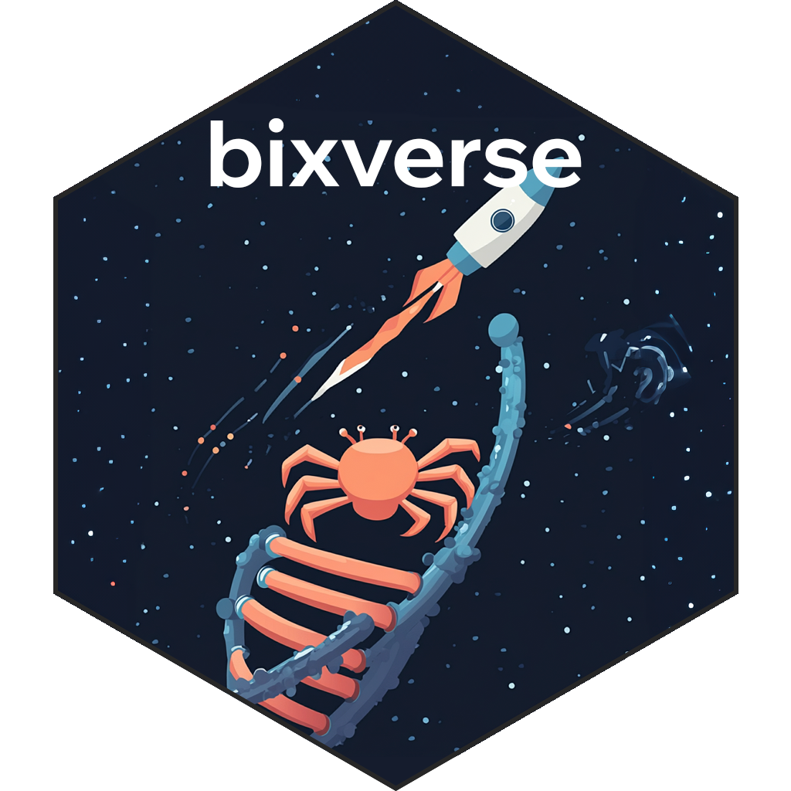
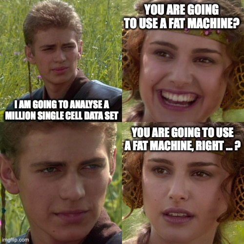

# bixverse package

[](https://github.com/GregorLueg/bixverse/blob/main/DESCRIPTION)
[](https://github.com/GregorLueg/bixverse/actions/workflows/R-cmd-check.yml)
[](https://opensource.org/licenses/MIT)
[](https://gregorlueg.github.io/bixverse/)
[](https://extendr.github.io/extendr/extendr_api/)

</br>



</br>

## What this is

This is an *opinionated* package taking bioinformatics and computational
biology workflows from R and Python, reimplementing them in Rust and exposing
them through thin R wrappers. Gene set enrichment, co-expression modules,
biomedical ontologies, graph and diffusion methods, differential expression,
and a full single cell suite that goes from raw h5 to annotated clusters, plus
a huge number of analysis methods for single cell. Result? Blazingly fast 
performance with low memory usage, making large-scale analysis feasible without 
any cloud compute.

Every exported function validates its inputs on the R side. The heavy numerics
live in the standalone [bixverse-rs](https://crates.io/crates/bixverse-rs)
crate, so the R layer stays a wrapper and nothing more.

## Atlas scale on a laptop



The 1 million cell PBMC data set from Parse Biosciences, end to end, on a
MacBook Air M3 with 24 GB. Parse's own guide for that same data set recommends
you move to the cloud and pick an instance with at least 8 threads and 160 GB
of RAM.

| Step | CPU | GPU |
|---|---|---|
| Stream in 24 samples | ~3.5 min | |
| HVG selection (2k genes) | ~10 s | |
| PCA (32 components) | ~25 s | 15 s |
| kNN graph | ~90 s (NNDescent) | <30 s (CAGRA) |

Nothing here loads the full matrix into memory. Counts sit on disk in a Rust
binary format, metadata sits in DuckDB, and the analysis streams. You can even
write pipelines like this here:

```r
pipeline <- sc_pipeline() %>>%
  step_hvg_sc(hvg_no = 2000L) %>>%
  step_pca_sc(no_pcs = 20L) %>>%
  step_harmony_sc(batch_column = "plate") %>>%
  step_neighbours_sc() %>>%
  step_clusters_sc(res = 0.5)

sc_object <- apply_pipeline(pipeline, sc_object)
```

Pipelines are inert. Nothing runs until you apply one, and the same chain works
on a `SingleCells`, on a `SingleCellsSubset`, or once per group via
`apply_pipeline_per_group()`.

Full walk-through: [scaling to millions of cells](https://gregorlueg.github.io/bixverse/articles/single_cell_big_data.html).
What changed in each release: [the changelog](https://gregorlueg.github.io/bixverse/news/index.html).

## What's in it

| Domain | What's in there | Read more |
|---|---|---|
| Gene set enrichment | Hypergeometric tests, fgsea, GSVA, ssGSEA, singscore, mitch, plus GO-aware elim methods | [GSE methods](https://gregorlueg.github.io/bixverse/articles/gse_methods.html), [pathway activity](https://gregorlueg.github.io/bixverse/articles/pathway_activity.html) |
| Regulons | SCENIC, CisTarget motif enrichment, regulon binarisation | [bag of genes](https://gregorlueg.github.io/bixverse/articles/bag_of_genes_single_cells.html) |
| Bulk co-expression | CoReMo, stabilised ICA, contrastive PCA, NMF and consensus NMF, DGRDL | [co-expression modules](https://gregorlueg.github.io/bixverse/articles/bulk_coexpression_modules.html), [contrastive PCA](https://gregorlueg.github.io/bixverse/articles/cpca.html) |
| Bulk DGE | limma-voom, Hedges' g effect sizes, batch correction, TPM and RPKM, structured handling of many contrasts | [reference](https://gregorlueg.github.io/bixverse/reference/index.html) |
| Ontologies | Resnik, Lin and Wang semantic similarities over disease, phenotype and gene ontologies | [semantic similarities](https://gregorlueg.github.io/bixverse/articles/ontologies.html) |
| Graphs | Network diffusion, constrained page rank, reciprocal best hit graphs, similarity network fusion, community detection | [diffusions and communities](https://gregorlueg.github.io/bixverse/articles/genetic_diffusions.html) |
| Single cell | Streaming i/o, QC, doublet detection, HVG, PCA, Harmony, fastMNN, BBKNN, kNN and clustering, markers, pseudobulk DGE, AUCell, hotspot, VISION, NMF, LDA | [start here](https://gregorlueg.github.io/bixverse/articles/thinking_single_cell.html), then the Single Cells menu |
| Single cell, advanced | Symphony reference mapping, NicheNet ligand receptor, DIALOGUE multicellular programmes, Palantir and PAGA trajectories | [Symphony](https://gregorlueg.github.io/bixverse/articles/symphony.html), [NicheNet](https://gregorlueg.github.io/bixverse/articles/nichenet.html), [DIALOGUE](https://gregorlueg.github.io/bixverse/articles/dialogue.html), [trajectories](https://gregorlueg.github.io/bixverse/articles/trajectory_inference.html) |
| Meta cells | Generation, purity and entropy diagnostics, the full downstream analysis surface | [meta cells](https://gregorlueg.github.io/bixverse/articles/meta_cells.html) |
| Multi-modal | ADT counts, DSB normalisation, WNN graphs | [multi-modal analysis](https://gregorlueg.github.io/bixverse/articles/multi_modal_single_cells.html) |

Bulk DGE is the one row pointing at the reference index rather than a vignette.
It works, it just doesn't have a written walk-through yet. On the roadmap.

## The "bixverse ecosystem"

- [bixverse.plots](https://github.com/GregorLueg/bixverse.plots) for, you
  guessed it, plotting. Especially a large number of plotting helpers for
  single cell.
- [bixverse.gpu](https://github.com/GregorLueg/bixverse.gpu) for
  GPU-accelerated methods, built on
  [cubecl](https://github.com/tracel-ai/cubecl)/[Burn](https://burn.dev) with
  wgpu backends, so it works on (theoretically) any GPU. If you do single cell
  stuff, have a look. Some of the implementations in there make everything
  substantially faster.
- [manifoldsR](https://github.com/GregorLueg/manifoldsR) for manifold learning:
  UMAP, tSNE, diffusion maps, and a cool clustering method called
  [EVoC](https://github.com/TutteInstitute/evoc). Every 2D visualisation in the
  single cell suite goes through it.
- [genewalkR](https://github.com/GregorLueg/genewalkR) is the graph-heavy one.
  Ships a database of gene to gene interaction and regulatory networks. Useful
  across a lot of computational biology workflows.

## Installation

You need Rust on your system. Install guide
[here](https://www.rust-lang.org/tools/install), and the rextendr guys have
written a lot of further help on the Rust set up
[here](https://extendr.github.io/rextendr/index.html). (bixverse uses rextendr
to interface with Rust.)

1. In the terminal, install [Rust](https://www.rust-lang.org/tools/install)

```
curl --proto '=https' --tlsv1.2 -sSf https://sh.rustup.rs | sh
```

2. In R, install [rextendr](https://extendr.github.io/rextendr/index.html):

```
install.packages("rextendr")
```

3. Finally install bixverse:

```
devtools::install_github("https://github.com/GregorLueg/bixverse")
```

### Windows

If you are using Windows, I am sorry, the tool chain is just very, very
painful... I really tried to make this work and maybe there are some hacks in
terms of compiling everything to install the package, but it has proven...
challenging in the CI/CD. Hence, no official Windows support for now. It is
specifically the incorporation of h5 which proves non-trivial with
cross-compiling that with Rust within the R umbrella.

## Where to start

The [package website](https://gregorlueg.github.io/bixverse/) is the main
entry point. Three routes depending on what you're after:

- [Why Rust is here](https://gregorlueg.github.io/bixverse/articles/rust_functions.html).
  A show case of how much faster Rust makes a lot of basic functions. If you
  want to integrate any of this into your own package, please feel free.
- [Design choices for single cell](https://gregorlueg.github.io/bixverse/articles/design_single_cell.html).
  Read this before touching the single cell suite. It explains the on-disk
  layout, the trade-offs and why things are the way they are.
- [The PBMC3k walkthrough](https://gregorlueg.github.io/bixverse/articles/pbmc_single_cell.html)
  for a first end-to-end run on a small data set.

Working with an LLM coding agent? `install_agent_skill()` drops a bixverse
skill into your agent set up so it stops guessing at the API.

## Roadmap

### Single and spatial transcriptomics

- [ ] [Slingshot](https://pubmed.ncbi.nlm.nih.gov/29914354/) for trajectory
  analysis, to sit alongside the Palantir and PAGA implementations that already
  ship.
- [ ] Save data to h5ad for easier interoperability with Python.
- [ ] Easy interoperability that chunks of data can be read in for neural
  network training in the corresponding deep learning frameworks.
- [ ] Full support of spatial transcriptomics via a dedicated `SpatialSpots`
  class, using the current Rust-based infrastructure for large scale analysis
  on local compute.
- [ ] Wire up [edge-rs](https://github.com/GregorLueg/edge-rs) to have 
  [NEBULA](https://www.nature.com/articles/s42003-021-02146-6) directly 
  integrated into the single cell framework.

### Cross integration

Tighter integration with [bixverse.gpu](https://github.com/GregorLueg/bixverse.gpu)
and [bixverse.plots](https://github.com/GregorLueg/bixverse.plots), both in
active development.

### Documentation

There are already quite a few vignettes, but the amount of code in the package
is... quite substantial and there are methods hidden here and there that lack
any vignettes for now. Bulk DGE is the most obvious gap.

## For developers

If you wish to contribute, please read the [Code Style](/info/code_style.md).
