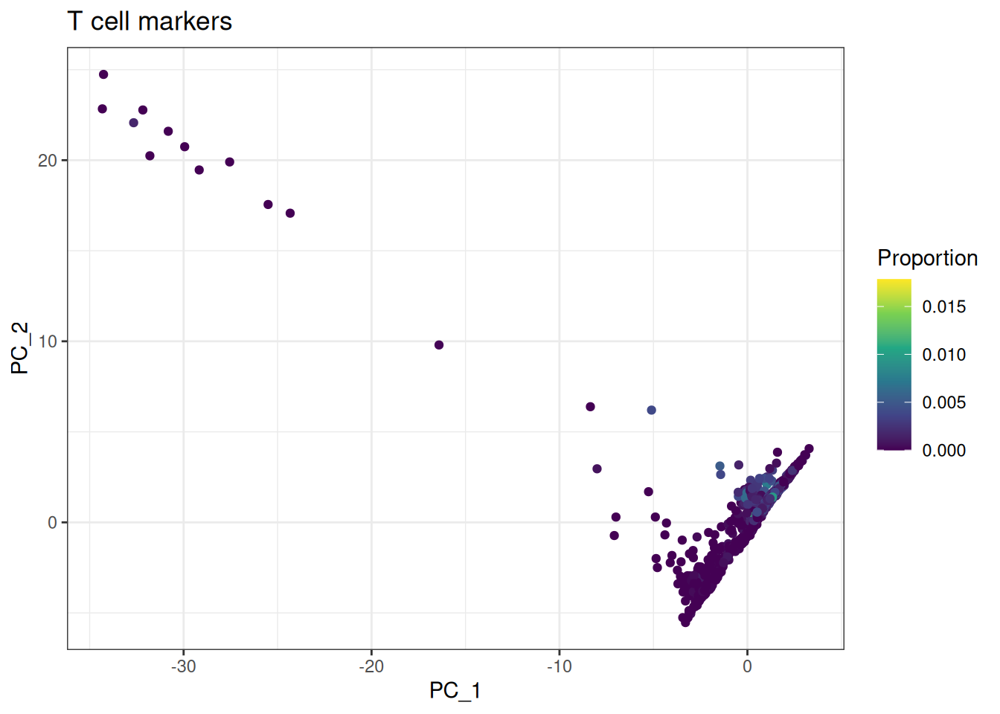
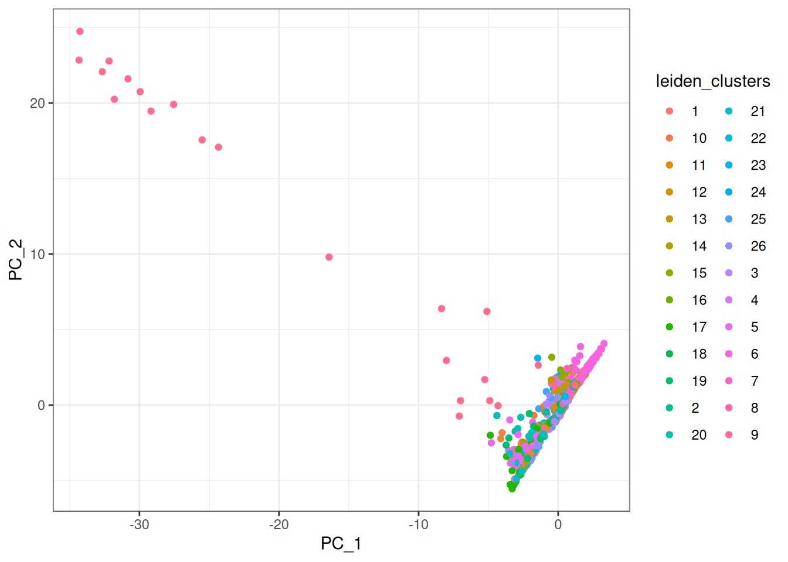
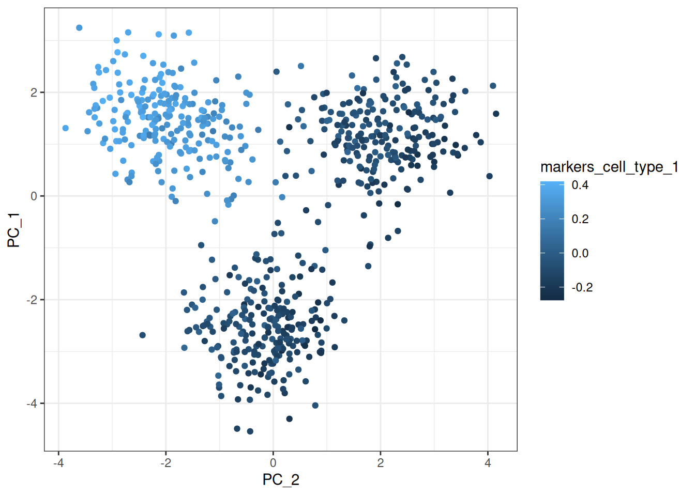

# Single Cell Analysis

## Introduction

This vignette shows how to use the `bixverse` package to perform single
cell analysis.

### Problem statement

The size of single cell datasets is growing rapidly, however the
computational tools used to to analyse them are not keeping up. The
current tools solution ot bigger datasets is just use a larger memory
machine, however this is not always possible especially if analysis is
required to be run locally on a laptop.

The aim of this package is to make it possible to analyse single-cell
datasets containing millions of cells on a standard laptop. This is
achieved through an out-of-memory design where large data objects—such
as count matrices and cell or feature metadata—are stored on disk rather
than held entirely in memory. Metadata tables are managed through
DuckDB, allowing for fast and efficient access to subsets of the data
when needed. While it may seem like overkill to use a duckdb to store
the obs and var tables for 100,000 cells these tables can quickly become
very large with millions of cells and become unwieldy to hold in memory
on a standard laptop.

Computationally intensive tasks are handled by Rust back-end utilities
that stream data from disk, perform the required operations, and return
results to R. This approach combines the ease of use of R with the speed
and efficiency of compiled Rust code, enabling high-performance
single-cell analysis with minimal memory requirements.

``` r
library(bixverse)
library(ggplot2)
```

### Create test data

``` r
## This function is used to create synthetic data
single_cell_test_data <- generate_single_cell_test_data()

f_path_csr <- file.path(tempdir(), "csr_test.h5ad")

write_h5ad_sc(
  f_path = f_path_csr,
  counts = single_cell_test_data$counts,
  obs = single_cell_test_data$obs,
  var = single_cell_test_data$var,
  .verbose = FALSE
)

single_cell_test_data <- generate_single_cell_test_data()

f_path_v1 <- file.path(tempdir(), "cells_csv")
f_path_v2 <- file.path(tempdir(), "genes_tsv")

dir.create(f_path_v1, showWarnings = FALSE, recursive = TRUE)
dir.create(f_path_v2, showWarnings = FALSE, recursive = TRUE)

counts_csc <- as(single_cell_test_data$counts, "CsparseMatrix")

# save a version with rows = cells and format type csv for the rest

write_cellranger_output(
  f_path = f_path_v1,
  counts = single_cell_test_data$counts,
  obs = single_cell_test_data$obs,
  var = single_cell_test_data$var,
  rows = "cells",
  format_type = "csv",
  .verbose = FALSE
)

# save a version with rows = genes and format type tsv for the rest

write_cellranger_output(
  f_path = f_path_v2,
  counts = single_cell_test_data$counts,
  obs = single_cell_test_data$obs,
  var = single_cell_test_data$var,
  rows = "genes",
  format_type = "tsv",
  .verbose = FALSE
)
```

## Single cell data processing using bixverse

### Load in data

The core of the single cell analysis is createing a `sc_object` this
object contains the connections to the data on disk that can be accessed
in rust and accessed and indexed by the duckdb.

Here we are setting the path to store the duckdb and files to `tempdir`
but in reality you want to keep these accessible such that you can
always access the data.

When generating the `sc_object` an `sc_qc_param` will need to be set,
this defines the parameters used to filter out low-quality cells at the
outset of the analysis. These cells are excluded during the creation of
the on-disk data, thereby reducing computational load. Since
poor-quality cells are not needed for downstream analysis, omitting them
also minimizes both storage and memory requirements.

Currently these parameters are:

- min_unique_genes = minimum number of genes expressed in a cell for it
  to be considered
- min_lib_size = minimum number of UMTs in a cell for it to be
  considered
- min_cells = minimum number of cells for a gene to be expressed for the
  gene to be considered
- target_size = library size to be normalised to during the lognorm step

\*\* Note your obs table will have a `to_keep` column appended to it
when the `sc_object` is created this allows tracking of what cells are
to be used in each analysis by default it will be set to all TRUE \*\*

``` r
## The QC parameters are set using the constructor function
sc_qc_param <- params_sc_min_quality(
  min_unique_genes = 45L,
  min_lib_size = 300L,
  min_cells = 500L,
  target_size = 1000
)
```

There are different ways to process single cell data and users may have
data stored in a number of ways we have tried to account for these when
developing this package.

However when an `sc_object` is created from whatever the source a number
of things happen

1.  First pass: Identify genes that are expressed in a sufficient number
    of cells based on the specified threshold set in `sc_qc_param`
2.  Second pass: Using the selected genes from the first pass, determine
    which cells meet the inclusion threshold
3.  CSR and CSC orientations of the data are saved in .bin files for
    rapid indexing of the data (more on this later)
4.  Data is log normalised based on the `target_size` parameter

Two columns are also added to the obs table `nnz` which is number of
genes detected in the cell and `lib_size` which is number of UMTs

#### H5AD

``` r

#  For demonstration
sc_object <- single_cell_exp(dir_data = tempdir())


sc_object <- load_h5ad(
  object = sc_object,
  h5_path = system.file("extdata", "csr_test.h5ad", package = "bixverse"),
  sc_qc_param = sc_qc_param,
  .verbose = TRUE
)
```

#### Cell Ranger

We have accounted for all possible combinations of outputs when loading
data from mtx files it can either be cells as rows or cells as columns,
and the obs and var tables can either be loaded as `.tsv` or `.csv`

``` r
sc_object <- single_cell_exp(dir_data = tempdir())


params_cells_rows_csv <- params_sc_mtx_io(
  path_mtx = file.path(f_path_v1, "mat.mtx"),
  path_obs = file.path(f_path_v1, "barcodes.csv"),
  path_var = file.path(f_path_v1, "features.csv"),
  cells_as_rows = TRUE,
  has_hdr = TRUE
)

## Data can also be loaded in this way, not run here shown purely as an example

# params_genes_rows_tsv <- params_sc_mtx_io(
#   path_mtx = file.path(f_path_v2, "mat.mtx"),
#   path_obs = file.path(f_path_v2, "barcodes.tsv"),
#   path_var = file.path(f_path_v2, "features.tsv"),
#   cells_as_rows = FALSE,
#   has_hdr = TRUE
# )

sc_object <- load_mtx(
  object = sc_object,
  sc_mtx_io_param = params_cells_rows_csv,
  sc_qc_param = sc_qc_param,
  streaming = FALSE, #  Shall the data be streamed during the conversion of CSR to CSC. Defaults to TRUE and should be used for larger data sets.
  .verbose = TRUE
)
#> Loading observations data from flat file into the DuckDB.
#> Loading variable data from flat file into the DuckDB.
```

### Accessing data

A duckdb with the single cell data has been created and it does not live
in memory, however for some operations (plotting) you do need the data,
A number of helpful getter functions have to been written to retrieve
the data.

#### Obs table (cell info)

``` r
# this returns a data.table of the obs table which can then be interacted with
sc_object[[]]
#>      cell_idx   cell_id    cell_grp batch_index   nnz lib_size to_keep
#>         <num>    <char>      <char>       <num> <num>    <num>  <lgcl>
#>   1:        1 cell_0001 cell_type_1           1    52      371    TRUE
#>   2:        2 cell_0003 cell_type_3           1    52      495    TRUE
#>   3:        3 cell_0004 cell_type_1           1    48      551    TRUE
#>   4:        4 cell_0005 cell_type_2           1    53      422    TRUE
#>   5:        5 cell_0006 cell_type_3           1    57      394    TRUE
#>  ---                                                                  
#> 925:      925 cell_0995 cell_type_2           1    53      548    TRUE
#> 926:      926 cell_0996 cell_type_3           1    57      545    TRUE
#> 927:      927 cell_0997 cell_type_1           1    56      543    TRUE
#> 928:      928 cell_0998 cell_type_2           1    49      487    TRUE
#> 929:      929 cell_1000 cell_type_1           1    60      474    TRUE

# The obs can also be retrieved using the obs getter which has mutliple arguments for fitlering
get_sc_obs(sc_object)
#>      cell_idx   cell_id    cell_grp batch_index   nnz lib_size to_keep
#>         <num>    <char>      <char>       <num> <num>    <num>  <lgcl>
#>   1:        1 cell_0001 cell_type_1           1    52      371    TRUE
#>   2:        2 cell_0003 cell_type_3           1    52      495    TRUE
#>   3:        3 cell_0004 cell_type_1           1    48      551    TRUE
#>   4:        4 cell_0005 cell_type_2           1    53      422    TRUE
#>   5:        5 cell_0006 cell_type_3           1    57      394    TRUE
#>  ---                                                                  
#> 925:      925 cell_0995 cell_type_2           1    53      548    TRUE
#> 926:      926 cell_0996 cell_type_3           1    57      545    TRUE
#> 927:      927 cell_0997 cell_type_1           1    56      543    TRUE
#> 928:      928 cell_0998 cell_type_2           1    49      487    TRUE
#> 929:      929 cell_1000 cell_type_1           1    60      474    TRUE
```

**Add data to obs**

Sometimes it is desirable to add data to the obs table for further
analysis this can be acheived using
[`set_sc_new_obs_col()`](../reference/set_sc_new_obs_col.md) or
[`set_sc_new_obs_col_multiple()`](../reference/set_sc_new_obs_col_multiple.md)

Note the new data must be of same length as
[`bixverse::get_cells_to_keep()`](../reference/get_cells_to_keep.md) and
have the same order.

``` r
n_cells <- get_cells_to_keep(sc_object)

## new data to add single column
new_data <- rep("random_new_data", length(n_cells))

## Using function or using
sc_object <- set_sc_new_obs_col(
  sc_object,
  col_name = "random_new_data",
  new_data = new_data
)

# or using [[]]
sc_object[["random_new_data2"]] <- new_data

head(sc_object[[]])
#>    cell_idx   cell_id    cell_grp batch_index   nnz lib_size to_keep
#>       <num>    <char>      <char>       <num> <num>    <num>  <lgcl>
#> 1:        1 cell_0001 cell_type_1           1    52      371    TRUE
#> 2:        2 cell_0003 cell_type_3           1    52      495    TRUE
#> 3:        3 cell_0004 cell_type_1           1    48      551    TRUE
#> 4:        4 cell_0005 cell_type_2           1    53      422    TRUE
#> 5:        5 cell_0006 cell_type_3           1    57      394    TRUE
#> 6:        6 cell_0007 cell_type_1           1    49      593    TRUE
#>    random_new_data random_new_data2
#>             <char>           <char>
#> 1: random_new_data  random_new_data
#> 2: random_new_data  random_new_data
#> 3: random_new_data  random_new_data
#> 4: random_new_data  random_new_data
#> 5: random_new_data  random_new_data
#> 6: random_new_data  random_new_data

## Multiple columns can also be added must be a list of vector
new_data_list <- list(
  "other_random_data" = rep("A", length(n_cells)),
  "even_different_random_data" = seq_len(length(n_cells))
)

## either like this
sc_object <- set_sc_new_obs_col_multiple(sc_object, new_data_list)

# or this
# sc_object[[names(new_data_list)]] <- new_data_list

# or this
sc_object[[c("new_name_a", "new_name_b")]] <- new_data_list
```

#### Var table (gene info)

``` r
# Returns gene info as a data.table
head(get_sc_var(sc_object))
#>    gene_idx  gene_id ensembl_id no_cells_exp
#>       <num>   <char>     <char>        <int>
#> 1:        1 gene_001    ens_001          758
#> 2:        2 gene_002    ens_002          742
#> 3:        3 gene_003    ens_003          772
#> 4:        4 gene_004    ens_004          724
#> 5:        5 gene_005    ens_005          533
#> 6:        6 gene_006    ens_006          724
```

#### Accessing Count data

This is where things get interesting and were the power of saving the
mtx as both a Compressed sparse Row (CSR) and compressed sparse column
(CSC) format becomes apparent. For gene wise operations (highly variable
genes,PCA) we want to be able to rapidly index through the columns
(genes) so we would opt for selecting the CSC notation of the matrix.
For cell wise operations (DGEs, AUCell) we want to be able to rapidly
index through the rows (cells) so we would opt for selecting the CSR
notation of the matrix.

Most of the algorithms will automatically select the correct orientation
so you don’t need to worry about it but below is a demonstration of the
time difference when retrieving a selection of cells from the db

``` r
## We are selecting 20:30 cells in the matrix which is a cellwise opperation so the correct thing to do would be to return the cells
tictoc::tic()
matrix <- get_sc_counts(
  object = sc_object,
  assay = "norm",
  cell_indices = 20:30,
  return_format = "cell"
)
tictoc::toc()
#> 0.005 sec elapsed

## Now we are to select the incorrect orientation
## This dataset is too small to see a difference however try it on your own larger and it will shock you
tictoc::tic()
matrix <- get_sc_counts(
  object = sc_object,
  assay = "norm",
  cell_indices = 20:30,
  return_format = "gene"
)
tictoc::toc()
#> 0.018 sec elapsed


## matrices can also be accessed with sinle brackets

matrix <- sc_object[, , return_format = "cell", assay = "norm"]
```

### Gene proportions

Usual QC procedure involves checking the proportions of mitochondrial
and ribosomal genes in you sample bixverse can do this as follows

This operation also be chunked by using by setting `streaming = TRUE`,
this is useful when working with very large datasets to avoid running
into memory constraints.

``` r
gs_of_interest <- list(
  gs_1 = c("gene_001", "gene_002", "gene_003", "gene_004"),
  gs_2 = c("gene_096", "gene_097", "gene_100")
)

## This will add proportions to the obs table
sc_object <- gene_set_proportions_sc(
  sc_object,
  gs_of_interest,
  streaming = FALSE, # can be chunked when working on large datasets to avoid running into memory constraints
  .verbose = TRUE
)

head(sc_object[[]])
#>    cell_idx   cell_id    cell_grp batch_index   nnz lib_size to_keep
#>       <num>    <char>      <char>       <num> <num>    <num>  <lgcl>
#> 1:        1 cell_0001 cell_type_1           1    52      371    TRUE
#> 2:        2 cell_0003 cell_type_3           1    52      495    TRUE
#> 3:        3 cell_0004 cell_type_1           1    48      551    TRUE
#> 4:        4 cell_0005 cell_type_2           1    53      422    TRUE
#> 5:        5 cell_0006 cell_type_3           1    57      394    TRUE
#> 6:        6 cell_0007 cell_type_1           1    49      593    TRUE
#>    random_new_data random_new_data2 other_random_data
#>             <char>           <char>            <char>
#> 1: random_new_data  random_new_data                 A
#> 2: random_new_data  random_new_data                 A
#> 3: random_new_data  random_new_data                 A
#> 4: random_new_data  random_new_data                 A
#> 5: random_new_data  random_new_data                 A
#> 6: random_new_data  random_new_data                 A
#>    even_different_random_data new_name_a new_name_b        gs_1        gs_2
#>                         <int>     <char>      <int>       <num>       <num>
#> 1:                          1          A          1 0.156334236 0.008086253
#> 2:                          2          A          2 0.022222223 0.006060606
#> 3:                          3          A          3 0.181488201 0.000000000
#> 4:                          4          A          4 0.007109005 0.033175357
#> 5:                          5          A          5 0.017766498 0.015228426
#> 6:                          6          A          6 0.242833048 0.079258010
```

We can then set cells to keep based on proportions of reads mapping to
genes, the filtered out cells will not actullay be removed from the
duckdb rather just have their `to_keep` column in the obs table set to
FALSE.

[`set_cells_to_keep()`](../reference/set_cells_to_keep.md) accepts both
cell ids and cell indices as a vector of cells to keep.

By default using the \[\[\]\] notation to load in the obs will only
retain the `to_keep` cells. To access all cells the
[`get_sc_obs()`](../reference/get_sc_obs.md) needs to be used.

Once this [`set_cells_to_keep()`](../reference/set_cells_to_keep.md)
function has been applied to the `sc_object` only cells marked TRUE in
the `to_keep` column will be used in the downstream analysis

``` r
threshold <- 0.05

cells_to_keep <- sc_object[[]][gs_2 < threshold, cell_id]

sc_object <- set_cells_to_keep(sc_object, cells_to_keep)

obs_data <- get_sc_obs(sc_object, filtered = FALSE)
table(obs_data$to_keep)
#> 
#> FALSE  TRUE 
#>   247   682

table(sc_object[["to_keep"]])
#> to_keep
#> TRUE 
#>  682
```

### Highly Variable Genes (HVG)

It is most common to perform downstream analysis (PCA, Knn graph,
clustering) on HVG as these usually are the most informative genes.

Currently the only implemented method is the VST-based version (known as
Seurat v3). The other methods (meanvarbin, dispersion) will be
implemented in the future.

See [`params_sc_hvg()`](../reference/params_sc_hvg.md) for details.

This also has the option for the data to be chunked in which is useful
for larger datasets where you may run into memory constraints.

``` r
hvg_params <- params_sc_hvg(
  method = "vst"
)

sc_object <- find_hvg_sc(
  object = sc_object,
  hvg_params = hvg_params,
  hvg_no = 30L, # Number of HVGs
  .verbose = TRUE
)

head(get_sc_var(sc_object))
#>    gene_idx  gene_id ensembl_id no_cells_exp      mean      var  var_exp
#>       <num>   <char>     <char>        <int>     <num>    <num>    <num>
#> 1:        1 gene_001    ens_001          758 11.747801 511.5848 2.652159
#> 2:        2 gene_002    ens_002          742 11.024927 388.6639 2.604914
#> 3:        3 gene_003    ens_003          772 13.149560 541.0187 2.724832
#> 4:        4 gene_004    ens_004          724  9.629032 312.5029 2.507178
#> 5:        5 gene_005    ens_005          533  4.703812 153.0825 1.926829
#> 6:        6 gene_006    ens_006          724 10.136364 351.4315 2.546862
#>      var_std
#>        <num>
#> 1: 1.1396177
#> 2: 0.9652928
#> 3: 1.0194833
#> 4: 0.9720214
#> 5: 1.8117409
#> 6: 0.9976512


## You can then which genes are highly variable as follows
head(get_sc_var(sc_object)[get_hvg(sc_object)], 5)
#>    gene_idx  gene_id ensembl_id no_cells_exp      mean       var  var_exp
#>       <num>   <char>     <char>        <int>     <num>     <num>    <num>
#> 1:        4 gene_004    ens_004          724  9.629032 312.50287 2.507178
#> 2:       16 gene_016    ens_016          655  7.756598 226.22502 2.403411
#> 3:       39 gene_043    ens_043          549  3.527859  33.90901 1.522625
#> 4:       18 gene_018    ens_018          750 10.665689 364.52734 2.581662
#> 5:        9 gene_009    ens_009          590  7.294722 246.94691 2.360737
#>      var_std
#>        <num>
#> 1: 0.9720214
#> 2: 0.8935734
#> 3: 1.0178647
#> 4: 0.9551431
#> 5: 1.0761360
```

### PCA

PCA is one of the most common form of dimensionally reduction
algorithms.

`bixverse` offers currently offers two implementations of the PCA.
Traditional PCA or the randomised PCA which is a faster approximation,
for details see
[here](https://research.facebook.com/publications/an-implementation-of-a-randomized-algorithm-for-principal-component-analysis/).
In reality the first principal components with most of the signal are
basically identical between the two methods and it is in the latter
principal components were the uncertainty of the randomised version
increases. Longer term, there is also the plan to implement SVD version
that work purely on sparse data without scaling (densifying the data)
for VERY large data sets. PCs will only be calculated using counts from
the HVGs as such the HVG calculation will need to be run prior to PCA.

Note the PCS are not currently saved to to the duckdb and after
calculations are currently stored in memory and will need to be
recalculated on the object if session is closed. Alternatively if you
wish to save PCA results this can be done using
[`save_sc_exp_to_disk()`](../reference/save_sc_exp_to_disk.md) these
will then be loaded back in when the
[`load_existing()`](../reference/load_existing.md) function is called.
More info in [Section 3](#sec-loading-existing).

``` r
sc_object <- calculate_pca_sc(
  object = sc_object,
  no_pcs = 10L, # Number PC to calculate
  randomised_svd = FALSE,
  .verbose = TRUE
)

# get the PCA factors
get_pca_factors(sc_object)[1:5, 1:5]
#>                 PC_1       PC_2       PC_3       PC_4        PC_5
#> cell_0001  0.7916713 -2.1312935 -1.3696928  0.4485300  2.23568630
#> cell_0003 -2.4218905 -1.2342623 -0.3744556 -1.7982795 -1.55481982
#> cell_0004  2.5719275 -1.4721915  1.2367083  0.8602270 -2.01101637
#> cell_0005  1.8453631  3.3306789 -0.3060451  0.8307743  2.15308475
#> cell_0006 -1.9956303 -0.4817278 -0.7805332 -1.3205884  0.06048276

# Get PCA loadings for each gene
get_pca_loadings(sc_object)[1:5, 1:5]
#>                 PC_1       PC_2        PC_3         PC_4        PC_5
#> gene_005  0.20317698 -0.3045997  0.05578877 -0.010422311  0.01976835
#> gene_017  0.15731421  0.3486673 -0.03532208 -0.046772514  0.08763239
#> gene_045 -0.02124721  0.0529221 -0.20211859  0.028571185 -0.01772384
#> gene_019  0.13870865  0.3136349  0.11827516  0.008420937 -0.00150319
#> gene_010  0.17827085 -0.3270922 -0.01653624  0.012350544  0.01573452
```

``` r
pca_plot_df <- cbind(sc_object[[]], get_pca_factors(sc_object))


ggplot(pca_plot_df, aes(x = PC_1, y = PC_2, color = cell_grp)) +
  geom_point() +
  theme_bw()
```



### Clustering

#### Nearest Neighbors Identification

Nearest neighbor identification is a foundational step in single-cell
analysis that finds the k most similar cells for each cell based on
their expression profiles. This creates a k-nearest neighbor (kNN)
graph, which is then converted into a shared nearest neighbor (sNN)
graph—a more robust representation where edges represent cells that
share neighbors. Here to ease computation we use the PCA factors to
generate the graph.

To identify nearest neighbors in bixverse, use two complementary
functions:

- [`params_sc_neighbours()`](../reference/params_sc_neighbours.md)configures
  the parameters for neighbor identification. Specify the knn parameters
  via `knn = list(<PARAMS>)`. For details on kNN parameters, refer to
  [`params_knn_defaults()`](../reference/params_knn_defaults.md). Key
  parameters are `k` (how many neighbors to find) and choice of the
  approximate nearest neighbour search algorithm: `annoy`for general
  speed, `hnsw` for accuracy and memory efficiency and `nndescent` as an
  alternative for small data sets without index building. Set the
  distance metric with ann_dist (typically `cosine` or `euclidean`). You
  can also control the sNN graph generation with `full_snn` (whether to
  create edges between all cells or just neighbors), `pruning` (to
  remove weak connections), and `snn_similarity` (choose `rank` or
  `jaccard` to determine how neighbor weights are calculated). This
  function returns a parameter list ready for neighbor detection.

- `find_neighbours()` applies these parameters to your single-cell
  object to generate the actual kNN and sNN graphs. Specify which
  embedding to use (`embd_to_use`, currently `pca`) and optionally limit
  the number of embedding dimensions with `no_embd_to_use`. Set a seed
  for reproducibility and use `.verbose` to track runtime information.
  The function adds the computed neighbor matrices to your object for
  use in downstream analyses.

Like PCA the results for these are not stored in the duckdb rather in
memory so will need to be saved or rerun each time.

``` r
neighbours_params <- params_sc_neighbours(knn = list(knn_method = "hnsw"))

sc_object <- find_neighbours_sc(
  sc_object,
  neighbours_params = neighbours_params,
  .verbose = TRUE
)
#> 
#> Generating sNN graph (full: FALSE).
#> Transforming sNN data to igraph.

head(get_knn_mat(sc_object))[1:5, 1:5]
#>      [,1] [,2] [,3] [,4] [,5]
#> [1,]  597  607  416   13  666
#> [2,]  419    4  308  645   24
#> [3,]    8  630  311  632  489
#> [4,]  430  178  449  678  413
#> [5,]   24    1  152  168  419

head(get_snn_graph(sc_object))[1:5, 1:5]
#> 5 x 5 sparse Matrix of class "dgCMatrix"
#>                               
#> [1,] . .         . . .        
#> [2,] . .         . . 0.9333333
#> [3,] . .         . . .        
#> [4,] . .         . . .        
#> [5,] . 0.9333333 . . .
```

#### Community detection

Currently only Leiden clustering is implemented in the package these
cluster are then added to the obs table of the `sc_object`

``` r
sc_object <- find_clusters_sc(sc_object, name = "leiden_clusters")

cbind(sc_object[[]], get_pca_factors(sc_object)) |>
  dplyr::mutate(leiden_clusters = as.character(leiden_clusters)) |>
  ggplot(aes(x = PC_1, y = PC_2, color = leiden_clusters)) +
  geom_point() +
  theme_bw()
```



### Differential gene expression

Once the clustering is complete we can perform differential gene
expression analysis between the 2 groups of cell lines or group verses
all style analysis.

Currently the wilcox method is used to assess DGE with a default
`twosided` test run.

``` r
cell_names_1 <- sc_object[[]][leiden_clusters == 1, cell_id]
cell_names_2 <- sc_object[[]][leiden_clusters == 2, cell_id]

dge_leiden_clusters <- find_markers_sc(
  object = sc_object,
  cells_1 = cell_names_1,
  cells_2 = cell_names_2,
  method = "wilcox",
  alternative = "twosided",
  .verbose = FALSE
)

head(dge_leiden_clusters)
#>     gene_id      lfc     prop1     prop2 z_scores     p_values          fdr
#>      <char>    <num>     <num>     <num>    <num>        <num>        <num>
#> 1: gene_001 2.335875 0.9819005 0.7521739 16.09610 2.717026e-58 2.445323e-57
#> 2: gene_002 2.352085 0.9819005 0.7217391 16.34724 4.551388e-60 4.608280e-59
#> 3: gene_003 2.470452 1.0000000 0.7739130 17.17004 4.451217e-66 9.834427e-65
#> 4: gene_004 2.318489 0.9728507 0.6869565 15.64946 3.350099e-55 2.087369e-54
#> 5: gene_005 1.743340 0.8371041 0.4000000 12.08653 1.244202e-33 5.304231e-33
#> 6: gene_006 2.235862 0.9728507 0.7130435 15.89808 6.533862e-57 5.292428e-56
```

Specify a column, and the function will calculate differential gene
expression for each cluster against all other cells combined. It
processes clusters sequentially: cluster one vs. all others, cluster two
vs. all others, and so on. To manage computational efficiency, the “all
others” group is automatically downsampled to a random 100,000 cells if
it exceeds that threshold.

Currently this functions alternative hypothesis is set to “greater”,
i.e., genes upregulated in the group.

``` r
dge_test_2 <- find_all_markers_sc(
  object = sc_object,
  column_of_interest = "leiden_clusters",
  method = "wilcox",
  .verbose = FALSE
)
```

### AUcell

AUCell calculates how well a set of genes (or pathway) “ranks” in each
cell compared to all other genes. It produces a score between 0 and 1
for each cell—higher scores mean the genes in your set are highly
expressed in that cell relative to the background.

The function `aucell_sc` offers two scoring methods: use `auroc` for
identifying cells expressing specific marker genes, or `wilcox` for
measuring overall pathway activity. For large datasets, you can load all
cells at once or stream them in chunks of 50,000 cells for memory
efficiency.

``` r
auc_gene_sets <- list(
  markers_cell_type_1 = sprintf("gene_%03d", 1:10),
  markers_cell_type_2 = sprintf("gene_%03d", 11:20),
  markers_cell_type_3 = sprintf("gene_%03d", 21:30)
)

auc_res_auroc <- aucell_sc(
  object = sc_object,
  gs_list = auc_gene_sets,
  auc_type = "auroc",
  .verbose = FALSE
)

cbind(auc_res_auroc, get_pca_factors(sc_object)) |>
  ggplot(aes(y = PC_1, x = PC_2, color = markers_cell_type_1)) +
  geom_point() +
  theme_bw()
```



### Save object

As analysis progresses some parts are written to the duckdb and saved
and others are not. Any updates to the `obs` table and to the `to_keep`
column (number of cells) will be saved to the duckdb and will be present
when the data is loaded back in using
[`load_existing()`](../reference/load_existing.md).

However, other aspects which are held in memory e.g HVG, PCA and AUcell
will not be saved. To ensure these are saved and then loaded back in
when [`load_existing()`](../reference/load_existing.md) is used run
[`save_sc_exp_to_disk()`](../reference/save_sc_exp_to_disk.md).

This will create an `memory.qs2` object in the same directory as the
`counts_cells.bin`, `counts_genes.bin` and `sc_duckdb.db`

Objects can either be saved as a `rds` or `qs2` it is highly recommended
the `qs2` format is used as the reading in is far more performant.

``` r
save_sc_exp_to_disk(sc_object, type = "qs2")
```

## Loading in existing object

A series of functions have been written to load in a already
pre-processed sc_object where the `to_keep` cells have already been
defined.

This is done by pointing the directory where the `sc_duckdb.db`,
`counts_cells.bin` and `counts_genes.bin` have been created.

All information that was stored in the obs table leiden_clusters, gene
proportions etc and any information in var table will be retained as it
has been stored in the duckdb. However analysis that was created and
stored in memory e.g knn and PCA will no longer exist and have to be
rerun (unless data has been saved with
[`save_sc_exp_to_disk()`](../reference/save_sc_exp_to_disk.md),
recommended).

``` r
sc_object_loaded <- single_cell_exp(dir_data = tempdir())

sc_object_loaded <- load_existing(sc_object_loaded)
#> Found stored data from save_sc_exp_to_disk(). Loading that one into the object.

dim(sc_object_loaded[])
#> [1] 682  81

dim(sc_object[])
#> [1] 682  81

dim(sc_object[[]])
#> [1] 682  16
dim(sc_object_loaded[[]])
#> [1] 682  16
```

``` r
## PCA in original object exists
head(get_pca_factors(sc_object))[1:5, 1:5]
#>                 PC_1       PC_2       PC_3       PC_4        PC_5
#> cell_0001  0.7916713 -2.1312935 -1.3696928  0.4485300  2.23568630
#> cell_0003 -2.4218905 -1.2342623 -0.3744556 -1.7982795 -1.55481982
#> cell_0004  2.5719275 -1.4721915  1.2367083  0.8602270 -2.01101637
#> cell_0005  1.8453631  3.3306789 -0.3060451  0.8307743  2.15308475
#> cell_0006 -1.9956303 -0.4817278 -0.7805332 -1.3205884  0.06048276

## PCA in loaded in object does exist as has been loaded back in from the qs2 file
head(get_pca_factors(sc_object_loaded))
#>                 PC_1       PC_2       PC_3       PC_4        PC_5        PC_6
#> cell_0001  0.7916713 -2.1312935 -1.3696928  0.4485300  2.23568630  0.10833390
#> cell_0003 -2.4218905 -1.2342623 -0.3744556 -1.7982795 -1.55481982 -1.73168576
#> cell_0004  2.5719275 -1.4721915  1.2367083  0.8602270 -2.01101637 -0.98504061
#> cell_0005  1.8453631  3.3306789 -0.3060451  0.8307743  2.15308475 -0.88234264
#> cell_0006 -1.9956303 -0.4817278 -0.7805332 -1.3205884  0.06048276 -1.61810422
#> cell_0008  0.8654820  0.2562445 -1.4927127  1.1618458  1.81161833  0.09957793
#>                 PC_7       PC_8        PC_9      PC_10
#> cell_0001 -0.8307593 -0.9369759  0.11120906  0.1123955
#> cell_0003  0.4090152  0.5485656 -0.03805275  0.6408936
#> cell_0004 -2.1615980  0.6148190  0.08886870  0.5149482
#> cell_0005  1.3377242  0.8726504  0.93318295  0.5300551
#> cell_0006 -0.5391674  0.1609078 -0.24828078  1.1093334
#> cell_0008 -0.1490478  1.2157899  1.11126518 -1.0982429


## Same for knn
head(get_knn_mat(sc_object))[1:5, 1:5]
#>      [,1] [,2] [,3] [,4] [,5]
#> [1,]  597  607  416   13  666
#> [2,]  419    4  308  645   24
#> [3,]    8  630  311  632  489
#> [4,]  430  178  449  678  413
#> [5,]   24    1  152  168  419

head(get_knn_mat(sc_object_loaded))
#>      [,1] [,2] [,3] [,4] [,5] [,6] [,7] [,8] [,9] [,10] [,11] [,12] [,13] [,14]
#> [1,]  597  607  416   13  666  300  177  453  654    96   507   127    99   605
#> [2,]  419    4  308  645   24  665  168  558  390   104   536   217   452    64
#> [3,]    8  630  311  632  489   83  383  381  183    40   119    32   253   671
#> [4,]  430  178  449  678  413  644  315  626  189   483    14   620   382    61
#> [5,]   24    1  152  168  419   94  514  221  308   190   602   277    15   231
#> [6,]  189  318  633  236  453  666  461  290  550    25   564   266   191   661
#>      [,15]
#> [1,]   424
#> [2,]   465
#> [3,]   292
#> [4,]   238
#> [5,]    73
#> [6,]   663
```
