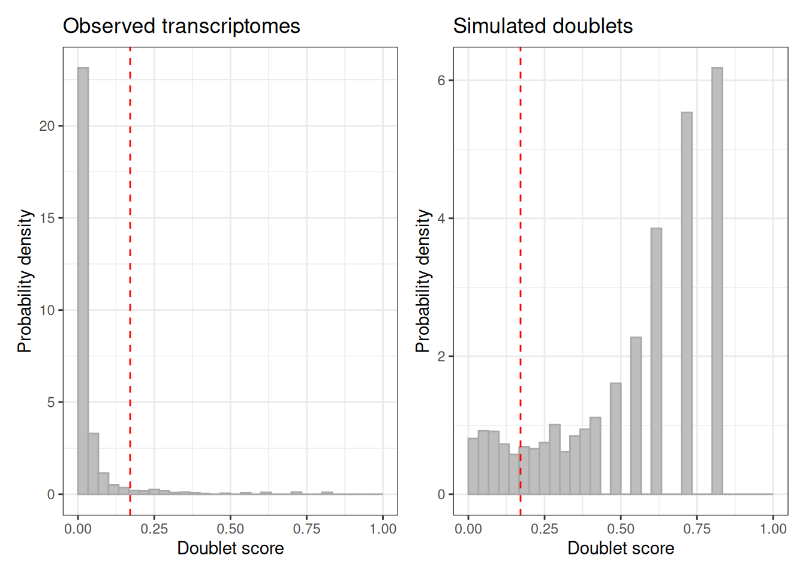
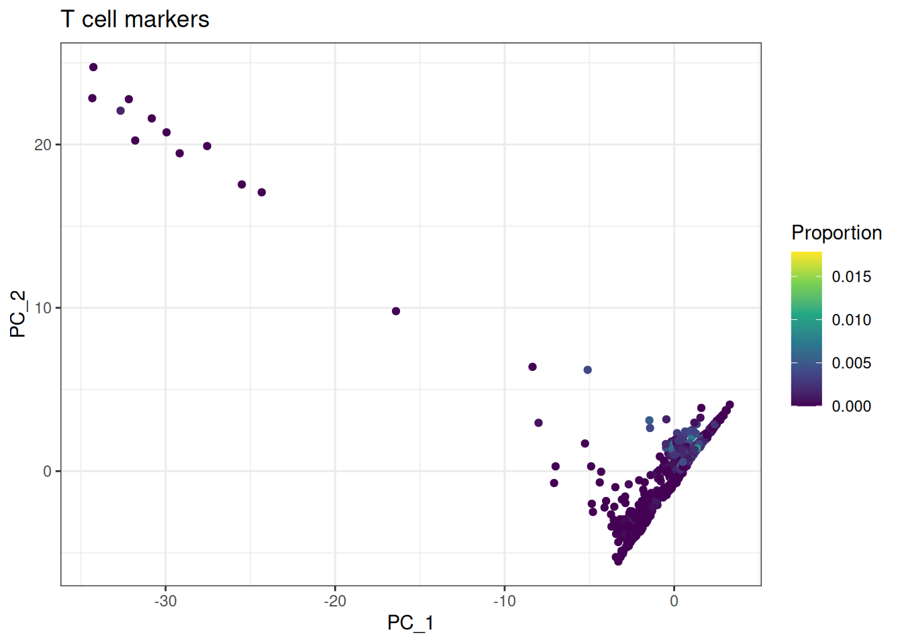
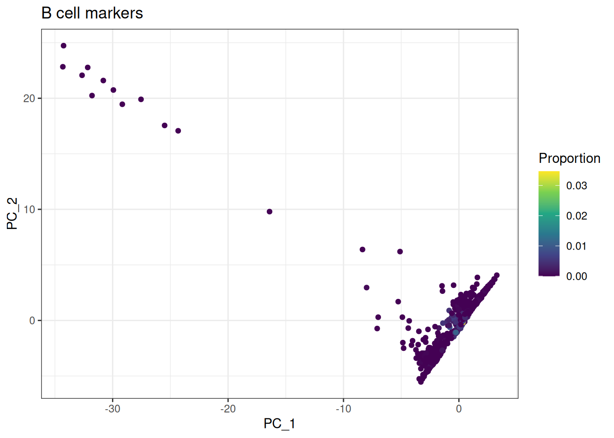
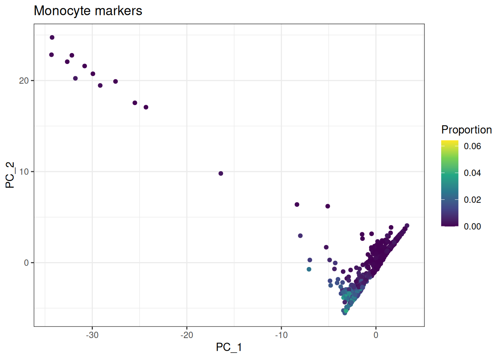
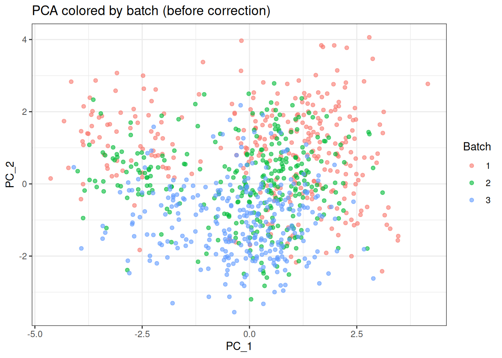
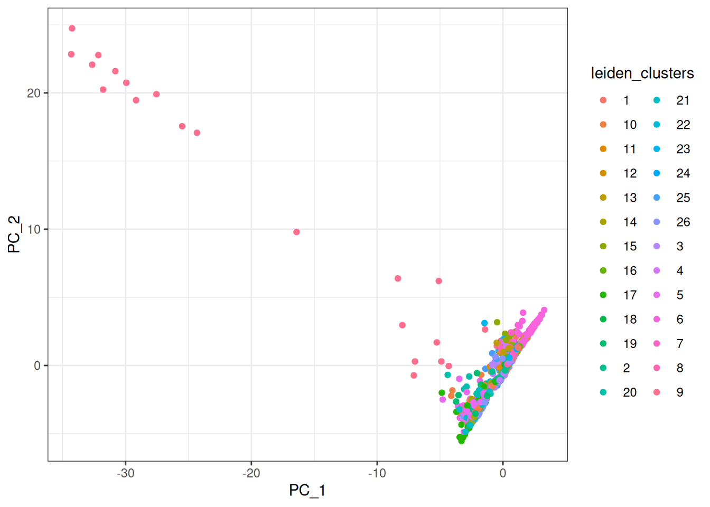
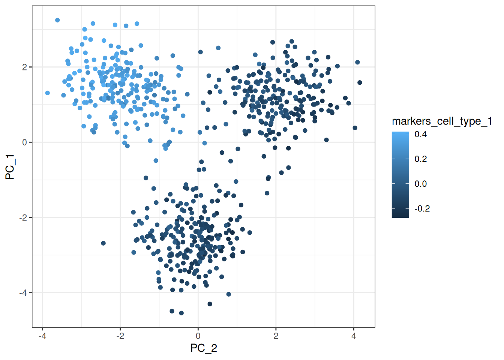
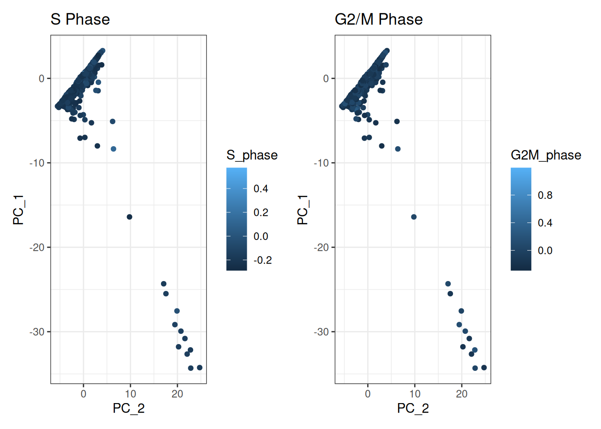
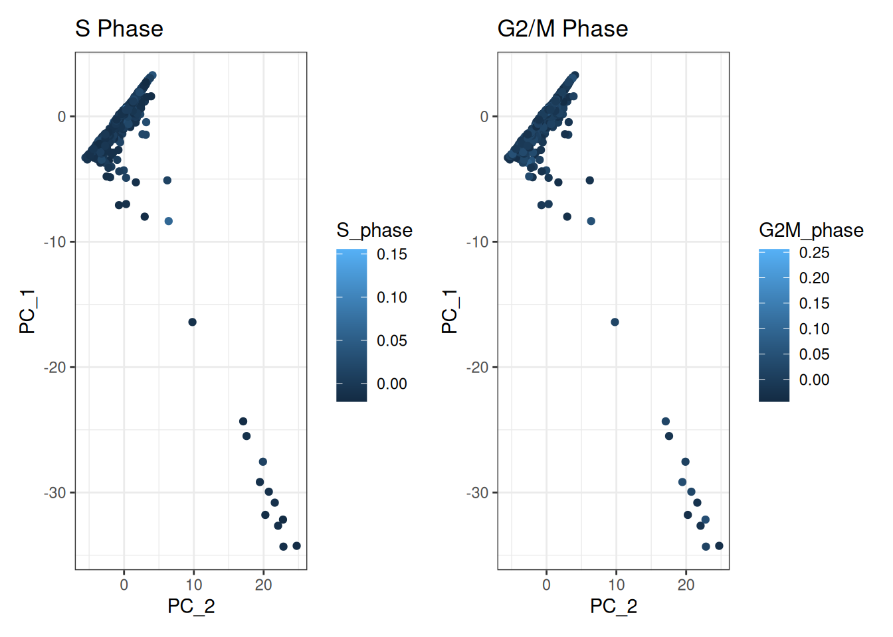

# Single Cell Analysis

## Introduction

This vignette shows how to use the `bixverse` package to perform single
cell analysis.

### Problem statement

The size of single cell datasets is growing rapidly, however the
computational tools used to to analyse them are not keeping up. The
current tools solution ot bigger datasets is just use a larger memory
machine, however this is not always possible especially if analysis is
required to be run locally on a laptop.

The aim of this package is to make it possible to analyse single-cell
datasets containing millions of cells on a standard laptop. This is
achieved through an out-of-memory design where large data objects—such
as count matrices and cell or feature metadata—are stored on disk rather
than held entirely in memory. Metadata tables are managed through
DuckDB, allowing for fast and efficient access to subsets of the data
when needed. While it may seem like overkill to use a duckdb to store
the obs and var tables for 100,000 cells these tables can quickly become
very large with millions of cells and become unwieldy to hold in memory
on a standard laptop.

Computationally intensive tasks are handled by Rust back-end utilities
that stream data from disk, perform the required operations, and return
results to R. This approach combines the ease of use of R with the speed
and efficiency of compiled Rust code, enabling high-performance
single-cell analysis with minimal memory requirements.

``` r
library(bixverse)
library(ggplot2)
library(magrittr)
# devtools::load_all()
```

### Create test data

``` r
## This function is used to create synthetic data
single_cell_test_data <- generate_single_cell_test_data()

f_path_csr <- file.path(tempdir(), "csr_test.h5ad")

write_h5ad_sc(
  f_path = f_path_csr,
  counts = single_cell_test_data$counts,
  obs = single_cell_test_data$obs,
  var = single_cell_test_data$var,
  .verbose = FALSE
)

single_cell_test_data <- generate_single_cell_test_data()

f_path_v1 <- file.path(tempdir(), "cells_csv")
f_path_v2 <- file.path(tempdir(), "genes_tsv")

dir.create(f_path_v1, showWarnings = FALSE, recursive = TRUE)
dir.create(f_path_v2, showWarnings = FALSE, recursive = TRUE)

counts_csc <- as(single_cell_test_data$counts, "CsparseMatrix")

# save a version with rows = cells and format type csv for the rest

write_cellranger_output(
  f_path = f_path_v1,
  counts = single_cell_test_data$counts,
  obs = single_cell_test_data$obs,
  var = single_cell_test_data$var,
  rows = "cells",
  format_type = "csv",
  .verbose = FALSE
)

# save a version with rows = genes and format type tsv for the rest

write_cellranger_output(
  f_path = f_path_v2,
  counts = single_cell_test_data$counts,
  obs = single_cell_test_data$obs,
  var = single_cell_test_data$var,
  rows = "genes",
  format_type = "tsv",
  .verbose = FALSE
)
```

## Single cell data processing using bixverse

### Load in data

The core of the single cell analysis is createing a `sc_object` this
object contains the connections to the data on disk that can be accessed
in rust and accessed and indexed by the duckdb.

Here we are setting the path to store the duckdb and files to `tempdir`
but in reality you want to keep these accessible such that you can
always access the data.

When generating the `sc_object` an `sc_qc_param` will need to be set,
this defines the parameters used to filter out low-quality cells at the
outset of the analysis. These cells are excluded during the creation of
the on-disk data, thereby reducing computational load. Since
poor-quality cells are not needed for downstream analysis, omitting them
also minimizes both storage and memory requirements.

Currently these parameters are:

- min_unique_genes = minimum number of genes expressed in a cell for it
  to be considered
- min_lib_size = minimum number of UMTs in a cell for it to be
  considered
- min_cells = minimum number of cells for a gene to be expressed for the
  gene to be considered
- target_size = library size to be normalised to during the lognorm step

\*\* Note your obs table will have a `to_keep` column appended to it
when the `sc_object` is created this allows tracking of what cells are
to be used in each analysis by default it will be set to all TRUE \*\*

``` r
## The QC parameters are set using the constructor function
sc_qc_param <- params_sc_min_quality(
  min_unique_genes = 20L,
  min_lib_size = 100L,
  min_cells = 20L,
  target_size = 1000
)
```

There are different ways to process single cell data and users may have
data stored in a number of ways we have tried to account for these when
developing this package.

However when an `sc_object` is created from whatever the source a number
of things happen

1.  First pass: Identify genes that are expressed in a sufficient number
    of cells based on the specified threshold set in `sc_qc_param`
2.  Second pass: Using the selected genes from the first pass, determine
    which cells meet the inclusion threshold
3.  CSR and CSC orientations of the data are saved in .bin files for
    rapid indexing of the data (more on this later)
4.  Data is log normalised based on the `target_size` parameter

Two columns are also added to the obs table `nnz` which is number of
genes detected in the cell and `lib_size` which is number of UMTs

#### H5AD

``` r

#  For demonstration
sc_object <- single_cell_exp(dir_data = tempdir())


sc_object <- load_h5ad(
  object = sc_object,
  h5_path = system.file("extdata", "csr_test.h5ad", package = "bixverse"),
  sc_qc_param = sc_qc_param,
  .verbose = TRUE
)
```

#### Cell Ranger

We have accounted for all possible combinations of outputs when loading
data from mtx files it can either be cells as rows or cells as columns,
and the obs and var tables can either be loaded as `.tsv` or `.csv`

Here we are going to use the PBMC 3k dataset for the remainder of the
vignette.

``` r
pbmc3k_path <- bixverse:::download_pbmc3k()

tempdir_pbmc <- tempdir()

sc_object <- single_cell_exp(dir_data = tempdir_pbmc)
#> Warning: `single_cell_exp()` was deprecated in bixverse 0.3.0.
#> ℹ Please use `SingleCells()` instead.

params_cells_rows_csv <- params_sc_mtx_io(
  path_mtx = file.path(pbmc3k_path, "matrix.mtx"),
  path_obs = file.path(pbmc3k_path, "barcodes.tsv"),
  path_var = file.path(pbmc3k_path, "genes.tsv"),
  cells_as_rows = FALSE,
  has_hdr = TRUE
)

sc_object <- load_mtx(
  object = sc_object,
  sc_mtx_io_param = params_cells_rows_csv,
  sc_qc_param = sc_qc_param,
  streaming = FALSE, #  Shall the data be streamed during the conversion of CSR to CSC. Defaults to TRUE and should be used for larger data sets.
  .verbose = TRUE
)
#> Loading observations data from flat file into the DuckDB.
#> Loading variable data from flat file into the DuckDB.
```

### Accessing data

A duckdb with the single cell data has been created and it does not live
in memory, however for some operations (plotting) you do need the data,
A number of helpful getter functions have to been written to retrieve
the data.

*Note by default these getters will return the filtered cells, as
filtered by the specified params_sc_min_quality()*

#### Obs table (cell info)

``` r
# this returns a data.table of the obs table which can then be interacted with
sc_object[[]]
#>       cell_idx          cell_id   nnz lib_size to_keep
#>          <num>           <char> <num>    <num>  <lgcl>
#>    1:        1 AAACATACAACCAC-1   771     2411    TRUE
#>    2:        2 AAACATTGAGCTAC-1  1329     4861    TRUE
#>    3:        3 AAACATTGATCAGC-1  1116     3133    TRUE
#>    4:        4 AAACCGTGCTTCCG-1   948     2627    TRUE
#>    5:        5 AAACCGTGTATGCG-1   517      976    TRUE
#>   ---                                                 
#> 2696:     2696 TTTCGAACTCTCAT-1  1140     3444    TRUE
#> 2697:     2697 TTTCTACTGAGGCA-1  1196     3401    TRUE
#> 2698:     2698 TTTCTACTTCCTCG-1   611     1673    TRUE
#> 2699:     2699 TTTGCATGAGAGGC-1   445     1015    TRUE
#> 2700:     2700 TTTGCATGCCTCAC-1   718     1979    TRUE

# The obs can also be retrieved using the obs getter which has mutliple arguments for fitlering
get_sc_obs(sc_object)
#>       cell_idx          cell_id   nnz lib_size to_keep
#>          <num>           <char> <num>    <num>  <lgcl>
#>    1:        1 AAACATACAACCAC-1   771     2411    TRUE
#>    2:        2 AAACATTGAGCTAC-1  1329     4861    TRUE
#>    3:        3 AAACATTGATCAGC-1  1116     3133    TRUE
#>    4:        4 AAACCGTGCTTCCG-1   948     2627    TRUE
#>    5:        5 AAACCGTGTATGCG-1   517      976    TRUE
#>   ---                                                 
#> 2696:     2696 TTTCGAACTCTCAT-1  1140     3444    TRUE
#> 2697:     2697 TTTCTACTGAGGCA-1  1196     3401    TRUE
#> 2698:     2698 TTTCTACTTCCTCG-1   611     1673    TRUE
#> 2699:     2699 TTTGCATGAGAGGC-1   445     1015    TRUE
#> 2700:     2700 TTTGCATGCCTCAC-1   718     1979    TRUE
```

**Add data to obs**

Sometimes it is desirable to add data to the obs table for further
analysis this can be acheived using
[`set_sc_new_obs_col()`](../reference/set_sc_new_obs_col.md) or
[`set_sc_new_obs_col_multiple()`](../reference/set_sc_new_obs_col_multiple.md)

Note the new data must be of same length as
[`bixverse::get_cells_to_keep()`](../reference/get_cells_to_keep.md) and
have the same order.

``` r
n_cells <- get_cells_to_keep(sc_object)

## new data to add single column
new_data <- rep("random_new_data", length(n_cells))

## Using function or using
sc_object <- set_sc_new_obs_col(
  sc_object,
  col_name = "random_new_data",
  new_data = new_data
)

# or using [[]]
sc_object[["random_new_data2"]] <- new_data

head(sc_object[[]])
#>    cell_idx          cell_id   nnz lib_size to_keep random_new_data
#>       <num>           <char> <num>    <num>  <lgcl>          <char>
#> 1:        1 AAACATACAACCAC-1   771     2411    TRUE random_new_data
#> 2:        2 AAACATTGAGCTAC-1  1329     4861    TRUE random_new_data
#> 3:        3 AAACATTGATCAGC-1  1116     3133    TRUE random_new_data
#> 4:        4 AAACCGTGCTTCCG-1   948     2627    TRUE random_new_data
#> 5:        5 AAACCGTGTATGCG-1   517      976    TRUE random_new_data
#> 6:        6 AAACGCACTGGTAC-1   771     2145    TRUE random_new_data
#>    random_new_data2
#>              <char>
#> 1:  random_new_data
#> 2:  random_new_data
#> 3:  random_new_data
#> 4:  random_new_data
#> 5:  random_new_data
#> 6:  random_new_data

## Multiple columns can also be added must be a list of vector
new_data_list <- list(
  "other_random_data" = rep("A", length(n_cells)),
  "even_different_random_data" = seq_len(length(n_cells))
)

## either like this
sc_object <- set_sc_new_obs_col_multiple(sc_object, new_data_list)

# or this
# sc_object[[names(new_data_list)]] <- new_data_list

# or this
sc_object[[c("new_name_a", "new_name_b")]] <- new_data_list
```

#### Var table (gene info)

``` r
# Returns gene info as a data.table
head(get_sc_var(sc_object))
#>    gene_idx         gene_id gene_name no_cells_exp
#>       <num>          <char>    <char>        <int>
#> 1:        1 ENSG00000188976     NOC2L          258
#> 2:        2 ENSG00000188290      HES4          145
#> 3:        3 ENSG00000187608     ISG15         1206
#> 4:        4 ENSG00000131591  C1orf159           24
#> 5:        5 ENSG00000186891  TNFRSF18           92
#> 6:        6 ENSG00000186827   TNFRSF4          155
```

#### Accessing Count data

This is where things get interesting and were the power of saving the
mtx as both a Compressed sparse Row (CSR) and compressed sparse column
(CSC) format becomes apparent. For gene wise operations (highly variable
genes,PCA) we want to be able to rapidly index through the columns
(genes) so we would opt for selecting the CSC notation of the matrix.
For cell wise operations (DGEs, AUCell) we want to be able to rapidly
index through the rows (cells) so we would opt for selecting the CSR
notation of the matrix.

Most of the algorithms will automatically select the correct orientation
so you don’t need to worry about it but below is a demonstration of the
time difference when retrieving a selection of cells from the db

``` r
## We are selecting 20:30 cells in the matrix which is a cellwise opperation so the correct thing to do would be to return the cells
tictoc::tic()
matrix <- get_sc_counts(
  object = sc_object,
  assay = "norm",
  cell_indices = 20:30,
  return_format = "cell"
)
tictoc::toc()
#> 0.007 sec elapsed

## Now we are to select the incorrect orientation
## This dataset is too small to see a difference however try it on your own larger and it will shock you
tictoc::tic()
matrix <- get_sc_counts(
  object = sc_object,
  assay = "norm",
  cell_indices = 20:30,
  return_format = "gene"
)
tictoc::toc()
#> 0.277 sec elapsed


## matrices can also be accessed with sinle brackets

matrix <- sc_object[, , return_format = "cell", assay = "norm"]
```

### Gene proportions

Usual QC procedure involves checking the proportions of mitochondrial
and ribosomal genes in your samples. We have also added the standard G2M
and S phase genes from seurat to the package. To assess cell cycle
shifts.

This operation also be chunked by using by setting `streaming = TRUE`,
this is useful when working with very large datasets to avoid running
into memory constraints.

``` r

gene_data <- get_sc_var(sc_object)

gs_of_interest <-  list(
      MT = gene_data[
        stringr::str_detect(gene_data$gene_name, "^MT-"),
      ]$gene_id,
      Ribo = gene_data[
        stringr::str_detect(gene_data$gene_name, "^RPS|^RPL"),
      ]$gene_id,
      S_phase = gene_data[
        stringr::str_detect(
          gene_data$gene_id,
          paste(cell_cycle_genes[set == "S phase", ensembl_gene_id] , collapse = "|")
        ),
      ]$gene_id,
      G2M_phase = gene_data[
        stringr::str_detect(
          gene_data$gene_id,
          paste(cell_cycle_genes[set == "G2/M phase", ensembl_gene_id] , collapse = "|")
        )]$gene_id,
      T_cells = gene_data[
        gene_data$gene_name %in% c("CD3D", "CD3E", "CD3G"),
      ]$gene_id,
      B_cells = gene_data[
        gene_data$gene_name %in% c("CD19", "MS4A1", "CD79A"),
      ]$gene_id,
      Monocytes = gene_data[
        gene_data$gene_name %in% c("CD14", "FCGR3A", "LYZ"),
      ]$gene_id,
      NK_cells = gene_data[
        gene_data$gene_name %in% c("GNLY", "NKG7", "NCAM1"),
      ]$gene_id
)

## This will add proportions to the obs table
sc_object <- gene_set_proportions_sc(
  sc_object,
  gs_of_interest,
  streaming = FALSE, # can be chunked when working on large datasets to avoid running into memory constraints
  .verbose = TRUE
)

head(sc_object[[]])
#>    cell_idx          cell_id   nnz lib_size to_keep random_new_data
#>       <num>           <char> <num>    <num>  <lgcl>          <char>
#> 1:        1 AAACATACAACCAC-1   771     2411    TRUE random_new_data
#> 2:        2 AAACATTGAGCTAC-1  1329     4861    TRUE random_new_data
#> 3:        3 AAACATTGATCAGC-1  1116     3133    TRUE random_new_data
#> 4:        4 AAACCGTGCTTCCG-1   948     2627    TRUE random_new_data
#> 5:        5 AAACCGTGTATGCG-1   517      976    TRUE random_new_data
#> 6:        6 AAACGCACTGGTAC-1   771     2145    TRUE random_new_data
#>    random_new_data2 other_random_data even_different_random_data new_name_a
#>              <char>            <char>                      <int>     <char>
#> 1:  random_new_data                 A                          1          A
#> 2:  random_new_data                 A                          2          A
#> 3:  random_new_data                 A                          3          A
#> 4:  random_new_data                 A                          4          A
#> 5:  random_new_data                 A                          5          A
#> 6:  random_new_data                 A                          6          A
#>    new_name_b          MT      Ribo      S_phase    G2M_phase     T_cells
#>         <int>       <num>     <num>        <num>        <num>       <num>
#> 1:          1 0.030277893 0.4384073 0.0012442970 0.0004147656 0.002488594
#> 2:          2 0.038263731 0.4276898 0.0002057190 0.0004114380 0.000000000
#> 3:          3 0.008937121 0.3182254 0.0003191829 0.0019150974 0.003830195
#> 4:          4 0.017510468 0.2436239 0.0007613247 0.0007613247 0.000000000
#> 5:          5 0.012295082 0.1495902 0.0000000000 0.0020491802 0.000000000
#> 6:          6 0.016783217 0.3650350 0.0000000000 0.0000000000 0.001864802
#>        B_cells    Monocytes     NK_cells
#>          <num>        <num>        <num>
#> 1: 0.000000000 0.0004147656 0.0000000000
#> 2: 0.001851471 0.0006171570 0.0002057190
#> 3: 0.000000000 0.0006383658 0.0003191829
#> 4: 0.000000000 0.0095165586 0.0003806624
#> 5: 0.000000000 0.0000000000 0.0143442620
#> 6: 0.000000000 0.0004662005 0.0000000000
```

We can then set cells to keep based on proportions of reads mapping to
genes, the filtered out cells will not actullay be removed from the
duckdb rather just have their `to_keep` column in the obs table set to
FALSE.

[`set_cells_to_keep()`](../reference/set_cells_to_keep.md) accepts both
cell ids and cell indices as a vector of cells to keep.

By default using the \[\[\]\] notation to load in the obs will only
retain the `to_keep` cells. To access all cells the
[`get_sc_obs()`](../reference/get_sc_obs.md) needs to be used.

Once this [`set_cells_to_keep()`](../reference/set_cells_to_keep.md)
function has been applied to the `sc_object` only cells marked TRUE in
the `to_keep` column will be used in the downstream analysis

``` r
threshold <- 0.8 # dummy threshold to keep cells

cells_to_keep <- sc_object[[]][Ribo < threshold, cell_id]

sc_object <- set_cells_to_keep(sc_object, cells_to_keep)

obs_data <- get_sc_obs(sc_object, filtered = FALSE)
table(obs_data$to_keep)
#> 
#> TRUE 
#> 2700

table(sc_object[["to_keep"]])
#> to_keep
#> TRUE 
#> 2700
```

### Highly Variable Genes (HVG)

It is most common to perform downstream analysis (PCA, Knn graph,
clustering) on HVG as these usually are the most informative genes.

Currently the only implemented method is the VST-based version (known as
Seurat v3). The other methods (meanvarbin, dispersion) will be
implemented in the future.

See [`params_sc_hvg()`](../reference/params_sc_hvg.md) for details.

This also has the option for the data to be chunked in which is useful
for larger datasets where you may run into memory constraints.

``` r
hvg_params <- params_sc_hvg(
  method = "vst"
)

sc_object <- find_hvg_sc(
  object = sc_object,
  hvg_params = hvg_params,
  hvg_no = 30L, # Number of HVGs
  .verbose = TRUE
)

head(get_sc_var(sc_object))
#>    gene_idx         gene_id gene_name no_cells_exp        mean         var
#>       <num>          <char>    <char>        <int>       <num>       <num>
#> 1:        1 ENSG00000188976     NOC2L          258 0.106666669 0.158251688
#> 2:        2 ENSG00000188290      HES4          145 0.078888886 0.145258144
#> 3:        3 ENSG00000187608     ISG15         1206 1.195555568 7.049901485
#> 4:        4 ENSG00000131591  C1orf159           24 0.008888889 0.008809879
#> 5:        5 ENSG00000186891  TNFRSF18           92 0.041481480 0.058279283
#> 6:        6 ENSG00000186827   TNFRSF4          155 0.077407405 0.161785558
#>       var_exp   var_std
#>         <num>     <num>
#> 1: -0.7872334 0.9695728
#> 2: -0.8848057 1.1141561
#> 3:  0.6116099 1.7241368
#> 4: -2.0270026 0.9375023
#> 5: -1.1272545 0.7812110
#> 6: -0.8963790 1.2744414


## You can then which genes are highly variable as follows
head(get_sc_var(sc_object)[get_hvg(sc_object)], 5)
#>    gene_idx         gene_id    gene_name no_cells_exp       mean         var
#>       <num>          <char>       <char>        <int>      <num>       <num>
#> 1:     8472 ENSG00000230155 RP3-477O4.14           57 0.02148148  0.02176075
#> 2:     2337 ENSG00000163737          PF4           43 0.11074074  2.72144103
#> 3:     6165 ENSG00000111605        CPSF6          219 0.08555555  0.08786562
#> 4:      624 ENSG00000163191      S100A11         1421 1.94296300 12.96710682
#> 5:     1261 ENSG00000168887      C2orf68           98 0.03740741  0.03897104
#>       var_exp   var_std
#>         <num>     <num>
#> 1: -1.5917225 0.8499563
#> 2: -0.6673856 7.0562515
#> 3: -0.8555639 0.6300592
#> 4:  0.8978275 1.6406555
#> 5: -1.2791641 0.7411495
```

### Doublet Detection

Doublet detection is a critical quality control step in single-cell
RNA-seq analysis. Doublets occur when two cells are captured in a single
droplet, leading to artificial transcriptional profiles that can
confound downstream analysis. The `bixverse` package provides two
complementary methods for doublet detection: **Scrublet** and
**Boost-based detection**.

#### Scrublet

Scrublet (Single-Cell Remover of Doublets) works by simulating
artificial doublets from your data, then comparing each observed cell to
these simulations. Cells that closely resemble simulated doublets
receive high doublet scores.

The method can be customized using
[`params_scrublet()`](../reference/params_scrublet.md), which allows you
to control:

- **normalisation**: Log-normalization parameters including
  `target_size` (library size to normalize to), `mean_center` (whether
  to mean-center), and `normalise_variance` (whether to z-score
  normalize). The original Scrublet paper found that log transformation
  WITHOUT z-scoring performs optimally.
- **pca**: PCA parameters via `list(no_pcs = 15L)` to specify the number
  of principal components to use
- **hvg**: Highly variable gene selection via
  `list(min_gene_var_pctl = 0.0)` to set the minimum gene variability
  percentile
- **expected_doublet_rate**: Expected proportion of doublets in your
  dataset (typically 0.05-0.1 for 10x data)
- **sim_doublet_ratio**: Ratio of simulated doublets to observed cells
  (typically 1.0-2.0)
- **n_bins**: Number of bins for histogram-based threshold detection

``` r
# Run Scrublet with default parameters
scrublet_result <- scrublet_sc(
  sc_object,
  scrublet_params = params_scrublet(), # Use defaults
  .verbose = TRUE
)

# View the automatic doublet detection plot
plot(scrublet_result)
```



``` r

# Access doublet predictions and scores
head(get_obs_data(scrublet_result))
#>    doublet doublet_score cell_idx
#>     <lgcl>         <num>    <num>
#> 1:   FALSE    0.01752022        1
#> 2:    TRUE    0.27383867        2
#> 3:    TRUE    0.21900825        3
#> 4:   FALSE    0.01752022        4
#> 5:   FALSE    0.00468110        5
#> 6:   FALSE    0.01434159        6
```

You can also manually adjust the doublet calling threshold if the
automatic threshold doesn’t perform optimally:

``` r
# Manually set threshold
scrublet_result_adjusted <- call_doublets_manual(
  scrublet_result, 
  threshold = 0.20, 
  .verbose = TRUE
)

# View updated results
head(get_obs_data(scrublet_result_adjusted))
```

#### Boost-based Doublet Detection

The Boost method uses iterative clustering and classification to
identify doublets. It repeatedly clusters cells, trains a classifier to
distinguish cell types, and identifies cells that appear to be mixtures
of multiple types based on classification uncertainty.

The method can be customized using
[`params_boost()`](../reference/params_boost.md), which allows you to
control:

- **hvg**: Highly variable gene selection parameters
- **pca**: PCA dimensionality and parameters via `list(no_pcs = 10L)`
- **normalisation**: Log-normalization settings including `target_size`
- **resolution**: Leiden clustering resolution parameter (higher = more
  clusters)
- **voter_thresh**: Threshold for classification voting (0-1, lower =
  more stringent)
- **n_iters**: Number of boosting iterations (typically 10-50)

``` r
# Run Boost-based doublet detection with default parameters
boost_result <- doublet_detection_boost_sc(
  sc_object,
  boost_params = params_boost(), # Use defaults
  .verbose = TRUE
)

# Access results
head(get_obs_data(boost_result))
#>    doublet doublet_score voting_avg cell_idx
#>     <lgcl>         <num>      <num>    <num>
#> 1:   FALSE    0.03442983       0.00        1
#> 2:   FALSE    0.68259084       0.84        2
#> 3:   FALSE    0.50783771       0.72        3
#> 4:   FALSE    0.11885773       0.00        4
#> 5:   FALSE    0.12274123       0.00        5
#> 6:   FALSE    0.05808103       0.04        6
```

Both methods add doublet information to the cell metadata, which you can
then use to filter cells before downstream analysis:

``` r
# Get doublet calls from either method
doublet_data <- get_obs_data(scrublet_result) # or get_obs_data(boost_result)

# Filter to keep only singlets
singlet_cells <- doublet_data[doublet == FALSE, cell_idx]

# Update sc_object to only include singlets
sc_object <- set_cells_to_keep(sc_object, singlet_cells)
```

**Recommendation**: Both methods have complementary strengths. Scrublet
excels at detecting cross-cell-type doublets (cells from different
populations), while Boost can be more sensitive to within-cluster
doublets. For critical analyses, consider running both methods and
investigating cells flagged by either approach.

### PCA

PCA is one of the most common form of dimensionally reduction
algorithms.

`bixverse` offers currently offers two implementations of the PCA.
Traditional PCA or the randomised PCA which is a faster approximation,
for details see
[here](https://research.facebook.com/publications/an-implementation-of-a-randomized-algorithm-for-principal-component-analysis/).
In reality the first principal components with most of the signal are
basically identical between the two methods and it is in the latter
principal components were the uncertainty of the randomised version
increases. Longer term, there is also the plan to implement SVD version
that work purely on sparse data without scaling (densifying the data)
for VERY large data sets. PCs will only be calculated using counts from
the HVGs as such the HVG calculation will need to be run prior to PCA.

Note the PCS are not currently saved to to the duckdb and after
calculations are currently stored in memory and will need to be
recalculated on the object if session is closed. Alternatively if you
wish to save PCA results this can be done using
[`save_sc_exp_to_disk()`](../reference/save_sc_exp_to_disk.md) these
will then be loaded back in when the
[`load_existing()`](../reference/load_existing.md) function is called.
More info in [Section 3](#sec-loading-existing).

``` r
sc_object <- calculate_pca_sc(
  object = sc_object,
  no_pcs = 10L, # Number PC to calculate
  randomised_svd = FALSE,
  .verbose = TRUE
)
#> Using dense SVD solving on scaled data on 30 HVG.

# get the PCA factors
get_pca_factors(sc_object)[1:5, 1:5]
#>                        PC_1       PC_2       PC_3      PC_4       PC_5
#> AAACATACAACCAC-1  1.1303505  1.2584710  0.5556017 -1.048613 -0.3753675
#> AAACATTGAGCTAC-1  0.1360883 -0.4062732  1.5540446  2.174946  0.1693888
#> AAACATTGATCAGC-1  0.8241050  0.8229902  0.5780997 -1.130924  0.1816138
#> AAACCGTGCTTCCG-1 -2.4238942 -3.2059493 -0.7070727  1.011035 -0.2475458
#> AAACCGTGTATGCG-1  1.9863925  2.2462864 -6.2973962  2.895016 -0.6814605

# Get PCA loadings for each gene
get_pca_loadings(sc_object)[1:5, 1:5]
#>                         PC_1       PC_2         PC_3        PC_4         PC_5
#> ENSG00000125991 -0.003344497 -0.0323110  0.012509749 -0.02836219  0.311027139
#> ENSG00000163736 -0.323539853  0.2156020 -0.007027835  0.01526347 -0.001063928
#> ENSG00000090382 -0.198058128 -0.3051449 -0.173239112 -0.08887634  0.073859990
#> ENSG00000163220 -0.183546484 -0.2867053 -0.198168010 -0.17102289  0.158386111
#> ENSG00000115523  0.090482146  0.1099188 -0.428308934  0.20027515  0.011484474
```

``` r
pca_plot_df <- cbind(sc_object[[]], get_pca_factors(sc_object))

ggplot(pca_plot_df, aes(x = PC_1, y = PC_2)) +
  geom_point(aes(color = T_cells)) +
  labs(title = "T cell markers", color = "Proportion") +
  scale_color_viridis_c() +
  theme_bw()
```



``` r

ggplot(pca_plot_df, aes(x = PC_1, y = PC_2)) +
  geom_point(aes(color = B_cells)) +
  labs(title = "B cell markers", color = "Proportion") +
  scale_color_viridis_c() +
  theme_bw()
```



``` r

ggplot(pca_plot_df, aes(x = PC_1, y = PC_2)) +
  geom_point(aes(color = Monocytes)) +
  labs(title = "Monocyte markers", color = "Proportion") +
  scale_color_viridis_c() +
  theme_bw()
```



### Batch Correction

Batch effects are technical variations that arise from differences in
sample processing, sequencing runs, experimental conditions, or
operators. These technical artifacts can obscure true biological signals
and lead to misleading conclusions in downstream analyses such as
clustering and differential expression. The `bixverse` package provides
multiple strategies for handling batch effects in single-cell data.

#### Understanding Batch Effects

To demonstrate batch correction methods, we’ll create synthetic datasets
with varying batch effect strengths. This allows us to illustrate how
well each method performs under different scenarios.

``` r
# Create a temporary directory for batch correction examples
batch_temp_dir <- file.path(tempdir(), "batch_correction_example")
dir.create(batch_temp_dir, showWarnings = FALSE, recursive = TRUE)

# Define cell type markers for synthetic data
cell_markers <- list(
  cell_type_1 = list(marker_genes = 0:8L),
  cell_type_2 = list(marker_genes = 9:19L),
  cell_type_3 = list(marker_genes = 20:29L),
  cell_type_4 = list(marker_genes = 30:44L)
)

# Generate synthetic data with medium batch effects
# This creates 900 cells across 4 cell types and 3 batches
batch_test_data <- generate_single_cell_test_data(
  syn_data_params = params_sc_synthetic_data(
    n_cells = 900L,
    marker_genes = cell_markers,
    n_batches = 3L,
    batch_effect_strength = "medium"  # Can be "weak", "medium", or "strong"
  )
)

# Create and load the sc_object
sc_batch_object <- single_cell_exp(dir_data = batch_temp_dir)

sc_batch_object <- load_r_data(
  object = sc_batch_object,
  counts = batch_test_data$counts,
  obs = batch_test_data$obs,
  var = batch_test_data$var,
  sc_qc_param = params_sc_min_quality(
    min_unique_genes = 45L,
    min_lib_size = 300L,
    min_cells = 450L
  ),
  streaming = FALSE,
  .verbose = FALSE
)

# Standard preprocessing pipeline
sc_batch_object <- find_hvg_sc(sc_batch_object, hvg_no = 30L, .verbose = FALSE)
sc_batch_object <- calculate_pca_sc(sc_batch_object, no_pcs = 15L, .verbose = FALSE)
sc_batch_object <- find_neighbours_sc(
  sc_batch_object,
  neighbours_params = params_sc_neighbours(knn = list(k = 10L)),
  .verbose = FALSE
)
```

#### Assessing Batch Effects with kBET

Before correcting batch effects, it’s important to quantify their
severity. The k-nearest neighbor Batch Effect Test (kBET) evaluates how
well batches are mixed in the local neighborhood of each cell. A high
kBET score indicates poor batch mixing (strong batch effects), while a
low score indicates good mixing.

``` r
# Calculate kBET score before batch correction
kbet_before <- calculate_kbet_sc(
  object = sc_batch_object,
  batch_column = "batch_index"  # Column in obs table containing batch labels
)

# The kbet_score represents the proportion of cells with significant batch effects
print(paste("kBET score before correction:", 
            round(kbet_before$kbet_score, 3)))
#> [1] "kBET score before correction: 0.462"

# Visualize batch effects in PCA space
pca_batch_df <- cbind(sc_batch_object[[]], get_pca_factors(sc_batch_object))

ggplot(pca_batch_df, aes(x = PC_1, y = PC_2, color = as.factor(batch_index))) +
  geom_point(alpha = 0.6) +
  labs(title = "PCA colored by batch (before correction)", 
       color = "Batch") +
  theme_bw()
```



#### Batch-Aware HVG Selection

When batch effects are present, selecting highly variable genes (HVGs)
independently within each batch and then combining them can improve
downstream analysis. This prevents batch-specific variation from
dominating the HVG selection.

The
[`find_hvg_batch_aware_sc()`](../reference/find_hvg_batch_aware_sc.md)
function offers three methods for combining HVGs across batches:

- **average**: Ranks genes by their average variability score across
  batches (balanced approach)
- **union**: Takes the union of top HVGs from each batch (more
  inclusive, captures batch-specific variation)
- **intersection**: Takes only genes highly variable in all batches
  (more stringent, conservative)

``` r
# Select HVGs using batch-aware method (average ranking)
hvg_batch_avg <- find_hvg_batch_aware_sc(
  sc_batch_object,
  hvg_no = 30L,
  batch_column = "batch_index",
  gene_comb_method = "average",  # Can be "average", "union", or "intersection"
  .verbose = FALSE
)

# View the HVG information
head(hvg_batch_avg$hvg_data)
#>         mean      var  var_exp   var_std  batch gene_idx
#>        <num>    <num>    <num>     <num> <char>    <int>
#> 1: 11.926666 389.7347 2.755905 0.6836970      1        0
#> 2: 12.530000 723.2823 2.850586 1.0202860      1        1
#> 3:  4.110000 129.9112 1.892482 1.6640435      1        2
#> 4:  5.006667 143.3733 1.988857 1.4709948      1        3
#> 5:  9.443334 284.1265 2.577703 0.7512938      1        4
#> 6: 11.620000 443.5222 2.704578 0.8756624      1        5
```

#### BBKNN: Batch Balanced k-Nearest Neighbors

BBKNN (Batch Balanced k-Nearest Neighbors) corrects batch effects by
constructing a k-nearest neighbor graph that enforces balanced
representation of batches in each cell’s neighborhood. Instead of
finding neighbors globally, BBKNN finds a specified number of neighbors
from within each batch, ensuring that local neighborhoods are
batch-diverse.

The method can be customized using parameters passed to
[`bbknn_sc()`](../reference/bbknn_sc.md):

- **neighbours_within_batch**: Number of neighbors to find within each
  batch (default: 3-5)
- **knn_method**: Approximate nearest neighbor algorithm (`"annoy"`,
  `"hnsw"`, or `"nndescent"`)
- **set_op_mix_ratio**: Balance between union and intersection when
  combining neighbor sets (0-1)
- **no_neighbours_to_keep**: Final number of neighbors to retain per
  cell

``` r
# Apply BBKNN batch correction
# Note: This will replace the existing kNN matrix
sc_batch_bbknn <- bbknn_sc(
  object = sc_batch_object,
  batch_column = "batch_index",
  no_neighbours_to_keep = 10L,  # Final k for kNN graph
  .verbose = TRUE
)
#> Warning in `method(bbknn_sc, bixverse::SingleCells)`(object = <object>, : Prior
#> kNN matrix found. Will be overwritten.
#> Running BBKNN algorithm.
#> Generating graph based on BBKNN connectivities. Weights will be based on the connectivities and not shared nearest neighour calculations.

# Assess batch mixing after BBKNN
kbet_after_bbknn <- calculate_kbet_sc(
  object = sc_batch_bbknn,
  batch_column = "batch_index"
)

print(paste("kBET score after BBKNN:", 
            round(kbet_after_bbknn$kbet_score, 3)))
#> [1] "kBET score after BBKNN: 0"

# The corrected kNN graph is now stored in the object
# and can be used for clustering
```

#### fastMNN: Fast Mutual Nearest Neighbors

fastMNN performs batch correction by identifying mutual nearest
neighbors (MNNs) across batches and using them to learn batch-specific
correction vectors. It projects the corrected data into a new embedding
space that preserves biological variation while removing batch effects.

The method can be customized using
[`params_sc_fastmnn()`](../reference/params_sc_fastmnn.md):

- **no_pcs**: Number of principal components to compute in the corrected
  space
- **knn**: k-nearest neighbor parameters for finding MNNs via
  `list(k = 5L, knn_method = "annoy")`
- **n_iter**: Number of iterations for correction refinement
- **variance_adj**: Whether to adjust for variance differences between
  batches

fastMNN is particularly effective when batch effects are strong and when
you want a new corrected embedding for visualization and downstream
analysis.

``` r
# First, find batch-aware HVGs for fastMNN
hvg_for_mnn <- find_hvg_batch_aware_sc(
  sc_batch_object,
  hvg_no = 30L,
  batch_column = "batch_index",
  gene_comb_method = "union",
  .verbose = FALSE
)

# Apply fastMNN correction
sc_batch_mnn <- fast_mnn_sc(
  object = sc_batch_object,
  batch_column = "batch_index",
  batch_hvg_genes = hvg_for_mnn$hvg_genes,
  fastmnn_params = params_sc_fastmnn(
    no_pcs = 10L,
    knn = list(k = 5L)
  ),
  .verbose = TRUE
)

# fastMNN creates a new "mnn" embedding that can be used for downstream analysis
# Build a new kNN graph using the corrected embedding
sc_batch_mnn <- find_neighbours_sc(
  sc_batch_mnn,
  embd_to_use = "mnn",  # Use the corrected embedding
  neighbours_params = params_sc_neighbours(knn = list(k = 10L)),
  .verbose = FALSE
)

# Assess batch mixing after fastMNN
kbet_after_mnn <- calculate_kbet_sc(
  object = sc_batch_mnn,
  batch_column = "batch_index"
)

print(paste("kBET score after fastMNN:", 
            round(kbet_after_mnn$kbet_score, 3)))
#> [1] "kBET score after fastMNN: 0.102"

# Visualize the corrected MNN embedding
# Note: fastMNN returns its own embedding, access it accordingly
# for visualization purposes you would extract and plot the MNN coordinates
```

#### Choosing a Batch Correction Method

**When to use each approach:**

- **Batch-aware HVG selection**: Use as a first step when batch effects
  are mild to moderate. It’s computationally cheap and prevents
  batch-specific genes from dominating feature selection. Use
  `"average"` for balanced results, `"union"` to capture batch-specific
  biology, or `"intersection"` for conservative selection.

- **BBKNN**: Best for moderate batch effects when you want to preserve
  the original PCA space while improving neighborhood structure. It’s
  fast, works directly on existing embeddings, and is ideal when you
  trust your PCA but need better batch mixing for clustering. The
  correction is applied at the graph level rather than to the data
  itself.

- **fastMNN**: Best for strong batch effects or when you need a new
  corrected embedding for visualization. It’s more computationally
  intensive but provides a corrected low-dimensional space that
  explicitly removes batch effects while preserving biological
  variation. Use when BBKNN isn’t sufficient or when you want corrected
  coordinates for plotting.

**General workflow:** 1. Always assess batch effects first using kBET
and visualization 2. Start with batch-aware HVG selection as a baseline
3. Apply BBKNN or fastMNN depending on severity 4. Re-assess using kBET
to verify improvement 5. Use the corrected neighborhood graph or
embedding for clustering and downstream analysis

### Clustering

#### Nearest Neighbors Identification

Nearest neighbor identification is a foundational step in single-cell
analysis that finds the k most similar cells for each cell based on
their expression profiles. This creates a k-nearest neighbor (kNN)
graph, which is then converted into a shared nearest neighbor (sNN)
graph—a more robust representation where edges represent cells that
share neighbors. Here to ease computation we use the PCA factors to
generate the graph.

To identify nearest neighbors in bixverse, use two complementary
functions:

- [`params_sc_neighbours()`](../reference/params_sc_neighbours.md)configures
  the parameters for neighbor identification. Specify the knn parameters
  via `knn = list(<PARAMS>)`. For details on kNN parameters, refer to
  [`params_knn_defaults()`](../reference/params_knn_defaults.md). Key
  parameters are `k` (how many neighbors to find) and choice of the
  approximate nearest neighbour search algorithm: `annoy`for general
  speed, `hnsw` for accuracy and memory efficiency and `nndescent` as an
  alternative for small data sets without index building. Set the
  distance metric with ann_dist (typically `cosine` or `euclidean`). You
  can also control the sNN graph generation with `full_snn` (whether to
  create edges between all cells or just neighbors), `pruning` (to
  remove weak connections), and `snn_similarity` (choose `rank` or
  `jaccard` to determine how neighbor weights are calculated). This
  function returns a parameter list ready for neighbor detection.

- `find_neighbours()` applies these parameters to your single-cell
  object to generate the actual kNN and sNN graphs. Specify which
  embedding to use (`embd_to_use`, currently `pca`) and optionally limit
  the number of embedding dimensions with `no_embd_to_use`. Set a seed
  for reproducibility and use `.verbose` to track runtime information.
  The function adds the computed neighbor matrices to your object for
  use in downstream analyses.

Like PCA the results for these are not stored in the duckdb rather in
memory so will need to be saved or rerun each time.

``` r
neighbours_params <- params_sc_neighbours(knn = list(knn_method = "hnsw"))

sc_object <- find_neighbours_sc(
  sc_object,
  neighbours_params = neighbours_params,
  .verbose = TRUE
)
#> 
#> Generating sNN graph (full: FALSE).
#> Transforming sNN data to igraph.

head(get_knn_mat(sc_object))[1:5, 1:5]
#>      [,1] [,2] [,3] [,4] [,5]
#> [1,]  548  241 2204  488  188
#> [2,] 1835 2214 2318 1013 2442
#> [3,] 2273 1351 1266 2529  234
#> [4,] 1552  518 1297  811  721
#> [5,] 1964  829 1261 2238 1962

head(get_snn_graph(sc_object))[1:5, 1:5]
#> 5 x 5 sparse Matrix of class "dgCMatrix"
#>               
#> [1,] . . . . .
#> [2,] . . . . .
#> [3,] . . . . .
#> [4,] . . . . .
#> [5,] . . . . .
```

#### Community detection

Currently only Leiden clustering is implemented in the package these
cluster are then added to the obs table of the `sc_object`

``` r
sc_object <- find_clusters_sc(sc_object, name = "leiden_clusters")

cbind(sc_object[[]], get_pca_factors(sc_object)) |>
  dplyr::mutate(leiden_clusters = as.character(leiden_clusters)) |>
  ggplot(aes(x = PC_1, y = PC_2, color = leiden_clusters)) +
  geom_point() +
  theme_bw()
```



### Differential gene expression

Once the clustering is complete we can perform differential gene
expression analysis between the 2 groups of cell lines or group verses
all style analysis.

Currently the wilcox method is used to assess DGE with a default
`twosided` test run.

``` r
cell_names_1 <- sc_object[[]][leiden_clusters == 1, cell_id]
cell_names_2 <- sc_object[[]][leiden_clusters == 2, cell_id]

dge_leiden_clusters <- find_markers_sc(
  object = sc_object,
  cells_1 = cell_names_1,
  cells_2 = cell_names_2,
  method = "wilcox",
  alternative = "twosided",
  .verbose = FALSE
)

head(dge_leiden_clusters)
#>            gene_id          lfc      prop1       prop2   z_scores  p_values
#>             <char>        <num>      <num>       <num>      <num>     <num>
#> 1: ENSG00000188976 -0.004295975 0.10447761 0.118110240 -0.1600114 0.8728721
#> 2: ENSG00000187608  0.025825217 0.40298507 0.259842515  1.1093230 0.2672909
#> 3: ENSG00000186827  0.019572020 0.07462686 0.007874016  0.7570289 0.4490326
#> 4: ENSG00000078808  0.052552961 0.16417910 0.039370079  1.4508600 0.1468189
#> 5: ENSG00000160087  0.010340076 0.11940298 0.102362208  0.1842148 0.8538449
#> 6: ENSG00000169972  0.022716010 0.05970149 0.000000000  0.6830740 0.4945601
#>          fdr
#>        <num>
#> 1: 0.9976685
#> 2: 0.9976685
#> 3: 0.9976685
#> 4: 0.9976685
#> 5: 0.9976685
#> 6: 0.9976685
```

Specify a column, and the function will calculate differential gene
expression for each cluster against all other cells combined. It
processes clusters sequentially: cluster one vs. all others, cluster two
vs. all others, and so on. To manage computational efficiency, the “all
others” group is automatically downsampled to a random 100,000 cells if
it exceeds that threshold.

Currently this functions alternative hypothesis is set to “greater”,
i.e., genes upregulated in the group.

``` r
dge_test_2 <- find_all_markers_sc(
  object = sc_object,
  column_of_interest = "leiden_clusters",
  method = "wilcox",
  .verbose = FALSE
)
```

### Pathway Analysis

Gene set scoring methods allow you to evaluate the activity or
expression of predefined gene sets (such as pathways, cell type markers,
or biological processes) at the single-cell level. The `bixverse`
package provides three complementary approaches for this task:
**AUCell**, **Vision**, and **module_scores_sc**. AUCell uses a
ranking-based approach where it calculates the Area Under the Curve
(AUC) to determine how highly a gene set ranks within each cell’s
expression profile, making it particularly effective for identifying
cells that express specific marker genes. Vision employs a signature
scoring method that accounts for the background distribution of gene
expression across the dataset, providing robust scores that can capture
subtle pathway activities. Module scoring (inspired by Seurat’s
AddModuleScore) calculates the average expression of genes in a set
while controlling for expression levels by randomly sampling control
gene sets with similar properties, which helps account for technical
variability and cellular detection rates. Each method has its strengths:
use AUCell for marker-based cell type identification, Vision for
comprehensive pathway activity analysis, and module scores for quick
comparative assessments of gene set expression across cell populations.

#### AUcell

AUCell calculates how well a set of genes (or pathway) “ranks” in each
cell compared to all other genes. It produces a score between 0 and 1
for each cell—higher scores mean the genes in your set are highly
expressed in that cell relative to the background.

The function `aucell_sc` offers two scoring methods: use `auroc` for
identifying cells expressing specific marker genes, or `wilcox` for
measuring overall pathway activity. For large datasets, you can load all
cells at once or stream them in chunks of 50,000 cells for memory
efficiency.

``` r
gene_sets <- list(
  S_phase = gene_data[
        stringr::str_detect(
          gene_data$gene_id,
          paste(cell_cycle_genes[set == "S phase", ensembl_gene_id] , collapse = "|")
        ),
      ]$gene_id,
      G2M_phase = gene_data[
        stringr::str_detect(
          gene_data$gene_id,
          paste(cell_cycle_genes[set == "G2/M phase", ensembl_gene_id] , collapse = "|")
        )]$gene_id
)

auc_res_auroc <- aucell_sc(
  object = sc_object,
  gs_list = gene_sets,
  auc_type = "auroc",
  .verbose = FALSE
)


plot_data_aucell <- cbind(auc_res_auroc, get_pca_factors(sc_object))

p1_aucell <- ggplot(plot_data_aucell, aes(y = PC_1, x = PC_2, color = S_phase)) +
  geom_point() +
  labs(title = "S Phase") +
  theme_bw()

p2_aucell <- ggplot(plot_data_aucell, aes(y = PC_1, x = PC_2, color = G2M_phase)) +
  geom_point() +
  labs(title = "G2/M Phase") +
  theme_bw()

p1_aucell + p2_aucell
```



#### Vision

``` r

    genesets_vs <- purrr::map(
        gene_sets,
        ~ {
            list(pos = .x)
        }
    )

vision_res <- vision_sc(
        object = sc_object,
        gs_list = genesets_vs,
        streaming = TRUE,
        .verbose = TRUE
    )


plot_data_vision <- cbind(vision_res, get_pca_factors(sc_object))

p1_vision <- ggplot(plot_data_vision, aes(y = PC_1, x = PC_2, color = S_phase)) +
  geom_point() +
  labs(title = "S Phase") +
  theme_bw()

p2_vision <- ggplot(plot_data_vision, aes(y = PC_1, x = PC_2, color = G2M_phase)) +
  geom_point() +
  labs(title = "G2/M Phase") +
  theme_bw()

p1_vision + p2_vision
```



#### Module Scores

``` r
module_score_res <- module_scores_sc(
        object = sc_object,
        gs_list = gene_sets,
        n_bins = 24L,
        n_ctrl = 100L,
        seed = 42L,
        .verbose = TRUE
    )


plot_data_module_score <- cbind(module_score_res, get_pca_factors(sc_object))

p1_module_score <- ggplot(plot_data_module_score, aes(y = PC_1, x = PC_2, color = S_phase)) +
  geom_point() +
  labs(title = "S Phase") +
  theme_bw()

p2_module_score <- ggplot(plot_data_module_score, aes(y = PC_1, x = PC_2, color = G2M_phase)) +
  geom_point() +
  labs(title = "G2/M Phase") +
  theme_bw()

p1_module_score + p2_module_score
```



### Hotspot Analysis

Hotspot analysis identifies genes that exhibit spatially coherent
patterns of expression across the cellular neighborhood structure.
Unlike traditional differential expression methods that compare discrete
groups, Hotspot calculates local auto-correlation statistics for each
gene based on the kNN graph constructed from your chosen embedding
(typically PCA). This approach reveals genes whose expression varies
smoothly and systematically across the transcriptional landscape, rather
than being randomly distributed. Genes with high auto-correlation scores
show coordinated expression patterns among neighboring cells, indicating
they may be involved in gradual developmental transitions, spatial
organization, or continuous cellular processes. The method supports
multiple statistical models (DANB, normal, or Bernoulli) to accommodate
different expression distributions, and can efficiently process large
datasets through streaming. The resulting auto-correlation scores and
statistical significance values help prioritize genes that drive local
structure in your data, complementing cluster-based marker
identification by capturing genes involved in continuous variation and
spatial patterning.

``` r
hotspot_autocor_danb_res <- hotspot_autocor_sc(
    object = sc_object,
    embd_to_use = "pca",
    streaming = TRUE,
    .verbose = TRUE
)

head(hotspot_autocor_danb_res)
#>            gene_id     gaerys_c    z_score          pval           fdr
#>             <char>        <num>      <num>         <num>         <num>
#> 1: ENSG00000188976  0.001289273  0.1473542  8.828525e-01  9.990468e-01
#> 2: ENSG00000188290  0.205720052 21.4417973 5.446830e-102 2.713080e-100
#> 3: ENSG00000187608  0.118394487 10.3541613  4.005820e-25  8.665597e-24
#> 4: ENSG00000131591 -0.008500200 -0.9920494  3.211734e-01  7.699534e-01
#> 5: ENSG00000186891  0.003847624  0.5450743  5.857024e-01  9.418119e-01
#> 6: ENSG00000186827  0.038622946  3.1006773  1.930786e-03  1.425055e-02
```

#### Hotspot Gene Modules

After identifying genes with significant local auto-correlation, the
next step is to discover modules of co-expressed genes that vary
together across the cellular landscape. The
[`hotspot_gene_cor_sc()`](../reference/hotspot_gene_cor_sc.md) function
computes pairwise local correlations between genes (typically focusing
on the top auto-correlated genes to reduce computational burden),
generating both a correlation matrix and Z-score matrix that quantify
how genes co-vary within the local neighborhood structure. These
correlation patterns are then used to identify gene modules—groups of
genes that exhibit coordinated expression patterns across space. Module
membership is assigned through clustering of the correlation structure,
and genes that don’t meet the Z-score threshold are excluded (marked as
NA). The resulting modules represent functional gene programs or
biological processes that vary systematically across your cellular
populations, providing a data-driven way to identify coherent
transcriptional programs without relying on predefined gene sets.

``` r
# Order results by auto-correlation score (Geary's C statistic)
hotspot_autocor_danb_res_ordered <- hotspot_autocor_danb_res[order(-gaerys_c)]

# Compute gene-gene correlations for top auto-correlated genes
hotspot_gene_gene_cor <- hotspot_gene_cor_sc(
    object = sc_object,
    embd_to_use = "pca",
    genes_to_take = hotspot_autocor_danb_res_ordered[1:500, gene_id],
    streaming = TRUE,
    .verbose = TRUE
)

# Assign genes to modules based on correlation structure
hotspot_gene_gene_cor <- set_hotspot_membership(hotspot_gene_gene_cor)

# Get module membership results (NA = below threshold, excluded)
membership_results <- get_hotspot_membership(hotspot_gene_gene_cor)

head(membership_results)
#>            gene_id cluster_member
#>             <char>          <num>
#> 1: ENSG00000087086            248
#> 2: ENSG00000019582            248
#> 3: ENSG00000167996            250
#> 4: ENSG00000105374            248
#> 5: ENSG00000101439            248
#> 6: ENSG00000163220            248

# Create gene sets from modules
hotspot_gs <- na.omit(get_hotspot_membership(hotspot_gene_gene_cor)) %$%
    split(gene_id, cluster_member)

# View module sizes
sapply(hotspot_gs, length)
#> 237 246 248 250 251 
#>  61  25 227 108  71
```

### Save object

As analysis progresses some parts are written to the duckdb and saved
and others are not. Any updates to the `obs` table and to the `to_keep`
column (number of cells) will be saved to the duckdb and will be present
when the data is loaded back in using
[`load_existing()`](../reference/load_existing.md).

However, other aspects which are held in memory e.g HVG, PCA and AUcell
will not be saved. To ensure these are saved and then loaded back in
when [`load_existing()`](../reference/load_existing.md) is used run
[`save_sc_exp_to_disk()`](../reference/save_sc_exp_to_disk.md).

This will create an `memory.qs2` object in the same directory as the
`counts_cells.bin`, `counts_genes.bin` and `sc_duckdb.db`

Objects can either be saved as a `rds` or `qs2` it is highly recommended
the `qs2` format is used as the reading in is far more performant.

``` r
save_sc_exp_to_disk(sc_object, type = "qs2")
```

## Loading in existing object

A series of functions have been written to load in a already
pre-processed sc_object where the `to_keep` cells have already been
defined.

This is done by pointing the directory where the `sc_duckdb.db`,
`counts_cells.bin` and `counts_genes.bin` have been created.

All information that was stored in the obs table leiden_clusters, gene
proportions etc and any information in var table will be retained as it
has been stored in the duckdb. However analysis that was created and
stored in memory e.g knn and PCA will no longer exist and have to be
rerun (unless data has been saved with
[`save_sc_exp_to_disk()`](../reference/save_sc_exp_to_disk.md),
recommended).

``` r
sc_object_loaded <- single_cell_exp(dir_data = tempdir_pbmc)

sc_object_loaded <- load_existing(sc_object_loaded)
#> Found stored data from save_sc_exp_to_disk(). Loading that one into the object.

dim(sc_object_loaded[])
#> [1] 2700 9713

dim(sc_object[])
#> [1] 2700 9713

dim(sc_object[[]])
#> [1] 2700   20
dim(sc_object_loaded[[]])
#> [1] 2700   20
```

``` r
## PCA in original object exists
head(get_pca_factors(sc_object))[1:5, 1:5]
#>                        PC_1       PC_2       PC_3      PC_4       PC_5
#> AAACATACAACCAC-1  1.1303505  1.2584710  0.5556017 -1.048613 -0.3753675
#> AAACATTGAGCTAC-1  0.1360883 -0.4062732  1.5540446  2.174946  0.1693888
#> AAACATTGATCAGC-1  0.8241050  0.8229902  0.5780997 -1.130924  0.1816138
#> AAACCGTGCTTCCG-1 -2.4238942 -3.2059493 -0.7070727  1.011035 -0.2475458
#> AAACCGTGTATGCG-1  1.9863925  2.2462864 -6.2973962  2.895016 -0.6814605

## PCA in loaded in object does exist as has been loaded back in from the qs2 file
head(get_pca_factors(sc_object_loaded))[1:5, 1:5]
#>                        PC_1       PC_2       PC_3      PC_4       PC_5
#> AAACATACAACCAC-1  1.1303505  1.2584710  0.5556017 -1.048613 -0.3753675
#> AAACATTGAGCTAC-1  0.1360883 -0.4062732  1.5540446  2.174946  0.1693888
#> AAACATTGATCAGC-1  0.8241050  0.8229902  0.5780997 -1.130924  0.1816138
#> AAACCGTGCTTCCG-1 -2.4238942 -3.2059493 -0.7070727  1.011035 -0.2475458
#> AAACCGTGTATGCG-1  1.9863925  2.2462864 -6.2973962  2.895016 -0.6814605


## Same for knn
head(get_knn_mat(sc_object))[1:5, 1:5]
#>      [,1] [,2] [,3] [,4] [,5]
#> [1,]  548  241 2204  488  188
#> [2,] 1835 2214 2318 1013 2442
#> [3,] 2273 1351 1266 2529  234
#> [4,] 1552  518 1297  811  721
#> [5,] 1964  829 1261 2238 1962

head(get_knn_mat(sc_object_loaded))[1:5, 1:5]
#>      [,1] [,2] [,3] [,4] [,5]
#> [1,]  548  241 2204  488  188
#> [2,] 1835 2214 2318 1013 2442
#> [3,] 2273 1351 1266 2529  234
#> [4,] 1552  518 1297  811  721
#> [5,] 1964  829 1261 2238 1962
```
