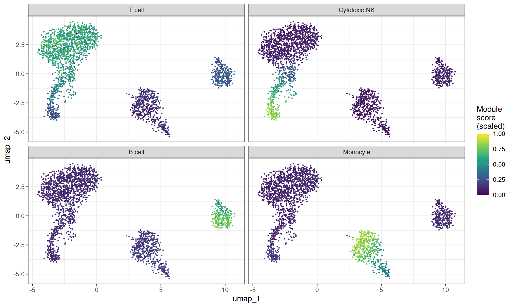
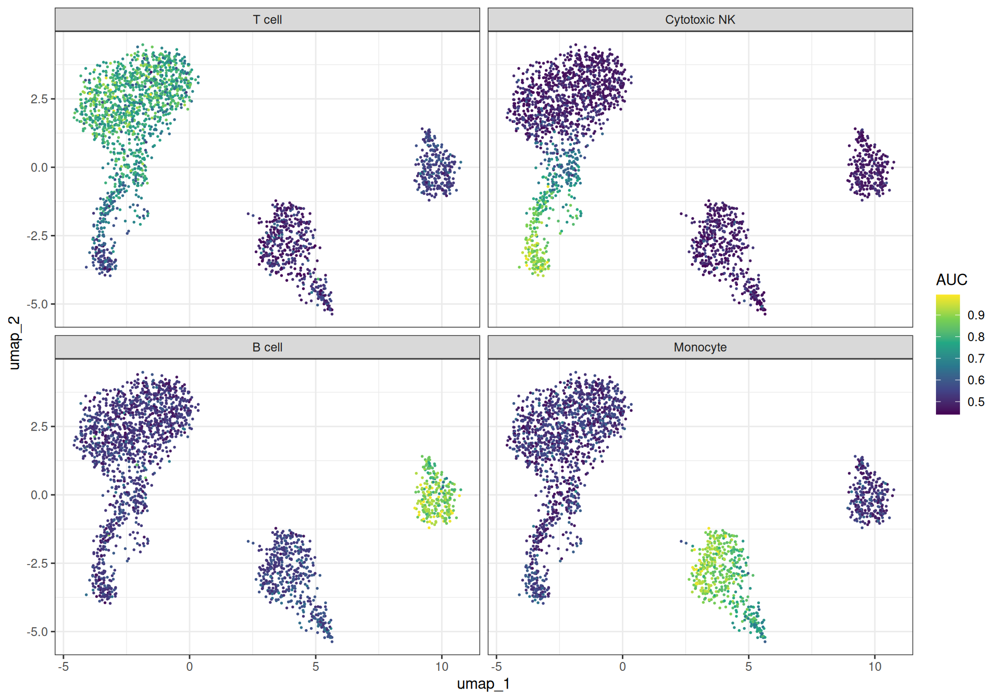
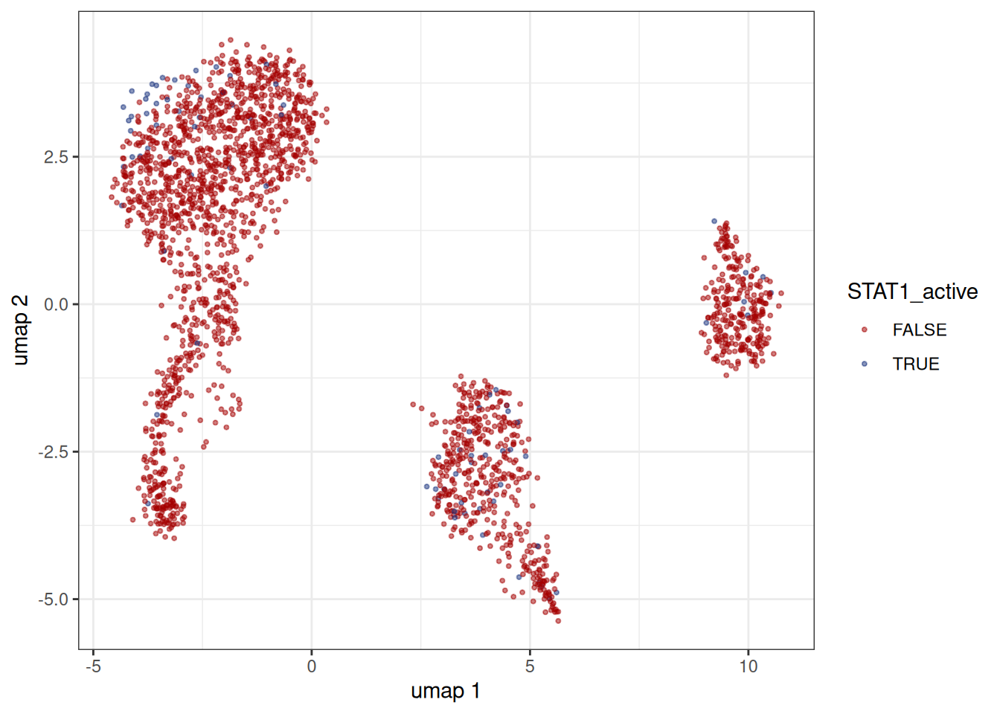
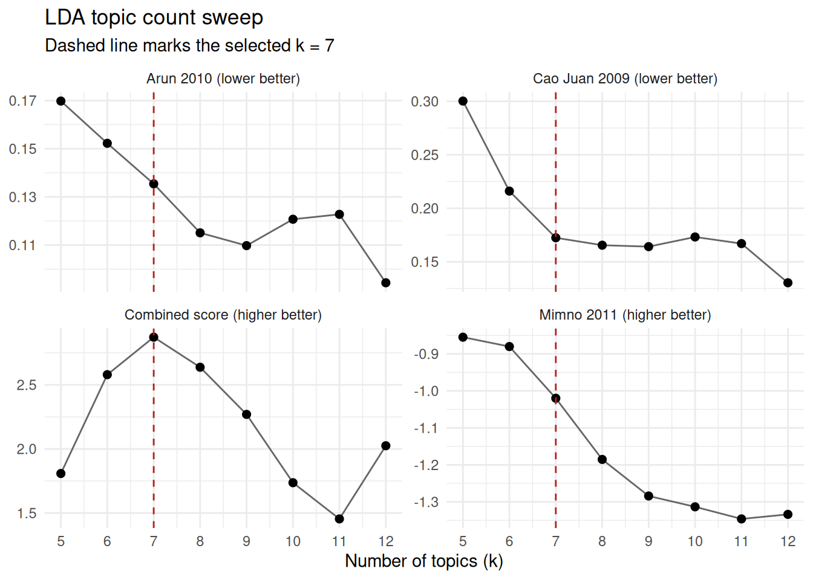
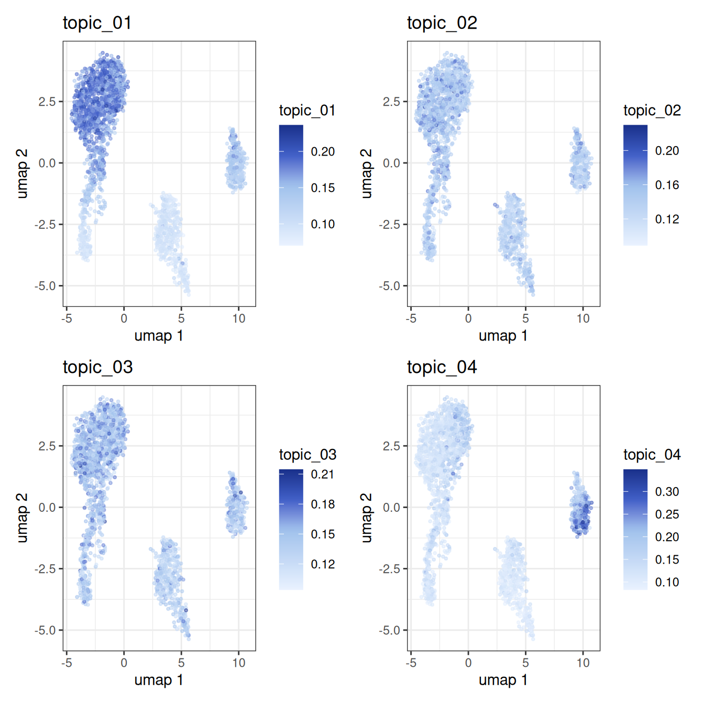

# Gene set analysis and GRN inference on PBMCs

## Intro

This vignette demonstrates the gene set scoring, spatial
autocorrelation, and gene regulatory network (GRN) inference methods
available in `bixverse`. It picks up where the [PBMC
vignette](https://gregorlueg.github.io/bixverse/articles/single_cell_pbmc.html)
left off: QC, normalisation, PCA, nearest neighbours, clustering and
UMAP are all assumed to be done already. If you have not read the
[design
choices](https://gregorlueg.github.io/bixverse/articles/design_single_cell.html)
and the [introductory
vignette](https://gregorlueg.github.io/bixverse/articles/thinking_single_cell.html),
please do so first.

The methods fall into four broad categories:

- The first, module scores, AUCell, and VISION, takes *pre-defined* gene
  sets and scores them per cell.
- The second, Hotspot and SCENIC, *discovers* gene programmes and
  regulatory relationships from the data itself.
- The third, NMF, also *discovers* gene programmes and regulatory
  relationships via matrix factorisation which is different from SCENIC
  and Hotspot.
- The fourth, LDA, is a topic model over a binary matrix. It picks up
  where SCENIC leaves off: binarise the regulon activity, then sort the
  TFs into topics.

We use the PBMC3k dataset throughout. At 2,700 cells this is likely too
small for the GRN methods to produce biologically meaningful results,
but it is large enough to show the API and the workflow end to end. On
real datasets with tens of thousands of cells the same code applies
unchanged. Also, as the

``` r

library(bixverse)
library(bixverse.plots)
library(ggplot2)
library(data.table)
#> 
#> Attaching package: 'data.table'
#> The following object is masked from 'package:base':
#> 
#>     %notin%
library(magrittr)
```

> **Note**
>
> The vignette was built on a GitHub runner which is a 2-core machine
> with ~8 GB of memory. That this works is incredible enough, but take
> this into account when looking at this vignette.

### Rebuilding the processed object

We reconstruct the processed `SingleCells` object from the PBMC
vignette. The chunk is hidden for brevity: it downloads the data, runs
QC, HVG selection, PCA, neighbour computation, Leiden clustering and
UMAP.

Rebuild the PBMC3k object (click to expand)

``` r

pbmc3k_path <- download_pbmc3k()
tempdir_pbmc <- tempdir()

sc_object <- SingleCells(dir_data = tempdir_pbmc)
mtx_io_params <- get_cell_ranger_params(pbmc3k_path)

sc_object <- load_mtx(
  object = sc_object,
  sc_mtx_io_param = mtx_io_params,
  mtx_streaming = FALSE,
  .verbose = FALSE
)

setnames_sc(sc_object, table = "var", old = "column1", new = "gene_symbol")

var <- get_sc_var(sc_object)
ensembl_to_symbol <- setNames(var$gene_symbol, var$gene_id)
symbol_to_ensembl <- setNames(var$gene_id, var$gene_symbol)

# gene set proportions for QC
gs_of_interest <- list(
  MT = var[grepl("^MT-", gene_symbol), gene_id],
  Ribo = var[grepl("^RPS|^RPL", gene_symbol), gene_id]
)
sc_object <- gene_set_proportions_sc(
  sc_object,
  gs_of_interest,
  streaming = FALSE,
  .verbose = FALSE
)

# MAD QC
qc_df <- sc_object[[c("cell_id", "lib_size", "nnz", "MT")]]
metrics <- list(
  log10_lib_size = log10(qc_df$lib_size),
  log10_nnz = log10(qc_df$nnz),
  MT = qc_df$MT
)
directions <- c(
  log10_lib_size = "twosided",
  log10_nnz = "twosided",
  MT = "above"
)
qc <- run_cell_qc(
  metrics = metrics,
  cells_to_keep = get_cells_to_keep(sc_object),
  directions = directions,
  threshold = 3
)
sc_object[["outlier"]] <- qc$combined
cells_to_keep <- qc_df[!qc$combined, cell_id]
sc_object <- set_cells_to_keep(sc_object, cells_to_keep)

# HVG, PCA, neighbours, clustering, UMAP
sc_object <- find_hvg_sc(sc_object, hvg_no = 2000L, .verbose = FALSE)
sc_object <- calculate_pca_sc(sc_object, no_pcs = 30L, sparse_svd = TRUE)
#> Using sparse SVD solving on scaled data on 2000 HVG.
sc_object <- find_neighbours_sc(
  sc_object,
  neighbours_params = params_sc_neighbours(
    knn = list(knn_method = "exhaustive")
  )
)
#> 
#> Generating sNN graph (full: TRUE).
#> Transforming sNN data to igraph.
sc_object <- find_clusters_sc(sc_object, res = 1.5, name = "leiden_clusters")
sc_object <- umap_sc(sc_object, knn_method = "annoy")
#> Running UMAP.
#> Using n_epochs = 500 (dataset <10k samples or adam_parallel optimiser)
#> Using provided kNN graph.

# UMAP coordinates for reuse
umap_dt <- extract_embedding_data(sc_object, embedding = "umap")
setnames(
  umap_dt,
  old = c("dim_1", "dim_2"),
  new = c("umap_1", "umap_2"),
  skip_absent = TRUE
)
```

## Gene set scoring

### Module scores

The simplest approach to gene set activity is the module score from
[Tirosh et
al. (2016)](https://www.science.org/doi/10.1126/science.aad0501): for
each cell, compute the mean expression of the gene set and subtract the
mean expression of a size-matched control set drawn from the same
expression bins. We will just use some lineage-specific genes to have
pretty visualisations.

``` r

lineage_sets <- list(
  `T cell` = symbol_to_ensembl[c(
    "CD3D",
    "CD3E",
    "CD3G",
    "CD2",
    "IL7R",
    "CD7",
    "LEF1",
    "TCF7",
    "LTB",
    "TRAC"
  )],
  `Cytotoxic NK` = symbol_to_ensembl[c(
    "NKG7",
    "GNLY",
    "GZMA",
    "GZMB",
    "GZMH",
    "PRF1",
    "CST7",
    "KLRD1",
    "KLRB1",
    "FGFBP2"
  )],
  `B cell` = symbol_to_ensembl[c(
    "CD79A",
    "CD79B",
    "MS4A1",
    "BANK1",
    "IGHM",
    "IGHD",
    "CD74",
    "HLA-DQA1",
    "TCL1A",
    "VPREB3"
  )],
  `Monocyte` = symbol_to_ensembl[c(
    "CD14",
    "LYZ",
    "S100A8",
    "S100A9",
    "S100A12",
    "CST3",
    "FCN1",
    "VCAN",
    "MNDA",
    "TYROBP"
  )]
)

# drop any NAs
lineage_sets <- lapply(lineage_sets, function(x) x[!is.na(x)])

module_scores <- module_scores_sc(
  object = sc_object,
  gs_list = lineage_sets,
  .verbose = FALSE
)

# you need to unclass here
ms_dt <- as.data.table(unclass(module_scores), keep.rownames = "cell_id")
ms_dt <- merge(ms_dt, umap_dt, by = "cell_id")

ms_long <- melt(
  ms_dt,
  id.vars = c("cell_id", "umap_1", "umap_2"),
  measure.vars = names(lineage_sets),
  variable.name = "phase",
  value.name = "score"
)

# scale the scores to make them more comparable across
ms_long[,
  score_scaled := (score - min(score)) / (max(score) - min(score)),
  by = phase
]

ggplot(ms_long, aes(x = umap_1, y = umap_2)) +
  geom_point(aes(colour = score_scaled), size = 0.3) +
  scale_colour_viridis_c() +
  facet_wrap(~phase, ncol = 2) +
  theme_bw() +
  labs(colour = "Module\nscore\n(scaled)")
```



Module scores for lineage genes projected onto UMAP

Let’s imagine you want to add the scores to the internal DB. There are
helpers for this, too. The
[`get_data()`](https://gregorlueg.github.io/bixverse/reference/get_data.md)
helper in combination with \`\`

``` r

sc_object <- add_sc_new_obs(
  object = sc_object,
  obs_data = get_data(module_scores)
)

head(sc_object)
#>    cell_idx          cell_id   nnz lib_size to_keep          MT      Ribo
#>       <num>           <char> <num>    <num>  <lgcl>       <num>     <num>
#> 1:        1 AAACATACAACCAC-1   778     2418    TRUE 0.030190241 0.4371381
#> 2:        3 AAACATTGATCAGC-1  1126     3144    TRUE 0.008905852 0.3171120
#> 3:        4 AAACCGTGCTTCCG-1   953     2632    TRUE 0.017477203 0.2431611
#> 4:        6 AAACGCACTGGTAC-1   779     2154    TRUE 0.016713092 0.3635097
#> 5:        8 AAACGCTGGTTCTT-1   785     2255    TRUE 0.031042129 0.3844789
#> 6:        9 AAACGCTGTAGCCA-1   530     1273    TRUE 0.011783189 0.3794187
#>    outlier leiden_clusters     T cell Cytotoxic NK     B cell   Monocyte
#>     <lgcl>           <int>      <num>        <num>      <num>      <num>
#> 1:   FALSE               1  0.3236977   -0.2325926 -0.3144407 -0.7570705
#> 2:   FALSE               1  0.2307960   -0.3455873 -0.4134143 -0.6403040
#> 3:   FALSE               7 -1.1175209   -0.2854205  0.0692758  1.2887695
#> 4:   FALSE               1 -0.1862041   -0.5217526 -0.2286735 -0.7023786
#> 5:   FALSE               4  0.1805688    0.4830460 -0.4746688 -0.6906318
#> 6:   FALSE               4 -0.1726186    0.2581931  0.7847812 -0.7003754
```

As we can appreciate, this has now added the new columns.

### AUCell

[AUCell](https://www.nature.com/articles/nmeth.4463) ranks genes within
each cell by expression and summarises where the gene set lands in that
ranking. More robust to outliers than a simple mean. `bixverse` gives
you three statistics via
[`params_sc_aucell()`](https://gregorlueg.github.io/bixverse/reference/params_sc_aucell.md),
all reading the same ranking but weighting it differently:

- `"recovery"`, the default, is the recovery-curve AUC under a rank
  cutoff, i.e. what Aibar et al. published. Top-heavy: only genes inside
  the top `max_rank` contribute, so it is the sharper instrument for
  marker sets and the one to use for SCENIC.
- `"wilcox"` is the AUC from the Mann-Whitney U statistic over the full
  ranking. Its null sits at 0.5 whatever the gene set size, which makes
  it a safe pick for pathway activity, but the flatter score does not
  split into on/off populations.
- `"ap"` is average precision. Most top-heavy of the three, but its null
  tracks gene set prevalence, so don’t compare raw values across sets of
  different size unless you switch `standardise` on.

We use the `"wilcox"` here.

``` r

auc_scores <- aucell_sc(
  object = sc_object,
  gs_list = lineage_sets,
  aucell_params = params_sc_aucell(auc_type = "wilcox"),
  .verbose = FALSE
)

auc_dt <- as.data.table(unclass(auc_scores), keep.rownames = "cell_id")
auc_dt <- merge(auc_dt, umap_dt, by = "cell_id")

auc_long <- melt(
  auc_dt,
  id.vars = c("cell_id", "umap_1", "umap_2"),
  measure.vars = names(lineage_sets),
  variable.name = "phase",
  value.name = "auc"
)

ggplot(auc_long, aes(x = umap_1, y = umap_2)) +
  geom_point(aes(colour = auc), size = 0.3) +
  scale_colour_viridis_c() +
  facet_wrap(~phase) +
  theme_bw() +
  labs(colour = "AUC")
```



AUCell scores for lineage genes projected onto UMAP

### VISION with spatial autocorrelation

Scoring gene sets is useful, but a natural follow-up question is: *are
these scores spatially structured on the cell neighbourhood graph, or
just noise?*
[VISION](https://www.nature.com/articles/s41467-019-12235-0) provides a
permutation-based test of spatial autocorrelation (Geary’s C) on the kNN
graph. Gene sets with significant autocorrelation are those whose
activity varies smoothly across cell neighbourhoods – a strong
indication that the signal is biologically meaningful rather than
random.

VISION expects gene sets in a signed format with `pos` and (optionally)
`neg` components. In the cause of our cell lineage genes, we could use
the other cell type’s markers as negatives, but we will just leave it
blank here.

``` r

vision_gs <- lapply(lineage_sets, function(genes) list(pos = genes))

vision_res <- vision_w_autocor_sc(
  object = sc_object,
  gs_list = vision_gs,
  embd_to_use = "pca",
  vision_params = params_sc_vision(n_perm = 500L),
  .verbose = FALSE
)

head(vision_res$auto_cor_dt)
#>    gene_set_name  auto_cor       p_val         fdr
#>           <char>     <num>       <num>       <num>
#> 1:        T cell 0.7612149 0.001996008 0.003992016
#> 2:  Cytotoxic NK 0.4620422 0.009980040 0.009980040
#> 3:        B cell 0.5621629 0.009980040 0.009980040
#> 4:      Monocyte 0.5473186 0.001996008 0.003992016
```

Unsurprisingly, all of these gene sets show highly significant spatial
correlation.

## Hotspot

Where the methods above test *pre-defined* gene sets, Hotspot ([DeTomaso
& Yosef,
2021](https://www.cell.com/cell-systems/fulltext/S2405-4712(21)00114-9))
discovers gene programmes *de novo* by testing each gene for spatial
autocorrelation on the kNN graph and then grouping the significant genes
by their local correlation structure.

### Gene autocorrelation

The first step computes Geary’s C for every gene against the neighbour
graph. Genes with significant autocorrelation are those whose expression
varies smoothly across neighbouring cells, i.e., genes that mark
spatially coherent programmes.

``` r

hotspot_autocor <- hotspot_autocor_sc(
  object = sc_object,
  .verbose = FALSE
)

hotspot_autocor[, gene_symbol := ensembl_to_symbol[gene_id]]

head(hotspot_autocor[order(fdr)], 25L)
#>             gene_id  gaerys_c   z_score  pval   fdr gene_symbol
#>              <char>     <num>     <num> <num> <num>      <char>
#>  1: ENSG00000188290 0.3242266  39.66046     0     0        HES4
#>  2: ENSG00000119535 0.3022016  49.27494     0     0       CSF3R
#>  3: ENSG00000163131 0.5119517  63.60383     0     0        CTSS
#>  4: ENSG00000163191 0.4122631  58.87283     0     0     S100A11
#>  5: ENSG00000163220 0.6936087 109.61599     0     0      S100A9
#>  6: ENSG00000143546 0.6563530 114.56873     0     0      S100A8
#>  7: ENSG00000197956 0.6433797  98.70326     0     0      S100A6
#>  8: ENSG00000196154 0.6429363  92.52890     0     0      S100A4
#>  9: ENSG00000177954 0.6083654  94.29710     0     0       RPS27
#> 10: ENSG00000158869 0.6997935  81.83833     0     0      FCER1G
#> 11: ENSG00000203747 0.6159353  71.61398     0     0      FCGR3A
#> 12: ENSG00000198821 0.2228819  59.91400     0     0       CD247
#> 13: ENSG00000143185 0.3826069  53.56304     0     0        XCL2
#> 14: ENSG00000143184 0.3719576  57.30895     0     0        XCL1
#> 15: ENSG00000116667 0.2143988  43.89426     0     0     C1orf21
#> 16: ENSG00000143947 0.3742483  57.71536     0     0      RPS27A
#> 17: ENSG00000115523 0.5908421 126.38232     0     0        GNLY
#> 18: ENSG00000153563 0.2527090  47.25644     0     0        CD8A
#> 19: ENSG00000172116 0.2330091  39.71748     0     0        CD8B
#> 20: ENSG00000071082 0.4138269  64.81413     0     0       RPL31
#> 21: ENSG00000144713 0.3622806  61.70233     0     0       RPL32
#> 22: ENSG00000168028 0.2855044  45.84666     0     0        RPSA
#> 23: ENSG00000233276 0.4964235  64.97836     0     0        GPX1
#> 24: ENSG00000163931 0.2321878  38.70044     0     0         TKT
#> 25: ENSG00000196542 0.3874654  51.78241     0     0      SPTSSB
#>             gene_id  gaerys_c   z_score  pval   fdr gene_symbol
#>              <char>     <num>     <num> <num> <num>      <char>
```

You should get a set of well known cell type markers here…

### Gene-gene local correlations and modules

Taking the significant genes forward, we compute pairwise local
correlations and cluster them into modules. Each module represents a
group of genes that are not only individually autocorrelated but also
co-vary locally - a much stronger signal than global correlation alone.

``` r

sig_genes <- hotspot_autocor[fdr <= 0.05, gene_id]

hotspot_cor <- hotspot_gene_cor_sc(
  object = sc_object,
  genes_to_take = sig_genes,
  .verbose = TRUE
)

hotspot_cor
#> Hotspot gene-gene local correlation results
#>   Genes: 2581
#>   Cells: 2163
#>   Modules: not yet computed (see generate_hotspot_membership)
```

This returns a HotSpot result. Let’s add the membership and plot it.

``` r

hotspot_cor <- generate_hotspot_membership(hotspot_cor)

# this will only plot a subsample of 500 genes for speed (stratified by
# module). You can control this via a parameter in the plotting function
plot(hotspot_cor)
```


Let’s pull out the genes:

``` r

membership <- get_hotspot_membership(hotspot_cor)
membership[, gene_symbol := ensembl_to_symbol[gene_id]]

membership <- membership[!is.na(cluster_member)]

head(membership[order(cluster_member)], 20L)
#>             gene_id cluster_member gene_symbol
#>              <char>          <num>      <char>
#>  1: ENSG00000188822              0        CNR2
#>  2: ENSG00000169504              0       CLIC4
#>  3: ENSG00000169442              0        CD52
#>  4: ENSG00000162511              0      LAPTM5
#>  5: ENSG00000162373              0       BEND5
#>  6: ENSG00000132704              0       FCRL2
#>  7: ENSG00000163534              0       FCRL1
#>  8: ENSG00000158481              0        CD1C
#>  9: ENSG00000072694              0      FCGR2B
#> 10: ENSG00000132185              0       FCRLA
#> 11: ENSG00000116191              0     RALGPS2
#> 12: ENSG00000197520              0     FAM177B
#> 13: ENSG00000054277              0        OPN3
#> 14: ENSG00000152689              0     RASGRP3
#> 15: ENSG00000119866              0      BCL11A
#> 16: ENSG00000162924              0         REL
#> 17: ENSG00000144218              0        AFF3
#> 18: ENSG00000136717              0        BIN1
#> 19: ENSG00000169994              0       MYO7B
#> 20: ENSG00000121966              0       CXCR4
#>             gene_id cluster_member gene_symbol
#>              <char>          <num>      <char>
```

The resulting modules should roughly correspond to the major cell-type
programmes in PBMCs (T cell, monocyte, B cell, NK cell signatures,
etc.). Let’s visualise this with AUCell check it out.

``` r

hotspot_gene_sets <- membership %$% split(gene_id, cluster_member)

hotspot_gene_sets <- lapply(hotspot_gene_sets, function(genes) {
  list(pos = genes)
})

vision_scores_hotspot <- vision_sc(
  object = sc_object,
  gs_list = hotspot_gene_sets,
  .verbose = FALSE
)

vision_scores_dt <- as.data.table(
  unclass(vision_scores_hotspot),
  keep.rownames = "cell_id"
)
vision_scores_dt <- merge(vision_scores_dt, umap_dt, by = "cell_id")


vision_scores_long <- melt(
  vision_scores_dt,
  id.vars = c("cell_id", "umap_1", "umap_2"),
  measure.vars = names(hotspot_gene_sets),
  variable.name = "gene_set",
  value.name = "vision_score"
)

# min max individually for prettier visualisations
vision_scores_long[,
  vision_score_scaled := (vision_score - min(vision_score)) /
    (max(vision_score) - min(vision_score)),
  by = gene_set
]

ggplot(vision_scores_long, aes(x = umap_1, y = umap_2)) +
  geom_point(aes(colour = vision_score_scaled), size = 0.3) +
  scale_colour_viridis_c() +
  facet_wrap(~gene_set) +
  theme_bw() +
  labs(colour = "Vision (scaled)")
```


## SCENIC

[SCENIC](https://www.nature.com/articles/nmeth.4463) infers gene
regulatory networks by asking: for each gene, which transcription
factors (TFs) best predict its expression? The original implementation
uses either random forests or GRNBoost2 (gradient boosted trees) to
regress each target gene on all TFs, then extracts feature importances
as a proxy for regulatory strength.

The `bixverse` implementation re-implements this in Rust with several
optimisations that make the RF and ExtraTrees paths substantially faster
than the single-target-at-a-time approach used by GRNBoost2:

- **Quantisation**: TF expression values are discretised into 256 bins
  (u8), so histogram construction during tree building operates on
  single bytes and fits comfortably in L1 cache.
- **Multi-output batching**: up to 64 target genes share a single tree
  structure. The histogram construction cost is paid once per node per
  feature, but the split score aggregates variance reduction across all
  targets in the batch. This amortises the dominant cost of tree
  building across targets.
- **Correlated gene batching**: rather than assigning genes to batches
  randomly, an optional SVD + k-means step groups co-expressed genes
  together so that the shared tree structure is more informative for
  each target in the batch.
- **GRNBoost2 with histogram subtraction**: for the gradient boosted
  path (single-target), the code builds full-feature histograms at each
  node and derives the larger child via parent-minus-smaller
  subtraction, avoiding a redundant scan of the larger child’s samples.
  OOB early stopping prevents overfitting and is the main source of
  speedup.

On the 2,700-cell PBMC3k dataset these optimisations are not that
noticeable… The data is too small for any method to take long. On
datasets with tens of thousands of cells and thousands of TFs, the RF/ET
multi-output path comfortably outperforms GRNBoost2. You need to just
decide if you are okay with the batching of genes. Generally speaking,
the big signals will be recovered again and again (from empirical
testing).

### Gene filtering

SCENIC first filters genes by minimum total counts and minimum
proportion of expressing cells to remove uninformative targets.

``` r

scenic_genes <- scenic_gene_filter_sc(
  object = sc_object,
  scenic_params = params_scenic(min_counts = 50L),
  .verbose = FALSE
)

length(scenic_genes)
#> [1] 5430
```

### Transcription factor list

We need a list of known TFs. The Aerts lab provides a curated list for
human which we can download and map to Ensembl IDs.

``` r

tf_dt <- data.table::fread(
  "https://resources.aertslab.org/cistarget/tf_lists/allTFs_hg38.txt",
  header = FALSE,
  col.names = "tf"
)
tf_dt[, gene_id := symbol_to_ensembl[tf]]
tf_dt <- tf_dt[!is.na(gene_id)]

nrow(tf_dt)
#> [1] 1100
```

### GRN inference

With genes and TFs in hand, we run the GRN inference step. Here we use
random forests with a batch size of 64 to illustrate the multi-output
path.

``` r

scenic_res <- scenic_grn_sc(
  object = sc_object,
  tf_ids = tf_dt$gene_id,
  genes_to_take = scenic_genes,
  scenic_params = params_scenic(
    learner_type = "randomforest",
    gene_batch_size = 64L
  ),
  .verbose = TRUE
)
#> SCENIC: 5430 target genes, 466 TFs, 2163 cells

scenic_res
#> ScenicGrn (GRN results)
#>   No genes:                 5430 
#>   No TFs:                   466 
#>   Applied learner:          randomforest 
#>   TF to gene generated:     FALSE 
#>   CisTarget res generated:  FALSE
```

If you are bored, you can run both methods
(`learner_type = "grnboost2"`) and compare the importance scores. You
will see very high correlations here (and can explore the speed
differences…)

### TF-to-gene refinement

The raw importance matrix is large and noisy. The next steps winnow it
down to a candidate regulatory network by keeping only the top TF-gene
pairs and filtering by pairwise expression correlation. The approach
used here is that per gene only TFs with an
`importance score ≥ mean(importance_score) + n_sd * sd(importance_score)`
per given gene are kept. Note that `n_sd` should be adjusted depending
on the learner: RF and ExtraTrees spread importance more evenly across
TFs than GRNBoost2, so a lower threshold (e.g. `n_sd = 1`) is
appropriate, whereas GRNBoost2 concentrates importance onto fewer TFs
and tolerates `n_sd = 1.5` or even `n_sd = 2`.

``` r

scenic_res <- identify_tf_to_genes(
  scenic_res,
  n_sd = 2,
  .verbose = TRUE
)
#> Extracting TF to gene associations via per-gene threshold (mean + 2.0 * SD).

scenic_res <- tf_to_genes_correlations(
  x = scenic_res,
  object = sc_object,
  .verbose = TRUE
)
#> Calculating the pairwise correlations between the TFs and genes
#> Keeping activating TF <> gene links at |rho| > 0.030
#> Removing self loops (TF controlling its own expression

tf_gene_dt <- get_tf_to_gene(scenic_res)
tf_gene_dt[, tf_symbol := ensembl_to_symbol[tf]]
tf_gene_dt[, gene_symbol := ensembl_to_symbol[gene]]

head(tf_gene_dt[order(-importance)], 5L)
#>                 tf            gene importance pairwise_cor cor_sign tf_symbol
#>             <char>          <char>      <num>        <num>    <int>    <char>
#> 1: ENSG00000171223 ENSG00000120129  0.2948482    0.3103159        1      JUNB
#> 2: ENSG00000066336 ENSG00000107341  0.2746513    0.1931844        1      SPI1
#> 3: ENSG00000170345 ENSG00000120129  0.2573821    0.3420300        1       FOS
#> 4: ENSG00000066336 ENSG00000165025  0.2460342    0.2060750        1      SPI1
#> 5: ENSG00000139187 ENSG00000153563  0.2453607    0.2005614        1     KLRG1
#>    gene_symbol
#>         <char>
#> 1:       DUSP1
#> 2:      UBE2R2
#> 3:       DUSP1
#> 4:         SYK
#> 5:        CD8A
```

### CisTarget motif enrichment

The final (and optional) step in the SCENIC pipeline validates the
predicted TF-gene links against known motif binding sites. This requires
downloading the CisTarget motif ranking database and motif-to-TF
annotation files from the [Aerts lab
resources](https://resources.aertslab.org/cistarget/), which together
are roughly 400 MB. We therefore show the code but do not evaluate it by
default.

``` r

# Download the CisTarget reference files (cached after first download)
paths <- download_cistarget_hg38()

rankings <- read_motif_ranking(paths$rankings)
annotations <- read_motif_annotation_file(paths$motif_annotations)

# Run motif enrichment on the TF-gene links
scenic_res <- tf_to_genes_motif_enrichment(
  x = scenic_res,
  motif_rankings = rankings,
  annot_data = annotations,
  # we store everything as Ensembl... The SCENIC data has gene symbols, hence,
  # the need to provide conversion
  gene_id_to_symbol = ensembl_to_symbol,
  cis_target_params = params_cistarget(),
  only_high_conf_tf = FALSE,
  .verbose = TRUE
)

# CisTarget results per TF
cistarget_dt <- get_cistarget_res(scenic_res)
head(cistarget_dt[order(-nes)])

# The TF-to-gene table now has a leading_edge column indicating which
# genes fall within the motif recovery curve
tf_gene_final <- get_tf_to_gene(scenic_res)

head(tf_gene_final[(in_leading_edge)][order(-importance)])
```

CisTarget is not a pass/fail filter on the module. Per enriched motif it
builds a recovery curve, compares it against the mean + 2 SD curve
across every motif in the database, and keeps only the genes above the
point of maximum separation. So expect the regulons coming out of
[`build_regulons()`](https://gregorlueg.github.io/bixverse/reference/build_regulons.md)
to be a good deal smaller than the modules going in.

[`build_regulons()`](https://gregorlueg.github.io/bixverse/reference/build_regulons.md)
applies that filter, adds the TF back to its own set and drops anything
too small. Since we skipped the CisTarget download above, we pass
`use_leading_edge = FALSE` and it warns and carries on without the motif
filter. The regulons that come out are a lot bigger and noisier than a
proper SCENIC run would give you, so read the biology below with that in
mind. The API is identical either way.

``` r

regulons <- build_regulons(scenic_res, use_leading_edge = FALSE)
#> Built 227 regulons (154 dropped below 10 genes). Median size: 21

length(regulons)
#> [1] 227
summary(lengths(regulons))
#>    Min. 1st Qu.  Median    Mean 3rd Qu.    Max. 
#>    10.0    14.0    21.0   139.8   104.0  1583.0
```

That is what you hand to
[`aucell_sc()`](https://gregorlueg.github.io/bixverse/reference/aucell_sc.md),
which scores every regulon in every cell.

``` r

auc_regulons <- aucell_sc(
  object = sc_object,
  gs_list = regulons,
  aucell_params = params_sc_aucell()
)
```

The AUC scores are continuous, and for most downstream purposes you want
an on/off call instead.
[`binarise_regulon_activity()`](https://gregorlueg.github.io/bixverse/reference/binarise_regulon_activity.md)
fits a two-component Gaussian mixture per regulon, compares it against a
single Gaussian by BIC, and puts the threshold at the trough between the
two component means. Regulons that are not bimodal fall back to
`mean + 2 * sd`.

``` r

binarised_regulons <- binarise_regulon_activity(auc_regulons)
#> Binarised 227 regulons, 72 of which were bimodal.

binary_matrix <- binarised_regulons$binary
colnames(binary_matrix) <- ensembl_to_symbol[colnames(binary_matrix)]

head(binarised_regulons$thresholds[order(-n_cells_on)])
#>            regulon   threshold bimodal n_cells_on
#>             <char>       <num>  <lgcl>      <num>
#> 1: ENSG00000177606 0.028034928    TRUE       1629
#> 2: ENSG00000198034 0.099866757    TRUE       1539
#> 3: ENSG00000124614 0.097379875    TRUE       1535
#> 4: ENSG00000171223 0.069938338    TRUE       1500
#> 5: ENSG00000136942 0.129315786    TRUE       1498
#> 6: ENSG00000100823 0.009789546    TRUE       1458
```

``` r

sc_object[["STAT1_active"]] <- binary_matrix[, "STAT1"]

embedding_plot_sc(
  object = sc_object,
  embedding = "umap",
  colour_by = "STAT1_active"
)
```



This is how you work with all types of `"bag of genes"` analyses for
single cell in `bixverse`.

## Topic models with LDA

Binarising the regulons gives us a cells x regulons matrix of ones and
zeros, which is exactly the shape a topic model wants: cells are
documents, regulons are terms. This is the trick behind
[cisTopic](https://doi.org/10.1038/s41592-019-0367-1), which runs latent
Dirichlet allocation over binarised scATAC to get a cell-topic
distribution for clustering and a topic-region distribution for region
set discovery. Nothing about it is ATAC-specific, so swapping regions
for regulons gives you TF activity sorted into topics.

Why binarise at all? Because LDA on raw single cell counts is dominated
by library size. Every cell’s “document length” is its total count, deep
cells dominate the corpus, and the topics you get back are largely a
rediscovery of sequencing depth. Thresholding to on/off throws that away
and leaves the model looking at co-occurrence, which is the thing you
actually care about.

`bixverse` implements variational Bayes LDA in Rust, following [Hoffman,
et
al.](https://papers.nips.cc/paper/2010/hash/71f6278d140af599e06ad9bf1ba03cb0-Abstract.html),
with the same knobs and defaults pycisTopic exposes.

### Picking the number of topics

Same eternal question as with NMF, and
[`lda_k_sweep()`](https://gregorlueg.github.io/bixverse/reference/lda_k_sweep.md)
gives you three different answers to argue with. Arun 2010 compares the
singular values of the topic-term matrix against the document length
distribution; Cao Juan 2009 is the mean pairwise cosine similarity
between topics, which climbs once `k` gets large enough that topics
start duplicating each other; Mimno 2011 is UMass coherence.
`combined_score` rescales all three onto `[0, 1]` and adds them up.

``` r

sweep_res <- lda_k_sweep(binary_matrix, k_range = 5:12)

sweep_res
#> LdaKSweepResult (LDA topic count sweep)
#>   k range:          5 to 12
#>   Best k:           7
#>   Metrics:          arun_2010 and cao_juan_2009 lower is better, mimno_2011 higher
#> 
#>        k  arun_2010 cao_juan_2009 mimno_2011     bound perplexity
#>    <int>      <num>         <num>      <num>     <num>      <num>
#> 1:     5 0.16981332     0.3002322 -0.8547891 -339021.7   134.5479
#> 2:     6 0.15225958     0.2160656 -0.8800924 -338921.9   134.3539
#> 3:     7 0.13542282     0.1724176 -1.0198741 -338820.0   134.1560
#> 4:     8 0.11508164     0.1654747 -1.1853645 -339039.1   134.5817
#> 5:     9 0.10976724     0.1641425 -1.2842002 -339296.9   135.0844
#> 6:    10 0.12072008     0.1731616 -1.3134488 -339586.9   135.6520
#> 7:    11 0.12276630     0.1669807 -1.3461572 -339823.9   136.1175
#> 8:    12 0.09433794     0.1303569 -1.3338648 -339872.5   136.2134
#>    combined_score converged
#>             <num>    <lgcl>
#> 1:       1.808360      TRUE
#> 2:       2.579716      TRUE
#> 3:       2.872085      TRUE
#> 4:       2.637487      TRUE
#> 5:       2.269648      TRUE
#> 6:       1.736410      TRUE
#> 7:       1.453985      TRUE
#> 8:       2.025017      TRUE
```

``` r

plot(sweep_res)
```



The three selection metrics and the combined score against k.

One caveat that will bite you if you do not know about it. Any `k` below
five is struck out of the selection entirely, because coherence
saturates on small topic counts and would otherwise always win. That is
inherited from pycisTopic, so `best_k` can never come back below five
however good the raw metrics of a smaller `k` look. Sweep below the
floor and you get a warning plus `NA` in `combined_score` for those
rows; the metrics themselves are still reported, so read them off the
table and pass the `k` you want to
[`get_best_model()`](https://gregorlueg.github.io/bixverse/reference/get_best_model.md).

### Reading the topics

[`get_best_model()`](https://gregorlueg.github.io/bixverse/reference/get_best_model.md)
pulls the winning fit straight out of the sweep, no refitting.

``` r

lda_res <- get_best_model(sweep_res)

lda_res
#> LdaResult (latent Dirichlet allocation)
#>   Documents:        2163
#>   Terms:            227
#>   Topics:           7
#>   Bound (ELBO):     -338820
#>   Perplexity:       134.156
#>   Iterations:       90
```

[`get_top_terms()`](https://gregorlueg.github.io/bixverse/reference/get_top_terms.md)
is where the interpretation happens: per topic, the regulons carrying
the most probability mass.

``` r

top_tfs <- get_top_terms(lda_res, n = 8L)

top_tfs[, .(tfs = paste(term, collapse = ", ")), by = topic]
#>       topic                                                       tfs
#>      <char>                                                    <char>
#> 1: topic_01        RPS4X, RPS10, JUNB, RPL35, TCF7, JUN, LEF1, ANXA11
#> 2: topic_02       PARP1, MAZ, BCLAF1, RAB2A, HSF1, DNMT1, APEX1, ATF4
#> 3: topic_03     NUCB1, ELF1, ZMAT2, ILF2, UGP2, STUB1, SCAND1, SUCLG1
#> 4: topic_04 CBFB, DUSP22, RNASEH2C, CXXC5, KLF12, RELA, SSRP1, ZNF581
#> 5: topic_05         NR4A1, LYL1, RXRA, CEBPD, SPI1, KLF4, CEBPB, MAFB
#> 6: topic_06    STAT4, TSC22D4, SF3B1, ETS1, MAGOH, RUNX3, KLRG1, XBP1
#> 7: topic_07 HTATIP2, HNRNPH3, NFATC3, KIF22, UGP2, APEX1, ANXA11, BBX
```

On PBMC3k the myeloid topic is usually unmistakable: `SPI1`, `CEBPD`,
`KLF4` and friends land together, because those regulons switch on in
the same cells. The T cell topics split along the naive/cytotoxic axis,
with `TCF7` and `LEF1` on one side and `STAT4`, `RUNX3`, `ETS1` on the
other. Which topic index gets which programme is arbitrary and changes
with the seed, so always read the loadings rather than trusting the
numbering.

The other half of the model is the cell-topic matrix, which is a soft
assignment: every cell gets a distribution over topics summing to one.
Drop a column into the object and it plots like any other cell-level
covariate.

``` r

doc_topic <- as.matrix(lda_res, "doc_topic")

for (topic in colnames(doc_topic)) {
  sc_object[[topic]] <- doc_topic[, topic]
}

topic_plots <- purrr::map(colnames(doc_topic)[1:4], \(topic) {
  embedding_plot_sc(
    object = sc_object,
    embedding = "umap",
    colour_by = topic
  ) +
    ggplot2::ggtitle(topic)
})

patchwork::wrap_plots(topic_plots, ncol = 2)
```



Topic proportions per cell on the UMAP.

Because the assignment is soft, a cell sitting between two programmes
shows up as genuinely intermediate rather than being forced into one
cluster. That is the main thing a topic model buys you over hard
clustering on the same matrix.

## NMF on single cells

The methods so far have all started from either a pre-defined gene set,
a graph-based notion of locality, or a TF-centric regression framework.
NMF (non-negative matrix factorisation) takes yet another angle: it
factorises the expression matrix `V ≈ W H` into a small number of latent
factors, where `W` carries non-negative gene loadings and `H` carries
non-negative cell activations. The non-negativity constraint tends to
push the factors into something interpretable as additive gene
programmes rather than abstract directions of variance like PCA.
`bixverse` implements
[HALS](https://proceedings.mlr.press/v39/kimura14.pdf) (Hierarchical
Alternating Least Squares) in Rust, which converges fast and scales
nicely.

A few practical notes before diving in:

- NMF is non-convex: different random initialisations land in different
  local optima. The package therefore provides
  [`nmf_sc()`](https://gregorlueg.github.io/bixverse/reference/nmf_sc.md)
  for a single run,
  [`stabilised_nmf_sc()`](https://gregorlueg.github.io/bixverse/reference/stabilised_nmf_sc.md)
  for multiple restarts, and
  [`consensus_nmf_sc()`](https://gregorlueg.github.io/bixverse/reference/consensus_nmf_sc.md)
  which takes those restarts and returns the programmes they agree on.
  The last one is the right default for any serious analysis.
- Picking `k` is the eternal question. Too small and programmes get
  smushed together; too large and they fragment into redundant copies.
  [`nmf_k_sweep_sc()`](https://gregorlueg.github.io/bixverse/reference/nmf_k_sweep_sc.md)
  turns that into something you can actually look at: stability against
  reconstruction error across a range of `k`. It is not a free lunch,
  but it beats licking your finger and seeing from where the wind comes…
  (Joke)
- NMF on a heterogeneous dataset often just rediscovers the obvious
  cell-type axis. The interesting use case is running it *within* a cell
  type to find finer-grained programmes (activation, exhaustion,
  cycling, etc.). We will do exactly that here.

We will focus on the T cells as an example. Think of your own use cases
in your data set and analyses.

### Identifying T cells

We will use the AUC scores from earlier to pull out the T cell
population. [Otsu’s
method](https://en.wikipedia.org/wiki/Otsu%27s_method) gives us a
data-driven threshold for the bimodal AUC distribution.

``` r

otsu_t_cell <- find_threshold_otsu(auc_dt$`T cell`)

ggplot(data = auc_dt, mapping = aes(x = `T cell`)) +
  geom_histogram(bins = 13, fill = "darkgrey") +
  theme_minimal() +
  xlab("T cell signature [AUC]") +
  geom_vline(xintercept = otsu_t_cell)
```


With the threshold in hand we grab the T cell IDs and recompute HVGs
*within* this subset. This matters: HVGs computed across all PBMCs are
dominated by inter-cell-type variation (T vs B vs monocyte). HVGs within
T cells expose the genes that actually vary across T cell states, which
is what we want NMF to factorise.

[`get_hvg_data_sc()`](https://gregorlueg.github.io/bixverse/reference/get_hvg_data_sc.md)
is a non-mutating variant of
[`find_hvg_sc()`](https://gregorlueg.github.io/bixverse/reference/find_hvg_sc.md):
it returns a data.table with the HVG metrics and an `is_hvg` flag,
without overwriting the HVGs stored on the object. Convenient when you
want HVGs for a specific downstream analysis without disturbing the
global state.

``` r

t_cell_ids <- auc_dt[`T cell` >= otsu_t_cell, cell_id]

hvg_t_cell_data <- get_hvg_data_sc(object = sc_object, cell_ids = t_cell_ids)

t_cell_hvg <- hvg_t_cell_data[(is_hvg), gene_id]
```

### Running a single NMF run

[`nmf_sc()`](https://gregorlueg.github.io/bixverse/reference/nmf_sc.md)
runs one NMF on the chosen cells and genes. The default initialisation
is NNDSVD, which is deterministic and usually gives a sensible starting
point.

``` r

t_cell_nmf_results <- nmf_sc(
  object = sc_object,
  k = 10L,
  cell_ids = t_cell_ids,
  gene_ids = t_cell_hvg
)
```

The result is an `NmfResult` carrying the `W` gene-loading matrix (genes
x components) and the `H` cell-activation matrix (components x cells),
plus the parameters and convergence info.

``` r

get_w(t_cell_nmf_results)[1:5, 1:5]
#>                      comp_01      comp_02      comp_03      comp_04
#> ENSG00000188976 2.756063e+00 1.516444e-01 9.978818e-11 3.985443e-01
#> ENSG00000188290 9.983770e-11 1.001252e-10 9.978818e-11 7.743338e-02
#> ENSG00000187608 9.983770e-11 2.746899e+00 1.624547e-01 9.984959e-11
#> ENSG00000186827 9.983770e-11 1.001252e-10 7.541640e+00 9.984959e-11
#> ENSG00000176022 9.073032e-01 7.619265e-03 1.844488e-01 9.984959e-11
#>                      comp_05
#> ENSG00000188976 3.031700e-01
#> ENSG00000188290 1.000227e-10
#> ENSG00000187608 1.000227e-10
#> ENSG00000186827 1.000227e-10
#> ENSG00000176022 1.000227e-10
```

``` r

get_h(t_cell_nmf_results)[1:5, 1:5]
#>         AAACATACAACCAC-1 AAACATTGATCAGC-1 AAACGCACTGGTAC-1 AAACGCTGGTTCTT-1
#> comp_01      0.029081384      0.028246988     2.750892e-02     2.642106e-02
#> comp_02      0.032824770      0.004165698     5.788827e-03     4.682986e-02
#> comp_03      0.009732882      0.053273071     5.238257e-02     1.002123e-10
#> comp_04      0.064907432      0.017416965     1.001506e-10     3.876413e-02
#> comp_05      0.004365134      0.047877852     9.997733e-11     1.034977e-02
#>         AAACTTGATCCAGA-1
#> comp_01      0.032608423
#> comp_02      0.002322522
#> comp_03      0.007309146
#> comp_04      0.018659594
#> comp_05      0.049327504
```

### Running multiple NMF runs

For anything beyond exploratory work you want multiple restarts.
[`stabilised_nmf_sc()`](https://gregorlueg.github.io/bixverse/reference/stabilised_nmf_sc.md)
runs `n_runs` HALS NMFs with random initialisations (seeded by
`seed + i`) and column-binds the resulting `W` matrices. Looking at this
stabilised data allows you to identify components that constantly show
up between random initialisations.

``` r

t_cell_nmf_results_stabilised <- stabilised_nmf_sc(
  object = sc_object,
  k = 10L,
  cell_ids = t_cell_ids,
  gene_ids = t_cell_hvg,
  n_runs = 10L
)
```

The W matrix here is wide: `n_genes x (k * n_runs)`. Each block of `k`
columns corresponds to one run. You can then use it for downstream
consensus analyses.

``` r

get_w(t_cell_nmf_results_stabilised)[1:5, 1:5]
#>                 run_01.comp_01 run_01.comp_02 run_01.comp_03 run_01.comp_04
#> ENSG00000188976   2.047948e+00   6.749125e-01     0.42683131   1.000597e-10
#> ENSG00000188290   2.615961e-02   1.000214e-10     0.13890615   1.000597e-10
#> ENSG00000187608   9.990404e-11   1.000214e-10    29.44829559   1.000597e-10
#> ENSG00000186827   9.990404e-11   1.000214e-10     2.02266049   7.260294e+00
#> ENSG00000176022   6.144505e-01   3.268677e-01     0.03150798   1.429209e-02
#>                 run_01.comp_05
#> ENSG00000188976   9.101315e-01
#> ENSG00000188290   1.698188e-01
#> ENSG00000187608   3.292343e+00
#> ENSG00000186827   1.002548e-10
#> ENSG00000176022   1.002548e-10
```

The H matrices are kept per-run, since each random initialisation gives
a different cell-activation pattern (components are not aligned across
runs without further work).

``` r

str(get_h(t_cell_nmf_results_stabilised))
#> List of 10
#>  $ run_01: num [1:10, 1:1150] 4.46e-02 1.84e-03 1.00e-10 2.27e-02 1.68e-02 ...
#>   ..- attr(*, "dimnames")=List of 2
#>   .. ..$ : chr [1:10] "comp_01" "comp_02" "comp_03" "comp_04" ...
#>   .. ..$ : chr [1:1150] "AAACATACAACCAC-1" "AAACATTGATCAGC-1" "AAACGCACTGGTAC-1" "AAACGCTGGTTCTT-1" ...
#>  $ run_02: num [1:10, 1:1150] 3.71e-02 1.00e-10 4.35e-02 1.23e-02 2.78e-02 ...
#>   ..- attr(*, "dimnames")=List of 2
#>   .. ..$ : chr [1:10] "comp_01" "comp_02" "comp_03" "comp_04" ...
#>   .. ..$ : chr [1:1150] "AAACATACAACCAC-1" "AAACATTGATCAGC-1" "AAACGCACTGGTAC-1" "AAACGCTGGTTCTT-1" ...
#>  $ run_03: num [1:10, 1:1150] 0.0218 0.031 0.016 0.0335 0.0346 ...
#>   ..- attr(*, "dimnames")=List of 2
#>   .. ..$ : chr [1:10] "comp_01" "comp_02" "comp_03" "comp_04" ...
#>   .. ..$ : chr [1:1150] "AAACATACAACCAC-1" "AAACATTGATCAGC-1" "AAACGCACTGGTAC-1" "AAACGCTGGTTCTT-1" ...
#>  $ run_04: num [1:10, 1:1150] 1.83e-02 3.01e-02 3.60e-02 2.95e-02 1.00e-10 ...
#>   ..- attr(*, "dimnames")=List of 2
#>   .. ..$ : chr [1:10] "comp_01" "comp_02" "comp_03" "comp_04" ...
#>   .. ..$ : chr [1:1150] "AAACATACAACCAC-1" "AAACATTGATCAGC-1" "AAACGCACTGGTAC-1" "AAACGCTGGTTCTT-1" ...
#>  $ run_05: num [1:10, 1:1150] 3.05e-02 3.28e-02 9.99e-11 1.00e-10 2.73e-02 ...
#>   ..- attr(*, "dimnames")=List of 2
#>   .. ..$ : chr [1:10] "comp_01" "comp_02" "comp_03" "comp_04" ...
#>   .. ..$ : chr [1:1150] "AAACATACAACCAC-1" "AAACATTGATCAGC-1" "AAACGCACTGGTAC-1" "AAACGCTGGTTCTT-1" ...
#>  $ run_06: num [1:10, 1:1150] 0.03488 0.01592 0.00726 0.02895 0.03118 ...
#>   ..- attr(*, "dimnames")=List of 2
#>   .. ..$ : chr [1:10] "comp_01" "comp_02" "comp_03" "comp_04" ...
#>   .. ..$ : chr [1:1150] "AAACATACAACCAC-1" "AAACATTGATCAGC-1" "AAACGCACTGGTAC-1" "AAACGCTGGTTCTT-1" ...
#>  $ run_07: num [1:10, 1:1150] 1.94e-02 4.54e-02 1.00e-10 1.19e-02 1.05e-02 ...
#>   ..- attr(*, "dimnames")=List of 2
#>   .. ..$ : chr [1:10] "comp_01" "comp_02" "comp_03" "comp_04" ...
#>   .. ..$ : chr [1:1150] "AAACATACAACCAC-1" "AAACATTGATCAGC-1" "AAACGCACTGGTAC-1" "AAACGCTGGTTCTT-1" ...
#>  $ run_08: num [1:10, 1:1150] 3.70e-02 1.00e-10 3.69e-02 4.94e-02 3.10e-02 ...
#>   ..- attr(*, "dimnames")=List of 2
#>   .. ..$ : chr [1:10] "comp_01" "comp_02" "comp_03" "comp_04" ...
#>   .. ..$ : chr [1:1150] "AAACATACAACCAC-1" "AAACATTGATCAGC-1" "AAACGCACTGGTAC-1" "AAACGCTGGTTCTT-1" ...
#>  $ run_09: num [1:10, 1:1150] 3.77e-02 1.00e-10 3.61e-02 1.22e-02 2.73e-02 ...
#>   ..- attr(*, "dimnames")=List of 2
#>   .. ..$ : chr [1:10] "comp_01" "comp_02" "comp_03" "comp_04" ...
#>   .. ..$ : chr [1:1150] "AAACATACAACCAC-1" "AAACATTGATCAGC-1" "AAACGCACTGGTAC-1" "AAACGCTGGTTCTT-1" ...
#>  $ run_10: num [1:10, 1:1150] 4.28e-02 1.00e-10 1.72e-02 2.96e-02 5.73e-02 ...
#>   ..- attr(*, "dimnames")=List of 2
#>   .. ..$ : chr [1:10] "comp_01" "comp_02" "comp_03" "comp_04" ...
#>   .. ..$ : chr [1:1150] "AAACATACAACCAC-1" "AAACATTGATCAGC-1" "AAACGCACTGGTAC-1" "AAACGCTGGTTCTT-1" ...
```

The run with the lowest final reconstruction loss is the most natural
starting point for a single-run analysis.
[`get_best_run()`](https://gregorlueg.github.io/bixverse/reference/get_best_run.md)
returns it as an `NmfResult`, identical in shape to the output of
[`nmf_sc()`](https://gregorlueg.github.io/bixverse/reference/nmf_sc.md).

``` r

best_run <- get_best_run(t_cell_nmf_results_stabilised)
```

### Consensus NMF

Picking the lowest-loss restart is a reasonable default, but it dodges
the question you actually care about: did the restarts agree? Consensus
NMF (cNMF, [Kotliar, et al.](https://elifesciences.org/articles/43803))
answers it directly. Pool the components of every restart, drop the ones
sitting on their own in the pool, k-means the survivors into `k` groups,
and take the median of each group. What comes out is the programme
structure the restarts agree on, and the mean silhouette of those
clusters says how strongly they agreed.

Before fitting, though, you need a `k`.
[`nmf_k_sweep_sc()`](https://gregorlueg.github.io/bixverse/reference/nmf_k_sweep_sc.md)
runs the consensus step across a range of ranks and reports stability
against reconstruction error, keeping no factors, so a wide sweep stays
affordable.

``` r

t_cell_k_sweep <- nmf_k_sweep_sc(
  object = sc_object,
  k_range = 2:12,
  cell_ids = t_cell_ids,
  gene_ids = t_cell_hvg,
  n_runs = 10L,
  nmf_consensus_params = params_nmf_consensus(density_threshold = 2)
)

t_cell_k_sweep
#> NmfKSweepResult (consensus NMF k sweep)
#>   Source class:     SingleCells
#>   k range:          2 to 12
#>   No runs per k:    10
#>   Most stable k:    2 (stability = 0.9987)
#> 
#>         k stability best_error median_error consensus_failed n_dropped
#>     <int>     <num>      <num>        <num>           <lgcl>     <int>
#>  1:     2 0.9987255  0.3494214    0.3494324            FALSE         0
#>  2:     3 0.7904969  0.3454919    0.3455086            FALSE         0
#>  3:     4 0.7136912  0.3430810    0.3431764            FALSE         0
#>  4:     5 0.7964178  0.3409729    0.3410496            FALSE         0
#>  5:     6 0.6604626  0.3390599    0.3391575            FALSE         0
#>  6:     7 0.7007527  0.3374616    0.3375218            FALSE         0
#>  7:     8 0.6017957  0.3359818    0.3362038            FALSE         0
#>  8:     9 0.6791331  0.3347037    0.3348030            FALSE         0
#>  9:    10 0.6019418  0.3331404    0.3334405            FALSE         0
#> 10:    11 0.5787128  0.3321190    0.3322654            FALSE         0
#> 11:    12 0.5389146  0.3308056    0.3309833            FALSE         0
#>     n_empty_clusters n_converged
#>                <int>       <int>
#>  1:                0          10
#>  2:                0          10
#>  3:                0          10
#>  4:                0          10
#>  5:                0          10
#>  6:                0          10
#>  7:                0          10
#>  8:                0          10
#>  9:                0          10
#> 10:                0          10
#> 11:                0          10
```

``` r

plot(t_cell_k_sweep)
```


Consensus NMF k sweep on the T cells.

Error falls monotonically with `k`, so it would happily push you to the
largest rank you can afford. Stability is the counterweight: take the
last `k` before it falls away, while the error curve is still coming
down. Here that is `5L`, not the 10 we picked by eye for the runs above.
Worth knowing before writing up ten programmes when the data supports
seven. (Identifying two components is always trivial and unlikely to be
the true signal.)

> **Note**
>
> `density_threshold = 2` turns the outlier filter off, since cosine
> distance cannot exceed 2. Left on, components whose neighbours sit too
> far away get dropped, and if fewer than `k` survive the fit errors
> instead of returning something degenerate. Sensible on real data with
> enough restarts; with 8 it fires more often than it should.
> [`get_stability()`](https://gregorlueg.github.io/bixverse/reference/get_stability.md)
> gives you the `local_density` values to pick a real threshold from.

``` r

t_cell_nmf_consensus <- consensus_nmf_sc(
  object = sc_object,
  k = 5L,
  cell_ids = t_cell_ids,
  gene_ids = t_cell_hvg,
  n_runs = 10L,
  nmf_consensus_params = params_nmf_consensus(density_threshold = 2)
)

t_cell_nmf_consensus
#> ConsensusNmfResult (consensus HALS NMF)
#>   Source class:     SingleCells
#>   No genes:         3000
#>   No cells:         1150
#>   No components:    5
#>   No runs:          10
#>   Stability:        0.7876
#>   Relative error:   0.3414
#>   Dropped:          0 / 50 components
#>   Preprocessing:    none
```

`W` and `H` come back in exactly the shape
[`nmf_sc()`](https://gregorlueg.github.io/bixverse/reference/nmf_sc.md)
gives you, so everything downstream is unchanged. What is new is
[`get_stability()`](https://gregorlueg.github.io/bixverse/reference/get_stability.md).

``` r

consensus_diag <- get_stability(t_cell_nmf_consensus)
consensus_diag$stability
#> [1] 0.7876265
consensus_diag$cluster_sizes
#>    cluster     n
#>      <int> <int>
#> 1:       1    10
#> 2:       2     7
#> 3:       3     9
#> 4:       4     6
#> 5:       5    18
```

The per-component table records where each restart’s components landed.
`component_id` uses the same `run_XX.comp_YY` naming as the `w_all`
columns of a stabilised fit, so at matching `k` and `n_runs` the two
line up directly and you can go back to the raw restarts behind any
cluster.

``` r

head(consensus_diag$clusters)
#>      component_id   run component pooled_idx cluster local_density silhouette
#>            <char> <int>     <int>      <int>   <int>         <num>      <num>
#> 1: run_01.comp_01     1         1          1       5   0.013249059  0.7841961
#> 2: run_01.comp_02     1         2          2       5   0.012458582  0.8275782
#> 3: run_01.comp_03     1         3          3       1   0.004470150  0.9566821
#> 4: run_01.comp_04     1         4          4       3   0.017578840  0.8770334
#> 5: run_01.comp_05     1         5          5       4   0.017095327  0.6891547
#> 6: run_02.comp_01     2         1          6       5   0.008731465  0.8714657
#>      kept
#>    <lgcl>
#> 1:   TRUE
#> 2:   TRUE
#> 3:   TRUE
#> 4:   TRUE
#> 5:   TRUE
#> 6:   TRUE
```

With 10 restarts, a cluster holding 10 components is a programme every
run found. A thin one is a programme only some initialisations saw, and
that is worth knowing before you write it up.

> **Note**
>
> Memory, not runtime, is what bites here. The restarts are dense and
> all live at once, so budget roughly `n_cells * k * n_runs` floats on
> top of the counts. At a few hundred thousand cells with `n_runs = 50`
> that adds up fast, and the honest answer is to run consensus NMF on
> `MetaCells` instead. See the meta cell vignette.

### Downstream analysis

What you do next depends entirely on what you are after. Some natural
directions:

- **Inspect the components**: rank genes by loading in `W` to read off
  what each component represents. Components that recover known
  programmes (cytotoxicity, exhaustion, ribosomal, IFN response, etc.)
  are a good sign; components that load on uninteresting genes you can
  ignore or merge.
- **Score cells**: `H` gives you per-cell activations for each
  programme. Project them onto your UMAP, correlate against existing
  annotations, or use them as features for downstream clustering.
- **Add activations to the obs table**:
  [`get_data()`](https://gregorlueg.github.io/bixverse/reference/get_data.md)
  on an `NmfResult` or a `ConsensusNmfResult` returns a data.table of
  cell activations that slots into the SingleCells obs table via
  [`add_sc_new_obs()`](https://gregorlueg.github.io/bixverse/reference/add_sc_new_obs.md),
  the same way module scores did earlier.

We leave the choice of analysis here to you - the right downstream
depends on the biology and your questions to the data, not the API.

## Clean up

``` r

unlink(tempdir_pbmc, recursive = TRUE, force = TRUE)
```
