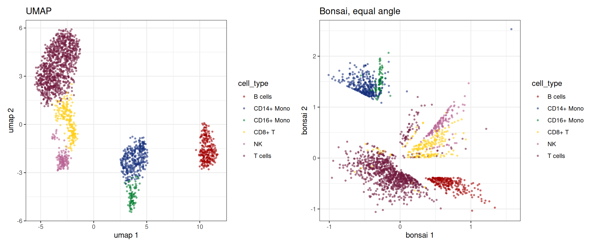

# Cell trees with Bonsai

## Intro

UMAP and t-SNE squash a kNN graph into two dimensions and lose most of
the global structure on the way. [Bonsai (de Groot, et al., Nat.
Biotechnol., 2026)](https://www.nature.com/articles/s41587-026-03220-2)
takes a different route: it reconstructs a tree over the cells, every
cell a leaf and every internal node an inferred ancestral state, with
branch lengths that carry how much changed between them. The tree is the
representation; a 2D layout is just a way to draw it.

What makes it work is that Bonsai uses the error bar on every
measurement, not only the measurement. Those come from [Sanity (Breda,
et al., Nat. Biotechnol.,
2021)](https://www.nature.com/articles/s41587-021-00875-x), which turns
raw UMI counts into posterior log fold changes with error bars, gene by
gene.
[`bonsai_sc()`](https://gregorlueg.github.io/bixverse/reference/bonsai_sc.md)
runs both: counts from disk, Sanity, Bonsai, layout. Both are Rust ports
under the hood,
[`sanity-sc-rs`](https://github.com/GregorLueg/sanity-sc-rs) and
[`bonsai-rs`](https://github.com/GregorLueg/bonsai-rs).

We use the PBMC3k data here. If you have not worked through the [PBMC
vignette](https://gregorlueg.github.io/bixverse/articles/pbmc_single_cell.html),
do that first; the preprocessing below is the same, just condensed.

``` r

library(bixverse)
library(ggplot2)
library(data.table)
#> 
#> Attaching package: 'data.table'
#> The following object is masked from 'package:base':
#> 
#>     %notin%
library(bixverse.plots)
library(magrittr)
```

## Preparing the data

Loading, QC and the usual HVG, PCA, neighbours and clustering chain.
Bonsai itself needs none of the last four, but the clusters and cell
types make the tree readable, and the UMAP gives us something to compare
against.

``` r

pbmc3k_path <- download_pbmc3k()
tempdir_pbmc <- tempdir()

# load
sc_object <- load_mtx(
  object = SingleCells(dir_data = tempdir_pbmc),
  sc_mtx_io_param = get_cell_ranger_params(pbmc3k_path),
  mtx_streaming = FALSE,
  .verbose = FALSE
)

setnames_sc(sc_object, table = "var", old = "column1", new = "gene_symbol")
var <- get_sc_var(sc_object)

# doublets
scrublet_res <- scrublet_sc(sc_object)

sc_object <- add_sc_new_obs(
  object = sc_object,
  obs_data = get_data(scrublet_res)
)

cells_without_doublets <- sc_object[[c("doublet", "cell_id")]][
  !(doublet),
  cell_id
]

sc_object <- set_cells_to_keep(
  x = sc_object,
  cells_to_keep = cells_without_doublets
)

# qc
sc_object <- gene_set_proportions_sc(
  sc_object,
  list(MT = var[grepl("^MT-", gene_symbol), gene_id]),
  streaming = FALSE,
  .verbose = FALSE
)

qc_df <- sc_object[[c("cell_id", "lib_size", "nnz", "MT")]]
qc <- run_cell_qc(
  metrics = list(
    log10_lib_size = log10(qc_df$lib_size),
    log10_nnz = log10(qc_df$nnz),
    MT = qc_df$MT
  ),
  cells_to_keep = get_cells_to_keep(sc_object),
  directions = c(
    log10_lib_size = "twosided",
    log10_nnz = "twosided",
    MT = "above"
  ),
  threshold = 3
)
sc_object <- set_cells_to_keep(sc_object, qc_df[!qc$combined, cell_id])

# hvg, pca, knn, clustering, umap
sc_object <- find_hvg_sc(sc_object, hvg_no = 2000L, .verbose = FALSE)
sc_object <- calculate_pca_sc(sc_object, no_pcs = 30L, .verbose = TRUE)
#> Using sparse SVD solving on scaled data on 2000 HVG.
sc_object <- find_neighbours_sc(
  sc_object,
  neighbours_params = params_sc_neighbours(
    knn = list(knn_method = "exhaustive")
  ),
  .verbose = FALSE
)
sc_object <- find_clusters_sc(sc_object, res = 1, name = "leiden_clusters")
sc_object <- umap_sc(sc_object, .verbose = FALSE)

sc_object
#> Single cell experiment (Single Cells).
#>   No cells (original): 2700
#>    To keep n: 2092
#>   No genes: 11139
#>   HVG calculated: TRUE
#>   PCA calculated: TRUE
#>   Other embeddings: umap
#>   KNN generated: TRUE
#>   SNN generated: TRUE
#>   MAGIC imputed: none
#>   Residual model: none
#>   Stale artefacts: none
```

Cell types via scType, with the same markers as the PBMC vignette.

``` r

cell_markers <- c(
  CD3D = "T cells",
  CD3E = "T cells",
  IL7R = "CD4+ T",
  CD4 = "CD4+ T",
  CD8A = "CD8+ T",
  CD8B = "CD8+ T",
  MS4A1 = "B cells",
  CD79A = "B cells",
  CD14 = "CD14+ Mono",
  LYZ = "CD14+ Mono",
  FCGR3A = "CD16+ Mono",
  CDKN1C = "CD16+ Mono",
  GNLY = "NK",
  NKG7 = "NK",
  FCER1A = "mDC",
  CD1C = "mDC",
  LILRA4 = "pDC",
  PPBP = "Platelet",
  PF4 = "Platelet"
)

cell_markers_dt <- stack(cell_markers) %>%
  as.data.table() %>%
  setnames(c("values", "ind"), c("cell_type", "gene_symbol")) %>%
  .[, gene_symbol := as.character(gene_symbol)] %>%
  .[, gene_id := var$gene_id[match(gene_symbol, var$gene_symbol)]] %>%
  .[!is.na(gene_id)]

sctype_scores <- calc_sc_type_scores(
  object = sc_object,
  cell_marker_list = prepare_cell_markers(sc_object, cell_markers_dt)
)
obs <- get_sc_obs(sc_object, filtered = TRUE)
cell_type_anno <- score_clusters(sctype_scores, obs$leiden_clusters)
sc_object[["cell_type"]] <- cell_type_anno$cell_type[
  match(obs$leiden_clusters, cell_type_anno$cluster_id)
]
```

## Running Bonsai

One call. No HVG selection needed: by default every gene is a candidate,
and Sanity streams them through in chunks of 1,024, keeping only the
genes with enough signal over their own noise (`min_signal_to_noise`, 1
by default). That is the gene selection of the Bonsai paper. Memory
stays at one chunk of counts plus the survivors, whatever the number of
candidates.

``` r

tree <- bonsai_sc(sc_object, .verbose = TRUE)
#> Running Sanity and Bonsai over 2_092 cells and 11_139 candidate genes.

tree
#> BonsaiTree: 2092 leaves, 1962 inferred ancestors
#>   Genes: 351 used, 10788 dropped
#>   Loglikelihood: -456821.5
#>   Layout: equal_angle
#>   Seconds: sanity 43.6 | ingest 0.0 | bonsai 38.8 | layout 0.0 | total 82.4
```

Where did the time go? Every stage is timed, and `total` is the whole
call as R saw it, so a gap between `total` and the stages would be time
spent somewhere nobody measured. At this size Sanity is most of the run:
it fits every one of the candidate genes, while the search only sees the
few hundred that survive.

``` r

tree$timings
#>     stage      seconds
#>    <char>        <num>
#> 1: sanity 43.615048658
#> 2: ingest  0.009770376
#> 3: bonsai 38.789472531
#> 4: layout  0.000131235
#> 5:  total 82.425385952
```

The search reports its steps too: the loglikelihood after each and what
it took. Steps 4 and 7 re-fit the branch lengths, 5 and 6 rearrange the
tree (subtree pruning and regrafting, then nearest-neighbour
interchanges), and 8 collapses the zero-length edges the rest leave
behind.

``` r

tree$steps
#>           step    loglik      seconds
#>         <char>     <num>        <num>
#> 1: 1-2 linkage -675160.8  0.193624604
#> 2:  3 polytomy -675160.8  0.007664169
#> 3:    4 branch -467982.0  0.841693342
#> 4:       5 spr -457101.7 34.872939005
#> 5:       6 nni -457088.5  1.121181187
#> 6:    7 branch -456821.6  0.996681357
#> 7:  8 collapse -456821.5  0.747663967
```

### Which genes made it?

Most genes carry no usable signal over their Poisson noise and are
dropped. The ones that stay overlap with, but are not, the HVGs.

``` r

hvg_ids <- get_gene_names_from_idx(sc_object, get_hvg(sc_object))

data.table(
  genes_used = length(tree$genes_used),
  genes_dropped = length(tree$genes_dropped),
  also_hvg = sum(tree$genes_used %in% hvg_ids)
)
#>    genes_used genes_dropped also_hvg
#>         <int>         <int>    <int>
#> 1:        351         10788      241
```

Want the tree on your own gene set instead? Pass `hvg` (1-indexed), e.g.
`bonsai_sc(sc_object, hvg = get_hvg(sc_object) + 1L)`. The
signal-to-noise filter still applies on top.

## Plotting

[`plot()`](https://rdrr.io/r/graphics/plot.default.html) draws every
branch and a point per cell. `colour_by` takes one value per cell, in
the order of the object’s cells.

``` r

cell_type <- get_sc_obs(sc_object, filtered = TRUE)$cell_type

plot(tree, colour_by = cell_type, point_size = 0.8) +
  guides(colour = guide_legend(override.aes = list(size = 3)))
```


Every cell type gets its own subtree, and none of that was told to
Bonsai: the annotation only colours the leaves. The CD16+ monocytes sit
inside the monocyte subtree rather than next to it, and the NK cells
branch off close to the T cells, which is what you would expect from
their biology. Branch length is change, so the long isolated branches
are cells that look like nothing else in the data.

The default is the equal-angle layout: every subtree gets a wedge
proportional to its size. Two alternatives, recomputed from the stored
tree without searching again. The dendrogram draws the branch lengths
along x:

``` r

plot(tree, colour_by = cell_type, layout = "dendrogram", point_size = 0.5)
```


The hyperbolic projection maps the same layout onto the unit disk. How
much it changes the picture depends on how far the tips sit from the
root; on PBMC3k the branches are short and it barely does, on deeper
trees it gives the crowded centre more room:

``` r

plot(tree, colour_by = cell_type, hyperbolic = TRUE, point_size = 0.8)
```


[`relayout_bonsai()`](https://gregorlueg.github.io/bixverse/reference/relayout_bonsai.md)
does the same but keeps the result, which matters for the next step.

## Bonsai next to UMAP

The leaf coordinates can go into the object as an embedding, so
everything that plots embeddings works on them.

``` r

sc_object <- set_bonsai_embedding(sc_object, tree)

patchwork::wrap_plots(
  embedding_plot_sc(
    sc_object,
    embedding = "umap",
    colour_by = "cell_type",
    discrete = TRUE
  ) +
    ggtitle("UMAP"),
  embedding_plot_sc(
    sc_object,
    embedding = "bonsai",
    colour_by = "cell_type",
    discrete = TRUE
  ) +
    ggtitle("Bonsai, equal angle")
)
```



## Bonsai on metacells

At 100k cells a tree over every cell is slow and hard to look at.
Metacells compress first. Their raw counts are sums over their cells,
and a sum of Poisson counts is Poisson, so Sanity treats a metacell
exactly as it treats a cell, with its total counts as the library size.
A metacell of 20 cells has about 20 times the counts, so its error bars
are much tighter, and Bonsai weights by them. The same
[`bonsai_sc()`](https://gregorlueg.github.io/bixverse/reference/bonsai_sc.md)
call works on `MetaCells`; every metacell becomes a leaf.

Here SEACells compresses the PBMCs to 100 metacells, and each metacell
gets the cell type most of its cells carry.

``` r

supercells <- generate_supercells_sc(
  object = sc_object,
  sc_supercell_params = params_sc_supercell(),
  .verbose = FALSE
)

supercells <- calc_meta_cell_purity(
  supercells,
  original_cell_type = get_sc_obs(sc_object, filtered = TRUE)$cell_type,
  add_additional_info = "top_label"
)

tree_mc <- bonsai_sc(supercells, .verbose = TRUE)
#> Running Sanity and Bonsai over 105 metacells and 11139 candidate genes.

tree_mc
#> BonsaiTree: 105 leaves (2092 cells), 89 inferred ancestors
#>   Genes: 2098 used, 9041 dropped
#>   Loglikelihood: -116872.1
#>   Layout: equal_angle
#>   Seconds: sanity 13.4 | ingest 0.0 | bonsai 5.1 | layout 0.0 | total 18.7
```

The same PBMCs as 100 metacells: a few seconds instead of the minutes
the cell-level tree took, most of it Sanity. And the summed counts are
deep enough that thousands of genes clear the signal-to-noise bar,
against a few hundred for single cells, so the tree sees far more of the
transcriptome.

`size_by_cells = TRUE` scales every leaf by the cells behind it.

``` r

plot(
  tree_mc,
  colour_by = supercells[[]]$mc_top_label,
  size_by_cells = TRUE,
  point_size = 1
)
```


The subtrees of the cell-level tree survive the compression, and the
monocytes come out sharper: CD14+ and CD16+ split into two branches of
one monocyte subtree. A few T-cell metacells sit on the NK branch; T and
NK cells share much of their cytotoxic programme, so that is where the
tree is least sure of the labels. What the metacell tree cannot show is
anything inside a metacell, so pick the compression to match the
resolution you care about.

## Scaling

The search grows a little faster than linearly with the cell number. In
`bonsai-rs`’s own benchmarks on ten cores it took about 70 seconds at
10,000 cells and 210 seconds at 25,000. Sanity comes on top and grows
with the number of candidate genes; CPU has been made fast, GPU is even
faster. `bonsai_gpu_sc()` in `bixverse.gpu` (from version 0.3.5 onwards)
takes the same arguments, returns the same `BonsaiTree`, and runs Sanity
on the device.

On 10,000 simulated cells with all 16,974 genes as candidates (M1 Max,
ten cores):

|  | Sanity | Bonsai search | total |
|----|----|----|----|
| [`bonsai_sc()`](https://gregorlueg.github.io/bixverse/reference/bonsai_sc.md) | 60 s | 80 s | 140 s |
| `bonsai_gpu_sc()` | 5 s | 80 s | 65 s |

Both kept the same 2,751 genes. With Sanity on the GPU the tree search
is the clear cost, and that is where 100k cells will hurt. Metacells are
the way around it: compress first and the tree has a few thousand leaves
instead of 100k.

## Clean up

``` r

unlink(tempdir_pbmc, recursive = TRUE, force = TRUE)
```
