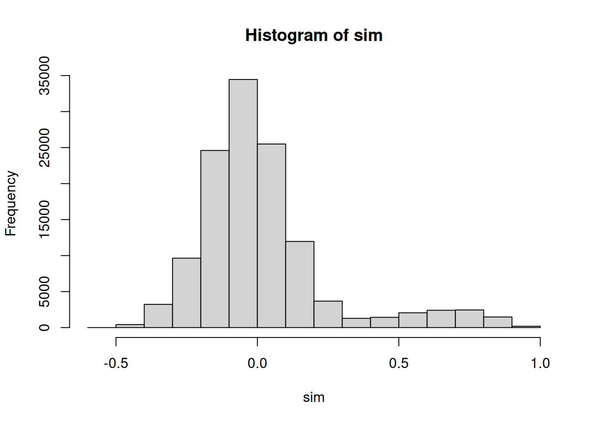
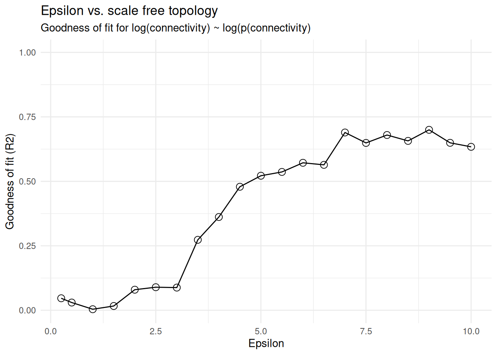
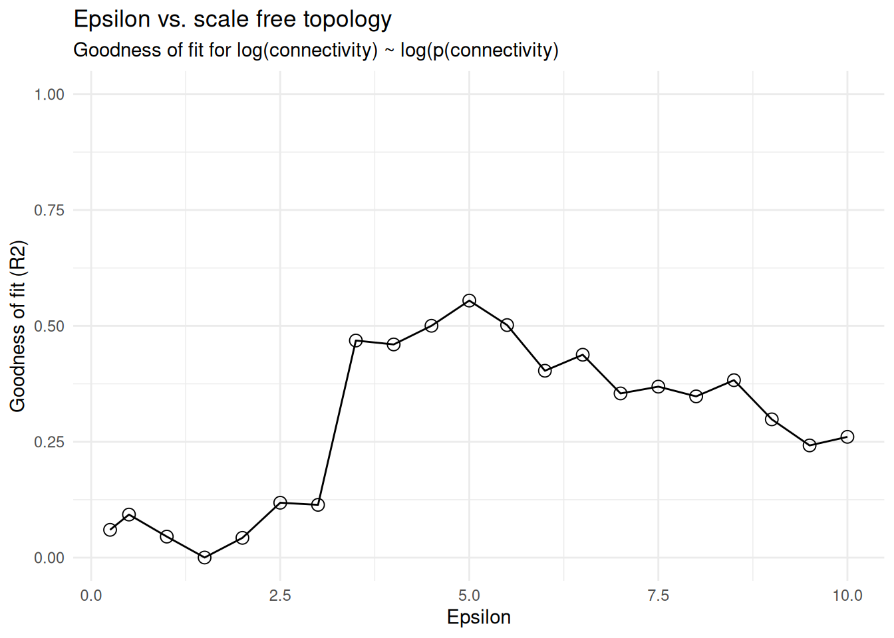
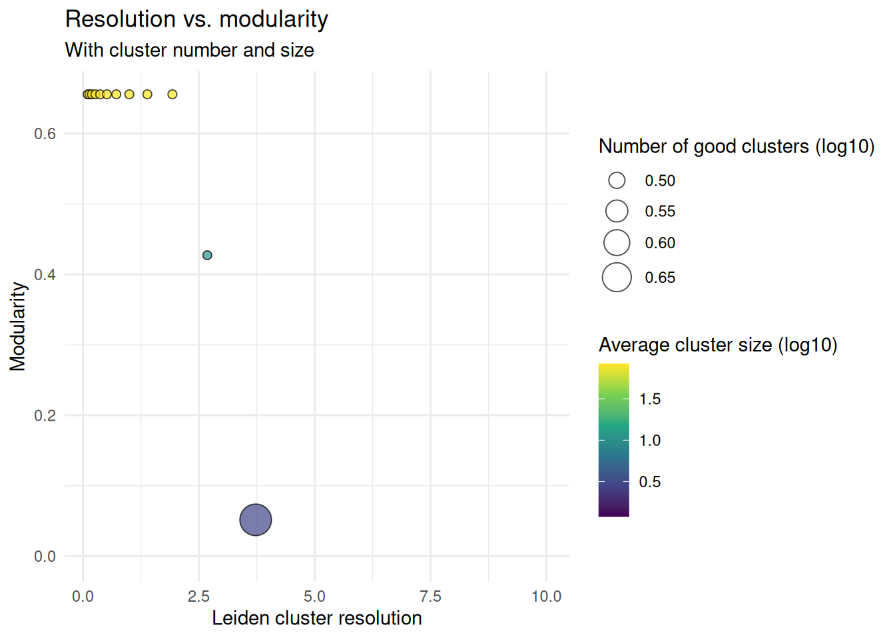
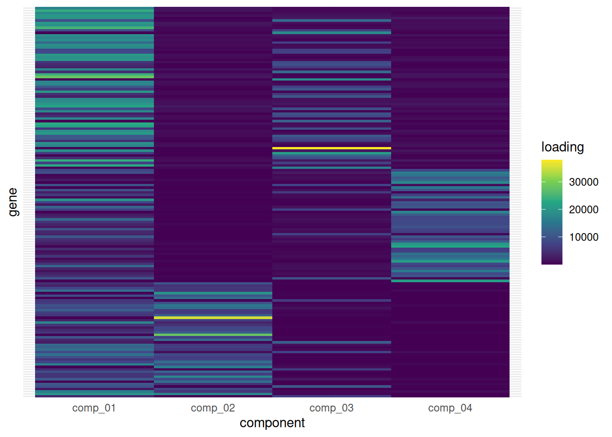
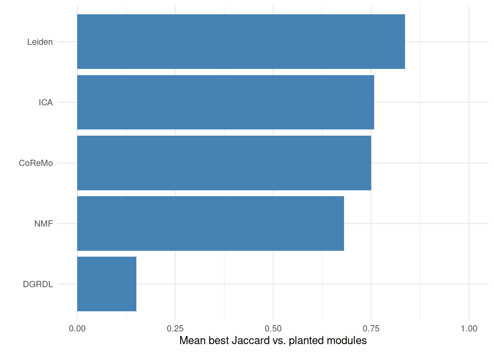
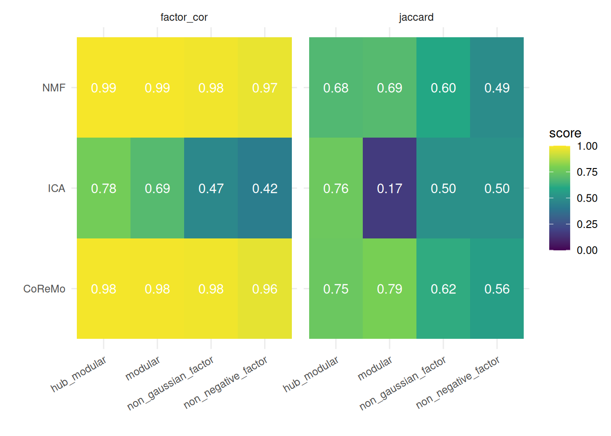

# Bulk co-expression modules

## Intro

Bulk co-expression module detection tries to find groups of genes that
vary together across samples. `bixverse` ships five approaches for this
on a shared `BulkCoExp` class:

- **CoReMo** ([Srivastava, et
  al.](https://www.nature.com/articles/s41467-018-06008-4): hierarchical
  clustering on an RBF-transformed correlation matrix. Fast,
  deterministic, gives you signed modules and per-sample eigengenes.
- **Graph-based Leiden** ([Barrio-Hernandez, et
  al.](https://www.nature.com/articles/s41588-023-01327-9)) — build a
  sparse affinity graph from correlations, then cluster with Leiden.
  Great when you want tunable resolution and hierarchical
  sub-clustering.
- **ICA** — independent component analysis with stability across random
  initialisations. Each component picks up an independent signal; the
  genes in the tails of a component’s loading distribution define its
  module.
- **DGRDL** ([Pan, et al.](https://doi.org/10.1016/j.cels.2022.09.005))
  — dual graph-regularised dictionary learning. Sparse decomposition
  regularised by feature- and sample-side Laplacians.
- **NMF (HALS)** — non-negative matrix factorisation with hierarchical
  alternating least squares. Non-negative loadings give a natural
  “parts-based” module interpretation and per-sample module activity.

One structural difference matters throughout. CoReMo and Leiden
partition genes: one gene, one module. The three factorisation methods
do not, and should not. A gene can load on several components, so
[`get_modules()`](https://gregorlueg.github.io/bixverse/reference/get_modules.md)
returns one row per (gene, component) pair for ICA, NMF and DGRDL, and
genes in no component’s tail appear nowhere.
[`params_module_membership()`](https://gregorlueg.github.io/bixverse/reference/params_module_membership.md)
controls that thresholding. Do not assume `gene` is a unique key.

None of these is uniformly best. This vignette walks through all five on
the same synthetic dataset with planted ground-truth modules, so you can
see the inputs, the outputs, and how well each recovers the true
structure.

``` r

library(bixverse)
library(data.table)
#> 
#> Attaching package: 'data.table'
#> The following object is masked from 'package:base':
#> 
#>     %notin%
library(magrittr)
library(ggplot2)
```

## Data

[`synthetic_bulk_cor_matrix()`](https://gregorlueg.github.io/bixverse/reference/synthetic_bulk_cor_matrix.md)
generates a bulk RNA-seq count matrix with heteroskedasticity plus a
user-specified number of planted co-expression modules. Counts come from
a negative binomial with a mean-dispersion trend, and a module is built
by putting its genes on a shared latent factor.

[`params_synthetic_bulk_rnaseq()`](https://gregorlueg.github.io/bixverse/reference/params_synthetic_bulk_rnaseq.md)
controls the whole thing. The parameter that matters most here is
`generator`, which picks how loadings and factors are drawn:

- **`hub_modular`** — LogNormal loadings on a Normal factor. Some genes
  end up far more connected than others, which is the WGCNA-style
  default and our starting point.
- **`modular`** — Beta(5, 2) loadings on a Normal factor. Homogeneous
  within-module correlation, no hubs.
- **`non_negative_factor`** — LogNormal loadings on a Gamma factor. The
  activity matrix is non-negative by construction, so NMF has a ground
  truth it can reach.
- **`non_gaussian_factor`** — LogNormal loadings on a Laplace factor.
  Non-Gaussian sources satisfy ICA identifiability.

We’ll start with `hub_modular` for the head-to-head, then come back to
the generator choice at the end. It turns out to matter more than you’d
guess.

``` r

synth_params <- params_synthetic_bulk_rnaseq(
  num_samples = 100L,
  num_genes = 1000L,
  module_sizes = c(100L, 100L, 100L),
  generator = "hub_modular",
  seed = 123L
)

synth <- synthetic_bulk_cor_matrix(synth_params)

truth <- synth$module_data
truth[membership > 0, .N, by = membership]
#>    membership     N
#>         <int> <int>
#> 1:          1   100
#> 2:          2   100
#> 3:          3   100
```

Three planted modules of 100 genes each. The remaining 700 genes are
background: no loading, never a hub.

The ground truth comes back with the counts, so we can score a recovered
module against what was actually simulated rather than eyeballing a
heatmap. Per gene we get its module, its loading on that module’s
factor, and whether it ranked as a hub:

``` r

truth[
  membership > 0,
  .(
    n_genes = .N,
    n_hubs = sum(is_hub),
    mean_loading = round(mean(loading), 3)
  ),
  by = membership
]
#>    membership n_genes n_hubs mean_loading
#>         <int>   <int>  <int>        <num>
#> 1:          1     100      9        1.246
#> 2:          2     100     11        1.314
#> 3:          3     100     10        1.307
```

Hubs are ranked on loading globally across all module genes rather than
per module, so the counts per module don’t have to be equal. On top of
that, `$module_factors` holds the latent factors themselves, one row per
module:

``` r

dim(synth$module_factors)
#> [1]   3 100
```

That matrix is what a module eigengene, an ICA component or an NMF
activity column is trying to recover, and we use it for a second scoring
pass later on.

For the correlation-based methods we work in log-CPM space (negative
values are fine); NMF needs non-negative input so we’ll build a separate
object from the raw counts for it.

``` r

norm_counts <- edgeR::cpm(synth$counts, log = TRUE)
raw_cpm <- edgeR::cpm(synth$counts, log = FALSE)

data_log <- t(norm_counts)
data_raw <- t(raw_cpm)

meta_data <- data.table(sample_id = rownames(data_log))

coexp <- BulkCoExp(raw_data = data_log, meta_data = meta_data)
coexp <- preprocess_bulk_coexp(coexp, hvg = 0.5, .verbose = FALSE)
coexp
#> Bulk co-expression module class (BulkCoExp).
#>  Pre-processing done: TRUE.
#>   Number of HVG: 500.
```

Preprocessing keeps the top 50% of genes by MAD; 500 features carried
through to the module-detection methods below. The `BulkCoExp` object
mutates in place as each method runs, so we’ll make copies for each
branch.

## Method 1: CoReMo

CoReMo shrinks weak correlations via an RBF, hierarchically clusters the
result, and picks the cut that maximises the within-module weighted
median R². The epsilon parameter controls how aggressively the RBF
suppresses weak correlations — you usually tune it against a scale-free
topology fit.

``` r

coexp_coremo <- cor_module_processing(
  coexp,
  cor_method = "spearman",
  .verbose = TRUE
)
#> Using Spearman correlations.

# show correlation structure
coexp_coremo@processed_data$correlation_res$get_data_table() %$% hist(sim)
#> Generating data.table format of the symmetric matrix.
```



``` r


coexp_coremo <- cor_module_check_epsilon(
  coexp_coremo,
  rbf_func = "gaussian",
  .verbose = TRUE
)
#> Testing 21 epsilons.

plot_epsilon_res(coexp_coremo)
```



``` r


epsilon_sf <- get_epsilon_res(coexp_coremo)[r2_vals == max(r2_vals), epsilon][1]
epsilon_sf
#> [1] 9
```

Here is a wrinkle worth knowing about, and one the ground truth lets us
actually diagnose. The scale-free R² criterion picks a high epsilon, but
epsilon controls how aggressively the RBF suppresses weak correlations,
so a high value throws genes out of modules entirely. Counting how many
of the 500 features survive into a module tells the story:

``` r

epsilon_scan <- rbindlist(lapply(c(1, 2, 3, 4, 6, epsilon_sf), \(eps) {
  fitted <- coexp_coremo %>%
    cor_module_coremo_clustering(
      coremo_params = params_coremo(epsilon = eps, rbf_func = "gaussian"),
      .verbose = FALSE
    ) %>%
    cor_module_coremo_stability(.verbose = FALSE) %>%
    cor_module_coremo_cor_sign(.verbose = FALSE)

  mods <- get_outputs(fitted)$final_modules
  data.table(
    epsilon = eps,
    n_modules = uniqueN(mods$cluster_id),
    genes_assigned = nrow(mods)
  )
}))

epsilon_scan
#>    epsilon n_modules genes_assigned
#>      <num>     <int>          <int>
#> 1:       1         4            254
#> 2:       2         5            253
#> 3:       3         4            207
#> 4:       4         4            184
#> 5:       6         2             58
#> 6:       9         7            110
```

The scale-free fit and “keep as many real module genes as possible” pull
in opposite directions on this data. We go with a low epsilon
deliberately, because the planted modules are what we are trying to
find:

``` r

coremo_params <- params_coremo(epsilon = 2, rbf_func = "gaussian")

coexp_coremo <- cor_module_coremo_clustering(
  coexp_coremo,
  coremo_params = coremo_params,
  .verbose = TRUE
)
#> Generating the full matrix format of the symmetric matrix.
#> Generating the hierarchical clustering.
#> Identifying optimal number of cuts.
#> Finalising CoReMo clusters.
coexp_coremo <- cor_module_coremo_stability(coexp_coremo, .verbose = FALSE)
coexp_coremo <- cor_module_coremo_cor_sign(coexp_coremo, .verbose = FALSE)
coexp_coremo <- cor_module_coremo_eigengene(coexp_coremo, .verbose = FALSE)

coremo_modules <- get_outputs(coexp_coremo)$final_modules
coremo_modules[, .N, by = cluster_id]
#>    cluster_id     N
#>        <char> <int>
#> 1:      2_pos    79
#> 2:      1_pos    83
#> 3:      3_pos    63
#> 4:      5_pos    27
#> 5:      5_neg     1
```

Each module has a sign suffix (`_pos` / `_neg`) reflecting whether the
member genes are positively or negatively correlated with the module
eigengene, and a per-gene stability score from the leave-one-out
resampling. Since the generator draws strictly positive loadings,
essentially everything lands in a `_pos` module; the odd `_neg`
singleton is an anti-correlated background gene getting split off, which
is correct behaviour.

## Method 2: Graph-based Leiden

The Leiden branch keeps the same RBF-based affinity but treats the
sparse non-zero pattern as an igraph. Modularity is optimised over a
Leiden resolution grid; large communities can be sub-clustered
recursively.

``` r

coexp_leiden <- cor_module_processing(
  coexp,
  cor_method = "spearman",
  .verbose = TRUE
)
#> Using Spearman correlations.

coexp_leiden <- cor_module_check_epsilon(
  coexp_leiden,
  rbf_func = "bump",
  .verbose = TRUE
)
#> Testing 21 epsilons.

plot_epsilon_res(coexp_leiden)
```



``` r


graph_params <- params_cor_graph(
  epsilon = 2
)

coexp_leiden <- cor_module_graph_check_res(
  coexp_leiden,
  resolution_params = params_graph_resolution(),
  graph_params = graph_params,
  parallel = FALSE,
  .verbose = TRUE
)
#> Generating data.table format of the symmetric matrix.
#> Generating correlation-based graph with 8566 edges.
#> Iterating through 15 resolutions
#> Using sequential computation.

plot_resolution_res(coexp_leiden)
#> Key: <resolution>
#>    resolution no_clusters modularity good_clusters avg_size max_size
#>         <num>       <int>      <num>         <int>    <num>    <int>
#> 1:  0.1000000           3  0.6555233             3 83.66667       88
#> 2:  0.1389495           3  0.6555233             3 83.66667       88
#> 3:  0.1930698           3  0.6555233             3 83.66667       88
#> 4:  0.2682696           3  0.6555233             3 83.66667       88
#> 5:  0.3727594           3  0.6555233             3 83.66667       88
#> 6:  0.5179475           3  0.6555233             3 83.66667       88
#> Warning in sqrt(x): NaNs produced
#> Warning: Removed 3 rows containing missing values or values outside the scale range
#> (`geom_point()`).
```



``` r


coexp_leiden <- cor_module_graph_final_modules(
  coexp_leiden,
  min_size = 10L,
  max_size = 500L,
  subclustering = TRUE,
  .graph_params = graph_params,
  .verbose = FALSE
)

leiden_modules <- get_modules(get_results(coexp_leiden))
leiden_modules[, .N, by = module_id]
#>    module_id     N
#>       <char> <int>
#> 1: cluster_1    84
#> 2: cluster_2    79
#> 3: cluster_3    88
```

## Method 3: ICA

ICA whitens the data, then finds independent components across many
random initialisations. The stability across restarts, the fraction of
converged runs, and the mutual information between components combine
into a `combined_score`: the loess inflection point of this score
against the number of components gives you an “optimal” `ncomp`. (Please
explore your data and see how it looks…)

``` r

coexp_ica <- ica_processing(coexp, fast_svd = TRUE, .verbose = FALSE)

# A dense enough grid that the loess in ica_optimal_ncomp() has something to
# fit. On a handful of points it gives up and warns instead.
ncomp_params <- params_ica_ncomp(max_no_comp = 30L, steps = 2L)
iter_params <- params_ica_randomisation(
  cross_validate = FALSE,
  random_init = 20L
)

coexp_ica <- ica_evaluate_comp(
  coexp_ica,
  ica_type = "logcosh",
  iter_params = iter_params,
  ncomp_params = ncomp_params,
  .verbose = FALSE
)

coexp_ica <- ica_optimal_ncomp(
  coexp_ica,
  span = 0.4,
  show_plot = FALSE,
  .verbose = FALSE
)
coexp_ica <- ica_stabilised_results(
  coexp_ica,
  iter_params = iter_params,
  .verbose = FALSE
)

ica_res <- get_results(coexp_ica)
ica_gene_loadings <- get_factors(ica_res, which = "gene_loadings")
dim(ica_gene_loadings)
#> [1] 500   5
```

`gene_loadings` is the `genes x k` matrix (transposed from the raw ICA
`S` convention of `k x genes`). Module membership keeps the tails of
each component, so a gene may appear more than once and many genes not
at all:

``` r

ica_modules <- get_modules(ica_res)
ica_modules[, .N, by = module_id][order(-N)]
#>    module_id     N
#>       <char> <int>
#> 1:      IC_1    88
#> 2:      IC_5    85
#> 3:      IC_4    70
#> 4:      IC_3    65
#> 5:      IC_2    57

# Sparse and overlapping, which is the whole point of a factorisation.
data.table(
  rows = nrow(ica_modules),
  unique_genes = uniqueN(ica_modules$gene),
  in_multiple_modules = ica_modules[, .N, by = gene][N > 1, .N]
)
#>     rows unique_genes in_multiple_modules
#>    <int>        <int>               <int>
#> 1:   365          234                 116
```

## Method 4: DGRDL

DGRDL learns a sparse dictionary of features constrained by a k-nearest-
neighbour Laplacian on both the feature and the sample side. The grid
search helps pick `dict_size` and `k_neighbours` before the final fit.

Unlike the other four, DGRDL needs **centred** input. Handed unscaled
log-CPM it spends its dictionary explaining the per-gene mean offset
instead of the covariance: atoms come out as near-duplicates of each
other, and the loadings become a large constant plus noise. So we build
a scaled object for it.

``` r

coexp_dgrdl <- BulkCoExp(raw_data = data_log, meta_data = meta_data) %>%
  preprocess_bulk_coexp(
    hvg = 0.5,
    scaling = TRUE,
    scaling_type = "normal",
    .verbose = FALSE
  )

coexp_dgrdl <- dgrdl_grid_search(
  coexp_dgrdl,
  neighbours_vec = c(5L, 10L),
  dict_size_vec = c(4L, 6L),
  seed_vec = c(1L, 2L),
  dgrdl_params = params_dgrdl(),
  .verbose = TRUE
)
#> A total of 8 parameters will be tested in a grid search for DGRDL.

grid_res <- get_grid_search_res(coexp_dgrdl)
setorder(grid_res, reconstruction_errs)
head(grid_res)
#>     seed dict_size k_neighbours reconstruction_errs feature_laplacian_objective
#>    <num>     <num>        <num>               <num>                       <num>
#> 1:     1         4            5             3157249                    98876.33
#> 2:     1         4           10             3157249                   196361.51
#> 3:     2         4            5             3157305                    98864.44
#> 4:     2         4           10             3157305                   196338.53
#> 5:     2         6            5             4831244                   149155.31
#> 6:     2         6           10             4831245                   294733.43
#>    sample_laplacian_objective
#>                         <num>
#> 1:                   1.700723
#> 2:                   3.085984
#> 3:                   1.700597
#> 4:                   3.085838
#> 5:                   2.602797
#> 6:                   4.898748
```

Pick the top row and fit the final DGRDL model:

``` r

top <- grid_res[1L]

dgrdl_params_final <- params_dgrdl(
  dict_size = as.integer(top$dict_size),
  k_neighbours = as.integer(top$k_neighbours)
)

coexp_dgrdl <- dgrdl_result(
  coexp_dgrdl,
  dgrdl_params = dgrdl_params_final,
  seed = as.integer(top$seed),
  .verbose = FALSE
)

dgrdl_res <- get_results(coexp_dgrdl)
dim(get_factors(dgrdl_res, which = "dictionary"))
#> [1] 100   4
dim(get_factors(dgrdl_res, which = "loadings"))
#> [1]   4 500
```

[`get_modules()`](https://gregorlueg.github.io/bixverse/reference/get_modules.md)
keeps the tails of each dictionary atom, so a gene active in several
atoms shows up in several modules:

``` r

dgrdl_modules <- get_modules(dgrdl_res)
dgrdl_modules[, .N, by = module_id][order(-N)]
#>    module_id     N
#>       <char> <int>
#> 1:    dict_1    53
#> 2:    dict_4    52
#> 3:    dict_2    49
#> 4:    dict_3    32
```

## Method 5: NMF (HALS)

NMF needs non-negative input, so we build a fresh `BulkCoExp` from CPM
(without the log transform). The single-run version is deterministic
given NNDSVD initialisation; the stabilised version runs multiple random
restarts and returns the run with the lowest reconstruction loss.

``` r

coexp_nmf <- BulkCoExp(raw_data = data_raw, meta_data = meta_data)
coexp_nmf <- preprocess_bulk_coexp(coexp_nmf, hvg = 0.5, .verbose = FALSE)

coexp_nmf <- nmf_bulk(
  coexp_nmf,
  k = 4L,
  preprocessing = "none",
  nmf_hals_params = params_nmf_hals(max_iter = 300L, tol = 1e-4),
  seed = 42L,
  .verbose = FALSE
)

nmf_modules <- get_nmf_modules(coexp_nmf)
nmf_modules[, .N, by = module_id]
#>    module_id     N
#>       <char> <int>
#> 1:   comp_01     3
#> 2:   comp_02    68
#> 3:   comp_03    67
#> 4:   comp_04    71
```

[`get_nmf_gene_loadings()`](https://gregorlueg.github.io/bixverse/reference/get_nmf_gene_loadings.md)
gives the features x k matrix, and
[`get_nmf_sample_activity()`](https://gregorlueg.github.io/bixverse/reference/get_nmf_sample_activity.md)
gives the samples x k matrix. A quick heatmap of gene loadings shows the
parts-based decomposition:

``` r

loadings <- get_nmf_gene_loadings(coexp_nmf)

top_genes <- unique(unlist(lapply(seq_len(ncol(loadings)), \(j) {
  names(sort(loadings[, j], decreasing = TRUE))[1:40]
})))

heat_dt <- as.data.table(
  loadings[top_genes, , drop = FALSE],
  keep.rownames = "gene"
)
heat_long <- melt(
  heat_dt,
  id.vars = "gene",
  variable.name = "component",
  value.name = "loading"
)

ggplot(heat_long, aes(component, gene, fill = loading)) +
  geom_tile() +
  scale_fill_viridis_c() +
  theme_minimal() +
  theme(axis.text.y = element_blank(), axis.ticks.y = element_blank())
```



NMF gene loadings, top 40 genes per component.

For a more robust fit,
[`stabilised_nmf_bulk()`](https://gregorlueg.github.io/bixverse/reference/stabilised_nmf_bulk.md)
runs several restarts and returns per-run losses via
[`get_nmf_stability()`](https://gregorlueg.github.io/bixverse/reference/get_nmf_stability.md).

``` r

coexp_nmf_stab <- stabilised_nmf_bulk(
  coexp_nmf,
  k = 4L,
  n_runs = 5L,
  preprocessing = "none",
  nmf_hals_params = params_nmf_hals(max_iter = 200L, tol = 1e-3),
  seed = 7L,
  .verbose = FALSE
)

stab <- get_nmf_stability(coexp_nmf_stab)
stab
#> $losses
#> [1] 6901265232 6885273328 6903864151 6878840103 6887485138
#> 
#> $converged
#> [1] TRUE TRUE TRUE TRUE TRUE
#> 
#> $best_idx
#> [1] 4
```

## Recovery of planted modules

With ground truth in hand we can quantify how well each method recovered
the three planted modules. For each method we compute the best-matching
planted module per detected cluster (max Jaccard), then take the mean
Jaccard across the three planted modules…. A simple “recall” score.

``` r

# assignments: data.table with columns `gene` and `module_id`.
# Returns one score per planted module: the best Jaccard any detected cluster
# manages against it.
best_jaccard_vs <- function(assignments, truth_dt) {
  planted <- split(truth_dt$gene, truth_dt$membership)
  planted <- planted[names(planted) != "0"]
  detected <- split(assignments$gene, assignments$module_id)
  purrr::map_dbl(planted, \(p) {
    max(purrr::map_dbl(detected, \(d) {
      length(intersect(p, d)) / length(union(p, d))
    }))
  })
}

recovery <- data.table(
  method = c("CoReMo", "Leiden", "ICA", "DGRDL", "NMF"),
  score = c(
    mean(best_jaccard_vs(
      coremo_modules[, .(gene, module_id = cluster_id)],
      truth
    )),
    mean(best_jaccard_vs(leiden_modules, truth)),
    mean(best_jaccard_vs(ica_modules, truth)),
    mean(best_jaccard_vs(dgrdl_modules, truth)),
    mean(best_jaccard_vs(nmf_modules, truth))
  )
)

setorder(recovery, -score)
recovery
#>    method     score
#>    <char>     <num>
#> 1: Leiden 0.8366667
#> 2:    ICA 0.7573697
#> 3: CoReMo 0.7500000
#> 4:    NMF 0.6811551
#> 5:  DGRDL 0.1505952
```

``` r

ggplot(recovery, aes(x = reorder(method, score), y = score)) +
  geom_col(fill = "steelblue") +
  coord_flip() +
  ylim(0, 1) +
  theme_minimal() +
  xlab("") +
  ylab("Mean best Jaccard vs. planted modules")
```



Mean best-Jaccard across the three planted modules.

## Scoring against the latent factors

Jaccard on gene sets only asks whether a method found the right genes.
The latent factors let us ask a sharper question: did it recover the
right *signal*? For CoReMo we can correlate each per-sample eigengene
against the factor the module was actually built on.

``` r

# activity: samples x k matrix of per-sample scores (eigengenes, ICA sample
# activity, NMF sample activity). Returns one score per true factor: the best
# absolute correlation any recovered column manages against it.
#
# Index the factor matrix by rownames(activity), not by column position: these
# per-sample matrices come back in lexicographic sample order (sample_1,
# sample_10, sample_100, ...) while module_factors is in numeric order. Line them
# up positionally and you get correlations near zero for no good reason.
best_factor_cor <- function(activity, module_factors) {
  purrr::map_dbl(seq_len(nrow(module_factors)), \(k) {
    true_factor <- module_factors[k, rownames(activity)]
    max(apply(activity, 2, \(a) {
      abs(cor(a, true_factor, method = "spearman"))
    }))
  })
}

eigengenes <- get_factors(get_results(coexp_coremo))$module_eigengenes

data.table(
  module = rownames(synth$module_factors),
  best_abs_cor = round(best_factor_cor(eigengenes, synth$module_factors), 3)
)
#>      module best_abs_cor
#>      <char>        <num>
#> 1: module_1        0.984
#> 2: module_2        0.984
#> 3: module_3        0.987
```

Those sit far higher than the Jaccard scores, and the gap is the
interesting part: CoReMo reconstructs the module’s *signal* almost
exactly even where it disagrees with the planted gene list at the edges.
If what you care about is a per-sample module score to regress against a
phenotype, the eigengene is doing its job well before the gene
membership is perfect.

## Does the generator matter?

A lot, and the answer depends on what you measure. `non_negative_factor`
advertises itself as NMF-friendly and `non_gaussian_factor` as
ICA-friendly, so the obvious guess is that each method wins on its
matched generator. We score two ways to see whether that holds:

- **Jaccard**, as above: a hard partition of genes into modules,
  compared against the planted gene sets.
- **Factor recovery**: the best absolute correlation any recovered
  per-sample activity column achieves against a true latent factor.

The distinction matters because “ICA-friendly” is a claim about
*identifiability of the factorisation*, that is, recovering the sources
up to permutation and scaling. It says nothing about whether assigning
each gene to its strongest-loading component reproduces a planted block.
Three methods rather than five here, to keep the render time honest:
Leiden and DGRDL both carry a parameter search on top.

``` r

run_methods <- function(generator) {
  params <- params_synthetic_bulk_rnaseq(
    num_samples = 100L,
    num_genes = 1000L,
    module_sizes = c(100L, 100L, 100L),
    generator = generator,
    seed = 123L
  )
  synth_g <- synthetic_bulk_cor_matrix(params)
  meta_g <- data.table(sample_id = colnames(synth_g$counts))

  log_obj <- BulkCoExp(
    raw_data = t(edgeR::cpm(synth_g$counts, log = TRUE)),
    meta_data = meta_g
  ) %>%
    preprocess_bulk_coexp(hvg = 0.5, .verbose = FALSE)

  raw_obj <- BulkCoExp(
    raw_data = t(edgeR::cpm(synth_g$counts, log = FALSE)),
    meta_data = meta_g
  ) %>%
    preprocess_bulk_coexp(hvg = 0.5, .verbose = FALSE)

  coremo_g <- log_obj %>%
    cor_module_processing(cor_method = "spearman", .verbose = FALSE) %>%
    cor_module_coremo_clustering(
      coremo_params = params_coremo(epsilon = 2),
      .verbose = FALSE
    ) %>%
    cor_module_coremo_stability(.verbose = FALSE) %>%
    cor_module_coremo_cor_sign(.verbose = FALSE) %>%
    cor_module_coremo_eigengene(.verbose = FALSE)

  ica_g <- log_obj %>%
    ica_processing(fast_svd = TRUE, .verbose = FALSE) %>%
    ica_evaluate_comp(
      ica_type = "logcosh",
      iter_params = iter_params,
      ncomp_params = ncomp_params,
      .verbose = FALSE
    ) %>%
    ica_optimal_ncomp(span = 0.4, show_plot = FALSE, .verbose = FALSE) %>%
    ica_stabilised_results(iter_params = iter_params, .verbose = FALSE)

  nmf_g <- nmf_bulk(
    raw_obj,
    k = 4L,
    preprocessing = "none",
    seed = 42L,
    .verbose = FALSE
  )

  truth_g <- synth_g$module_data
  coremo_mods <- get_outputs(coremo_g)$final_modules
  coremo_res_g <- get_results(coremo_g)
  ica_res_g <- get_results(ica_g)

  jacc <- \(assign) round(mean(best_jaccard_vs(assign, truth_g)), 3)
  fcor <- \(act) round(mean(best_factor_cor(act, synth_g$module_factors)), 3)

  data.table(
    generator = generator,
    metric = c("jaccard", "factor_cor"),
    CoReMo = c(
      jacc(coremo_mods[, .(gene, module_id = cluster_id)]),
      fcor(get_factors(coremo_res_g)$module_eigengenes)
    ),
    ICA = c(
      jacc(get_modules(ica_res_g)),
      fcor(get_factors(ica_res_g, which = "sample_activity"))
    ),
    NMF = c(
      jacc(get_nmf_modules(nmf_g)),
      fcor(get_nmf_sample_activity(nmf_g))
    )
  )
}

grid_res <- rbindlist(lapply(
  c("hub_modular", "modular", "non_negative_factor", "non_gaussian_factor"),
  run_methods
))

grid_res
#>              generator     metric CoReMo   ICA   NMF
#>                 <char>     <char>  <num> <num> <num>
#> 1:         hub_modular    jaccard  0.750 0.757 0.681
#> 2:         hub_modular factor_cor  0.985 0.776 0.988
#> 3:             modular    jaccard  0.790 0.166 0.690
#> 4:             modular factor_cor  0.983 0.691 0.986
#> 5: non_negative_factor    jaccard  0.560 0.504 0.486
#> 6: non_negative_factor factor_cor  0.959 0.420 0.966
#> 7: non_gaussian_factor    jaccard  0.617 0.502 0.596
#> 8: non_gaussian_factor factor_cor  0.978 0.466 0.979
```

``` r

grid_long <- melt(
  grid_res,
  id.vars = c("generator", "metric"),
  variable.name = "method",
  value.name = "score"
)

ggplot(grid_long, aes(x = generator, y = method, fill = score)) +
  geom_tile() +
  geom_text(aes(label = sprintf("%.2f", score)), colour = "white") +
  scale_fill_viridis_c(limits = c(0, 1)) +
  facet_wrap(~metric) +
  theme_minimal() +
  theme(axis.text.x = element_text(angle = 30, hjust = 1)) +
  xlab("") +
  ylab("")
```



Recovery by generator, method and metric. Note how the two panels
disagree.

Two things to read out of that.

**ICA’s factor recovery is best on `non_gaussian_factor`, exactly as
advertised.** The Laplace-factor generator is the one built for ICA and
it wins on the metric identifiability is actually about. NMF’s factor
recovery sits above 0.96 on all four, so that metric does not
discriminate for NMF at all: it recovers per-sample activity almost
perfectly regardless.

**ICA’s Jaccard on `modular` collapses, and the reason is instructive.**
Membership for the factorisation methods comes from keeping the tails of
each component’s loading distribution, which quietly assumes there *is*
a tail. That assumption depends entirely on how the loadings were drawn:

``` r

excess_kurtosis <- function(x) {
  centred <- x - mean(x)
  mean(centred^4) / (mean(centred^2)^2) - 3
}

rbindlist(lapply(
  c("hub_modular", "modular", "non_negative_factor", "non_gaussian_factor"),
  \(gen) {
    synth_g <- synthetic_bulk_cor_matrix(params_synthetic_bulk_rnaseq(
      num_samples = 100L,
      num_genes = 1000L,
      module_sizes = c(100L, 100L, 100L),
      generator = gen,
      seed = 123L
    ))
    loadings_g <- synth_g$module_data[membership > 0, loading]
    data.table(
      generator = gen,
      loading_cv = round(sd(loadings_g) / mean(loadings_g), 2),
      loading_kurtosis = round(excess_kurtosis(loadings_g), 2)
    )
  }
))
#>              generator loading_cv loading_kurtosis
#>                 <char>      <num>            <num>
#> 1:         hub_modular       0.80             9.79
#> 2:             modular       0.23            -0.15
#> 3: non_negative_factor       0.75             8.83
#> 4: non_gaussian_factor       0.81             9.86
```

`modular` draws Beta(5, 2), so module-gene loadings have a coefficient
of variation around 0.23: a tight, homogeneous block. Push that through
ICA and the resulting component loadings come out *sub*-Gaussian, with
negative excess kurtosis, and essentially nothing clears `abs(z) > 3`.
There is no tail, so a tail-based rule finds nothing and Jaccard bottoms
out. The three LogNormal generators have a loading CV around 0.8 and
produce strongly leptokurtic components, where the rule works as
designed.

So `modular` is a good benchmark for correlation and graph clustering,
which threshold a similarity, and a poor one for matrix factorisation,
which thresholds a loading tail. That is a property of the *generator
and metric pairing*, not a verdict on any method.

Two practical lessons. Pick the generator that matches the property you
are measuring and state which one you used, because a method that looks
twice as good as another may simply have been handed a friendlier
dataset. And if a factorisation returns almost no modules, check the
kurtosis of its loadings before blaming the algorithm: you may just need
a different `cutoff` in
[`params_module_membership()`](https://gregorlueg.github.io/bixverse/reference/params_module_membership.md),
or a generator whose loadings have a tail at all.

## Wrap-up

Different methods suit different questions:

- **CoReMo** if you want signed modules with per-sample eigengenes and a
  fast, deterministic pipeline. Solid default for standard bulk data.
- **Graph-based Leiden** if you want tunable resolution or hierarchical
  sub-clustering. Handles very heterogeneous module sizes better than
  CoReMo.
- **ICA** if you want components that decompose independent, potentially
  overlapping biological signals. Interpretation is per-component, not
  per-gene.
- **DGRDL** if you want a sparse dictionary regularised by feature and
  sample neighbour graphs. Sparsity is a tunable constraint, not a
  byproduct. It comes last on recovery here, and note that
  [`dgrdl_grid_search()`](https://gregorlueg.github.io/bixverse/reference/dgrdl_grid_search.md)
  ranks by reconstruction error, which is not the same objective as
  recovering planted modules. Remember to centre the input!
- **NMF** if you want non-negative, parts-based decompositions with a
  natural interpretation as “how strongly is each sample expressing each
  module”.

For a real dataset, run more than one and cross-check. The synthetic
setup here has a clean signal to noise regime; real bulk data (GTEx,
TCGA, recount3) will happily show larger gaps between methods.
[`simulate_dropouts()`](https://gregorlueg.github.io/bixverse/reference/simulate_dropouts.md)
is the next knob to turn if you want to see how far each method degrades
once you thin the library sizes towards single-cell-like sparsity.
