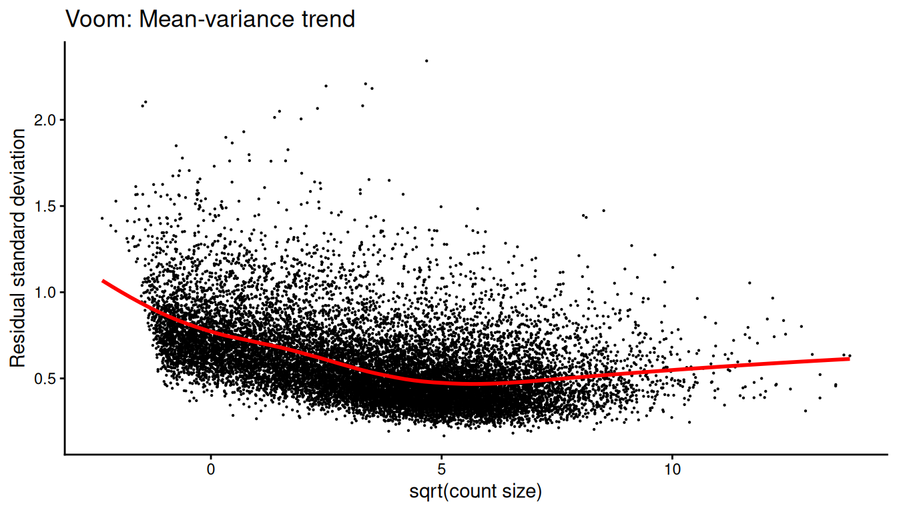
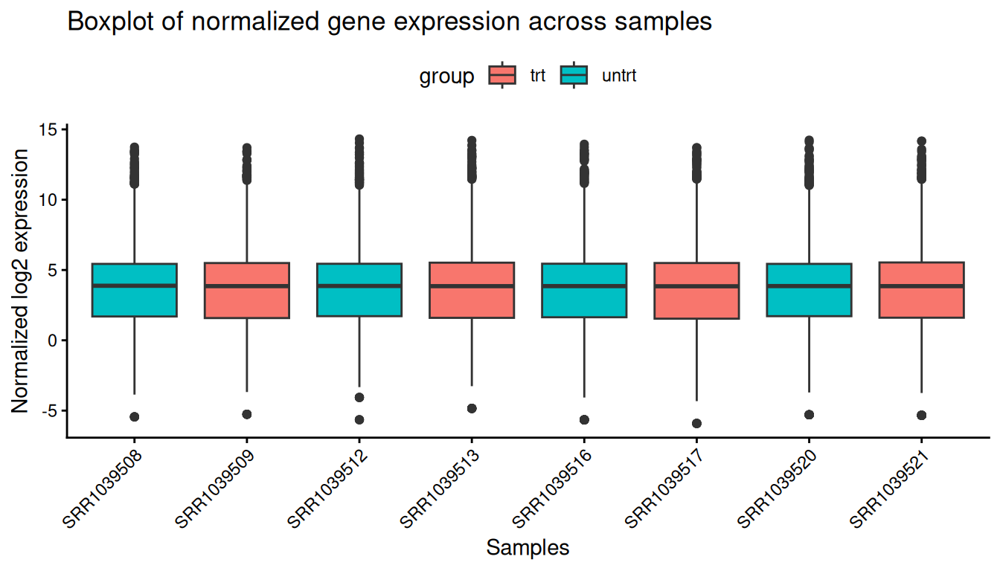
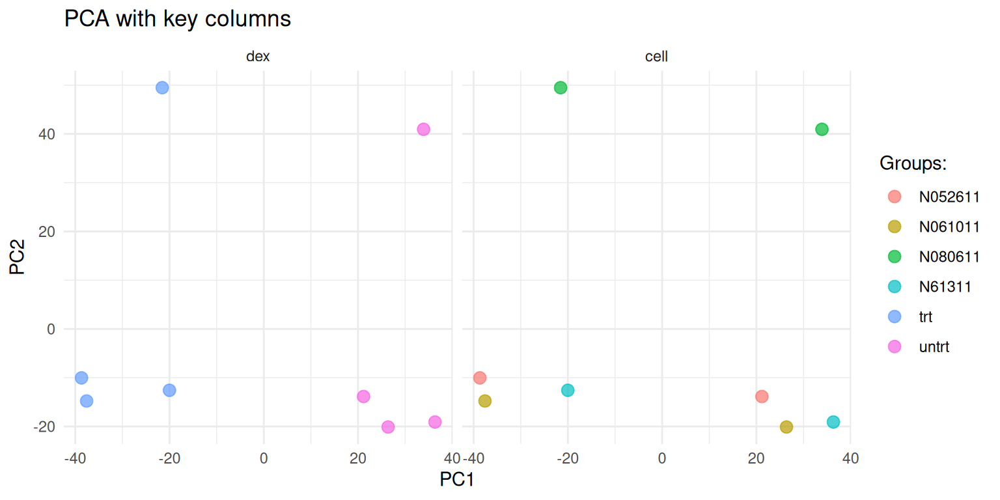
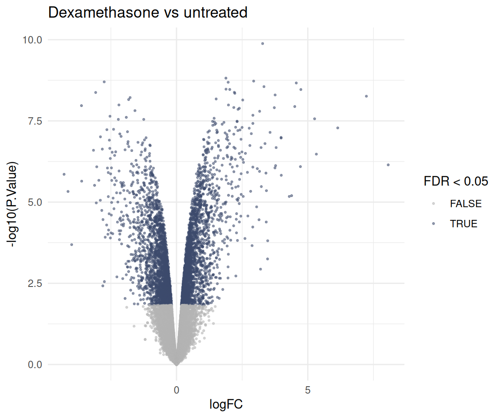

# Bulk differential expression with BulkDge

## Intro

`BulkDge` is the class for bulk RNA-seq differential expression. You
hand it a count matrix and the sample metadata, and it walks you through
the usual steps: sample QC, gene filtering, normalisation, a PCA to see
what drives the data, optional batch correction, and then the actual
tests. Every step stores its output and its plots on the object, so you
can come back to them later.

    BulkDge()
      -> qc_bulk_dge()              # outlier samples, filterByExpr
      -> normalise_bulk_dge()       # TMM + voom
      -> calculate_pca_bulk_dge()   # what separates the samples?
      -> batch_correction_bulk_dge() # optional, removeBatchEffect
      -> calculate_dge_limma()      # limma-voom
      -> calculate_dge_hedges()     # effect sizes

None of this needs limma or edgeR. The numerics run in Rust via
[edge-rs](https://crates.io/crates/edge-rs), a port of the edgeR and
limma stack that is checked against both. Towards the end we put the two
side by side, and go through where the results match, where they differ
on purpose, and what edge-rs does not do (yet).

``` r

library(bixverse)
library(data.table)
library(ggplot2)
library(magrittr)
library(patchwork)

# the comparison section at the end needs the reference implementations
has_reference <- requireNamespace("limma", quietly = TRUE) &&
  requireNamespace("edgeR", quietly = TRUE)
```

## The data

The classic: [airway](https://bioconductor.org/packages/airway/) from
[Himes, et al.](https://doi.org/10.1371/journal.pone.0099625). Four
airway smooth muscle cell lines, each treated with dexamethasone or left
untreated. Eight samples, and a paired design: the cell line is a
nuisance factor we want to account for, the treatment is what we care
about.

``` r

data("airway", package = "airway")

counts <- SummarizedExperiment::assay(airway, "counts")

meta_data <- as.data.table(
  as.data.frame(SummarizedExperiment::colData(airway)),
  keep.rownames = "sample_id"
)[, .(sample_id, cell, dex)]

meta_data
#>     sample_id    cell    dex
#>        <char>  <fctr> <fctr>
#> 1: SRR1039508  N61311  untrt
#> 2: SRR1039509  N61311    trt
#> 3: SRR1039512 N052611  untrt
#> 4: SRR1039513 N052611    trt
#> 5: SRR1039516 N080611  untrt
#> 6: SRR1039517 N080611    trt
#> 7: SRR1039520 N061011  untrt
#> 8: SRR1039521 N061011    trt

dim(counts)
#> [1] 63677     8
```

Setting up the class needs the counts (genes x samples, with names) and
a data.table with a `sample_id` column matching the column names of the
counts.

``` r

dge_obj <- BulkDge(raw_counts = counts, meta_data = meta_data)

dge_obj
#> Bulk differential gene expression class (BulkDge).
#>  Raw counts: 63677 genes x 8 samples.
#>  Meta-data rows: 8.
#>  Variable info provided: FALSE.
#>  Applied steps:
#>   qc_bulk_dge(): FALSE.
#>   normalise_bulk_dge(): FALSE.
#>   batch_correction_bulk_dge(): FALSE.
#>   calculate_pca_bulk_dge(): FALSE.
#>   calculate_dge_limma(): FALSE.
#>   calculate_dge_hedges(): FALSE.
#>   TPM normalisation: FALSE.
#>   FPKM normalisation: FALSE.
```

## QC

[`qc_bulk_dge()`](https://gregorlueg.github.io/bixverse/reference/qc_bulk_dge.md)
does two things. It flags samples that detect far fewer genes than the
rest (more than `outlier_threshold` standard deviations below the mean)
and drops them, and it removes lowly expressed genes with edgeR’s
`filterByExpr()` logic within the groups of `group_col`.

``` r

dge_obj <- qc_bulk_dge(dge_obj, group_col = "dex")
#> Detecting sample outliers.
#> A total of 0 samples are detected as outlier.
#> Removing lowly expressed genes.
#> A total of 15926 genes are kept.
```

The QC plots live on the object. Plot 1 shows the number of detected
genes per sample, plot 2 the outlier thresholds.

``` r

get_dge_qc_plot(dge_obj, plot_choice = 1L)
```


``` r

get_dge_qc_plot(dge_obj, plot_choice = 2L)
```


## Normalisation

[`normalise_bulk_dge()`](https://gregorlueg.github.io/bixverse/reference/normalise_bulk_dge.md)
calculates the normalisation factors (TMM by default) and applies voom
on top, which gives you log2-CPM values to work with for PCAs, plotting
and effect sizes. The mean-variance trend and the per-sample
distributions end up as plots 3 and 4.

``` r

dge_obj <- normalise_bulk_dge(dge_obj, group_col = "dex")

get_dge_qc_plot(dge_obj, plot_choice = 3L)
#> `geom_smooth()` using formula = 'y ~ x'
```



``` r

get_dge_qc_plot(dge_obj, plot_choice = 4L)
```



The factors are stored alongside the counts:

``` r

get_outputs(dge_obj)$norm_factors
#> SRR1039508 SRR1039509 SRR1039512 SRR1039513 SRR1039516 SRR1039517 SRR1039520 
#>  1.0554426  1.0212432  0.9904147  0.9486448  1.0308659  0.9780453  1.0266818 
#> SRR1039521 
#>  0.9539343
```

Want the edgeR `DGEList` anyway, say for a method bixverse does not
wrap?
[`get_dge_list()`](https://gregorlueg.github.io/bixverse/reference/get_dge_list.md)
builds one from the stored counts, library sizes and factors. This is
the one function in the class that needs edgeR installed.

``` r

get_dge_list(dge_obj)
#> An object of class "DGEList"
#> $counts
#>                 SRR1039508 SRR1039509 SRR1039512 SRR1039513 SRR1039516
#> ENSG00000000003        679        448        873        408       1138
#> ENSG00000000419        467        515        621        365        587
#> ENSG00000000457        260        211        263        164        245
#> ENSG00000000460         60         55         40         35         78
#> ENSG00000000971       3251       3679       6177       4252       6721
#>                 SRR1039517 SRR1039520 SRR1039521
#> ENSG00000000003       1047        770        572
#> ENSG00000000419        799        417        508
#> ENSG00000000457        331        233        229
#> ENSG00000000460         63         76         60
#> ENSG00000000971      11027       5176       7995
#> 15921 more rows ...
#> 
#> $samples
#>            group lib.size norm.factors
#> SRR1039508 untrt 20637971    1.0554426
#> SRR1039509   trt 18809481    1.0212432
#> SRR1039512 untrt 25348649    0.9904147
#> SRR1039513   trt 15163415    0.9486448
#> SRR1039516 untrt 24448408    1.0308659
#> SRR1039517   trt 30818215    0.9780453
#> SRR1039520 untrt 19126151    1.0266818
#> SRR1039521   trt 21164133    0.9539343
```

## PCA

Before testing anything, check what actually separates the samples.

``` r

dge_obj <- calculate_pca_bulk_dge(dge_obj)

plot_pca_res(dge_obj, cols_to_plot = c("dex", "cell"))
```



The class also runs a quick ANOVA of PC1 and PC2 against the groups:

``` r

get_outputs(dge_obj)$pca_anova
#>        pc       pvalue
#>    <char>        <num>
#> 1:    PC1 7.136426e-05
#> 2:    PC2 7.867420e-01
```

## Batch correction

Cell line is a nuisance factor here. For the linear model we’ll put it
into the design (see below), which is the right way to deal with it when
testing. For plotting and for effect sizes you want it gone from the
expression values themselves.
[`batch_correction_bulk_dge()`](https://gregorlueg.github.io/bixverse/reference/batch_correction_bulk_dge.md)
does that via limma’s `removeBatchEffect()` logic, while protecting the
contrast of interest.

``` r

dge_obj <- batch_correction_bulk_dge(
  dge_obj,
  contrast_column = "dex",
  batch_col = "cell"
)

get_dge_qc_plot(dge_obj, plot_choice = "p6_batch_correction_plot")
```


## Differential expression

### limma-voom

[`calculate_dge_limma()`](https://gregorlueg.github.io/bixverse/reference/calculate_dge_limma.md)
fits `~ 0 + dex + cell` and tests every pairwise contrast between the
levels of `contrast_column`. With two levels that is one contrast,
treated versus untreated. The knobs sit in
[`params_limma_voom()`](https://gregorlueg.github.io/bixverse/reference/params_limma_voom.md):
the route (`"voom"` or `"trend"`), the normalisation method, robust
empirical Bayes and friends.

``` r

dge_obj <- calculate_dge_limma(
  dge_obj,
  contrast_column = "dex",
  co_variates = "cell",
  limma_params = params_limma_voom(route = "voom", robust = FALSE)
)
#> Calculating the differential expression with Limma Voom.
#> Fixing any naming issues for the selected main contrast and any co-variates.

limma_res <- get_dge_limma_voom(dge_obj)
head(limma_res)
#>            gene_id     logFC      CI.L      CI.R  AveExpr         t
#>             <char>     <num>     <num>     <num>    <num>     <num>
#> 1: ENSG00000165995  3.278358  3.087215  3.469500 3.680801  39.41238
#> 2: ENSG00000162493  1.880994  1.732667  2.029321 5.187898  29.14082
#> 3: ENSG00000120129  2.938014  2.700250  3.175778 6.643013  28.39505
#> 4: ENSG00000146250 -2.753617 -2.977994 -2.529241 3.223442 -28.20072
#> 5: ENSG00000157214  1.967390  1.806513  2.128266 6.788567  28.10164
#> 6: ENSG00000152583  4.561808  4.186473  4.937144 4.165462  27.92876
#>         P.Value    adj.P.Val        B     contrast subgroup
#>           <num>        <num>    <num>       <char>   <lgcl>
#> 1: 1.315252e-10 2.094670e-06 14.34624 trt_vs_untrt       NA
#> 2: 1.523281e-09 5.451368e-06 12.74382 trt_vs_untrt       NA
#> 3: 1.878886e-09 5.451368e-06 12.56916 trt_vs_untrt       NA
#> 4: 1.986232e-09 5.451368e-06 12.13328 trt_vs_untrt       NA
#> 5: 2.043601e-09 5.451368e-06 12.49578 trt_vs_untrt       NA
#> 6: 2.148203e-09 5.451368e-06 12.13050 trt_vs_untrt       NA
```

The columns are the ones from limma’s `topTable(confint = TRUE)`. Here’s
the volcano:

``` r

ggplot(
  limma_res,
  aes(x = logFC, y = -log10(P.Value), colour = adj.P.Val < 0.05)
) +
  geom_point(size = 0.5, alpha = 0.5) +
  scale_colour_manual(values = c("grey70", "#3C4B6D")) +
  theme_minimal() +
  labs(
    title = "Dexamethasone vs untreated",
    colour = "FDR < 0.05"
  )
```



``` r

limma_res[, .(
  up = sum(adj.P.Val < 0.05 & logFC > 0),
  down = sum(adj.P.Val < 0.05 & logFC < 0)
)]
#>       up  down
#>    <int> <int>
#> 1:  2469  2285
```

### Effect sizes

p-values tell you how sure you are, not how big the change is. Hedges’ g
gives a standardised effect size per gene, and since we ran the batch
correction above, it is calculated on the corrected values.

``` r

dge_obj <- calculate_dge_hedges(dge_obj, contrast_column = "dex")
#> Found batch corrected counts. These will be used for effect size calculations
#> Calculating the differential expression based on Hedge's G.
#> Less than 50 samples identified. Applying small sample correction.

head(get_dge_effect_sizes(dge_obj))
#>    effect_sizes standard_errors         gene_id  combination subgroup
#>           <num>           <num>          <char>       <char>   <lgcl>
#> 1:    7.9092554       2.0999453 ENSG00000000003 untrt_vs_trt       NA
#> 2:   -2.4729394       0.9392627 ENSG00000000419 untrt_vs_trt       NA
#> 3:   -0.3023837       0.7111362 ENSG00000000457 untrt_vs_trt       NA
#> 4:    0.1958752       0.7088004 ENSG00000000460 untrt_vs_trt       NA
#> 5:   -4.5584510       1.3411626 ENSG00000000971 untrt_vs_trt       NA
#> 6:    5.7085826       1.5927161 ENSG00000001036 untrt_vs_trt       NA
```

Watch the direction: the combination here is `untrt_vs_trt`, the
opposite way round to the limma contrast, so the signs flip.

### Outside the class

Both linear model chains are also available as plain functions on a
count matrix.
[`run_limma_voom()`](https://gregorlueg.github.io/bixverse/reference/run_limma_voom.md)
is what
[`calculate_dge_limma()`](https://gregorlueg.github.io/bixverse/reference/calculate_dge_limma.md)
calls under the hood.
[`run_edger_ql()`](https://gregorlueg.github.io/bixverse/reference/run_edger_ql.md)
gives you the edgeR quasi-likelihood test instead, which is the one to
reach for when you have few replicates or very low counts.

``` r

dge_counts <- get_outputs(dge_obj)$dge_counts
# copy: the data.table on the object would otherwise be modified by reference
sample_info <- copy(get_outputs(dge_obj)$sample_info)
sample_info[, dex := factor(dex, levels = c("untrt", "trt"))]

design <- model.matrix(~ cell + dex, data = sample_info)

edger_res <- run_edger_ql(
  counts = dge_counts[, sample_info$sample_id],
  design = design,
  coef = "dextrt",
  edger_params = params_edger_ql(filter = FALSE)
)

head(edger_res[order(p_value)])
#>         feature_id    log_fc  log_cpm    f_stat      p_value          fdr
#>             <char>     <num>    <num>     <num>        <num>        <num>
#> 1: ENSG00000165995  3.280155 4.530402 1579.0374 1.151697e-10 1.834193e-06
#> 2: ENSG00000109906  7.150217 4.169702 1369.4922 2.358897e-10 1.878390e-06
#> 3: ENSG00000146250 -2.762087 3.893947  803.5986 1.800980e-09 5.637336e-06
#> 4: ENSG00000162493  1.882082 5.684657  795.3839 1.876679e-09 5.637336e-06
#> 5: ENSG00000168309  4.726736 2.873488  725.6715 2.107584e-09 5.637336e-06
#> 6: ENSG00000157214  1.967517 7.136382  699.0993 3.167730e-09 5.637336e-06
```

## edge-rs versus edgeR and limma

Swapping out the R implementations for a Rust port raises the obvious
question: do you get the same answer? For the parts bixverse uses, yes.
The package tests check `filterByExpr()`, TMM factors, `cpm()`, voom’s
log-CPM values and weights, the full `voomLmFit()` -\> `eBayes()` -\>
`topTable()` table (log fold changes, confidence intervals, moderated t,
p-values, B) and `removeBatchEffect()` against edgeR 4.8.2 and limma
3.66.0, to 1e-8 or better.

Let’s check it on airway. We rebuild exactly what
[`calculate_dge_limma()`](https://gregorlueg.github.io/bixverse/reference/calculate_dge_limma.md)
ran, on the same filtered counts, with edgeR and limma.

``` r

design_ref <- model.matrix(~ 0 + dex + cell, data = sample_info)
colnames(design_ref) <- gsub("dex", "", colnames(design_ref))

# the class keeps the pre-filter library sizes, as a subset DGEList does
y <- edgeR::normLibSizes(
  edgeR::DGEList(
    dge_counts[, sample_info$sample_id],
    lib.size = get_outputs(dge_obj)$lib_size[sample_info$sample_id]
  )
)

fit <- edgeR::voomLmFit(y, design_ref, sample.weights = FALSE)
fit <- limma::contrasts.fit(
  fit,
  limma::makeContrasts(trt - untrt, levels = design_ref)
)
fit <- limma::eBayes(fit)

ref_res <- as.data.table(
  limma::topTable(fit, number = Inf, sort.by = "none", confint = TRUE),
  keep.rownames = "gene_id"
)

comparison <- merge(
  limma_res[, .(gene_id, logFC, t, P.Value)],
  ref_res[, .(gene_id, logFC, t, P.Value)],
  by = "gene_id",
  suffixes = c("_rs", "_r")
)

comparison[, .(
  max_abs_diff_logfc = max(abs(logFC_rs - logFC_r)),
  max_abs_diff_t = max(abs(t_rs - t_r)),
  max_abs_diff_log10p = max(abs(log10(P.Value_rs) - log10(P.Value_r)))
)]
#>    max_abs_diff_logfc max_abs_diff_t max_abs_diff_log10p
#>                 <num>          <num>               <num>
#> 1:       1.421085e-14   1.540386e-10        7.670664e-11
```

Or as plots:

``` r

p1 <- ggplot(data = comparison, mapping = aes(x = logFC_rs, y = logFC_r)) +
  geom_point() +
  xlab("LFC (Rust)") +
  ylab("LFC (R)") +
  ggtitle(label = waiver(), subtitle = "LFC comparison") +
  theme_minimal() +
  geom_abline(slope = 1, intercept = 0, linesize = 0.25)
#> Warning in geom_abline(slope = 1, intercept = 0, linesize = 0.25): Ignoring
#> unknown parameters: `linesize`

p2 <- ggplot(data = comparison, mapping = aes(x = t_rs, y = t_r)) +
  geom_point() +
  xlab("t stat (Rust)") +
  ylab("t stat (R)") +
  ggtitle(label = waiver(), subtitle = "t stat comparison") +
  theme_minimal() +
  geom_abline(slope = 1, intercept = 0, linesize = 0.25)
#> Warning in geom_abline(slope = 1, intercept = 0, linesize = 0.25): Ignoring
#> unknown parameters: `linesize`

p1 + p2 + plot_annotation(title = "Rust vs R limma-voom")
```


And voom’s normalised values against the ones
[`normalise_bulk_dge()`](https://gregorlueg.github.io/bixverse/reference/normalise_bulk_dge.md)
stored:

``` r

voom_ref <- limma::voom(
  y,
  model.matrix(~ 0 + dex, data = sample_info)
)

max(abs(get_outputs(dge_obj)$normalised_counts - voom_ref$E))
#> [1] 1.776357e-15
```

Same for the batch correction: `removeBatchEffect()` on the stored voom
values, cell line as batch, treatment protected, against what
[`batch_correction_bulk_dge()`](https://gregorlueg.github.io/bixverse/reference/batch_correction_bulk_dge.md)
stored. Again, this is for plotting and effect sizes. The test itself
had the cell line in the design.

``` r

batch_info <- get_outputs(dge_obj)$sample_info

corrected_ref <- limma::removeBatchEffect(
  get_outputs(dge_obj)$normalised_counts,
  batch = batch_info$cell,
  design = model.matrix(~ 0 + factor(batch_info$dex))
)

max(abs(get_outputs(dge_obj)$normalised_counts_corrected - corrected_ref))
#> [1] 3.552714e-15
```

### Speed

Same numbers, so is the Rust worth it? Here’s the full limma-voom chain,
TMM factors to the final table, against what
[`calculate_dge_limma()`](https://gregorlueg.github.io/bixverse/reference/calculate_dge_limma.md)
runs. Airway is tiny with eight samples, so this is a small-data view.

``` r

microbenchmark::microbenchmark(
  limma = {
    y_bench <- edgeR::normLibSizes(
      edgeR::DGEList(
        dge_counts[, sample_info$sample_id],
        lib.size = get_outputs(dge_obj)$lib_size[sample_info$sample_id]
      )
    )
    fit_bench <- edgeR::voomLmFit(y_bench, design_ref, sample.weights = FALSE)
    fit_bench <- limma::contrasts.fit(
      fit_bench,
      limma::makeContrasts(trt - untrt, levels = design_ref)
    )
    limma::topTable(
      limma::eBayes(fit_bench),
      number = Inf,
      sort.by = "none",
      confint = TRUE
    )
  },
  bixverse = run_limma_voom(
    meta_data = sample_info,
    main_contrast = "dex",
    counts = dge_counts[, sample_info$sample_id],
    co_variates = "cell",
    limma_params = params_limma_voom(route = "voom", robust = FALSE),
    lib_size = get_outputs(dge_obj)$lib_size[sample_info$sample_id],
    .verbose = FALSE
  ),
  times = 5L
)
#> Unit: milliseconds
#>      expr       min       lq     mean    median        uq       max neval
#>     limma 1593.3436 1633.921 1747.723 1669.4712 1705.4067 2136.4707     5
#>  bixverse  345.2062  345.498  356.875  346.5454  362.8988  384.2264     5
```

And the edgeR quasi-likelihood chain, same counts and design as
[`run_edger_ql()`](https://gregorlueg.github.io/bixverse/reference/run_edger_ql.md)
above:

``` r

microbenchmark::microbenchmark(
  edgeR = {
    y_bench <- edgeR::normLibSizes(
      edgeR::DGEList(dge_counts[, sample_info$sample_id])
    )
    fit_bench <- edgeR::glmQLFit(y_bench, design)
    edgeR::topTags(edgeR::glmQLFTest(fit_bench, coef = "dextrt"), n = Inf)
  },
  bixverse = run_edger_ql(
    counts = dge_counts[, sample_info$sample_id],
    design = design,
    coef = "dextrt",
    edger_params = params_edger_ql(filter = FALSE)
  ),
  times = 5L
)
#> Unit: milliseconds
#>      expr      min       lq     mean   median       uq      max neval
#>     edgeR 864.3576 889.7964 896.2229 896.3851 912.5195 918.0560     5
#>  bixverse 288.2735 288.6989 301.1239 288.8206 307.9850 331.8418     5
```

Both land a few times faster on the Rust side, on eight samples. Mileage
on bigger cohorts will vary with your machine, but some benchmarks have
shown the delta tends to increase with Rust getting comparably faster
with larger N.

### Where the results differ on purpose

Numbers matching is only half the story. A few defaults differ from what
a classic limma script does, and they will move your results a bit:

- **`voomLmFit()`, not `voom()` + `lmFit()`.** The DGE chain follows
  edgeR’s `voomLmFit()`. It masks structural zeros, i.e. genes that are
  all zero in a group, before fitting the mean-variance trend, and gives
  those genes their own residual degrees of freedom. On well-filtered
  data the two agree closely, on sparse data they don’t.
- **No quantile normalisation.** Older versions of bixverse
  quantile-normalised the voom output in
  [`normalise_bulk_dge()`](https://gregorlueg.github.io/bixverse/reference/normalise_bulk_dge.md).
  Voom on top of TMM is limma’s own default, and the one we stick with
  now.
- **The empirical Bayes trend follows the route.** voom carries the
  mean-variance relationship in its weights, so the prior is not
  trended; limma-trend has nothing else to absorb it, so it is. limma
  lets you mix and match, bixverse doesn’t.

Here’s how much the first point matters on airway: the classic
`voom()` + `lmFit()` script next to what bixverse runs.

``` r

v <- limma::voom(y, design_ref)
fit_classic <- limma::lmFit(v, design_ref)
fit_classic <- limma::contrasts.fit(
  fit_classic,
  limma::makeContrasts(trt - untrt, levels = design_ref)
)
fit_classic <- limma::eBayes(fit_classic)

classic_res <- as.data.table(
  limma::topTable(fit_classic, number = Inf, sort.by = "none"),
  keep.rownames = "gene_id"
)

classic <- merge(
  limma_res[, .(gene_id, logFC, P.Value, adj.P.Val)],
  classic_res[, .(gene_id, logFC, P.Value, adj.P.Val)],
  by = "gene_id",
  suffixes = c("_bixverse", "_classic")
)

classic[, .(
  cor_logfc = cor(logFC_bixverse, logFC_classic),
  cor_log10p = cor(log10(P.Value_bixverse), log10(P.Value_classic)),
  sig_bixverse = sum(adj.P.Val_bixverse < 0.05),
  sig_classic = sum(adj.P.Val_classic < 0.05),
  sig_both = sum(adj.P.Val_bixverse < 0.05 & adj.P.Val_classic < 0.05)
)]
#>    cor_logfc cor_log10p sig_bixverse sig_classic sig_both
#>        <num>      <num>        <int>       <int>    <int>
#> 1:         1  0.9995499         4754        4840     4749
```

Fold changes are identical to the last digit and the p-values barely
move. The classic script calls a few dozen more genes at 5% FDR, and
nearly everything bixverse calls, it calls too. Different defaults, same
biology.

### What edge-rs does not do (yet)

- **Sample or array weights.** No `voomWithQualityWeights()` or
  `arrayWeights()` in the bixverse chain.
- **Blocking.** No `duplicateCorrelation()` and no `block` argument.
  Repeated measures have to go into the design as a fixed effect, as the
  cell line did above.
- **The moderated F-test.** One coefficient or contrast at a time.
  Several at once errors rather than silently testing the first.
- **Arbitrary contrasts.** `contrast_list` takes `"a-b"` strings only,
  not the full expression syntax of `makeContrasts()`.
- **`treat()`** and the other limma extras.

If you need any of those,
[`get_dge_list()`](https://gregorlueg.github.io/bixverse/reference/get_dge_list.md)
hands you a `DGEList` and you can carry on in limma or edgeR directly.

## Where next

The DGE results feed straight into the gene set enrichment methods, see
[`vignette("gse_methods")`](https://gregorlueg.github.io/bixverse/articles/gse_methods.md).
For co-expression rather than differential expression,
[`vignette("bulk_coexpression_modules")`](https://gregorlueg.github.io/bixverse/articles/bulk_coexpression_modules.md).
For single cell pseudobulk, NEBULA and friends,
[`vignette("differential_expression")`](https://gregorlueg.github.io/bixverse/articles/differential_expression.md).
