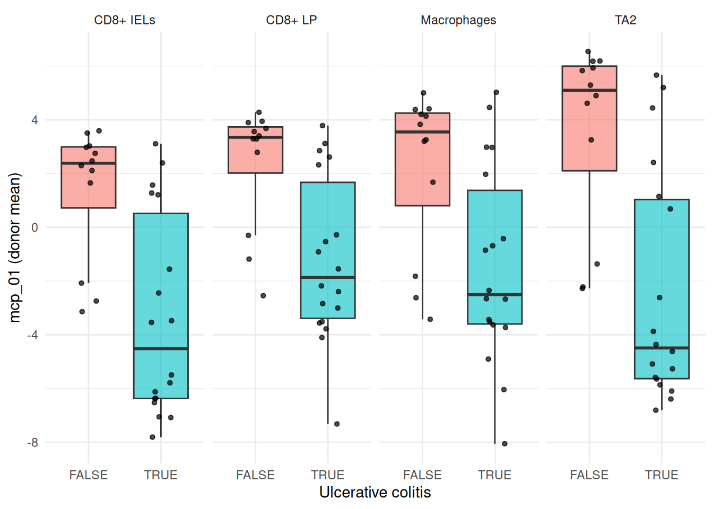

# Multicellular programmes with DIALOGUE

## Intro

Most programme discovery methods ask what varies together *within* a
cell type. NMF on the T cells gives you T cell programmes; Hotspot on
the macrophages gives you macrophage programmes. Neither tells you
whether the T cell programme and the macrophage programme are the same
thing seen from two sides.

[DIALOGUE](https://doi.org/10.1038/s41587-022-01288-0) asks the other
question. It looks for multicellular programmes (MCPs): axes of
variation that show up in several cell types *at once*, sample by
sample. If macrophages in a biopsy sit high on some axis and the
epithelial cells in the same biopsy also sit high, and that holds across
enough biopsies, then whatever those cells are doing is coordinated
rather than independent.

Three stages, and it is worth knowing the shape before you run it:

1.  Each cell type’s features are averaged to one row per sample and put
    through a sparse multi-CCA. That gives every programme a weight
    vector per cell type and a provisional gene signature.
2.  For every ordered pair of cell types and every candidate gene, a
    mixed model asks whether a cell’s own programme score tracks the
    partner cell type’s expression of that gene in the same sample. The
    random intercept is over samples.
3.  The partners are meta-analysed, and the scores are refit onto the
    surviving genes by non-negative least squares.

If you have not read the [design
choices](https://gregorlueg.github.io/bixverse/articles/design_single_cell.html)
and the [introductory
vignette](https://gregorlueg.github.io/bixverse/articles/thinking_single_cell.html),
please do so first; this one assumes you know how `SingleCells`, subsets
and on-disk storage work.

> **DIALOGUE needs a study design, not just a lot of cells**
>
> Because stage one works on per-sample averages, DIALOGUE needs
> **multiple samples and multiple cell types, with every cell type
> captured in every sample**. `bixverse` hard-errors below five samples
> present in all cell types, and drops samples that do not clear `abn_c`
> cells for a given cell type.
>
> This is the thing that catches people out. A beautiful 500k cell atlas
> from one donor is useless here. Ten scrappy biopsies are not.

``` r

library(bixverse)
library(bixverse.plots)
library(ggplot2)
library(data.table)
#> 
#> Attaching package: 'data.table'
#> The following object is masked from 'package:base':
#> 
#>     %notin%
library(magrittr)
```

## The data

We use the ulcerative colitis subset from the DIALOGUE paper, originally
from [Smillie, et al.](https://doi.org/10.1016/j.cell.2019.06.029).
5,374 cells across five cell subtypes and 30 donors: twelve healthy,
eighteen with UC who each contributed an inflamed and a non-inflamed
biopsy.

One provenance note. The published matrix holds `log2(TPM / 10 + 1)` and
the raw counts were never released, so the file served here has been
linearised back to the TPM/10 scale and rounded to integers. It
therefore loads like any count matrix and picks up `bixverse`’s own log
CPM on the way in. That is fine for DIALOGUE, which only ever reads the
normalised layer.

``` r

dialogue_h5ad <- download_dialogue_uc()

tempdir_dlg <- file.path(tempdir(), "dialogue_uc")
dir.create(tempdir_dlg, showWarnings = FALSE, recursive = TRUE)

sc_object <- SingleCells(dir_data = tempdir_dlg)
sc_object <- load_h5ad(
  object = sc_object,
  h5_path = dialogue_h5ad,
  .verbose = FALSE
)

sc_object
#> Single cell experiment (Single Cells).
#>   No cells (original): 5374
#>    To keep n: 5374
#>   No genes: 6329
#>   HVG calculated: FALSE
#>   PCA calculated: FALSE
#>   Other embeddings: none
#>   KNN generated: FALSE
#>   SNN generated: FALSE
#>   MAGIC imputed: none
#>   Stale artefacts: none
```

Before anything else, look at the design. This is the table that decides
whether DIALOGUE can run at all.

``` r

obs <- get_sc_obs(sc_object, filtered = TRUE)

table(obs$cell_subtype, obs$clinical_status)
#>              
#>               Healthy Inflamed Non-inflamed
#>   CD8+ IELs       409      145          198
#>   CD8+ IL17+       24       45           30
#>   CD8+ LP         429      367          370
#>   Macrophages     543      450          459
#>   TA2             723      568          614
```

`CD8+ IL17+` is the problem: 99 cells in total, and completely absent
from twelve of the thirty donors. A cell type missing from a sample
means that sample cannot contribute to any pair involving it, so the
sensible move is to drop the cell type rather than lose the samples.
pertpy’s DIALOGUE tutorial does the same thing on the same data.

``` r

sc_object <- set_cells_to_keep(
  x = sc_object,
  cells_to_keep = obs[cell_subtype != "CD8+ IL17+", cell_id]
)

sc_object <- find_hvg_sc(sc_object, hvg_no = 2000L, .verbose = FALSE)

obs <- get_sc_obs(sc_object, filtered = TRUE)
cell_types <- sort(unique(obs$cell_subtype))

cell_types
#> [1] "CD8+ IELs"   "CD8+ LP"     "Macrophages" "TA2"
min(table(obs$sample, obs$cell_subtype))
#> [1] 2
```

Four cell types, thirty donors, and the sparsest donor-by-cell-type cell
still has cells in it. That is a design DIALOGUE can work with.

## Per-cell-type features

This is the step to get right, and the one the documentation warns
about: the `features` you hand DIALOGUE must be computed **per cell
type**, not sliced out of a global PCA. A global PCA’s leading
components mostly separate the cell types from each other, so slicing it
hands every cell type the same axis and DIALOGUE dutifully reports that
the cell types agree with themselves.

So: subset, find variable genes within the subset, run a PCA within the
subset.

``` r

features <- purrr::map(cell_types, \(ct) {
  sub <- SingleCellsSubset(
    sc_object = sc_object,
    grouping_column = "cell_subtype",
    group = ct
  )
  sub <- find_hvg_sc(sub, hvg_no = 2000L, .verbose = FALSE)
  sub <- calculate_pca_sc(sub, no_pcs = 10L, .verbose = FALSE)

  get_pca_factors(sub)
})
names(features) <- cell_types

purrr::map(features, dim)
#> $`CD8+ IELs`
#> [1] 752  10
#> 
#> $`CD8+ LP`
#> [1] 1166   10
#> 
#> $Macrophages
#> [1] 1452   10
#> 
#> $TA2
#> [1] 1905   10
```

`features` is a named list of matrices, names matching the cell type
labels, row names matching cell ids. Rows are matched by name rather
than position, so the order does not matter, but the coverage does:
every cell of that type has to be in there.

## Running it

Three parameter bundles, one per stage. The defaults follow upstream’s
`DLG.get.param`, and the two knobs worth thinking about live in
[`params_dialogue_pmd()`](https://gregorlueg.github.io/bixverse/reference/params_dialogue_pmd.md):
`k` is how many programmes you are asking for, with no sweep to help you
pick it, and `n_permutations` sets the resolution of the empirical
p-value.

We ask for three programmes, matching what pertpy reports on this data.

``` r

dlg_res <- dialogue_sc(
  object = sc_object,
  cell_type_col = "cell_subtype",
  sample_col = "sample",
  features = features,
  quality_col = "cell_q",
  pmd_params = params_dialogue_pmd(k = 3L, n_permutations = 100L)
)

dlg_res
#> DialogueResult (multicellular programmes)
#>   Source class:     SingleCells
#>   Cell types:       4 (CD8+ IELs, CD8+ LP, Macrophages, TA2)
#>   Shared samples:   30
#>   Programmes:       3
#>     mcp_01 - worst pair p: 0.0448 | spans 4 cell type(s)
#>     mcp_02 - worst pair p: 0.1127 | spans 4 cell type(s)
#>     mcp_03 - worst pair p: 0.08292 | spans 4 cell type(s)
#>   Genes with a verdict: 1395
#>   Signature genes:  1168 permissive | 799 strict
```

`quality_col = "cell_q"` is the per-cell quality score the original
paper shipped with this data. Leave it `NULL` and `bixverse` falls back
to the z-scored log library size instead. That choice matters more than
it looks, and we come back to it below.

## Reading the output

[`get_results()`](https://gregorlueg.github.io/bixverse/reference/get_results.md)
gives the programme table: one row per programme per ordered pair of
cell types, with the empirical p-value and the correlation between the
two cell types’ sample-level scores.

``` r

get_results(dlg_res)
#>     programme cell_type_a cell_type_b      emp_p  pair_cor
#>         <int>      <char>      <char>      <num>     <num>
#>  1:         1   CD8+ IELs     CD8+ LP 0.04480159 0.9186660
#>  2:         2   CD8+ IELs     CD8+ LP 0.06371927 0.6268279
#>  3:         3   CD8+ IELs     CD8+ LP 0.05551659 0.6293367
#>  4:         1   CD8+ IELs Macrophages 0.04480159 0.8735931
#>  5:         2   CD8+ IELs Macrophages 0.04480159 0.8026124
#>  6:         3   CD8+ IELs Macrophages 0.04817104 0.6640532
#>  7:         1   CD8+ IELs         TA2 0.04480159 0.9256057
#>  8:         2   CD8+ IELs         TA2 0.07283526 0.5953537
#>  9:         3   CD8+ IELs         TA2 0.04480159 0.7620888
#> 10:         1     CD8+ LP Macrophages 0.04480159 0.9521887
#> 11:         2     CD8+ LP Macrophages 0.04817104 0.7600446
#> 12:         3     CD8+ LP Macrophages 0.04817104 0.7119079
#> 13:         1     CD8+ LP         TA2 0.04480159 0.9452754
#> 14:         2     CD8+ LP         TA2 0.04480159 0.7362233
#> 15:         3     CD8+ LP         TA2 0.08291775 0.6008835
#> 16:         1 Macrophages         TA2 0.04480159 0.9129270
#> 17:         2 Macrophages         TA2 0.11266125 0.5873035
#> 18:         3 Macrophages         TA2 0.05174027 0.6392640
```

A programme is only interesting if it holds up across *every* pair, so
the number to look at is the worst p in each programme, which is what
[`print()`](https://rdrr.io/r/base/print.html) reports. With
`n_permutations = 100` the p-value cannot go below roughly 0.01, so do
not read too much into the exact values; raise it for anything you
intend to believe.

`refit_fidelity` says how well each cell type’s score survived stage
three, i.e. how much of the programme is really carried by the genes
that passed the mixed model.

``` r

round(dlg_res$refit_fidelity, 3)
#>             mcp_01 mcp_02 mcp_03
#> CD8+ IELs    0.947  0.463  0.775
#> CD8+ LP      0.943  0.787  0.734
#> Macrophages  0.985  0.884  0.898
#> TA2          0.938  0.827  0.877
```

The signatures come in two flavours. `permissive` and `strict` are
nested by evidence rather than by threshold, and `strict` is the one to
quote.

``` r

dcast(
  dlg_res$signatures[
    list == "strict",
    .N,
    by = .(cell_type, programme, direction)
  ],
  cell_type + programme ~ direction,
  value.var = "N"
)
#> Key: <cell_type, programme>
#>       cell_type programme  down    up
#>          <char>     <int> <int> <int>
#>  1:   CD8+ IELs         1    76    25
#>  2:   CD8+ IELs         2    NA     3
#>  3:   CD8+ IELs         3     3     7
#>  4:     CD8+ LP         1    69    58
#>  5:     CD8+ LP         2    10     4
#>  6:     CD8+ LP         3    12    21
#>  7: Macrophages         1   187   156
#>  8: Macrophages         2    NA    15
#>  9: Macrophages         3    10    48
#> 10:         TA2         1    36    33
#> 11:         TA2         2    NA    11
#> 12:         TA2         3     4    11
```

## Does it track the disease?

The scores are a named list, one cells-by-programme matrix per cell
type. Average them up to the donor and compare across UC status.

``` r

score_dt <- rbindlist(purrr::imap(dlg_res$scores, \(mat, ct) {
  data.table(cell_id = rownames(mat), cell_type = ct, as.data.table(mat))
}))

score_dt <- merge(
  score_dt,
  obs[, .(cell_id, sample, pathology, clinical_status, lib_size)],
  by = "cell_id"
)

per_sample <- score_dt[,
  lapply(.SD, mean),
  by = .(sample, cell_type, pathology),
  .SDcols = patterns("^mcp_")
]

per_sample[,
  .(p = signif(wilcox.test(mcp_01 ~ pathology)$p.value, 3)),
  by = cell_type
]
#>      cell_type        p
#>         <char>    <num>
#> 1:         TA2 0.000239
#> 2:     CD8+ LP 0.000956
#> 3:   CD8+ IELs 0.000542
#> 4: Macrophages 0.010100
```

`mcp_01` separates UC donors from healthy ones in all four cell types at
once, which is the thing DIALOGUE exists to find. Plotted:

``` r

ggplot(
  per_sample,
  aes(x = pathology, y = mcp_01, fill = pathology)
) +
  geom_boxplot(outlier.shape = NA, alpha = 0.6) +
  geom_jitter(width = 0.15, size = 1.2, alpha = 0.7) +
  facet_wrap(~cell_type, nrow = 1) +
  labs(x = "Ulcerative colitis", y = "mcp_01 (donor mean)") +
  theme_minimal() +
  theme(legend.position = "none")
```



Donor-level mcp_01 score by cell type and disease status.

## Before you believe it: check the confounders

Here is where a vignette that wanted to look good would stop. Do not
stop here.

A programme that shows up in every cell type at once is exactly what a
*technical* axis looks like. Depth, capture efficiency and ambient RNA
hit all cell types in a sample together, which is precisely the
signature DIALOGUE is built to detect. So before reading any biology
into `mcp_01`, correlate it against the quality covariates.

``` r

score_dt[,
  .(rho = round(cor(mcp_01, lib_size, method = "spearman"), 3)),
  by = cell_type
]
#>      cell_type   rho
#>         <char> <num>
#> 1:         TA2 0.585
#> 2:     CD8+ LP 0.556
#> 3:   CD8+ IELs 0.461
#> 4: Macrophages 0.591
```

That is not a small correlation. `mcp_01` is tracking library size at
`rho ~ 0.5` in every cell type, and library size itself differs between
the UC and healthy donors on this subset. So a good chunk of what we
just called a disease programme is a depth axis wearing a lab coat.

The fix is to condition on the right covariate. `cell_q` is the paper’s
own quality score and it barely correlates with `mcp_01` here, so it was
never going to absorb this. The library-size covariate will.

``` r

dlg_lib <- dialogue_sc(
  object = sc_object,
  cell_type_col = "cell_subtype",
  sample_col = "sample",
  features = features,
  quality_col = NULL,
  pmd_params = params_dialogue_pmd(k = 3L, n_permutations = 100L),
  .verbose = FALSE
)

score_lib <- rbindlist(purrr::imap(dlg_lib$scores, \(mat, ct) {
  data.table(cell_id = rownames(mat), cell_type = ct, as.data.table(mat))
}))
score_lib <- merge(
  score_lib,
  obs[, .(cell_id, sample, pathology, lib_size)],
  by = "cell_id"
)

score_lib[,
  .(rho = round(cor(mcp_01, lib_size, method = "spearman"), 3)),
  by = cell_type
]
#>      cell_type   rho
#>         <char> <num>
#> 1:         TA2 0.181
#> 2:     CD8+ LP 0.239
#> 3:   CD8+ IELs 0.068
#> 4: Macrophages 0.276
```

Much better. Two things to notice about what changed and what did not.

The programme table and the p-values are **identical** to the first run.
That is not a bug: the quality covariate only enters stage two, so stage
one’s decomposition and its permutation null never saw it.

What did change is the signature. Conditioning on depth drops the strict
gene count by more than half, because the genes that were only there to
track library size no longer clear the mixed model.

``` r

c(
  cell_q = nrow(dlg_res$signatures[list == "strict"]),
  lib_size = nrow(dlg_lib$signatures[list == "strict"])
)
#>   cell_q lib_size 
#>      799      342
```

And the disease association survives.

``` r

score_lib[,
  lapply(.SD, mean),
  by = .(sample, cell_type, pathology),
  .SDcols = patterns("^mcp_")
][,
  .(p = signif(wilcox.test(mcp_01 ~ pathology)$p.value, 3)),
  by = cell_type
]
#>      cell_type        p
#>         <char>    <num>
#> 1:         TA2 0.013200
#> 2:     CD8+ LP 0.004990
#> 3:   CD8+ IELs 0.000239
#> 4: Macrophages 0.007700
```

So there is a real coordinated programme here, it is just a good deal
smaller than the first run advertised. That is the normal outcome of
doing this check, and it is why you do it.

## Caveats and what is next

A few things worth knowing before you point this at your own data.

- **`k` has no sweep.** Unlike
  [`nmf_k_sweep_sc()`](https://gregorlueg.github.io/bixverse/reference/nmf_k_sweep_sc.md),
  there is no diagnostic to pick the number of programmes. Run a few
  values and look at whether the extra programmes hold up across every
  pair.
- **`satterthwaite` dominates the runtime.** Turning it off in
  [`params_dialogue_hlm()`](https://gregorlueg.github.io/bixverse/reference/params_dialogue_hlm.md)
  falls back to the residual count for the degrees of freedom, which is
  faster and usually close enough for a first pass.
- **The random intercept level is a real modelling choice.** We used the
  donor, matching the original analysis. Using the biopsy instead
  (`paste(sample, clinical_status)`) would let the inflamed and
  non-inflamed samples from one patient separate, at the cost of samples
  that then fall below `abn_c`.
- **Meta cells have to be built within samples.** Otherwise the random
  intercept has no well-defined level.
  [`meta_cells_per_group()`](https://gregorlueg.github.io/bixverse/reference/meta_cells_per_group.md)
  with `group_col` set to your sample column does exactly that, and
  [`dialogue_sc()`](https://gregorlueg.github.io/bixverse/reference/dialogue_sc.md)
  dispatches on `MetaCells` the same way it does on `SingleCells`. You
  have to aggregate the features over each meta cell’s membership
  yourself.
- **This is a four-cell-type slice of a fifty-one-cell-type atlas.** The
  published UC programme spanned cell types that are simply not in this
  file, so partial agreement with the paper is the expected result
  rather than a failure.

## Clean up

``` r

unlink(tempdir_dlg, recursive = TRUE, force = TRUE)
```
