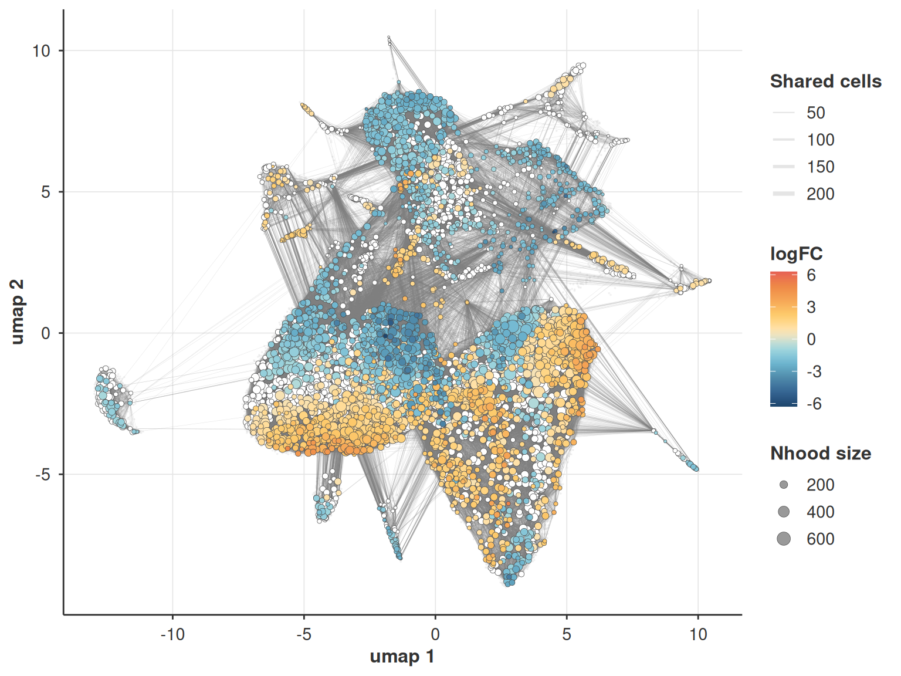
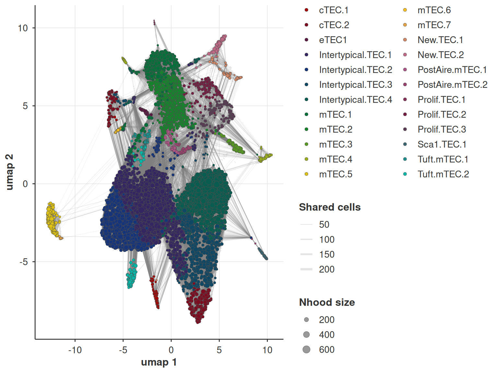

# Differential abundance with Milo and MELD

## Intro

Differential expression asks whether cells changed what they express.
Differential abundance asks whether the cells that are there changed at
all. Both matter, and the second is the one people usually answer badly.

The obvious approach is to cluster, count cells per cluster per sample,
and test the proportions. It works, and it inherits every problem the
clustering had. If a condition shifts a subpopulation that your
resolution parameter merged into a bigger cluster, you see nothing. If
it shifts half a cluster, the proportion barely moves. The answer
depends on a choice you made before you asked the question.

Two methods here avoid that, in different ways.

[Milo](https://doi.org/10.1038/s41587-021-01033-z) tests overlapping
neighbourhoods of the kNN graph instead of clusters. Each neighbourhood
is a cell and its neighbours, so the resolution is the graph’s rather
than the clustering’s, and a shift that spans part of a cluster shows
up. Counts per neighbourhood per sample go through the same negative
binomial machinery bulk RNA-seq uses.

[MELD](https://doi.org/10.1038/s41587-020-00803-5) does not test
anything. It smooths the condition labels over the graph and returns,
per cell, how likely that cell is under each condition. It is a
continuous score rather than a set of calls, which suits a graded
response better than a discrete one.

They answer the same question and they should agree. At the end of this
vignette they do, which is a better check on both than either provides
alone.

``` r

library(bixverse)
library(bixverse.plots)
library(data.table)
library(SingleCellExperiment)
```

## The data

[Baran-Gale, et al.](https://doi.org/10.1242/dev.183996) profiled mouse
thymic epithelial cells at one, four and sixteen weeks. The thymus
involutes with age, so the cell type proportions genuinely move, which
is what makes this a sensible differential abundance example.

> **A stimulation experiment is a bad Milo example**
>
> It is tempting to reuse a treatment dataset here. Do not. In vitro
> stimulation moves cells a long way in embedding space without moving
> the cell type proportions much, so stimulated and control cells
> separate into different neighbourhoods and almost every neighbourhood
> comes out significant. The result looks spectacular and says nothing
> beyond “the treatment did something”, which you knew.
>
> Differential abundance needs a design where the *composition*
> plausibly changed.

The object carries no gene names at all, with the identifiers sitting in
the `rowData` instead.
[`load_sce()`](https://gregorlueg.github.io/bixverse/reference/load_sce.html)
falls back to the first metadata column and tells you it did. 336 genes
have no annotation whatsoever and get a generated identifier, which it
also tells you. Both warnings are expected here.

``` r

sce <- qs2::qs_read(download_thymus_ageing())

dir_thymus <- file.path(tempdir(), "thymus")
dir.create(dir_thymus, showWarnings = FALSE, recursive = TRUE)

sc_object <- SingleCells(dir_data = dir_thymus)
sc_object <- load_sce(
  object = sc_object,
  sce = sce,
  sc_qc_param = params_sc_min_quality(
    min_unique_genes = 200L,
    min_lib_size = 500L,
    min_cells = 20L,
    target_size = 1e4
  ),
  .verbose = TRUE
)
#> Pulling the raw counts out of the SingleCellExperiment.
#> Pulling the obs and var data out of the object
#> Warning in flatten(SummarizedExperiment::rowData(sce), rownames(sce), id_label
#> = "gene_id", : No gene names on the object. Using 'ensembl_gene_id' from the
#> metadata instead.
#> Warning in flatten(SummarizedExperiment::rowData(sce), rownames(sce), id_label
#> = "gene_id", : 336 gene(s) have no identifier. Generating one for each.
#> Writing counts to disk.
#> Generating gene-based data.
#>  Converting the cell-based data into the gene-based format.
#> Writing to the DuckDB.
#> Setting internal mapping.

sc_object
#> Single cell experiment (Single Cells).
#>   No cells (original): 69180
#>    To keep n: 69180
#>   No genes: 22719
#>   HVG calculated: FALSE
#>   PCA calculated: FALSE
#>   Other embeddings: none
#>   KNN generated: FALSE
#>   SNN generated: FALSE
#>   MAGIC imputed: none
#>   Residual model: none
#>   Stale artefacts: none
```

Now the design, and there is a trap in it. `samp_id` looks like the
sample. It is not: it is the sequencing run, and every run carries all
three ages, because the ages were hashed together and demultiplexed.

``` r

obs <- sc_object[[]]

table(obs$samp_id, obs$age)
#>          
#>            Wk1 Wk16  Wk4
#>   1stRun1 5160 3798 3902
#>   1stRun2 3360 4199 2355
#>   2ndRun1 4017 3728 4629
#>   2ndRun2 3897 3630 4551
#>   3rdRun1 3263 2981 3771
#>   3rdRun2 3745 3284 4910
```

The sample is the run and the age together, which gives eighteen. Using
`samp_id` as the sample would ask Milo whether abundance differs between
sequencing runs, and every run contains every age, so the answer would
be a flat no.

``` r

sc_object[["sample"]] <- paste(obs$samp_id, obs$age, sep = "_")
obs <- sc_object[[]]

table(obs$sample, obs$age)[1:6, ]
#>               
#>                 Wk1 Wk16  Wk4
#>   1stRun1_Wk1  5160    0    0
#>   1stRun1_Wk16    0 3798    0
#>   1stRun1_Wk4     0    0 3902
#>   1stRun2_Wk1  3360    0    0
#>   1stRun2_Wk16    0 4199    0
#>   1stRun2_Wk4     0    0 2355
```

## The embedding

Milo and MELD both run on the kNN graph, so the usual pipeline comes
first.

``` r

sc_object <- find_hvg_sc(sc_object, hvg_no = 2000L, .verbose = FALSE)
sc_object <- calculate_pca_sc(sc_object, no_pcs = 30L, .verbose = FALSE)
```

The default `k` of 15 is fine for clustering and too small for Milo. A
neighbourhood is the index cell, its `k` neighbours and every cell that
lists it as a neighbour, so it holds at least `k + 1` cells, and those
get spread over the samples. With eighteen samples and `k = 15` the
smallest neighbourhoods have under one cell per sample, and a negative
binomial fitted to counts that are mostly zero or one has very little to
work with.

Rough rule: pick `k` so the average neighbourhood holds at least a few
cells per sample. Eighteen samples and `k = 60` gives around eight here,
the neighbourhoods averaging just under 150 cells.

``` r

sc_object <- find_neighbours_sc(
  sc_object,
  neighbours_params = params_sc_neighbours(
    knn = list(k = 60L)
  ),
  .verbose = TRUE
)
#> 
#> Generating sNN graph (full: TRUE).
#> Transforming sNN data to igraph.
```

## Milo

Sampling the neighbourhoods and counting the cells per sample is one
call. The counts come back as neighbourhoods by samples, with the
graph-overlap weighting and the k-th neighbour distances taken at the
same time, since all three are functions of the neighbourhood matrix
alone.

``` r

milo_obj <- get_miloR_abundances_sc(
  object = sc_object,
  sample_id_col = "sample",
  miloR_params = params_sc_miloR(prop = 0.1),
  .verbose = TRUE
)

dim(milo_obj$sample_counts)
#> [1] 5191   18
mean(rowSums(milo_obj$sample_counts))
#> [1] 146.5026
```

The test needs a design table with one row per sample, and its rownames
have to cover the sample names on the counts. Blocking on the run is
worth it: every run contributes all three ages, so run-to-run variation
is a nuisance term the model can remove.

``` r

samp_design <- unique(obs[, .(sample, samp_id, age)])

design_df <- data.frame(
  age = samp_design$age,
  run = samp_design$samp_id,
  row.names = samp_design$sample
)
design_df <- design_df[colnames(milo_obj$sample_counts), , drop = FALSE]

table(design_df$age, design_df$run)
#>       
#>        1stRun1 1stRun2 2ndRun1 2ndRun2 3rdRun1 3rdRun2
#>   Wk1        1       1       1       1       1       1
#>   Wk16       1       1       1       1       1       1
#>   Wk4        1       1       1       1       1       1
```

> **Check which coefficient you are testing**
>
> [`test_nhoods()`](https://gregorlueg.github.io/bixverse/reference/test_nhoods.md)
> defaults to the last column of the design, the way edgeR and limma do.
> With `age` as a factor, R orders the levels alphabetically: `Wk1`,
> `Wk16`, `Wk4`. The last coefficient is therefore **Wk4 against Wk1**,
> not the sixteen week contrast you probably wanted.
>
> Name the coefficient rather than trusting the default.

``` r

milo_obj <- test_nhoods(
  milo_obj,
  design = ~ run + age,
  design_df = design_df,
  coef = "ageWk16"
)

da_res <- get_differential_abundance_res(milo_obj)

da_res[SpatialFDR <= 0.1, .N]
#> [1] 3135
```

``` r

head(da_res[order(PValue), .(Nhood, logFC, F, PValue, FDR, SpatialFDR)], 6)
#>    Nhood     logFC        F       PValue          FDR   SpatialFDR
#>    <int>     <num>    <num>        <num>        <num>        <num>
#> 1:  4500  3.669117 85.82945 1.011859e-13 2.376116e-10 1.672688e-10
#> 2:  2167  3.334926 84.10430 1.494970e-13 2.376116e-10 1.672688e-10
#> 3:  1421  3.947703 84.01501 1.525664e-13 2.376116e-10 1.672688e-10
#> 4:  2900  3.455329 83.21505 1.831360e-13 2.376116e-10 1.672688e-10
#> 5:  3721  2.955785 82.19818 2.313184e-13 2.376116e-10 1.672688e-10
#> 6:  2404 -3.491821 81.45520 2.746425e-13 2.376116e-10 1.672688e-10
```

A neighbourhood is not a cell type, so on its own a list of
neighbourhood indices is not much use.
[`add_nhoods_info()`](https://gregorlueg.github.io/bixverse/reference/add_nhoods_info.md)
tags each with the cell type its cells mostly belong to.

``` r

milo_obj <- add_nhoods_info(milo_obj, cell_info = obs$cluster_annot)
da_res <- get_differential_abundance_res(milo_obj)

sig <- da_res[SpatialFDR <= 0.1]
sig[, direction := ifelse(logFC > 0, "up at Wk16", "down at Wk16")]

dcast(
  sig[, .N, by = .(majority_celltype, direction)],
  majority_celltype ~ direction,
  value.var = "N",
  fill = 0
)[order(-`up at Wk16`)]
#>      majority_celltype down at Wk16 up at Wk16
#>                 <char>        <int>      <int>
#>  1: Intertypical.TEC.1          576        381
#>  2: Intertypical.TEC.2           48        347
#>  3: Intertypical.TEC.4          184        343
#>  4: Intertypical.TEC.3           46        230
#>  5:             mTEC.2          157         55
#>  6:             cTEC.2           46         49
#>  7:             mTEC.1          254         22
#>  8:             mTEC.4            0         20
#>  9:             mTEC.3            0         17
#> 10:             mTEC.6            0         16
#> 11:          New.TEC.2            0         10
#> 12:    PostAire.mTEC.1           21          9
#> 13:              eTEC1            0          7
#> 14:        Tuft.mTEC.2           19          5
#> 15:          New.TEC.1            1          0
#> 16:    PostAire.mTEC.2            4          0
#> 17:       Prolif.TEC.2           93          0
#> 18:       Prolif.TEC.3           95          0
#> 19:         Sca1.TEC.1           12          0
#> 20:        Tuft.mTEC.1            1          0
#> 21:             cTEC.1           36          0
#> 22:             mTEC.5           28          0
#> 23:             mTEC.7            3          0
#>      majority_celltype down at Wk16 up at Wk16
#>                 <char>        <int>      <int>
```

The two proliferating populations are the most strongly depleted of
anything here, which is the clearest ageing signal the tissue has: an
involuting thymus stops making new cells. The intertypical TECs dominate
the enriched side.

The medullary subsets split both ways, so “mTECs go up” would be the
wrong summary to take away. That is the point of testing neighbourhoods
rather than clusters: a cluster level test would have averaged those
subsets into one number and reported whichever direction happened to
win.

### On the embedding

The figure everyone expects from Milo is the neighbourhood graph on a
UMAP. Each neighbourhood sits at its index cell, sized by how many cells
it holds and connected to the neighbourhoods it shares cells with.
Significant ones are coloured by logFC, the rest stay white. The UMAP is
only for the picture, the test above never touched it.

``` r

sc_object <- umap_sc(sc_object, .verbose = FALSE)
```

``` r

milo_nhood_plot_sc(sc_object, milo_obj, embedding = "umap", alpha = 0.1)
```



`colour_by = "majority_celltype"` swaps the logFC for the annotation
from
[`add_nhoods_info()`](https://gregorlueg.github.io/bixverse/reference/add_nhoods_info.md),
which helps to read the logFC plot next to it.

``` r

milo_nhood_plot_sc(
  sc_object,
  milo_obj,
  embedding = "umap",
  colour_by = "majority_celltype"
)
```



### On the spatial FDR

Neighbourhoods overlap, so their tests are not independent and a plain
Benjamini-Hochberg adjustment is anti-conservative. Milo’s spatial FDR
weights each p-value by the reciprocal of its connectivity and runs the
step-up on those weights.

``` r

data.table(
  plain_fdr = da_res[FDR <= 0.1, .N],
  spatial_fdr = da_res[SpatialFDR <= 0.1, .N]
)
#>    plain_fdr spatial_fdr
#>        <int>       <int>
#> 1:      3109        3135
```

On this data the two barely differ. That is worth knowing rather than
disappointing: the correction bites when neighbourhoods overlap heavily
and the connectivity varies a lot between them, and here it does not. Do
not assume it is always doing work.

The weighting scheme is a choice. `"k-distance"` weights by the distance
to the k-th neighbour, `"graph-overlap"` by how many cells a
neighbourhood shares with the others. Both are precomputed, so switching
is cheap.

## MELD

MELD needs no design and no neighbourhood sampling. Hand it the
condition column and it smooths the indicator over the graph.

``` r

meld_res <- meld_sc(
  object = sc_object,
  sample_id_col = "age",
  .verbose = FALSE
)

dim(meld_res$norm_scores)
#> [1] 69180     3
head(round(meld_res$norm_scores, 3), 4)
#>                                             Wk1  Wk16   Wk4
#> Ageing_ZsG_1stRun1_HTO_AAACCCAAGATAGCAT-1 0.298 0.387 0.315
#> Ageing_ZsG_1stRun1_HTO_AAACCCAAGCTGACCC-1 0.495 0.182 0.323
#> Ageing_ZsG_1stRun1_HTO_AAACCCAAGGGAGAAT-1 0.345 0.353 0.302
#> Ageing_ZsG_1stRun1_HTO_AAACCCACAAGACCGA-1 0.196 0.496 0.308
```

The normalised scores are clamped at zero and L1 normalised per cell, so
each row is a likelihood over the three ages. A cell sitting at 0.6 for
Wk16 lives in a part of the manifold that is enriched for sixteen week
old thymus.

Averaging per cell type turns that into something readable.

``` r

meld_dt <- data.table(
  cluster = obs$cluster_annot,
  as.data.table(meld_res$norm_scores)
)

per_celltype <- meld_dt[, lapply(.SD, mean), by = cluster]

head(per_celltype[order(-Wk16)], 8)
#>               cluster       Wk1      Wk16       Wk4
#>                <char>     <num>     <num>     <num>
#> 1:             mTEC.6 0.1770806 0.5682456 0.2546739
#> 2:             mTEC.4 0.2855591 0.4333534 0.2810875
#> 3: Intertypical.TEC.2 0.2703171 0.4047897 0.3248932
#> 4: Intertypical.TEC.4 0.3057111 0.3968813 0.2974075
#> 5:          New.TEC.2 0.3010342 0.3924626 0.3065032
#> 6:             mTEC.3 0.3254357 0.3683957 0.3061687
#> 7: Intertypical.TEC.3 0.2877266 0.3647245 0.3475490
#> 8:          New.TEC.1 0.3712302 0.3629886 0.2657812
```

## Do they agree

They are different methods on the same graph, so this is a real check
rather than a formality. Milo’s mean log fold change per cell type
against MELD’s mean Wk16 likelihood per cell type.

``` r

milo_per_ct <- sig[,
  .(milo_logfc = mean(logFC)),
  by = .(cluster = majority_celltype)
]
comparison <- merge(per_celltype, milo_per_ct, by = "cluster")

comparison[order(-milo_logfc), .(cluster, Wk1, Wk16, milo_logfc)]
#>                cluster       Wk1      Wk16 milo_logfc
#>                 <char>     <num>     <num>      <num>
#>  1:             mTEC.6 0.1770806 0.5682456  1.7937274
#>  2: Intertypical.TEC.2 0.2703171 0.4047897  1.5911538
#>  3:             mTEC.3 0.3254357 0.3683957  1.3727827
#>  4: Intertypical.TEC.3 0.2877266 0.3647245  1.2893126
#>  5:             mTEC.4 0.2855591 0.4333534  1.0972278
#>  6:              eTEC1 0.3353299 0.3469043  0.9650014
#>  7:          New.TEC.2 0.3010342 0.3924626  0.9281692
#>  8: Intertypical.TEC.4 0.3057111 0.3968813  0.6439599
#>  9:             cTEC.2 0.3056120 0.3373034  0.1408709
#> 10: Intertypical.TEC.1 0.3343522 0.3136527 -0.5325424
#> 11:    PostAire.mTEC.1 0.3753332 0.2747342 -0.5653124
#> 12:             mTEC.2 0.3794611 0.2840836 -0.5875689
#> 13:        Tuft.mTEC.2 0.3230736 0.2527644 -0.8223745
#> 14:          New.TEC.1 0.3712302 0.3629886 -1.0003930
#> 15:    PostAire.mTEC.2 0.3359724 0.3439290 -1.1167300
#> 16:             mTEC.5 0.4041162 0.2327593 -1.1572635
#> 17:        Tuft.mTEC.1 0.3345616 0.2984189 -1.1745815
#> 18:             mTEC.7 0.3852273 0.2806892 -1.2730840
#> 19:             mTEC.1 0.4464053 0.2144022 -1.3845189
#> 20:         Sca1.TEC.1 0.4224332 0.1967016 -1.4761205
#> 21:             cTEC.1 0.4649790 0.2659894 -1.6419000
#> 22:       Prolif.TEC.2 0.4804880 0.1791882 -1.7606735
#> 23:       Prolif.TEC.3 0.5147457 0.1555439 -2.1050597
#>                cluster       Wk1      Wk16 milo_logfc
#>                 <char>     <num>     <num>      <num>
```

``` r

cor(comparison$Wk16, comparison$milo_logfc, method = "spearman")
#> [1] 0.8853755
```

Strong agreement, and the disagreements are informative rather than
embarrassing. Milo tests neighbourhoods and reports only the ones that
clear a threshold, so a cell type that shifted a little everywhere can
score low on the Milo axis while MELD still registers the shift. The two
are measuring related but not identical things.

## Which one to reach for

Milo when you want calls with error control: a list of regions that
changed, with p-values you can defend and a multiple testing correction
that accounts for the overlap. It needs a real design, enough samples to
fit a negative binomial, and a `k` large enough that the counts are not
mostly zero.

MELD when the response is graded, when you want a per-cell score to
carry into downstream analysis, or when the design is too thin for a
test. It gives you no p-values, which is a feature when you have four
samples and would only have been fooling yourself.

Running both costs almost nothing once the graph is built, and their
agreement is the most useful diagnostic either one has.

## Where next

The other half of this is differential *expression* with the same donor
structure, which has its own
[vignette](https://gregorlueg.github.io/bixverse/articles/differential_expression.html).
Neighbourhood level expression testing, rather than abundance, is not
wired up yet.
