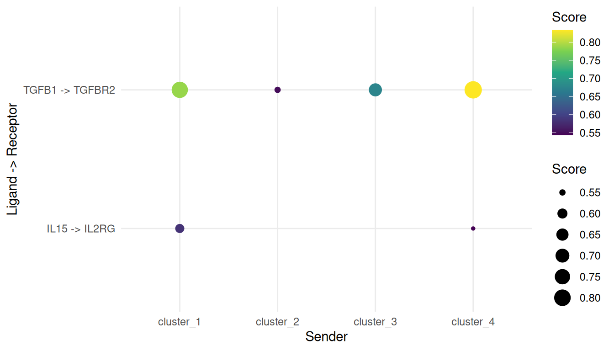

# Ligand-receptor analysis with bixverse

## Intro

This vignette runs two flavours of ligand-receptor analysis on the
PBMC3k data set. It assumes you know your way around the `SingleCells`
class and the basic processing pipeline. If not, have a look at the
[PBMC processing
vignette](https://gregorlueg.github.io/bixverse/articles/pbmc_single_cell.html)
first.

The two approaches answer different questions:

1.  [CellPhoneDB](https://www.nature.com/articles/s41596-024-01137-1)
    asks which ligand-receptor pairs are expressed between two cell
    types, more so than you’d expect by chance. It works off expression
    alone, handles multi-subunit receptor complexes and comes with a
    curated database of ~2,900 interactions.
2.  [NicheNet](https://pubmed.ncbi.nlm.nih.gov/31819264/) goes one step
    further and asks which ligands best explain a downstream
    transcriptional response in the receiver. That needs a signalling
    and a gene regulatory network on top.

Both share the processing and the marker genes, so we do that once.

``` r

library(bixverse)
library(data.table)
#> 
#> Attaching package: 'data.table'
#> The following object is masked from 'package:base':
#> 
#>     %notin%
library(ggplot2)
library(magrittr)
```

## Loading and processing PBMC3k

We reuse the standard processing pipeline. See the PBMC processing
vignette for commentary on each step.

``` r

pbmc3k_path <- download_pbmc3k()
tempdir_pbmc <- tempdir()

sc_object <- SingleCells(dir_data = tempdir_pbmc)
mtx_io_params <- get_cell_ranger_params(pbmc3k_path)

sc_object <- load_mtx(
  object = sc_object,
  sc_mtx_io_param = mtx_io_params,
  mtx_streaming = FALSE,
  .verbose = FALSE
)

setnames_sc(sc_object, table = "var", old = "column1", new = "gene_symbol")
var <- get_sc_var(sc_object)
symbol_to_ensembl <- setNames(var$gene_id, var$gene_symbol)
ensembl_to_symbol <- setNames(var$gene_symbol, var$gene_id)

# QC and processing
gs_of_interest <- list(
  MT = var[grepl("^MT-", gene_symbol), gene_id],
  Ribo = var[grepl("^RPS|^RPL", gene_symbol), gene_id]
)
sc_object <- gene_set_proportions_sc(
  sc_object,
  gs_of_interest,
  .verbose = FALSE
)

# minimal cell filtering
cells_to_keep <- sc_object[[]][MT < 0.2, cell_id]
sc_object <- set_cells_to_keep(sc_object, cells_to_keep)

sc_object <- find_hvg_sc(sc_object, hvg_no = 2000L, .verbose = FALSE)
sc_object <- calculate_pca_sc(sc_object, no_pcs = 30L, .verbose = FALSE)
sc_object <- find_neighbours_sc(sc_object, .verbose = FALSE)
sc_object <- find_clusters_sc(sc_object, res = 0.5)
```

For demonstration purposes we use the Leiden cluster IDs directly as
cell types. In a real analysis you’d annotate the clusters first (marker
genes, a canonical panel,
[`assign_sc_type()`](https://gregorlueg.github.io/bixverse/reference/assign_sc_type.md),
take your pick). Senders and receivers are biological concepts, and
“cluster_3 talks to cluster_0” doesn’t tell anyone much.

``` r

sc_object[["celltype"]] <- paste0(
  "cluster_",
  unlist(sc_object[["leiden_clustering"]])
)

celltype_counts <- sc_object[[]][!is.na(celltype), .N, by = celltype][order(-N)]

celltype_counts
#>     celltype     N
#>       <char> <int>
#> 1: cluster_0  1198
#> 2: cluster_1   486
#> 3: cluster_2   346
#> 4: cluster_3   286
#> 5: cluster_4   166
#> 6: cluster_5   165
#> 7: cluster_6    33
#> 8: cluster_7    14
#> 9: cluster_8     4
```

Both methods want per-cluster marker genes, so let’s get them out of the
way.
[`find_all_markers_sc()`](https://gregorlueg.github.io/bixverse/reference/find_all_markers_sc.md)
runs a one-vs-rest Wilcoxon test per cluster.

``` r

celltype_de <- find_all_markers_sc(
  object = sc_object,
  column_of_interest = "celltype",
  .verbose = FALSE
)

# rename to the schema the downstream functions expect
setnames(
  celltype_de,
  c("gene_id", "grp", "p_values"),
  c("gene", "cluster_id", "pval"),
  skip_absent = TRUE
)
```

## CellPhoneDB

### The database

[`get_cellphonedb_db()`](https://gregorlueg.github.io/bixverse/reference/get_cellphonedb_db.md)
pulls the CellPhoneDB v5 database and flattens it to one row per
interaction. Each partner comes with the gene symbols of its subunits:
one gene for a plain protein, several for a complex.

``` r

cpdb_db <- get_cellphonedb_db(dir = tempdir_pbmc, .verbose = FALSE)

cpdb_db[, .N, by = directionality]
#>       directionality     N
#>               <char> <int>
#> 1:   Ligand-Receptor  2508
#> 2: Receptor-Receptor    28
#> 3: Adhesion-Adhesion   242
#> 4:     Ligand-Ligand   123
#> 5:           Gap-Gap    10
```

A few receptors are complexes, e.g. the TGF-beta receptors:

``` r

cpdb_db[partner_a == "TGFB1", .(partner_a, partner_b, genes_b)]
#>    partner_a             partner_b       genes_b
#>       <char>                <char>        <list>
#> 1:     TGFB1     TGFbeta_receptor2  ACVR1,TGFBR2
#> 2:     TGFB1 integrin_aVb6_complex   ITGAV,ITGB6
#> 3:     TGFB1     TGFbeta_receptor1 TGFBR1,TGFBR2
#> 4:     TGFB1                TGFBR3        TGFBR3
```

Got your own curated list? Any `data.table` with `interaction_id`,
`partner_a`, `partner_b` and the list columns `genes_a` and `genes_b`
works.

### Statistical analysis

For every interaction and every ordered (sender, receiver) cluster pair,
partner a is measured in the sender and partner b in the receiver. The
interaction mean is the average of the two partner means, and a complex
takes the minimum over its subunits. Both partners need to be expressed
in more than 10% of their cluster’s cells (the gate). The p-value comes
from shuffling the cluster labels 1,000 times. The database speaks gene
symbols, so we point `gene_id_col` at the symbol column.

``` r

cpdb_res <- cellphonedb_sc(
  object = sc_object,
  celltype_colname = "celltype",
  lr_db = cpdb_db,
  gene_id_col = "gene_symbol",
  params = params_sc_cellphonedb(n_perm = 1000L)
)
#> Warning in cellphonedb_sc(object = sc_object, celltype_colname = "celltype", :
#> Dropping 2753 of 2911 interactions with subunits missing from `object`.

cpdb_sig <- cpdb_res[gate == TRUE & pval <= 0.05]

nrow(cpdb_sig)
#> [1] 525
```

That’s a lot of dropped interactions.
[`load_mtx()`](https://gregorlueg.github.io/bixverse/reference/load_mtx.md)
throws out genes seen in fewer than 10 cells, and much of CellPhoneDB
(neurotransmitter transporters, neuronal receptors, …) is simply not
expressed in blood:

``` r

cpdb_genes <- unique(unlist(c(cpdb_db$genes_a, cpdb_db$genes_b)))

c(
  in_database = length(cpdb_genes),
  in_object = sum(cpdb_genes %in% var$gene_symbol)
)
#> in_database   in_object 
#>        1354         392
```

An interaction needs every subunit of both partners, which leaves 158
interactions to test.

Which cluster pairs talk the most? Counting the significant interactions
per pair gives the classic CellPhoneDB heatmap.

``` r

pair_counts <- cpdb_sig[, .N, by = .(sender, receiver)]

ggplot(pair_counts, aes(x = receiver, y = sender, fill = N)) +
  geom_tile() +
  scale_fill_viridis_c() +
  theme_minimal() +
  theme(axis.text.x = element_text(angle = 45, hjust = 1)) +
  labs(
    x = "Receiver",
    y = "Sender",
    fill = "Significant\ninteractions"
  )
```


And the strongest interactions by mean:

``` r

head(
  cpdb_sig[order(-mean), .(sender, receiver, partner_a, partner_b, mean, pval)],
  10
)
#>        sender  receiver partner_a partner_b     mean  pval
#>        <char>    <char>    <char>    <char>    <num> <num>
#>  1: cluster_7 cluster_6       APP      CD74 2.942930     0
#>  2: cluster_7 cluster_2       APP      CD74 2.886648     0
#>  3: cluster_8 cluster_6       APP      CD74 2.683409     0
#>  4: cluster_6 cluster_6       APP      CD74 2.673170     0
#>  5: cluster_8 cluster_2       APP      CD74 2.627127     0
#>  6: cluster_6 cluster_2       APP      CD74 2.616888     0
#>  7: cluster_7 cluster_6       PF4     CXCR3 2.607065     0
#>  8: cluster_4 cluster_1      CD44    TYROBP 2.544029     0
#>  9: cluster_4 cluster_4      CD44    TYROBP 2.449054     0
#> 10: cluster_0 cluster_1      CD44    TYROBP 2.408698     0
```

Two things to keep in mind here. First, the permutation test asks for
specificity, not just expression. PPIA-BSG passes the expression gate in
81 of the 81 cluster pairs, but is significant in only 32 of them.
Second, the top of that list is dominated by clusters 6 to 8, which hold
33, 14, 4 cells. Means over a handful of cells are noisy, so treat hits
from tiny clusters with care.

### DEG-based analysis

The alternative is CellPhoneDB’s DEG-based method. No permutations here.
Instead, an interaction is kept for a pair if the expression gate passes
and partner a is a marker of the sender or partner b a marker of the
receiver. You decide what counts as a marker. Here we take genes with a
log fold change above 0.5 and FDR \<= 0.05, and convert them to symbols
to match the database.

``` r

deg_table <- celltype_de[lfc > 0.5 & fdr <= 0.05, .(cluster_id, gene)]
deg_table[, gene := ensembl_to_symbol[gene]]

cpdb_deg_res <- suppressWarnings(cellphonedb_sc(
  object = sc_object,
  celltype_colname = "celltype",
  lr_db = cpdb_db,
  method = "degs",
  deg_table = deg_table,
  gene_id_col = "gene_symbol"
))

cpdb_relevant <- cpdb_deg_res[gate == TRUE]

head(
  cpdb_relevant[order(-mean), .(sender, receiver, partner_a, partner_b, mean)],
  10
)
#>        sender  receiver partner_a partner_b     mean
#>        <char>    <char>    <char>    <char>    <num>
#>  1: cluster_7 cluster_6       APP      CD74 2.942930
#>  2: cluster_7 cluster_2       APP      CD74 2.886648
#>  3: cluster_8 cluster_6       APP      CD74 2.683409
#>  4: cluster_6 cluster_6       APP      CD74 2.673170
#>  5: cluster_8 cluster_2       APP      CD74 2.627127
#>  6: cluster_6 cluster_2       APP      CD74 2.616888
#>  7: cluster_7 cluster_6       PF4     CXCR3 2.607065
#>  8: cluster_4 cluster_1      CD44    TYROBP 2.544029
#>  9: cluster_4 cluster_4      CD44    TYROBP 2.449054
#> 10: cluster_0 cluster_1      CD44    TYROBP 2.408698
```

292 interaction and cluster pair combinations pass the DEG gate, and 257
of them are also significant in the permutation run. This is the route
to take if you’ve got a proper DE setup, e.g. pseudo-bulk across samples
(see the notes at the end). The cell type specificity then comes from
the DE test instead of from shuffling labels.

## NicheNet

NicheNet ranks upstream ligands by how well their predicted target genes
line up with a gene set of interest in a receiver cell type. The
pipeline:

1.  Build a ligand-target regulatory potential matrix from a signalling
    network (PPI) and a gene regulatory network (GRN).
2.  Define a gene set of interest in the receiver (here, its marker
    genes).
3.  Score each ligand by how well its targets overlap with that gene set
    (AUROC, AUPR, correlations).
4.  Combine ligand activity with sender/receiver expression and DE into
    a single prioritisation score.

### Building the networks

A production analysis would load the curated NicheNet networks
(signalling and GRN) from [Zenodo](https://zenodo.org/records/7074291).
To keep the vignette self-contained, we construct a small network
covering a handful of canonical immune signalling pathways. The shape of
the inputs is what matters here… and it means you can feed in your own
networks.

``` r

# Ligand-receptor pairs (canonical immune signalling)
lr_network <- data.table(
  # ligands
  from = c("CCL5", "CXCL10", "IL15", "TNF", "TGFB1", "IL10", "ICAM1"),
  # receptors
  to = c(
    "CCR5",
    "CXCR3",
    "IL2RG",
    "TNFRSF1A",
    "TGFBR2",
    "IL10RA",
    "ITGAL"
  ),
  weight = 1
)

# Signalling (PPI) layer: ligand -> receptor -> intracellular signalling -> TFs
ppi_network <- data.table(
  from = c(
    "CCL5",
    "CXCL10",
    "IL15",
    "TNF",
    "TGFB1",
    "IL10",
    "ICAM1",
    "CCR5",
    "CXCR3",
    "IL2RG",
    "TNFRSF1A",
    "TGFBR2",
    "IL10RA",
    "ITGAL",
    "JAK1",
    "JAK2",
    "JAK3",
    "STAT1",
    "STAT3",
    "STAT5A",
    "NFKB1",
    "SMAD2"
  ),
  to = c(
    "CCR5",
    "CXCR3",
    "IL2RG",
    "TNFRSF1A",
    "TGFBR2",
    "IL10RA",
    "ITGAL",
    "JAK1",
    "JAK1",
    "JAK3",
    "NFKB1",
    "SMAD2",
    "JAK1",
    "NFKB1",
    "STAT1",
    "STAT3",
    "STAT5A",
    "STAT3",
    "STAT1",
    "STAT3",
    "STAT3",
    "STAT3"
  ),
  weight = 1
)

# GRN layer: TF -> targets
grn_network <- data.table(
  from = c(
    rep("STAT1", 6),
    rep("STAT3", 6),
    rep("STAT5A", 4),
    rep("NFKB1", 6),
    rep("SMAD2", 4)
  ),
  to = c(
    "IRF1",
    "MX1",
    "ISG15",
    "OAS1",
    "GBP1",
    "CXCL10",
    "SOCS3",
    "IL6",
    "BCL2",
    "VEGFA",
    "MYC",
    "FOS",
    "CCND1",
    "BCL2L1",
    "IL2RA",
    "FOXP3",
    "TNF",
    "IL1B",
    "IL6",
    "NFKBIA",
    "CCL5",
    "ICAM1",
    "SERPINE1",
    "CDKN1A",
    "JUNB",
    "ID1"
  ),
  weight = 1
)
```

Map gene symbols to the Ensembl IDs used internally by `sc_object`,
dropping any genes not present in the data set.

``` r

symbol_to_id <- function(syms) {
  ids <- symbol_to_ensembl[syms]
  ids[!is.na(ids)]
}

# Restrict the networks to genes present in PBMC3k
keep_ppi <- ppi_network$from %in%
  names(symbol_to_ensembl) &
  ppi_network$to %in% names(symbol_to_ensembl)
keep_grn <- grn_network$from %in%
  names(symbol_to_ensembl) &
  grn_network$to %in% names(symbol_to_ensembl)
keep_lr <- lr_network$from %in%
  names(symbol_to_ensembl) &
  lr_network$to %in% names(symbol_to_ensembl)

ppi_network <- ppi_network[keep_ppi]
grn_network <- grn_network[keep_grn]
lr_network <- lr_network[keep_lr]
```

### Ligand-target regulatory potential

Construct the ligand-target influence matrix. Each row is one ligand and
each column is a gene from the union of both networks; entries are
NicheNet-style regulatory potential scores.

``` r

ligand_seeds <- setNames(
  lapply(lr_network$from, identity),
  lr_network$from
)

ligand_influence <- generate_ligand_target_influence(
  ligand_seeds = ligand_seeds,
  ppi_network = rbind(lr_network, ppi_network),
  grn_network = grn_network,
  # because of the tiny network, the original ltf_cutoff of 0.99 would be way
  # too aggressive
  params = params_ligand_target(ltf_cutoff = 0)
)

ligand_influence
#> LigandTargetInfluence
#>   No ligand seeds:    6
#>   No genes:           40
#>   Damping factor:     0.500
#>   Max iter:           1000
#>   Secondary targets:  FALSE
```

This returns a `LigandTargetInfluence` class. If you want to access the
actual scores, you can use:

``` r

get_influence(ligand_influence)
#>         CCL5     CXCL10 IL15   TNF TGFB1 ICAM1 CCR5 CXCR3 IL2RG TNFRSF1A TGFBR2
#> CCL5   0.000 0.08333333    0 0.000     0 0.000    0     0     0        0      0
#> CXCL10 0.000 0.08333333    0 0.000     0 0.000    0     0     0        0      0
#> IL15   0.000 0.02083333    0 0.000     0 0.000    0     0     0        0      0
#> TNF    0.125 0.04166667    0 0.125     0 0.125    0     0     0        0      0
#> TGFB1  0.000 0.04166667    0 0.000     0 0.000    0     0     0        0      0
#> ICAM1  0.125 0.04166667    0 0.125     0 0.125    0     0     0        0      0
#>        IL10RA ITGAL JAK1 JAK2 JAK3 STAT1 STAT3 STAT5A NFKB1 SMAD2       IRF1
#> CCL5        0     0    0    0    0     0     0      0     0     0 0.08333333
#> CXCL10      0     0    0    0    0     0     0      0     0     0 0.08333333
#> IL15        0     0    0    0    0     0     0      0     0     0 0.02083333
#> TNF         0     0    0    0    0     0     0      0     0     0 0.04166667
#> TGFB1       0     0    0    0    0     0     0      0     0     0 0.04166667
#> ICAM1       0     0    0    0    0     0     0      0     0     0 0.04166667
#>               MX1      ISG15       OAS1       GBP1      SOCS3        IL6
#> CCL5   0.08333333 0.08333333 0.08333333 0.08333333 0.04166667 0.04166667
#> CXCL10 0.08333333 0.08333333 0.08333333 0.08333333 0.04166667 0.04166667
#> IL15   0.02083333 0.02083333 0.02083333 0.02083333 0.04166667 0.04166667
#> TNF    0.04166667 0.04166667 0.04166667 0.04166667 0.08333333 0.20833333
#> TGFB1  0.04166667 0.04166667 0.04166667 0.04166667 0.08333333 0.08333333
#> ICAM1  0.04166667 0.04166667 0.04166667 0.04166667 0.08333333 0.20833333
#>              BCL2      VEGFA        MYC        FOS BCL2L1  IL2RA  FOXP3  IL1B
#> CCL5   0.04166667 0.04166667 0.04166667 0.04166667 0.0000 0.0000 0.0000 0.000
#> CXCL10 0.04166667 0.04166667 0.04166667 0.04166667 0.0000 0.0000 0.0000 0.000
#> IL15   0.04166667 0.04166667 0.04166667 0.04166667 0.0625 0.0625 0.0625 0.000
#> TNF    0.08333333 0.08333333 0.08333333 0.08333333 0.0000 0.0000 0.0000 0.125
#> TGFB1  0.08333333 0.08333333 0.08333333 0.08333333 0.0000 0.0000 0.0000 0.000
#> ICAM1  0.08333333 0.08333333 0.08333333 0.08333333 0.0000 0.0000 0.0000 0.125
#>        NFKBIA CDKN1A  JUNB   ID1
#> CCL5    0.000  0.000 0.000 0.000
#> CXCL10  0.000  0.000 0.000 0.000
#> IL15    0.000  0.000 0.000 0.000
#> TNF     0.125  0.000 0.000 0.000
#> TGFB1   0.000  0.125 0.125 0.125
#> ICAM1   0.125  0.000 0.000 0.000
```

### Defining the gene set of interest

In a case/control experiment, the gene set of interest would be the DEGs
between conditions in the receiver cell type. PBMC3k is a single
condition, so we use the receiver’s markers as a stand-in. We pick the
largest cluster as receiver and a few others as senders.

``` r

receiver_id <- celltype_counts[1, celltype]
senders_oi <- celltype_counts[2:min(5, .N), celltype]

# upregulated genes with FDR <= 0.05 form the gene set
geneset_oi <- celltype_de[
  cluster_id == receiver_id & lfc > 0 & fdr <= 0.05,
  gene
]
length(geneset_oi)
#> [1] 838
```

### Ligand activity scoring

Score each ligand by how well its target potential vector aligns with
`geneset_oi`. The background is the full set of genes in the influence
matrix.

``` r

activity <- ligand_activity_scores(
  ligand_influence = ligand_influence,
  # need to transform to gene symbols
  gene_sets = list(receiver_degs = ensembl_to_symbol[geneset_oi])
)

activity[order(-aupr_corrected)]
#>         gene_set ligand     auroc      aupr aupr_corrected      pearson
#>           <char> <char>     <num>     <num>          <num>        <num>
#> 1: receiver_degs  TGFB1 0.6594982 0.3956790    0.170679012  0.299473381
#> 2: receiver_degs   IL15 0.5663082 0.2353395    0.010339506  0.117053047
#> 3: receiver_degs   CCL5 0.5501792 0.2291667    0.004166667 -0.004045534
#> 4: receiver_degs CXCL10 0.5501792 0.2291667    0.004166667 -0.004045534
#> 5: receiver_degs    TNF 0.5125448 0.2086676   -0.016332442 -0.004747876
#> 6: receiver_degs  ICAM1 0.5125448 0.2086676   -0.016332442 -0.004747876
#>      spearman
#>         <num>
#> 1: 0.26664795
#> 2: 0.11085364
#> 3: 0.09001531
#> 4: 0.09001531
#> 5: 0.02025577
#> 6: 0.02025577
```

### Sender and receiver tables

Prioritisation needs the DE of ligands across senders and of receptors
in the receiver (we’ve got that from the markers), plus the average
expression of ligands and receptors per cluster. The latter calls into
the streaming engine via
[`compute_expression_info_sc()`](https://gregorlueg.github.io/bixverse/reference/compute_expression_info_sc.md).

``` r

genes_of_interest <- union(lr_network$to, lr_network$from)
genes_of_interest_ids <- symbol_to_id(genes_of_interest)

expression_info <- compute_expression_info_sc(
  object = sc_object,
  celltype_colname = "celltype",
  genes = genes_of_interest_ids
)
```

### Prioritisation

Combine all of the above into a single weighted score. PBMC3k has no
condition contrast, so we use the `"one_condition"` scenario, which sets
the condition-specificity weights to zero.

``` r

# Reduce activity table to one row per ligand (we ran one gene set)
la_input <- activity[, .(ligand, aupr_corrected)]
la_input[, ligand := symbol_to_ensembl[ligand]]

lr_network_ensembl <- data.table(
  ligand = symbol_to_ensembl[lr_network$from],
  receptor = symbol_to_ensembl[lr_network$to]
) %>%
  na.omit()

result <- prioritise_interactions(
  celltype_de = celltype_de[, .(cluster_id, gene, lfc, pval)],
  expression_info = expression_info,
  ligand_activities = na.omit(la_input),
  lr_network = lr_network_ensembl,
  senders_oi = senders_oi,
  receivers_oi = receiver_id,
  scenario = "one_condition"
)
```

Add symbol columns for readability.

``` r

result[, ligand_symbol := ensembl_to_symbol[ligand]]
result[, receptor_symbol := ensembl_to_symbol[receptor]]

head(
  result[, .(
    sender,
    receiver,
    ligand_symbol,
    receptor_symbol,
    prioritisation_score,
    prioritisation_rank
  )],
  10
)
#>       sender  receiver ligand_symbol receptor_symbol prioritisation_score
#>       <char>    <char>        <char>          <char>                <num>
#> 1: cluster_4 cluster_0         TGFB1          TGFBR2            0.8333333
#> 2: cluster_1 cluster_0         TGFB1          TGFBR2            0.7864823
#> 3: cluster_3 cluster_0         TGFB1          TGFBR2            0.6756293
#> 4: cluster_1 cluster_0          IL15           IL2RG            0.5830033
#> 5: cluster_2 cluster_0         TGFB1          TGFBR2            0.5500000
#> 6: cluster_4 cluster_0          IL15           IL2RG            0.5434125
#>    prioritisation_rank
#>                  <int>
#> 1:                   1
#> 2:                   2
#> 3:                   3
#> 4:                   4
#> 5:                   5
#> 6:                   6
```

### Top interactions

A quick dotplot of the top prioritised interactions.

``` r

top_n <- 15L

plot_dt <- head(result, top_n)[, `:=`(
  interaction = paste(ligand_symbol, "->", receptor_symbol)
)]

ggplot(
  plot_dt,
  aes(
    x = sender,
    y = interaction,
    size = prioritisation_score,
    colour = prioritisation_score
  )
) +
  geom_point() +
  scale_colour_viridis_c() +
  theme_minimal() +
  labs(
    x = "Sender",
    y = "Ligand -> Receptor",
    size = "Score",
    colour = "Score"
  )
```



## Notes on DE methods

[`find_all_markers_sc()`](https://gregorlueg.github.io/bixverse/reference/find_all_markers_sc.md)
runs a Wilcoxon test, which is convenient but inflates p-values in
single cell data: each cell is treated as an independent observation.
For inference that matters, go pseudo-bulk with `DESeq2` or `edgeR`:

1.  Aggregate counts per (sample, cluster) into pseudo-bulk.
2.  Run a standard bulk DE pipeline.
3.  Feed the result into `cellphonedb_sc(method = "degs")` as a
    `cluster_id`, `gene` table, or into
    [`prioritise_interactions()`](https://gregorlueg.github.io/bixverse/reference/prioritise_interactions.md)
    after renaming the columns to `cluster_id`, `gene`, `lfc`, `pval`.

Neither function cares which method produced the DE table.

## Clean up

``` r

unlink(tempdir_pbmc, recursive = TRUE, force = TRUE)
```
