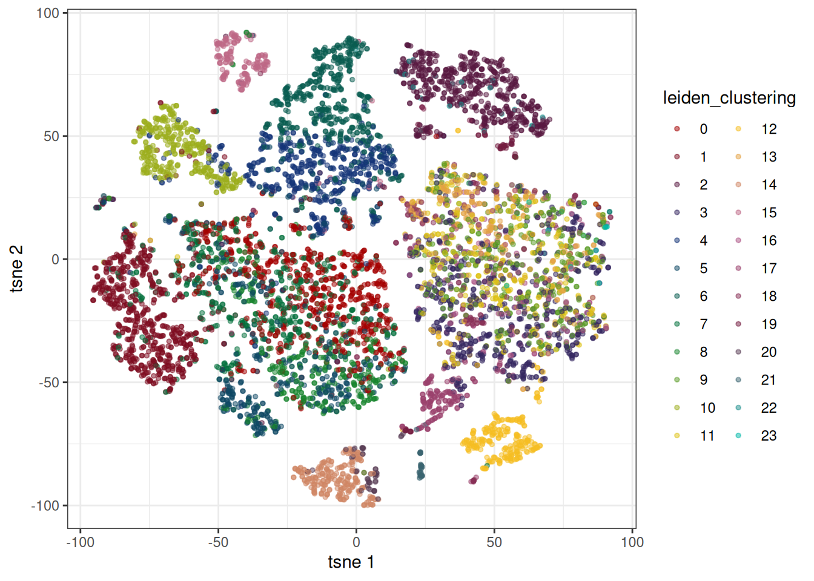
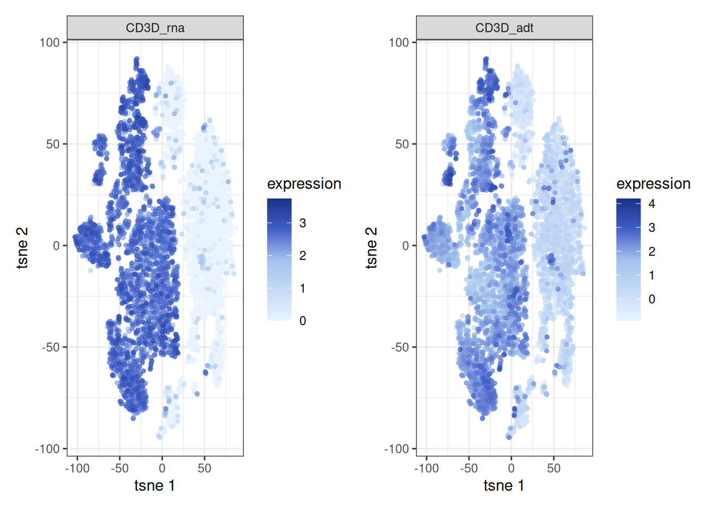

# Multi-modal single cell analysis with bixverse

## Intro

This vignette walks through a multi-modal single cell workflow on a
CITE-seq data set (10x’s 10k Human PBMC TotalSeq-B). The general
`bixverse` philosophy — do not keep things in memory if you do not have
to, keep heavy lifting in Rust, only round-trip to R when the user
actually needs to look at something — still applies. The bit that
changes is that there is now a second modality hanging off the main
class: Antibody-Derived Tags (ADT). ATAC is on the roadmap but not yet
wired up.

Before going further, please read the [design
choices](https://gregorlueg.github.io/bixverse/articles/design_single_cell.html)
and the [introductory
vignette](https://gregorlueg.github.io/bixverse/articles/thinking_single_cell.html)
if you have not already. This vignette assumes you are comfortable with
the `SingleCells` class, the on-disk count storage, and the
cells-to-keep logic.

``` r

library(bixverse)
library(bixverse.plots)
library(patchwork)
library(ggplot2)
library(data.table)
#> 
#> Attaching package: 'data.table'
#> The following object is masked from 'package:base':
#> 
#>     %notin%
```

## Loading the data

A 10x Cell Ranger H5 with multiple feature types contains both the RNA
and the ADT counts in one file, separated by `feature_type`. We peek at
the metadata first to confirm what is in there before committing to
anything.

``` r

# NEEDS UPDATE
h5_10x_path <- download_pbmc_totalseq_data()

tempdir_10x_total_seq <- tempdir()
```

### EDA

``` r

h5_metadata <- read_tenx_h5_metadata(h5_10x_path)

h5_metadata$feature_types
#> Antibody Capture  Gene Expression 
#>              140            18082
```

Two feature types: gene expression and antibody capture. Good, we have
both modalities to play with.

### Loading in the RNA

The RNA goes through `SingleCellsMultiModal`, which is essentially the
same class as `SingleCells` with extra slots for `adt_counts` (and,
later, an `atac` connection). RNA loading and storage are identical to
the single-modal case: counts get pre-filtered, normalised, transposed,
and written to the two binary files on disk.

``` r

sc_object <- SingleCellsMultiModal(dir_data = tempdir_10x_total_seq)

sc_object <- load_tenx_h5(object = sc_object, h5_path = h5_10x_path)
#>  Using light streaming for the CSR to CSC conversion.
#> Loading barcodes from 10x h5 into the DuckDB.
#> Loading features from 10x h5 into the DuckDB.

head(sc_object)
#>    cell_idx            cell_id   nnz lib_size to_keep
#>       <int>             <char> <num>    <num>  <lgcl>
#> 1:        1 AAACAAGCACCATACT-1  2499     4486    TRUE
#> 2:        2 AAACAAGCACGTAATG-1  2759     4902    TRUE
#> 3:        3 AAACAAGCATGCAATG-1  3512     7639    TRUE
#> 4:        4 AAACAAGCATTTGGGA-1  2973     5446    TRUE
#> 5:        5 AAACCAATCAAGTTTC-1  4419    13000    TRUE
#> 6:        6 AAACCAATCAGGGATT-1  3765     8270    TRUE
```

### Loading in the ADT counts

The ADT design philosophy differs from RNA. Protein panels are tiny:
dozens of antibodies, sometimes a couple of hundred for the larger
commercial panels. The cost-benefit calculus that justifies the on-disk
binary format for RNA just does not hold here. Even a million cells
times 200 proteins fits in memory without breaking a sweat. So the whole
`ADTCounts` object — raw counts, normalised counts, a bit of metadata —
lives in memory as a plain matrix. The saving is in code complexity
rather than RAM.

For normalisation, you currently have two options:

- **CLR** (centred log-ratio): the Seurat default. Comes in two flavours
  via `seurat_clr`: the original CLR (allows negatives) and the modified
  Seurat-style version (does not).
- **DSB** (denoised and scaled by background): from [Mulè et al.,
  2022](https://www.nature.com/articles/s41467-022-29356-8). More
  principled if you have empty droplets to estimate the protein
  background; falls back to a 2-component k-means on log counts if you
  do not (the “ModelNegativeADTnorm” path).

Isotype controls help DSB tease apart per-cell technical noise from true
biological signal.
[`detect_adt_isotypes()`](https://gregorlueg.github.io/bixverse/reference/detect_adt_isotypes.md)
regexes the obvious patterns (`IgG.*`, `Ig.*ctrl`, etc.) and is fine for
standard TotalSeq panels; for anything unusual just pass the column
names directly via `isotype_names`.

``` r

adt_counts <- read_tenx_h5_adt(f_path = h5_10x_path)

iso <- detect_adt_isotypes(colnames(adt_counts))

sc_object <- add_adt_counts_sc(
  object = sc_object,
  adt_counts = adt_counts,
  method = "dsb",
  dsb_params = params_sc_dsb(
    use_isotype_controls = TRUE,
    quantile_low = 0.01,
    quantile_high = 1.0
  ),
  isotype_names = iso
)
```

## QC

### Low quality cells

QC runs jointly across modalities. The RNA loader already populated
`lib_size` and `nnz` on the obs table;
[`add_adt_counts_sc()`](https://gregorlueg.github.io/bixverse/reference/add_adt_counts_sc.md)
added `adt_lib_size` and `adt_nnz` on top. We feed all four into
MAD-based outlier detection. Two-sided is sensible across the board —
extremely high ADT library size can also flag doublets or aggregates,
not just dead cells.

``` r

qc_df <- sc_object[[c(
  "cell_id",
  "lib_size",
  "nnz",
  "adt_lib_size",
  "adt_nnz"
)]]
metrics <- list(
  log10_rna_lib_size = log10(qc_df$lib_size),
  log10_rna_nnz = log10(qc_df$nnz),
  log10_adt_lib_size = log10(qc_df$adt_lib_size),
  log10_adt_nnz = log10(qc_df$adt_nnz)
)

directions <- c(
  log10_rna_lib_size = "twosided",
  log10_rna_nnz = "twosided",
  log10_adt_lib_size = "twosided",
  log10_adt_nnz = "twosided"
)

qc <- run_cell_qc(
  metrics = metrics,
  cells_to_keep = get_cells_to_keep(sc_object),
  directions = directions,
  threshold = 3
)

qc_obs <- get_data(qc)

plots <- violin_plot_sc(qc)

plots$log10_rna_lib_size + plots$log10_adt_lib_size
```


``` r

sc_object[["outlier"]] <- qc$combined

cells_to_keep <- qc_df[!qc$combined, cell_id]

sc_object <- set_cells_to_keep(sc_object, cells_to_keep)
```

## Standard workflows

For the initial steps, the two modalities are treated independently.
Each gets its own dimensionality reduction, kNN graph, and embeddings.
The `modality` argument routes to the relevant Rust kernel and stores
results in the right cache slot: `sc_cache` for RNA, `adt_cache` for
ADT. Cross-modal integration comes later, in the WNN section.

### RNA

Standard recipe: HVGs, PCA, neighbours, Leiden, tSNE.

``` r

sc_object <- find_hvg_sc(
  object = sc_object,
  hvg_no = 2000L
)

sc_object <- calculate_pca_sc(
  object = sc_object,
  no_pcs = 30L
)
#> Using dense SVD solving on scaled data on 2000 HVG.

# the data is so tiny that exhaustive kNN search is faster than building
# an approximate nearest neighbour index
sc_object <- find_neighbours_sc(
  object = sc_object,
  no_embd_to_use = 16L,
  neighbours_params = params_sc_neighbours(
    knn = list(knn_method = "exhaustive")
  )
)
#> 
#> Generating sNN graph (full: TRUE).
#> Transforming sNN data to igraph.
```

``` r

sc_object <- find_clusters_sc(sc_object)

head(sc_object)
#>    cell_idx            cell_id   nnz lib_size to_keep adt_nnz adt_lib_size
#>       <int>             <char> <num>    <num>  <lgcl>   <num>        <num>
#> 1:        1 AAACAAGCACCATACT-1  2499     4486    TRUE     115         3007
#> 2:        2 AAACAAGCACGTAATG-1  2759     4902    TRUE     101         1794
#> 3:        3 AAACAAGCATGCAATG-1  3512     7639    TRUE     125         6316
#> 4:        4 AAACAAGCATTTGGGA-1  2973     5446    TRUE     119         3118
#> 5:        5 AAACCAATCAAGTTTC-1  4419    13000    TRUE     136        12419
#> 6:        6 AAACCAATCAGGGATT-1  3765     8270    TRUE     128         4936
#>    outlier leiden_clustering
#>     <lgcl>             <int>
#> 1:   FALSE                 0
#> 2:   FALSE                 4
#> 3:   FALSE                 0
#> 4:   FALSE                 7
#> 5:   FALSE                11
#> 6:   FALSE                 0
```

``` r

sc_object <- tsne_sc(
  sc_object,
  modality = "rna"
)
#> Running t-SNE.
```

``` r

embedding_plot_sc(
  sc_object,
  embedding = "tsne",
  colour_by = "leiden_clustering",
  discrete = TRUE,
  point_size = 0.5
)
```


### ADT

For ADT we skip HVG selection — there is nothing to select from in a
panel of thirty-odd antibodies — and feed the panel directly into PCA,
minus the isotype controls (they only add background noise). Otherwise
the recipe is the same as for RNA, with `modality = "adt"` doing the
routing.

``` r

sc_object <- calculate_pca_adt_sc(
  object = sc_object,
  no_pcs = 15L,
  features = remove_adt_isotypes(get_adt_names(sc_object))
)

# the data is so tiny that exhaustive kNN search is faster than building
# an approximate nearest neighbour index
sc_object <- find_neighbours_sc(
  object = sc_object,
  neighbours_params = params_sc_neighbours(
    knn = list(knn_method = "exhaustive")
  ),
  modality = "adt"
)
#> 
#> Generating sNN graph (full: TRUE).
#> Transforming sNN data to igraph.
```

``` r

sc_object <- tsne_sc(
  sc_object,
  modality = "adt"
)
#> Running t-SNE.

feature_plot_sc(
  sc_object,
  features = "CD3D",
  embedding = "tsne",
  expr_modality = "adt",
  embd_modality = "adt",
  point_size = 1
) +
  theme_bx()
```


## Plotting

`bixverse.plots` has a few helpers tuned to multi-modal data. The main
mechanism is that the plotting functions take an `expr_modality` (where
the values come from) and an `embd_modality` (which embedding to overlay
them on) separately. That split is what lets you colour an ADT-derived
UMAP by RNA expression, or any other combination.

### Features against each other

The classic CITE-seq sanity check: does the protein signal match the
mRNA signal where you would expect it to?
[`feature_scatter_plot_sc()`](https://gregorlueg.github.io/bixverse.plots/reference/feature_scatter_plot_sc.html)
takes two features with optional `_rna` / `_adt` suffixes, so you can
mix modalities freely. mRNA tends to be sparse and noisy; ADT tends to
be smoother but with more background. A scatter against each other
surfaces both effects in one picture.

``` r

feature_scatter_plot_sc(
  object = sc_object,
  feature_1 = "ENSG00000167286_rna",
  feature_2 = "CD3D_adt"
) +
  theme_bx() +
  xlab("CD3D mRNA") +
  ylab("CD3D ADT")
```


``` r

feature_scatter_plot_sc(
  object = sc_object,
  feature_1 = "ENSG00000177455_rna",
  feature_2 = "CD19_adt"
) +
  theme_bx() +
  xlab("CD19 mRNA") +
  ylab("CD19 ADT")
```


### Embeddings

Same idea on the embedding side. The cell below paints RNA expression of
CD3D onto an ADT-derived tSNE. `feature_labels` is the cleanest way to
render a human-readable label without renaming columns upstream.

``` r

feature_plot_sc(
  sc_object,
  features = "ENSG00000167286",
  feature_labels = c(ENSG00000167286 = "CD3D_rna"),
  embedding = "tsne",
  expr_modality = "rna",
  embd_modality = "adt",
  point_size = 1
) +
  theme_bx()
```


For the reverse — ADT expression on the same ADT embedding — features
just go by their panel name:

``` r

feature_plot_sc(
  sc_object,
  features = "CD19",
  embedding = "tsne",
  expr_modality = "adt",
  embd_modality = "adt",
  point_size = 1
)
```


[`embedding_plot_sc()`](https://gregorlueg.github.io/bixverse.plots/reference/embedding_plot_sc.html)
accepts the same `embd_modality` argument when you want to overlay obs
columns (clusters, donor IDs, cell type calls) on a particular
modality’s embedding:

``` r

embedding_plot_sc(
  object = sc_object,
  embedding = "tsne",
  embd_modality = "adt",
  colour_by = "leiden_clustering",
  discrete = TRUE,
  point_size = 1
)
```



## WNN

So far we have looked at each modality in isolation. For a single
cell-type assignment that uses both, you want a joint representation.
The current implementation in `bixverse` is Weighted Nearest Neighbours
(WNN) from [Hao et al.,
2021](https://www.cell.com/cell/fulltext/S0092-8674(21)00583-3), the
same method Seurat v4 introduced.

The intuition is that different modalities carry different information
for different cells. For something like monocyte versus B cell, the RNA
signal is very strong. For CD4 versus CD8 T cell subsets, the protein
signal is much cleaner — the mRNAs are barely differential at that
resolution. WNN formalises this: for each cell, it asks how well that
cell’s neighbours in one modality predict its profile in the *other*
modality, and uses the answer to weight the two modalities per cell. The
weighted neighbours are then merged into a single joint graph.

The whole thing runs in Rust — per-cell weights, neighbour selection,
graph merging — so it scales to hundreds of thousands of cells
comfortably. The resulting graph lands under `other_data$wnn` and can be
embedded just like any other modality.

``` r

sc_object <- generate_wnn_graph_sc(
  sc_object,
  wnn_params = params_sc_wnn(sd_scale = 1)
)
#> Running WNN graph generation.
#> Generating sNN graph (full: TRUE) from WNN graph.
#> Transforming sNN data to igraph.
```

``` r

sc_object <- tsne_sc(
  sc_object,
  modality = "wnn"
)
#> Running t-SNE.
#> Using provided kNN graph.
```

A nice sanity check is to look at the same marker from both modalities,
projected onto the WNN embedding. If WNN is doing its job, the two
pictures should largely agree — even though they come from completely
independent measurements.

``` r

p1 <- feature_plot_sc(
  sc_object,
  features = "ENSG00000167286",
  feature_labels = c(ENSG00000167286 = "CD3D_rna"),
  embedding = "tsne",
  expr_modality = "rna",
  embd_modality = "wnn",
  point_size = 1
)

p2 <- feature_plot_sc(
  sc_object,
  features = "CD3D",
  feature_labels = c(CD3D = "CD3D_adt"),
  embedding = "tsne",
  expr_modality = "adt",
  embd_modality = "wnn",
  point_size = 1
)

p1 + p2
```



From here, the rest of the pipeline (clustering, marker detection, cell
type annotation) works exactly as in the standard vignette — just point
the relevant functions at the WNN graph instead of the RNA one.
