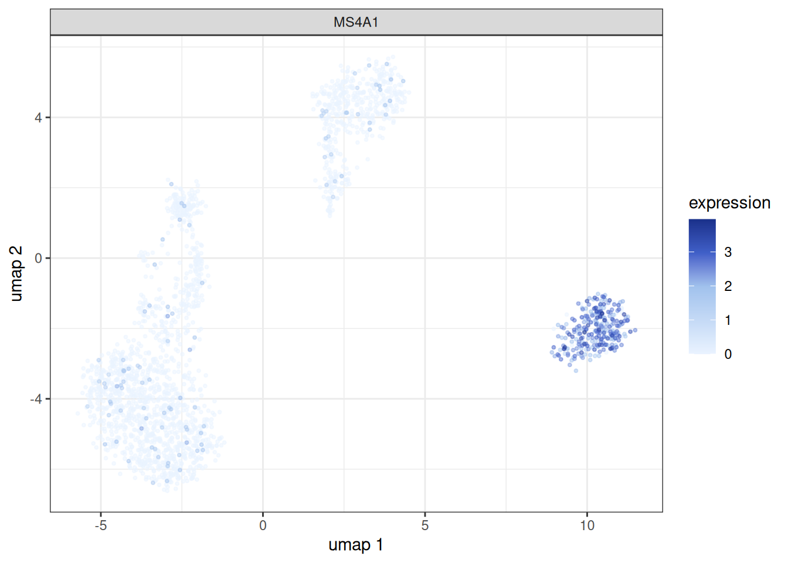
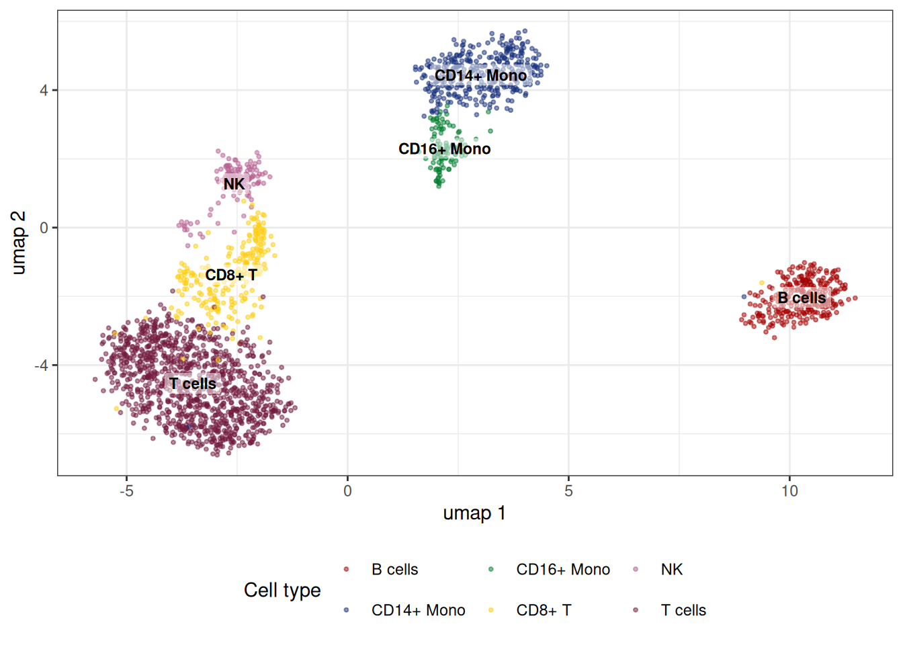
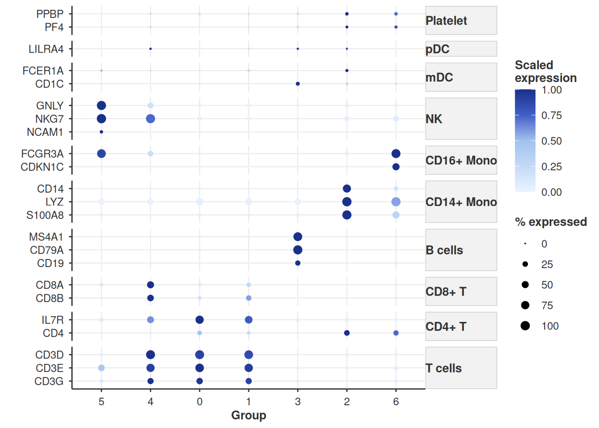

# Analysing PBMCs with bixverse

## Intro

This vignette walks through a standard single cell analysis on the
PBMC3k data set using `bixverse`. If you have not read the [design
choices](https://gregorlueg.github.io/bixverse/articles/design_single_cell.html)
and the [introductory
vignette](https://gregorlueg.github.io/bixverse/articles/thinking_single_cell.html),
please do so first; this vignette assumes familiarity with how the
`SingleCells` class, on-disk storage and cells-to-keep logic work.

``` r

library(bixverse)
library(ggplot2)
library(data.table)
#> 
#> Attaching package: 'data.table'
#> The following object is masked from 'package:base':
#> 
#>     %notin%
library(bixverse.plots)
library(magrittr)
```

## Loading the data

We start by downloading the PBMC3k data set bundled with the package and
loading it via Cell Ranger-style MTX I/O.

``` r

pbmc3k_path <- download_pbmc3k()

tempdir_pbmc <- tempdir()

sc_object <- SingleCells(dir_data = tempdir_pbmc)

mtx_io_params <- get_cell_ranger_params(pbmc3k_path)

sc_object <- load_mtx(
  object = sc_object,
  sc_mtx_io_param = mtx_io_params,
  mtx_streaming = FALSE,
  .verbose = TRUE
)
#>  Using light streaming for the CSR to CSC conversion.
#> Loading observations data from flat file into the DuckDB.
#> Loading variable data from flat file into the DuckDB.

sc_object
#> Single cell experiment (Single Cells).
#>   No cells (original): 2700
#>    To keep n: 2700
#>   No genes: 11139
#>   HVG calculated: FALSE
#>   PCA calculated: FALSE
#>   Other embeddings: none
#>   KNN generated: FALSE
#>   SNN generated: FALSE
```

Let’s have a quick look at the variable table. The column names from the
MTX files are not always informative, so we rename the gene symbol
column to something sensible and set up mappings between Ensembl IDs and
symbols.

``` r

var <- get_sc_var(sc_object)

head(var)
#>    gene_idx         gene_id   column1 no_cells_exp
#>       <num>          <char>    <char>        <int>
#> 1:        1 ENSG00000225880 LINC00115           18
#> 2:        2 ENSG00000188976     NOC2L          258
#> 3:        3 ENSG00000188290      HES4          145
#> 4:        4 ENSG00000187608     ISG15         1206
#> 5:        5 ENSG00000131591  C1orf159           24
#> 6:        6 ENSG00000186891  TNFRSF18           92

setnames_sc(
  object = sc_object,
  table = "var",
  old = "column1",
  new = "gene_symbol"
)

var <- get_sc_var(sc_object)

ensembl_to_symbol <- setNames(var$gene_symbol, var$gene_id)
symbol_to_ensembl <- setNames(var$gene_id, var$gene_symbol)
```

## Quality control

### Gene set proportions

A typical first step is computing the proportion of counts mapping to
mitochondrial and ribosomal genes per cell. These are added directly to
the obs table in the DuckDB.

``` r

gs_of_interest <- list(
  MT = var[grepl("^MT-", gene_symbol), gene_id],
  Ribo = var[grepl("^RPS|^RPL", gene_symbol), gene_id]
)

sc_object <- gene_set_proportions_sc(
  sc_object,
  gs_of_interest,
  streaming = FALSE,
  .verbose = TRUE
)

head(sc_object)
#>    cell_idx          cell_id   nnz lib_size to_keep          MT      Ribo
#>       <num>           <char> <num>    <num>  <lgcl>       <num>     <num>
#> 1:        1 AAACATACAACCAC-1   778     2418    TRUE 0.030190241 0.4371381
#> 2:        2 AAACATTGAGCTAC-1  1346     4896    TRUE 0.037990198 0.4246323
#> 3:        3 AAACATTGATCAGC-1  1126     3144    TRUE 0.008905852 0.3171120
#> 4:        4 AAACCGTGCTTCCG-1   953     2632    TRUE 0.017477203 0.2431611
#> 5:        5 AAACCGTGTATGCG-1   520      979    TRUE 0.012257406 0.1491318
#> 6:        6 AAACGCACTGGTAC-1   779     2154    TRUE 0.016713092 0.3635097
```

As we can see we now have MT and Ribo as columns in the obs table.

### MAD outlier detection

We use per-cell QC metrics and MAD-based outlier detection to flag
problematic cells. The `run_cell_qc` function returns a `CellQc` object
that carries the metrics, per-metric outlier calls and a combined
outlier vector.

``` r

qc_df <- sc_object[[c("cell_id", "lib_size", "nnz", "MT")]]

metrics <- list(
  log10_lib_size = log10(qc_df$lib_size),
  log10_nnz = log10(qc_df$nnz),
  MT = qc_df$MT
)

directions <- c(
  log10_lib_size = "twosided",
  log10_nnz = "twosided",
  MT = "above"
)

qc <- run_cell_qc(
  metrics = metrics,
  cells_to_keep = get_cells_to_keep(sc_object),
  directions = directions,
  threshold = 3
)

qc
#> CellQc: 2700 cells, 537 outliers (19.9%)
#> Metrics:
#>   - log10_lib_size: 336 outliers
#>     lower = 3.05, upper = 3.64
#>   - log10_nnz: 383 outliers
#>     lower = 2.70, upper = 3.12
#>   - MT: 201 outliers
#>     upper = 0.04
```

The `CellQc` class has a few associated plotting functions using the
output of `run_cell_qc` and the specified metrics as input

- `violin_plot_sc` method that produces violin plots with outliers
  highlighted.

``` r

plots <- violin_plot_sc(qc)

plots$log10_lib_size + plots$log10_nnz + plots$MT
```


- `joint_plot_sc` method that compares the genes versus UMIs per cell.

``` r

joint_plot_sc(qc)
```


### Filtering cells

We store the outlier flag in the obs table and then set the cells to
keep. From this point on, all downstream methods (HVG selection, PCA,
etc.) will only operate on the retained cells.

``` r

sc_object[["outlier"]] <- qc$combined

cells_to_keep <- qc_df[!qc$combined, cell_id]

sc_object <- set_cells_to_keep(sc_object, cells_to_keep)

sc_object
#> Single cell experiment (Single Cells).
#>   No cells (original): 2700
#>    To keep n: 2163
#>   No genes: 11139
#>   HVG calculated: FALSE
#>   PCA calculated: FALSE
#>   Other embeddings: none
#>   KNN generated: FALSE
#>   SNN generated: FALSE
```

## Feature selection, PCA and neighbours

With QC done, we move through the standard pipeline: highly variable
gene selection, PCA, and nearest neighbour computation.

``` r

sc_object <- find_hvg_sc(
  object = sc_object,
  hvg_no = 2000L,
  .verbose = TRUE
)

sc_object <- calculate_pca_sc(
  object = sc_object,
  no_pcs = 30L,
  sparse_svd = TRUE
)
#> Using sparse SVD solving on scaled data on 2000 HVG.

# the data is so tiny that exhaustive kNN search is faster than building
# an approximate nearest neighbour index
sc_object <- find_neighbours_sc(
  object = sc_object,
  neighbours_params = params_sc_neighbours(
    knn = list(knn_method = "exhaustive")
  )
)
#> 
#> Generating sNN graph (full: TRUE).
#> Transforming sNN data to igraph.
```

## Clustering and marker detection

### Leiden clustering

Leiden clustering followed by differential gene expression across all
clusters. You can also run Louvain if you want, but Leiden is thought of
to have better properties, see [Traag, et
al.](https://www.nature.com/articles/s41598-019-41695-z).

``` r

sc_object <- find_clusters_sc(sc_object, res = 1, name = "leiden_clusters")

all_markers <- find_all_markers_sc(
  object = sc_object,
  column_of_interest = "leiden_clusters"
)
#> Processing group 1 out of 7.
#> Processing group 2 out of 7.
#> Processing group 3 out of 7.
#> Processing group 4 out of 7.
#> Processing group 5 out of 7.
#> Processing group 6 out of 7.
#> Processing group 7 out of 7.

all_markers[, gene_symbol := ensembl_to_symbol[gene_id]]

head(all_markers[fdr <= 0.05][order(-abs(lfc))])
#>      grp         gene_id      lfc     prop1     prop2 z_scores      p_values
#>    <int>          <char>    <num>     <num>     <num>    <num>         <num>
#> 1:     2 ENSG00000163220 4.155627 0.9831461 0.2014388 28.94462 1.639847e-184
#> 2:     5 ENSG00000115523 4.124791 0.9710145 0.1308642 18.84557  1.597530e-79
#> 3:     5 ENSG00000105374 4.088584 1.0000000 0.2464198 19.09652  1.349314e-81
#> 4:     2 ENSG00000090382 4.060530 0.9971910 0.5107914 29.53159 5.660450e-192
#> 5:     2 ENSG00000143546 3.646430 0.9691011 0.1151079 28.54947 1.425784e-179
#> 6:     2 ENSG00000101439 3.415613 0.9943820 0.2385169 28.15655 9.960795e-175
#>              fdr gene_symbol
#>            <num>      <char>
#> 1: 3.718354e-181      S100A9
#> 2:  3.701476e-76        GNLY
#> 3:  6.252719e-78        NKG7
#> 4: 2.567014e-188         LYZ
#> 5: 2.155310e-176      S100A8
#> 6: 1.129305e-171        CST3
```

### Fast clustering

In the case of large data sets there is an option to run an accelerated
form of clustering. This runs first k-means clustering (with default
`sqrt(N)` cells), then kNN on the centroids, followed by Louvain (Leiden
is not yet supported, but on the to-do list) across a set of
resolutions. There is also an option to run this across several seeds to
check for stability of the clustering. If you ran the grid search, the
membership

``` r

fast_cluster_res <- fast_cluster_sc(
  object = sc_object,
  resolutions = c(5, 3, 2, 1.5, 1, 0.5),
  # also return the k-mean clustering
  return_kmeans = TRUE,
  no_seeds = 25L,
  grid_search = TRUE
)

fast_clusted_dt <- get_data(fast_cluster_res)

head(fast_clusted_dt)
#>    cell_idx res_5 res_3 res_2 res_1.5 res_1 res_0.5
#>       <int> <int> <int> <int>   <int> <int>   <int>
#> 1:        1     8     2     2       2     0       0
#> 2:        3    14     2     2       2     0       0
#> 3:        4     2     1     1       1     2       2
#> 4:        6     8     2     2       2     0       0
#> 5:        8    11     2     2       2     0       0
#> 6:        9    11     2     2       2     0       0
```

If you want to explore the k-means memberships or centroids, there are
getters for this.

``` r

centroids <- get_centroids(fast_cluster_res)

kmeans_membership <- get_kmeans_clusters(fast_cluster_res)
```

You can add the data to the object via:

``` r

sc_object <- add_sc_new_obs(
  object = sc_object,
  obs_data = get_data(fast_cluster_res)
)

head(sc_object)
#>    cell_idx          cell_id   nnz lib_size to_keep          MT      Ribo
#>       <num>           <char> <num>    <num>  <lgcl>       <num>     <num>
#> 1:        1 AAACATACAACCAC-1   778     2418    TRUE 0.030190241 0.4371381
#> 2:        3 AAACATTGATCAGC-1  1126     3144    TRUE 0.008905852 0.3171120
#> 3:        4 AAACCGTGCTTCCG-1   953     2632    TRUE 0.017477203 0.2431611
#> 4:        6 AAACGCACTGGTAC-1   779     2154    TRUE 0.016713092 0.3635097
#>    outlier leiden_clusters res_5 res_3 res_2 res_1.5 res_1 res_0.5
#>     <lgcl>           <int> <int> <int> <int>   <int> <int>   <int>
#> 1:   FALSE               0     8     2     2       2     0       0
#> 2:   FALSE               0    14     2     2       2     0       0
#> 3:   FALSE               6     2     1     1       1     2       2
#> 4:   FALSE               0     8     2     2       2     0       0
```

### Dimensionality reduction

Let us run quickly UMAP and tSNE.

``` r

sc_object <- umap_sc(sc_object)
#> Running UMAP.
#> Using n_epochs = 500 (dataset <10k samples or adam_parallel optimiser)
#> Using provided kNN graph.

sc_object <- tsne_sc(
  sc_object,
  perplexity = 10
)
#> Running t-SNE.
```

We can use `bixverse.plots` package which provides some basic plotting
functions such as:

- Plotting the embedding using `embedding_plot_sc` to check out the UMAP
  embeddings:

``` r

embedding_plot_sc(
  sc_object,
  embedding = "umap",
  colour_by = "leiden_clusters",
  label_by = "leiden_clusters",
  discrete = TRUE
)
```


- Let’s check out tSNE

``` r

embedding_plot_sc(
  sc_object,
  embedding = "tsne",
  colour_by = "leiden_clusters",
  label_by = "leiden_clusters",
  discrete = TRUE
)
```


- We can also plot a gene expression on the embedding space using
  `feature_plot_sc`:

``` r

feature_plot_sc(
  object = sc_object,
  features = "ENSG00000156738",
  feature_labels = c("ENSG00000156738" = "MS4A1"),
  embedding = "umap"
)
```



### Cell type annotation

Define a set of marker genes to perform cell type annotation.

``` r

cell_markers <- c(
  CD3D = "T cells",
  CD3E = "T cells",
  CD3G = "T cells",
  IL7R = "CD4+ T",
  CD4 = "CD4+ T",
  CD8A = "CD8+ T",
  CD8B = "CD8+ T",
  MS4A1 = "B cells",
  CD79A = "B cells",
  CD19 = "B cells",
  CD14 = "CD14+ Mono",
  LYZ = "CD14+ Mono",
  S100A8 = "CD14+ Mono",
  FCGR3A = "CD16+ Mono",
  CDKN1C = "CD16+ Mono",
  GNLY = "NK",
  NKG7 = "NK",
  NCAM1 = "NK",
  FCER1A = "mDC",
  CD1C = "mDC",
  LILRA4 = "pDC",
  CLEC4C = "pDC",
  PPBP = "Platelet",
  PF4 = "Platelet"
)
```

Let’s annotate the PBMCs using the scType cell type annotation algorithm
by [Ianevski et al. (2022)](https://doi.org/10.1038/s41467-022-28803-w).
We first prepare the cell type markers into the right format using
`prepare_cell_markers` helper functions. Subsequently calculate the
scType score using `calc_sc_type_scores` and summarise on cluster level
to get the annotated cell type using `score_clusters`. Finally, we can
assign back the cell type annotation into the `sc_object`.

``` r

cell_markers_dt <- stack(cell_markers) %>%
  as.data.table() %>%
  setnames(., c("values", "ind"), c("cell_type", "gene_symbol")) %>%
  .[, gene_symbol := as.character(gene_symbol)] %>%
  .[, gene_id := var$gene_id[match(gene_symbol, var$gene_symbol)]] %>%
  .[!is.na(gene_id), ]

## Prepare the list of markers
marker_list <- prepare_cell_markers(sc_object, cell_markers_dt)
## Calculate the score for each cell
sctype_scores <- calc_sc_type_scores(
  object = sc_object,
  cell_marker_list = marker_list
)
## Annotate the clusters
cell_type_anno <- score_clusters(
  sctype_scores,
  sc_object[[]][["leiden_clusters"]]
)
```

We can add the cell type annotation back into the `sc_object`.

``` r

obs <- get_sc_obs(sc_object, filtered = TRUE)[, .(
  cell_idx,
  leiden_clusters
)] %>%
  .[,
    sc_type := cell_type_anno$cell_type[match(
      leiden_clusters,
      cell_type_anno$cluster_id
    )]
  ]
sc_object[["sc_type"]] <- obs$sc_type
```

``` r

embedding_plot_sc(
  sc_object,
  embedding = "umap",
  colour_by = "sc_type",
  label_by = "sc_type",
  discrete = T
) +
  labs(color = "Cell type") +
  theme(legend.position = "bottom")
```



Alternatively, we can also show the expression levels of the cell type
markers using the dotplot plotting function `dot_plot_sc` from
`bixverse.plots`.

``` r

features_vec <- setdiff(symbol_to_ensembl[names(cell_markers)], NA)
feature_labels <- ensembl_to_symbol[features_vec]

dot_plot_sc(
  object = sc_object,
  features = features_vec,
  feature_labels = ensembl_to_symbol[features_vec],
  grouping_variable = "leiden_clusters",
  scale_exp = TRUE,
  feature_grouping = cell_markers,
  cluster_groups = T
)
```



### Per-cell gene expression

In addition to the feature plot (`feature_plot_sc`), we can also
represent the gene expression using a violin plot

``` r

features <- symbol_to_ensembl[c(
  "CD3D",
  "IL7R",
  "CD8A",
  "MS4A1"
)]
feature_labels <- setNames(names(features), nm = features)
stacked_violin_plot_sc(
  sc_object,
  features = features,
  feature_labels = feature_labels,
  grouping_variable = "leiden_clusters"
)
```


## Clean up

``` r

unlink(tempdir_pbmc, recursive = TRUE, force = TRUE)
```
