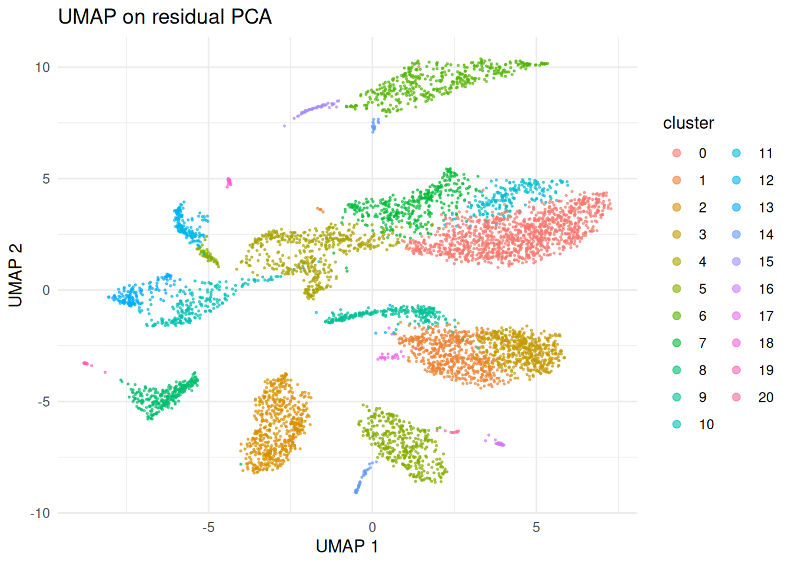

# Pearson residuals and scTransform

## Intro

`bixverse` normalises once, at ingestion. Counts go in,
`log1p(count / lib_size * target_size)` comes out, and both layers sit
on disk from then on. Every downstream step reads that second layer.
It’s cheap, it streams, and it is why a million cells fit on a laptop.

It also has a known problem. Library-size normalisation followed by a
log assumes the variance of a gene is roughly constant once you’ve
divided the depth out. For UMI counts that isn’t true. Highly expressed
genes carry more variance than lowly expressed ones no matter what you
divide by, so a variance-based HVG ranking partly ranks genes by how
much they were expressed in the first place.

Pearson residuals fix this by asking a different question. Fit a null
model of what a gene’s counts should look like given only sequencing
depth, then ask how far each cell deviates from it:

``` math
r_{gc} = \frac{y_{gc} - \mu_{gc}}{\sqrt{\mu_{gc} + \mu_{gc}^2 / \theta_g}}
```

A gene that is nothing but depth gets residuals with variance near one.
A gene with real structure gets more. As an HVG statistic that holds up
well. As a PCA input it’s more contested, and [the caveats
section](#what-the-field-actually-thinks) goes through what the
benchmarks actually say.

The catch is cost. Nothing about this is precomputable: a residual
depends on the fitted model, so it has to be regenerated every time
something wants it. Worse, a residual is non-zero even where the count
is zero, so the matrix is dense by construction. That is exactly the
trade-off the design vignette warns about, and it’s why this is opt-in
rather than the default.

`bixverse` gives you two flavours.

- **scTransform v2** ([Choudhary and Satija,
  2022](https://doi.org/10.1186/s13059-021-02584-9)) fits a negative
  binomial per gene by regression against log depth, then regularises
  the per-gene parameters against their expression level with a kernel
  smoother. Only a bounded subsample (2000 genes by 2000 cells by
  default) goes through the actual GLM fitting, so the expensive part
  doesn’t scale with your data set. Everything after it streams.

- **Analytic Pearson residuals** ([Lause, Berens and Kobak,
  2021](https://doi.org/10.1186/s13059-021-02451-7)) skip the fitting
  entirely. One shared dispersion for every gene, and $`\mu`$ from the
  marginals:
  $`\mu_{gc} = \frac{\sum_c y_{gc} \cdot \sum_g y_{gc}}{\sum_{gc} y_{gc}}`$.
  Closed form, no iterations, and their paper argues it ranks genes
  about as well as the fitted version does.

Analytic Pearson is the one to reach for first. It’s a couple of orders
of magnitude cheaper and you can always refit with scTransform if you
need corrected counts or per-gene dispersions.

``` r

library(bixverse)
library(data.table)
#> 
#> Attaching package: 'data.table'
#> The following object is masked from 'package:base':
#> 
#>     %notin%
library(ggplot2)
library(magrittr)
```

## Loading the data

Two PBMC runs, so there’s something to group over later.

Code

``` r

dir_data <- download_pbmc_batches()

tempdir_resid <- file.path(tempdir(), "residuals_bixverse")
dir.create(tempdir_resid, showWarnings = FALSE, recursive = TRUE)

h5ad_files <- list.files(dir_data)
h5ad_files <- h5ad_files[grepl(".h5ad", h5ad_files)]
h5ad_paths <- file.path(dir_data, h5ad_files)
names(h5ad_paths) <- c("pbmc3k", "pbmc4k")

h5_tasks <- prescan_h5ad_files(h5_paths = h5ad_paths)

sc_object <- SingleCells(dir_data = tempdir_resid)

sc_object <- load_multi_h5ad(
  object = sc_object,
  prescan_result = h5_tasks,
  .verbose = FALSE
)
```

Standard QC before anything else. A residual model fitted on debris is a
model of debris.

Code

``` r

var <- get_sc_var(sc_object)

h5_metadata <- read_h5ad_metadata(h5ad_paths[[1]])

var <- merge(
  var,
  h5_metadata$var[, c("ENSEMBL_ID", "Symbol_TENx")],
  by.x = "gene_id",
  by.y = "ENSEMBL_ID"
)

setnames(var, old = "Symbol_TENx", new = "gene_symbol", skip_absent = TRUE)

gs_of_interest <- list(
  MT = var[grepl("^MT-", gene_symbol), gene_id],
  Ribo = var[grepl("^RPS|^RPL", gene_symbol), gene_id]
)

sc_object <- gene_set_proportions_sc(
  sc_object,
  gs_of_interest,
  streaming = FALSE,
  .verbose = FALSE
)

qc_df <- sc_object[[c("cell_id", "lib_size", "nnz", "MT")]]

qc <- run_cell_qc(
  metrics = list(
    log10_lib_size = log10(qc_df$lib_size),
    log10_nnz = log10(qc_df$nnz),
    MT = qc_df$MT
  ),
  cells_to_keep = get_cells_to_keep(sc_object),
  directions = c(
    log10_lib_size = "twosided",
    log10_nnz = "twosided",
    MT = "above"
  ),
  threshold = 3
)

sc_object[["outlier"]] <- qc$combined
sc_object <- set_cells_to_keep(sc_object, qc_df[!qc$combined, cell_id])

sc_object
#> Single cell experiment (Single Cells).
#>   No cells (original): 7040
#>    To keep n: 5841
#>   No genes: 13925
#>   HVG calculated: FALSE
#>   PCA calculated: FALSE
#>   Other embeddings: none
#>   KNN generated: FALSE
#>   SNN generated: FALSE
#>   MAGIC imputed: none
#>   Residual model: none
#>   Stale artefacts: none
```

## Fitting a model

[`fit_residuals_sc()`](https://gregorlueg.github.io/bixverse/reference/fit_residuals_sc.md)
fits and caches. It doesn’t transform anything, and it doesn’t touch the
counts on disk. What lands on the object is the model.

``` r

sc_object <- fit_residuals_sc(
  object = sc_object,
  method = "analytic_pearson",
  .verbose = TRUE
)
#> Fitting analytic_pearson over 5_841 cells.
#> Fitted 1 model(s) over 13_879 genes.

get_residual_fit(sc_object)
#> Fitted residual model: analytic Pearson
#>   1 group over 5_841 cells
#>   13_879 genes modelled in every group
```

The fit is keyed to the cells it saw. Move the filter afterwards and
anything that tries to use it errors rather than quietly applying
coefficients to the wrong cells. The usual cache-status machinery knows
about it too:

``` r

get_sc_cache_status(sc_object)
#>    modality  artefact   name stamped  stale reason               id   from
#>      <char>    <char> <char>  <lgcl> <lgcl> <char>           <char> <list>
#> 1:      rna residuals   <NA>    TRUE  FALSE   <NA> 2d0b52eb23bf9193
```

## Variable features

[`find_hvg_sc()`](https://gregorlueg.github.io/bixverse/reference/find_hvg_sc.md)
gains a `"residual"` method. It ranks on the residual variance of the
cached model instead of on the stored layer.

``` r

sc_object <- find_hvg_sc(
  object = sc_object,
  hvg_no = 2000L,
  hvg_params = params_sc_hvg(method = "residual"),
  .verbose = TRUE
)

length(get_hvg(sc_object))
#> [1] 2000
```

The per-gene statistic lands in the variable table as
`residual_variance`. Genes the model didn’t retain come back `NA` rather
than zero, which matters: zero would read as a real measurement of no
variance.

``` r

var_dt <- get_sc_var(sc_object)

ggplot(
  var_dt[!is.na(residual_variance)],
  aes(x = log10(residual_variance))
) +
  geom_histogram(bins = 80, fill = "#2f6f9f", colour = NA) +
  geom_vline(xintercept = 0, linetype = "dashed", colour = "grey30") +
  labs(
    title = "Residual variance",
    subtitle = "Dashed line is variance = 1, where a depth-only gene sits",
    x = "log10(residual variance)",
    y = "Genes"
  ) +
  theme_minimal()
```


That bulk piled up around one is the null doing its job. The tail to the
right is what you actually want to cluster on.

Worth comparing against what the default ranking picks:

``` r

hvg_residual <- get_hvg(sc_object)

sc_vst <- find_hvg_sc(
  object = sc_object,
  hvg_no = 2000L,
  hvg_params = params_sc_hvg(method = "vst"),
  .verbose = FALSE
)

hvg_vst <- get_hvg(sc_vst)

sprintf(
  "%i of 2000 genes shared (%.0f%%)",
  length(intersect(hvg_residual, hvg_vst)),
  100 * length(intersect(hvg_residual, hvg_vst)) / 2000
)
#> [1] "1560 of 2000 genes shared (78%)"
```

Substantial overlap, and the disagreement is the interesting part. The
residual ranking tends to favour lower-expressed markers that a variance
ranking buries under housekeeping genes.

## PCA on residuals

[`calculate_pca_sc()`](https://gregorlueg.github.io/bixverse/reference/calculate_pca_sc.md)
takes `residuals = TRUE`. Two settings have to change, and the function
will tell you so rather than silently working around you:

``` r

calculate_pca_sc(
  object = sc_object,
  no_pcs = 30L,
  residuals = TRUE,
  .verbose = FALSE
)
#> Error in `.assert_residual_pca_params()`:
#> ! Residual PCA cannot normalise the variance: the residuals already carry the biological signal as variance, and scaling it away is the one thing the transform exists to avoid. Pass params_sc_pca(normalise_variance = FALSE).
```

Variance normalisation is on by default, and on this path it would
flatten the exact ranking the transform produces. The `PFlogPF`
transform belongs to the normalised layer and has nothing to say about
residuals. Both are refused rather than overridden, because they’re
settings you passed and quietly changing them would make the recorded
parameters a lie.

``` r

sc_object <- calculate_pca_sc(
  object = sc_object,
  no_pcs = 30L,
  pca_params = params_sc_pca(normalise_variance = FALSE),
  residuals = TRUE,
  .verbose = TRUE
)
#> Using dense SVD on analytic_pearson residuals for 2000 genes.

dim(get_pca_factors(sc_object))
#> [1] 5841   30
```

From here it’s the normal pipeline. Neighbours, clusters, embeddings,
none of them know or care where the PCA came from.

``` r

sc_object <- find_neighbours_sc(sc_object, .verbose = FALSE)
sc_object <- find_clusters_sc(sc_object, res = 0.8, name = "residual_clusters")
sc_object <- umap_sc(sc_object, .verbose = FALSE)

umap_dt <- data.table(
  get_embedding(sc_object, "umap"),
  cluster = factor(unlist(sc_object[["residual_clusters"]])),
  batch = unlist(sc_object[["exp_id"]])
)
setnames(umap_dt, c("umap_1", "umap_2", "cluster", "batch"))

ggplot(umap_dt, aes(x = umap_1, y = umap_2, colour = cluster)) +
  geom_point(size = 0.3, alpha = 0.6) +
  labs(title = "UMAP on residual PCA", x = "UMAP 1", y = "UMAP 2") +
  theme_minimal() +
  guides(colour = guide_legend(override.aes = list(size = 2)))
```



### What it costs

The residual path has no sparse solver and no streaming solver. A
residual column is dense even where the counts are not, because a zero
count still has a residual of `-mu / sqrt(var)`. So the PCA input is a
real cells by genes dense matrix, and
[`calculate_pca_sc()`](https://gregorlueg.github.io/bixverse/reference/calculate_pca_sc.md)
warns once it gets past a few gigabytes.

Two knobs if that bites: fewer HVGs, or fewer cells. There’s no third
option, and `sparse_svd = TRUE` errors rather than silently running the
log-normalised algorithm instead.

## Multi-sample fits

Fitting one model across several samples folds their depth differences
into the gene coefficients. `group_column` fits one model per group
instead, which is what Seurat v5 does with split layers.

``` r

sc_grouped <- fit_residuals_sc(
  object = sc_object,
  method = "analytic_pearson",
  group_column = "exp_id",
  .verbose = TRUE
)
#> Fitting analytic_pearson over 5_841 cells in 2 groups.
#> Fitted 2 model(s) over 11_990 genes.

get_residual_fit(sc_grouped)
#> Fitted residual model: analytic Pearson
#>   2 groups over 5_841 cells
#>   11_990 genes modelled in every group
#>   grouped by: exp_id
```

The gene axis narrows to the intersection: a gene one sample filtered
out is not modelled anywhere, because there’d be no coefficients to
apply to that sample’s cells.

Grouping also changes what `hvg_no` means. Seurat’s rule is to rank
within each sample, take the top N of each, then union them, so a marker
that only one sample carries doesn’t get buried by a pooled ranking. The
result is therefore usually **more** than `hvg_no` genes:

``` r

sc_grouped <- find_hvg_sc(
  object = sc_grouped,
  hvg_no = 2000L,
  hvg_params = params_sc_hvg(method = "residual"),
  .verbose = TRUE
)
#> Selected 3395 variable features: the union of the top 2000 of each of 2 groups.

length(get_hvg(sc_grouped))
#> [1] 3395
```

`bixverse` doesn’t trim that back to 2000. Trimming would undo the
per-sample ranking, which is the only reason to do the union in the
first place.

One thing this is not: batch correction. Per-sample models remove the
sample-level depth differences, not the batch effect. If the batches
still don’t mix, you want [the batch correction
vignette](https://gregorlueg.github.io/bixverse/articles/single_cell_batch_corrections.html).

## Covariates

scTransform can take extra cell-level covariates into the design.
Library size is never one of them: it enters as a fixed offset with the
slope pinned, which is the change that separates v2 from v1.

``` r

sc_cov <- fit_residuals_sc(
  object = sc_object,
  method = "sctransform",
  covariate_columns = "MT",
  .verbose = TRUE
)
#> Fitting sctransform over 5_841 cells.
#> Fitted 1 model(s) over 13_879 genes.

fit <- get_residual_fit(sc_cov)
fit$covariate_names
#> [1] "MT"
fit$models[[1]]$n_coef
#> [1] 2
```

Two coefficients: the intercept and the one covariate.

Column **order** is remembered and checked on every later use. Hand the
model a reordered set and it errors instead of applying each coefficient
to the wrong column, which would give you plausible-looking residuals
and a wrong embedding.

Numeric and integer columns only. A factor needs dummy coding, and
`bixverse` refuses to guess a contrast for you rather than silently
changing the rank of the design matrix.

## Corrected counts

Residuals are a modelling device. They are not counts, they go negative,
and nothing downstream that expects counts will take them.
[`sct_corrected_counts_sc()`](https://gregorlueg.github.io/bixverse/reference/sct_corrected_counts_sc.md)
reverses the transform with every latent variable held at its median,
which removes the depth structure while keeping the per-sample
intercept.

``` r

sc_sct <- fit_residuals_sc(sc_object, method = "sctransform", .verbose = TRUE)
#> Fitting sctransform over 5_841 cells.
#> Fitted 1 model(s) over 13_879 genes.

corrected <- sct_corrected_counts_sc(
  object = sc_sct,
  dir_out = file.path(tempdir(), "pbmc_corrected"),
  .verbose = TRUE
)
#> Building the cell-major companion store.
#> Corrected store: 5841 cells by 13879 genes in /tmp/Rtmp0Ap1Pb/pbmc_corrected.

corrected
#> Single cell experiment (Single Cells).
#>   No cells (original): 5841
#>    To keep n: 5841
#>   No genes: 13879
#>   HVG calculated: FALSE
#>   PCA calculated: FALSE
#>   Other embeddings: none
#>   KNN generated: FALSE
#>   SNN generated: FALSE
#>   MAGIC imputed: none
#>   Residual model: none
#>   Stale artefacts: none
```

That comes back as a proper `SingleCells`, not a loose file. Behind the
scenes the gene-major store gets written, transposed into its cell-major
twin, and given a fresh database.

Two things to know about it. It’s scTransform only, since the analytic
Pearson model has no corrected-count equivalent. And its gene axis is
the **model’s**, so it is narrower than the source and the indices do
not line up. The variable table is rebuilt from the genes that survived
rather than copied across, so gene names are right; raw index arithmetic
against the original object is not.

## What the field actually thinks

Residuals are not a settled win, and it would be dishonest to ship them
here without saying so. Three findings are worth knowing before you
build an analysis on them.

### The transform is not monotonic

This is the sharpest criticism, and it comes from [Booeshaghi,
Hallgrímsdóttir, Gálvez-Merchán and
Pachter](https://www.biorxiv.org/content/10.1101/2022.05.06.490859v4). A
residual is a signed distance from a per-gene null, so two genes in the
same cell can swap places relative to their raw counts. The transform
reorders genes *within* a cell.

That matters more than it sounds. Marker inspection, heatmaps and
anything that reads “gene A is higher than gene B in this cell” are
answering a question about the transformed values, not about the counts.
Their benchmark across 526 data sets found residual and scaling
transformations showed exactly these within-cell rank changes, and that
sctransform retained substantial depth correlation in many of them,
which is awkward for a method whose stated job is removing depth.

Their proposal is `PFlogPF`, a shifted centred-log-ratio transform that
keeps monotonicity. `bixverse` has it as `params_sc_pca(clr = TRUE)` on
the normal path, and it is a reasonable thing to try before reaching for
residuals at all.

### The benchmarks are not one-sided

[Ahlmann-Eltze and Huber](https://doi.org/10.1038/s41592-023-01814-1)
compared delta-method, residual, latent-state and factor-analysis
transformations in Nature Methods and found that the plain shifted
logarithm followed by PCA performs as well or better than the
sophisticated alternatives on simulated and real data. They did single
out analytic Pearson residuals as well suited to picking variable genes
and finding rare cell types, which is a narrower claim than “use
residuals for everything”.

That shape matches what’s implemented here. Using residuals to *choose*
genes and then running the normal pipeline is a defensible middle
ground, and
`find_hvg_sc(hvg_params = params_sc_hvg(method = "residual"))` followed
by an ordinary
[`calculate_pca_sc()`](https://gregorlueg.github.io/bixverse/reference/calculate_pca_sc.md)
does exactly that.

### scTransform v1 was overfitted

[Lause, Berens and Kobak](https://doi.org/10.1186/s13059-021-02451-7)
showed the original model is overspecified: per-gene overdispersion
estimates come out strongly biased, which is why the method needs a
post-hoc smoothing step to be usable at all. Their argument is that UMI
data don’t need gene-specific overdispersion in the first place.

v2 addresses a good chunk of this by pinning the depth coefficient
rather than fitting it, and it is the version implemented here. The
regularisation is still doing real work though, and `bw_adjust` in
[`params_sc_sctransform()`](https://gregorlueg.github.io/bixverse/reference/params_sc_sctransform.md)
is the knob that controls how much.

### Scaling

The dense-matrix problem from “What it costs” above is the same one the
Pachter paper raises: dense residual output is what makes million-cell
analyses awkward, since the whole point of the on-disk sparse format is
that you never materialise a matrix that size.

`bixverse` softens this but does not solve it. The fit and the variance
sweep both stream gene by gene, so memory there is one row per worker
rather than a genes-by-cells matrix, and the scTransform GLM only ever
sees a bounded 2000 by 2000 subsample. Those parts scale fine. The
residual PCA does not, because a dense SVD needs a dense input. At a
million cells you can still fit a model and select genes on residuals;
you cannot run the residual PCA, and
[`calculate_pca_sc()`](https://gregorlueg.github.io/bixverse/reference/calculate_pca_sc.md)
will warn you with the actual number before it tries.

### So what should you use

Analytic Pearson for gene selection, then the normal log-normalised PCA,
is the combination with the least to argue against it. Full residual PCA
is worth trying when you suspect depth is driving your embedding, and
worth checking against the default rather than trusting blindly. If you
want marker-level interpretability, stay on the normalised layer or use
`PFlogPF`.

## Where to go next

Meta cells take all of this too. Their counts are summed UMIs, so the
negative binomial still applies, just at far greater depth. Prefer
`method = "analytic_pearson"` there and revisit the `n_genes` and
`n_cells` defaults of
[`params_sc_sctransform()`](https://gregorlueg.github.io/bixverse/reference/params_sc_sctransform.md),
which are sized for raw cells and there are usually a lot more of those
than there are meta cells.

Still on the list: residual-space projection of new cells onto existing
components, which the Rust side can already do but has no R entry point
yet.
