# A guide to single-cell plotting functions

### Intro

This vignette gives an overview of the different plotting functions that
are available when running a single cell analysis.

``` r

library(bixverse)
library(ggplot2)
library(data.table)
#> 
#> Attaching package: 'data.table'
#> The following object is masked from 'package:base':
#> 
#>     %notin%
library(bixverse.plots)
library(magrittr)
```

### Preparing the data

We run the standard analysis using the same PBMC3k data set. For more
details on the data analysis itself, please refer to the [introductory
vignette](https://gregorlueg.github.io/bixverse/articles/thinking_single_cell.html).
This vignette assumes familiarity with how the `SingleCells` class,
on-disk storage and cells-to-keep logic work.

Code

``` r

pbmc3k_path <- download_pbmc3k()

tempdir_pbmc <- tempdir()

sc_object <- SingleCells(dir_data = tempdir_pbmc)

mtx_io_params <- get_cell_ranger_params(pbmc3k_path)

sc_object <- load_mtx(
  object = sc_object,
  sc_mtx_io_param = mtx_io_params,
  mtx_streaming = FALSE,
  .verbose = TRUE
)
#>  Using light streaming for the CSR to CSC conversion.
#> Loading observations data from flat file into the DuckDB.
#> Loading variable data from flat file into the DuckDB.

sc_object[["sample"]] <- sample(
  x = c("sample1", "sample2"),
  size = nrow(sc_object),
  replace = TRUE
)

setnames_sc(
  object = sc_object,
  table = "var",
  old = "column1",
  new = "gene_symbol"
)

var <- get_sc_var(sc_object)

ensembl_to_symbol <- setNames(var$gene_symbol, var$gene_id)
symbol_to_ensembl <- setNames(var$gene_id, var$gene_symbol)

# Define gene sets whose proportional expression signals low quality
gs_of_interest <- list(
  MT = var[grepl("^MT-", gene_symbol), gene_id],
  Ribo = var[grepl("^RPS|^RPL", gene_symbol), gene_id]
)

sc_object <- gene_set_proportions_sc(
  sc_object,
  gs_of_interest,
  streaming = FALSE,
  .verbose = TRUE
)

# Collect metrics for outlier detection
qc_df <- sc_object[[c("cell_id", "sample", "lib_size", "nnz", "MT")]]

metrics <- list(
  log10_lib_size = log10(qc_df$lib_size),
  log10_nnz = log10(qc_df$nnz),
  MT = qc_df$MT
)

directions <- c(
  log10_lib_size = "twosided",
  log10_nnz = "twosided",
  MT = "above"
)

qc <- run_cell_qc(
  metrics = metrics,
  cells_to_keep = get_cells_to_keep(sc_object),
  directions = directions,
  threshold = 3,
  groups = qc_df$sample
)
```

### Joint QC plot

[`joint_plot_sc()`](https://gregorlueg.github.io/bixverse.plots/reference/joint_plot_sc.html)
compares the number of features and number of counts per cell similar to
`sns.jointplot`.

``` r

joint_plot_sc(qc)
#> Warning: Computation failed in `stat_binhex()`.
#> Computation failed in `stat_binhex()`.
#> Caused by error in `compute_group()`:
#> ! The package "hexbin" is required for `stat_bin_hex()`.
```

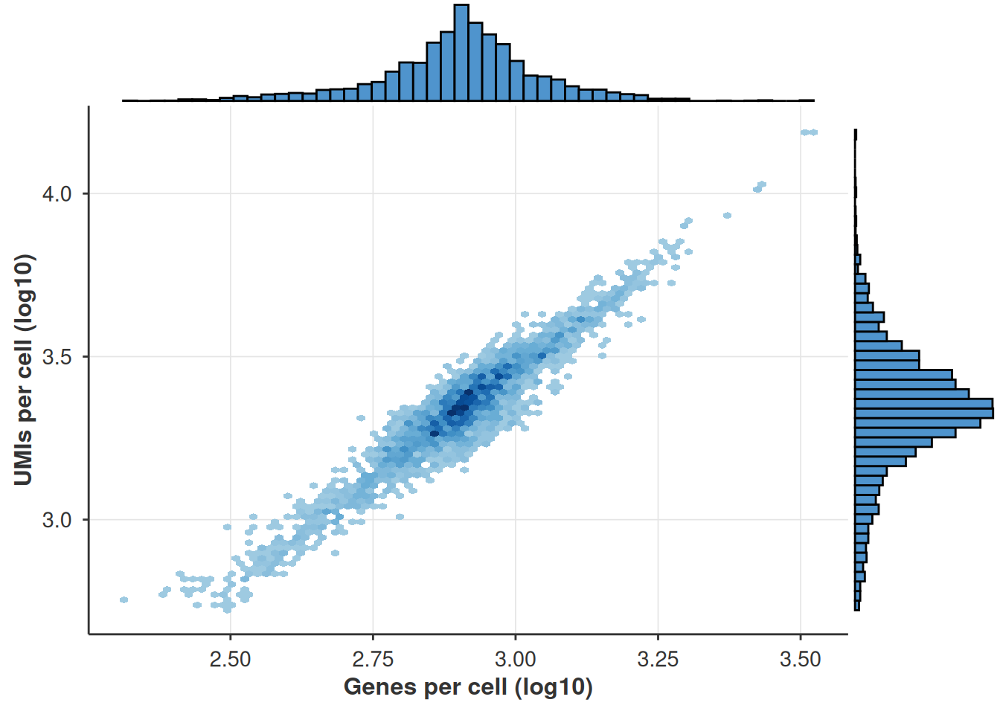

Joint QC plot showing features versus counts.

### Violin QC Plots

[`violin_plot_sc()`](https://gregorlueg.github.io/bixverse.plots/reference/violin_plot_sc.html)
shows the distribution of each QC metric as a violin, split by donor (or
any grouping variable stored in the `qc` object).

``` r

violin_plot_sc(qc)
#> $log10_lib_size
```

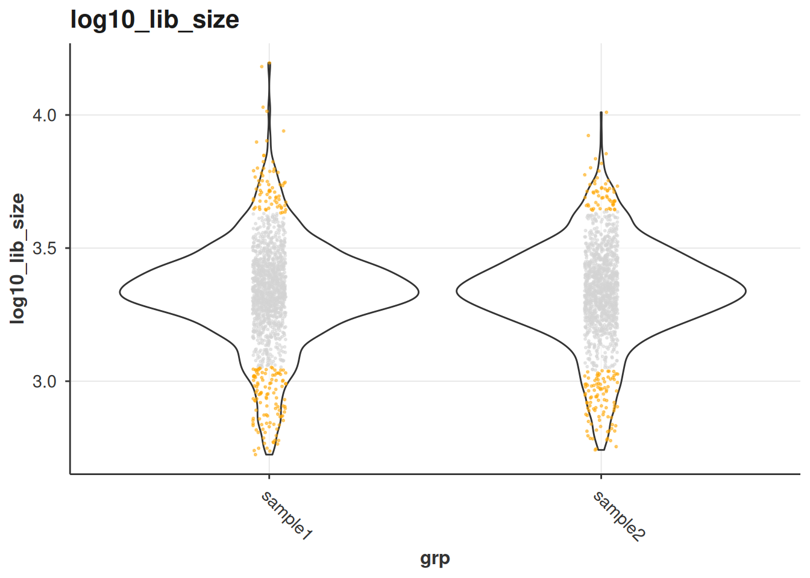

Per-donor violin plots for library size, number of non-zero genes, and
MT proportion.

    #>
    #> $log10_nnz

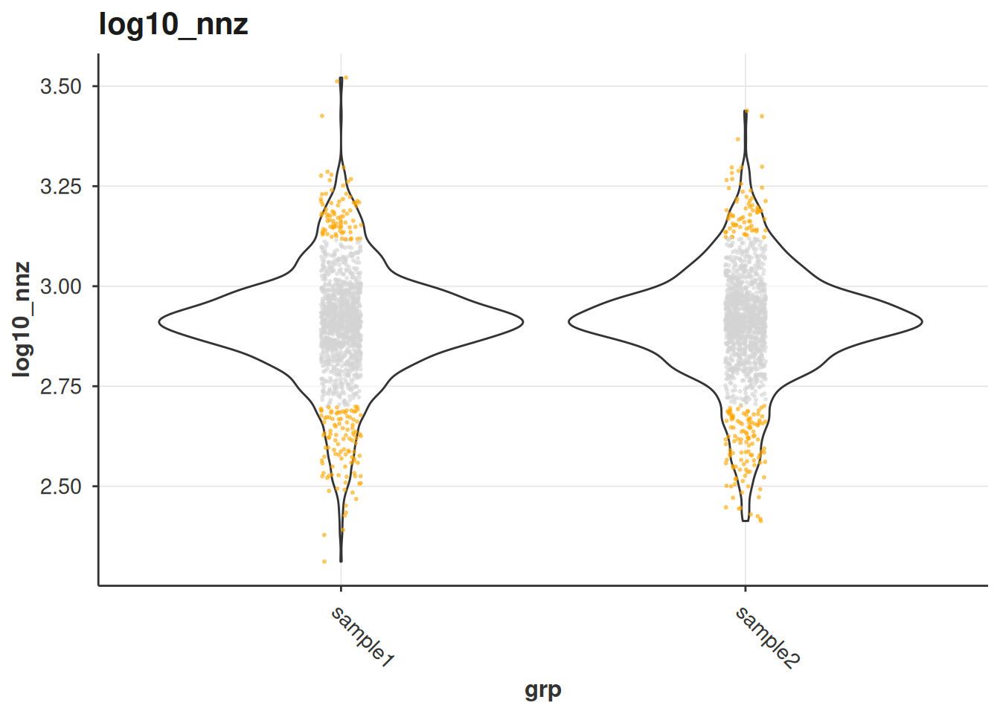

Per-donor violin plots for library size, number of non-zero genes, and
MT proportion.

    #>
    #> $MT

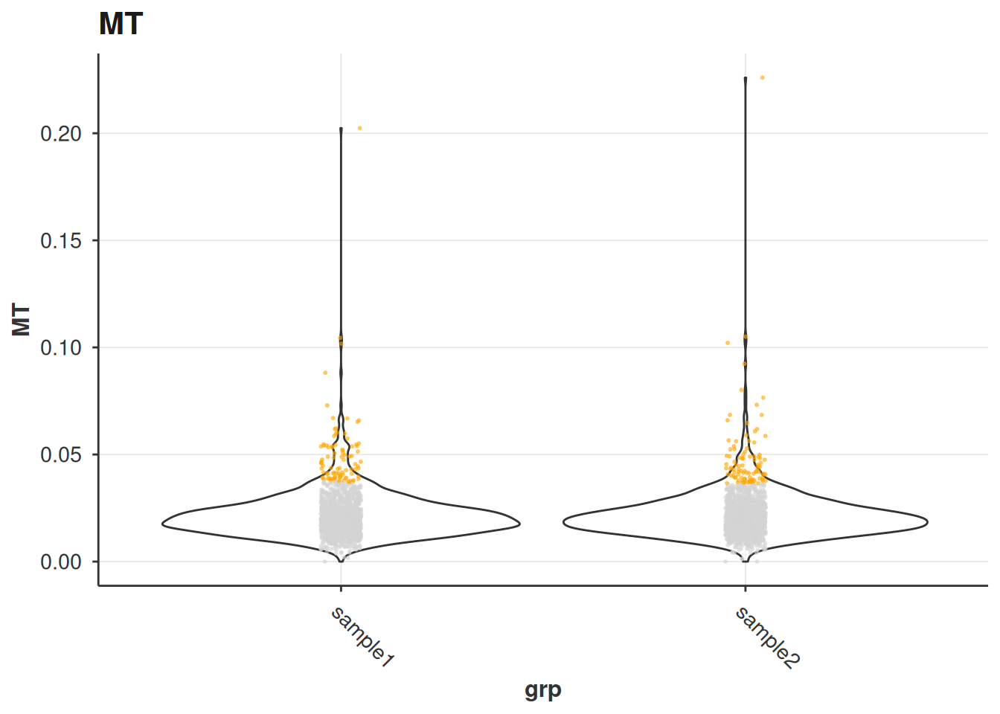

Per-donor violin plots for library size, number of non-zero genes, and
MT proportion.

Alternatively, we can also provide a datatable generate the violins
plots with different variables than those considered in the QC.

``` r

obs <- get_sc_obs(sc_object)

violin_plot_sc(
  obs,
  grouping_column = "sample",
  variable = "Ribo",
  show_outlier = TRUE
)
```

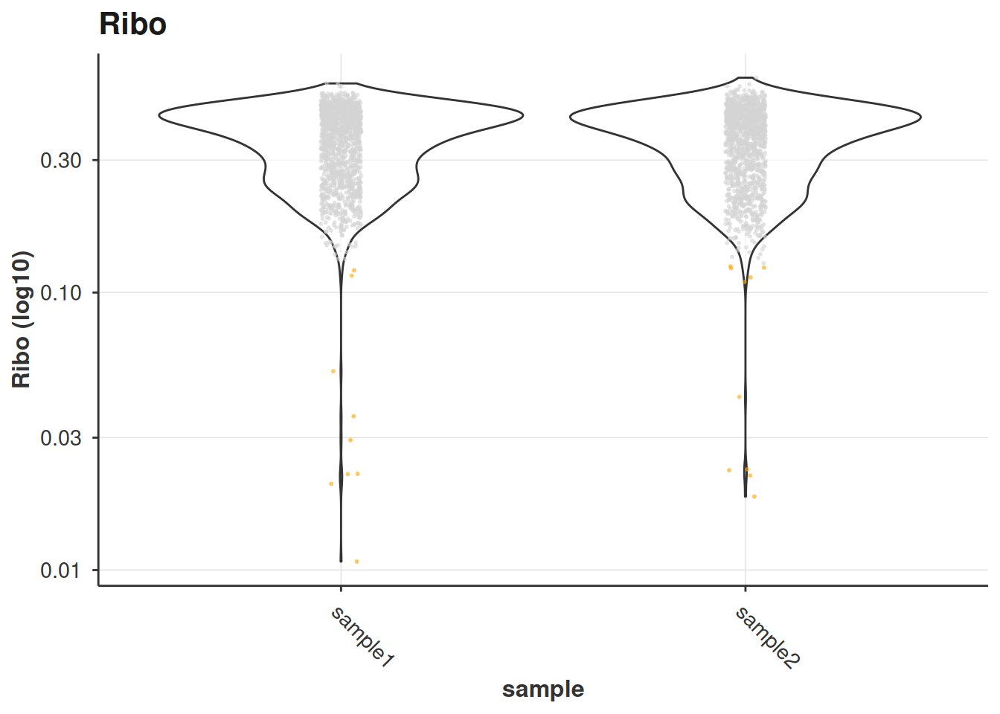

### Density QC Plots

[`density_plot_sc()`](https://gregorlueg.github.io/bixverse.plots/reference/density_plot_sc.html)
overlays smoothed density distributions for each group, which highlights
bimodal distributions or outlier populations that violins can obscure.

``` r

density_plot_sc(qc)
#> $log10_lib_size
```

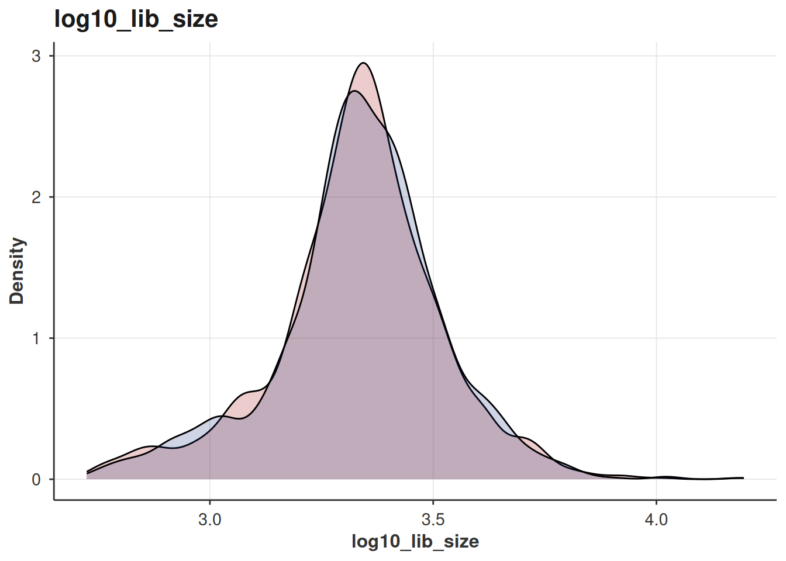

Density plots for each QC metric.

    #>
    #> $log10_nnz

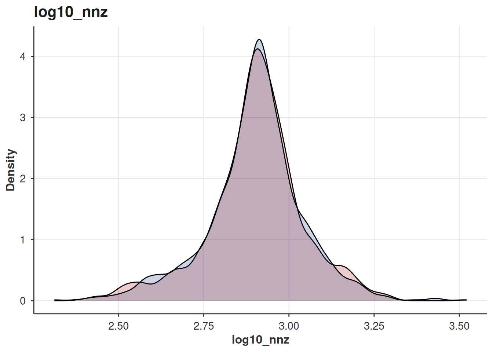

Density plots for each QC metric.

    #>
    #> $MT

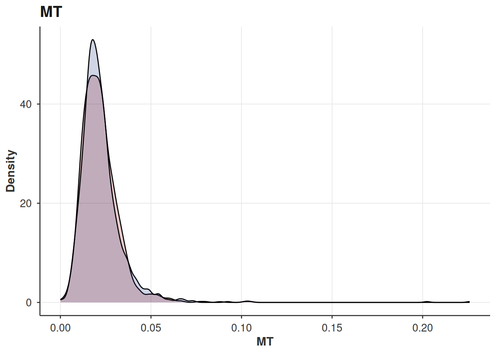

Density plots for each QC metric.

## Dimensionality Reduction Plots

After PCA, neighbour-finding, clustering, and UMAP, cells can be
visualised on any 2D embedding stored in the object.

Code

``` r

sc_object <- find_hvg_sc(
  object = sc_object,
  hvg_no = 2000L,
  .verbose = TRUE
)

sc_object <- calculate_pca_sc(
  object = sc_object,
  no_pcs = 30L,
  sparse_svd = TRUE
)
#> Using sparse SVD solving on scaled data on 2000 HVG.

# the data is so tiny that exhaustive kNN search is faster than building
# an approximate nearest neighbour index
sc_object <- find_neighbours_sc(
  object = sc_object,
  neighbours_params = params_sc_neighbours(
    knn = list(knn_method = "exhaustive")
  )
)
#> 
#> Generating sNN graph (full: TRUE).
#> Transforming sNN data to igraph.
sc_object <- find_clusters_sc(sc_object, res = 0.5, name = "leiden_clusters")
sc_object <- umap_sc(sc_object)
#> Running UMAP.
#> Using n_epochs = 500 (dataset <10k samples or adam_parallel optimiser)
#> Using provided kNN graph.

cell_markers <- c(
  CD3D = "T cells",
  CD3E = "T cells",
  CD3G = "T cells",
  IL7R = "CD4+ T",
  CD4 = "CD4+ T",
  CD8A = "CD8+ T",
  CD8B = "CD8+ T",
  MS4A1 = "B cells",
  CD79A = "B cells",
  CD19 = "B cells",
  CD14 = "CD14+ Mono",
  LYZ = "CD14+ Mono",
  S100A8 = "CD14+ Mono",
  FCGR3A = "CD16+ Mono",
  CDKN1C = "CD16+ Mono",
  GNLY = "NK",
  NKG7 = "NK",
  NCAM1 = "NK",
  FCER1A = "mDC",
  CD1C = "mDC",
  LILRA4 = "pDC",
  CLEC4C = "pDC",
  PPBP = "Platelet",
  PF4 = "Platelet"
)

cell_markers_dt <- stack(cell_markers) %>%
  as.data.table() %>%
  setnames(., c("values", "ind"), c("cell_type", "gene_symbol")) %>%
  .[, gene_symbol := as.character(gene_symbol)] %>%
  .[, gene_id := var$gene_id[match(gene_symbol, var$gene_symbol)]] %>%
  .[!is.na(gene_id), ]

## Prepare the list of markers
marker_list <- prepare_cell_markers(sc_object, cell_markers_dt)
## Calculate the score for each cell
sctype_scores <- calc_sc_type_scores(
  object = sc_object,
  cell_marker_list = marker_list
)
## Annotate the clusters
cell_type_anno <- score_clusters(
  sctype_scores,
  sc_object[[]][["leiden_clusters"]]
)

obs <- sc_object[[]][, .(cell_idx, leiden_clusters)]
add_sctype <- setNames(
  cell_type_anno$cell_type[match(
    obs$leiden_clusters,
    cell_type_anno$cluster_id
  )],
  nm = obs$cell_idx
)
sc_object[["sc_type"]] <- add_sctype
```

**Colouring by Cluster**

We can plot the UMAP embedding highlighting the leiden clusters.

``` r

embedding_plot_sc(
  sc_object,
  embedding = "umap",
  colour_by = "leiden_clusters",
  label_by = "leiden_clusters",
  discrete = TRUE
)
```

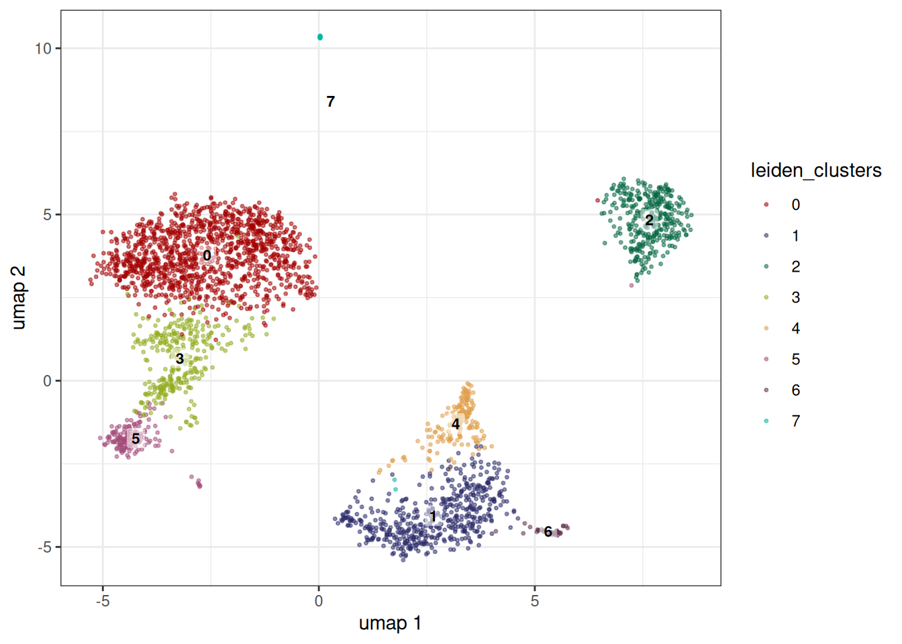

UMAP coloured by Leiden cluster number.

**Colouring by a discrete variable**

Pass any column from the cell metadata to `colour_by`. Use `label_by` to
overlay text labels at the cluster centroid. These do not need to be the
same variables.

``` r

embedding_plot_sc(
  sc_object,
  embedding = "umap",
  colour_by = "sc_type",
  label_by = "leiden_clusters",
  discrete = TRUE
)
```

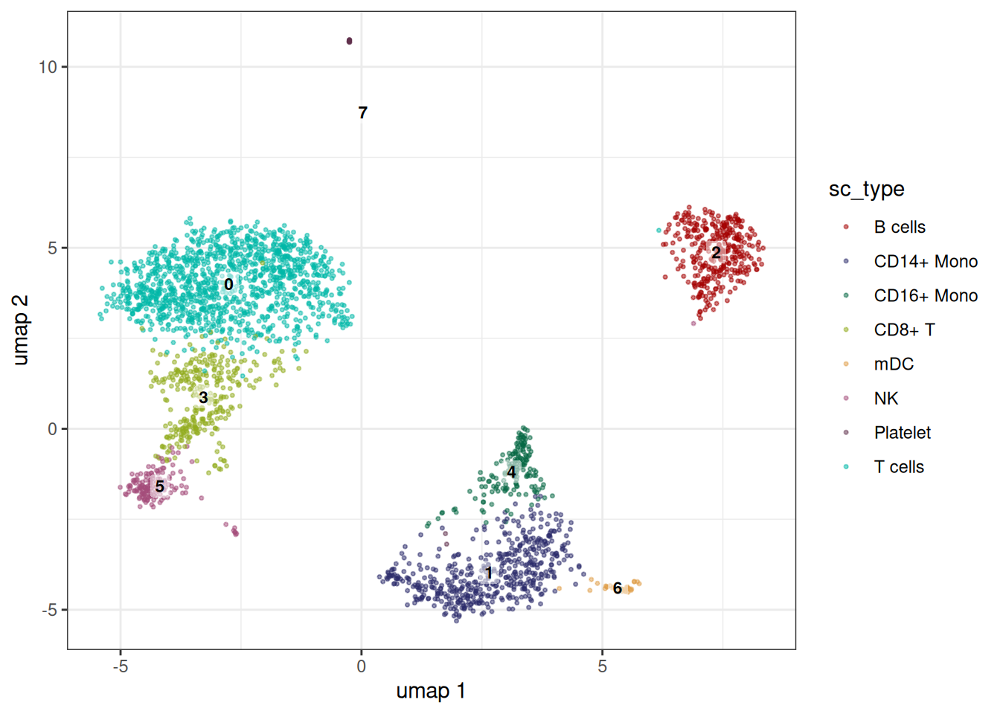

UMAP coloured by manually annotated cell type. Labels are placed at
cluster centroids.

**Colouring by a continuous variable**

Set `discrete = FALSE` to use a continuous colour scale — useful for
confidence scores, pseudotime, or gene module scores.

``` r

embedding_plot_sc(
  sc_object,
  embedding = "umap",
  colour_by = "Ribo",
  discrete = FALSE,
  point_alpha = 0.2
)
```

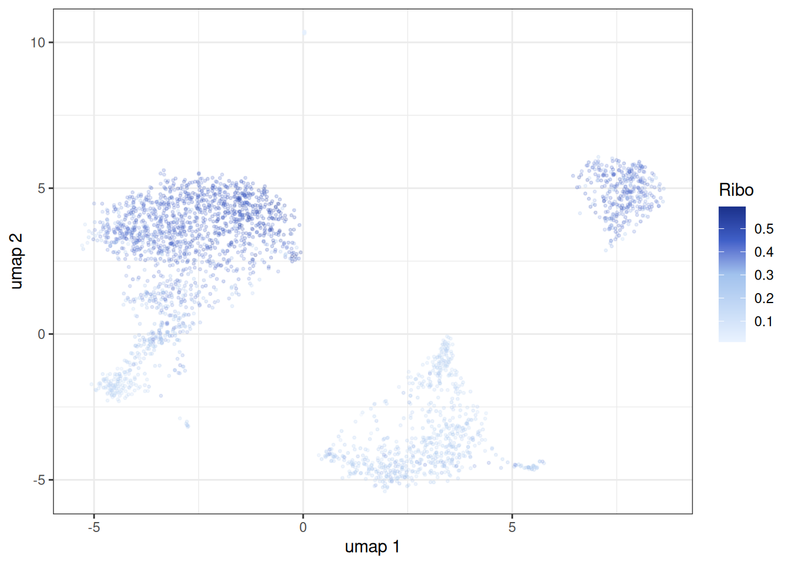

UMAP coloured by ribosomal content (continuous scale).

**Key arguments:**

| Argument      | Description                                                |
|---------------|------------------------------------------------------------|
| `embedding`   | Name of the stored embedding (`"umap"`, `"tsne"`, `"pca`…) |
| `colour_by`   | Metadata column used to colour points                      |
| `label_by`    | Metadata column used to label centroids                    |
| `discrete`    | `TRUE` for categorical palettes, `FALSE` for continuous    |
| `point_alpha` | Transparency (0–1); reduce for dense datasets              |

**Extracting the plotting data**

Alternatively, you can also extract the plotting data directly to make
customised plots.

``` r

dt <- extract_embedding_data(
  sc_object,
  embedding = "umap",
  obs_cols = c("sc_type", "leiden_clusters", "Ribo")
)
head(dt)
#>             cell_id     dim_1     dim_2    sc_type leiden_clusters      Ribo
#>              <char>     <num>     <num>     <char>           <int>     <num>
#> 1: AAACATACAACCAC-1 -2.937514  2.624615    T cells               0 0.4371381
#> 2: AAACATTGAGCTAC-1  7.362597  3.199373    B cells               2 0.4246323
#> 3: AAACATTGATCAGC-1 -5.039197  3.457341    T cells               0 0.3171120
#> 4: AAACCGTGCTTCCG-1  3.021256 -2.670398 CD16+ Mono               4 0.2431611
#> 5: AAACCGTGTATGCG-1 -4.438816 -1.185655         NK               5 0.1491318
#> 6: AAACGCACTGGTAC-1 -3.210414  2.825611    T cells               0 0.3635097
```

## Per-Gene Expression plots\`

[`feature_plot_sc()`](https://gregorlueg.github.io/bixverse.plots/reference/feature_plot_sc.html)
projects normalised expression of one or more genes onto the embedding.

``` r

# Select a single feature by Ensembl ID; provide a human-readable label
features <- setdiff(symbol_to_ensembl[names(cell_markers)], NA)
feature_labels <- ensembl_to_symbol[features]

feature_plot_sc(
  object = sc_object,
  features = features[8],
  feature_labels = feature_labels[8],
  embedding = "umap",
  label_by = "sc_type"
)
```

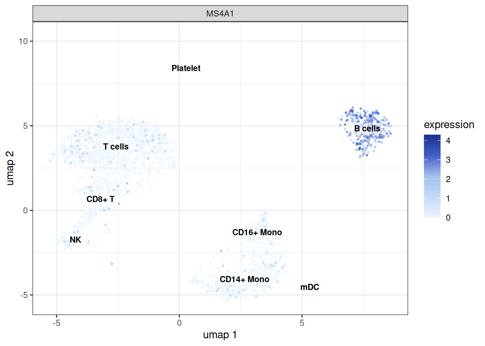

Expression of MS4A1 on the UMAP. High-expressing cells cluster in
expected B cell cluster.

**Tip:** pass a character vector of Ensembl IDs to `features` and
matching labels to `feature_labels` to produce one panel per gene.

We can also highlight the genes of interest for clearer visualisation.

``` r

# Select a single feature by Ensembl ID; provide a human-readable label
features <- setdiff(symbol_to_ensembl[names(cell_markers)], NA)
feature_labels <- ensembl_to_symbol[features]

feature_plot_sc(
  object = sc_object,
  features = features[8],
  feature_labels = feature_labels[8],
  embedding = "umap",
  label_by = "sc_type",
  highlight_features = TRUE
)
```

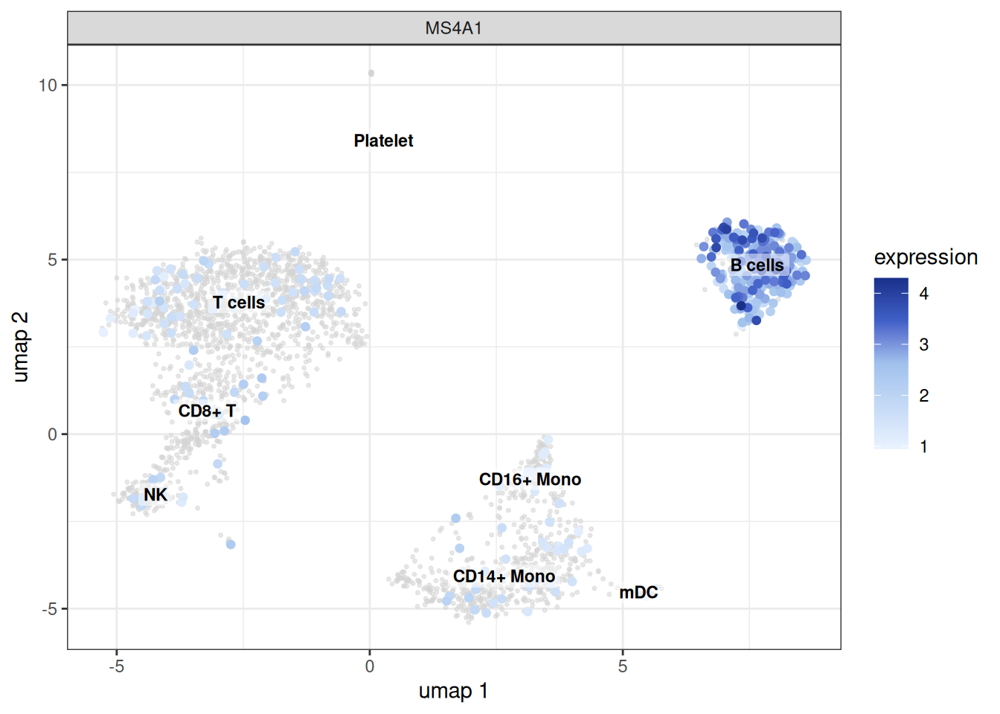

Expression of MS4A1 on the UMAP. High-expressing cells cluster in
expected B cell cluster.

**Extracting the plotting data**

Alternatively, you can also extract the plotting data directly to make
customised plots.

``` r

dt <- extract_feature_plot_data(
  sc_object,
  embedding = "umap",
  obs_cols = c("sc_type", "leiden_clusters", "Ribo"),
  features = features[8],
  modality = "rna"
)

head(dt)
#>             cell_id     dim_1     dim_2    sc_type leiden_clusters      Ribo
#>              <char>     <num>     <num>     <char>           <int>     <num>
#> 1: AAACATACAACCAC-1 -2.937514  2.624615    T cells               0 0.4371381
#> 2: AAACATTGAGCTAC-1  7.362597  3.199373    B cells               2 0.4246323
#> 3: AAACATTGATCAGC-1 -5.039197  3.457341    T cells               0 0.3171120
#> 4: AAACCGTGCTTCCG-1  3.021256 -2.670398 CD16+ Mono               4 0.2431611
#> 5: AAACCGTGTATGCG-1 -4.438816 -1.185655         NK               5 0.1491318
#> 6: AAACGCACTGGTAC-1 -3.210414  2.825611    T cells               0 0.3635097
#>               gene expression
#>             <fctr>      <num>
#> 1: ENSG00000156738   0.000000
#> 2: ENSG00000156738   2.583984
#> 3: ENSG00000156738   0.000000
#> 4: ENSG00000156738   0.000000
#> 5: ENSG00000156738   0.000000
#> 6: ENSG00000156738   0.000000
```

## Dot Plots

Dot plots encode two dimensions simultaneously:

- **Dot size** → fraction of cells in the group expressing the gene (≥ 1
  count)
- **Dot colour** → mean (scaled) expression among expressing cells

``` r

features <- setdiff(symbol_to_ensembl[names(cell_markers)], NA)
feature_labels <- ensembl_to_symbol[features]
```

``` r

dot_plot_sc(
  object = sc_object,
  features = features,
  feature_labels = ensembl_to_symbol[features],
  grouping_variable = "leiden_clusters",
  scale_exp = TRUE,
  feature_grouping = cell_markers,
  cluster_groups = TRUE
)
```

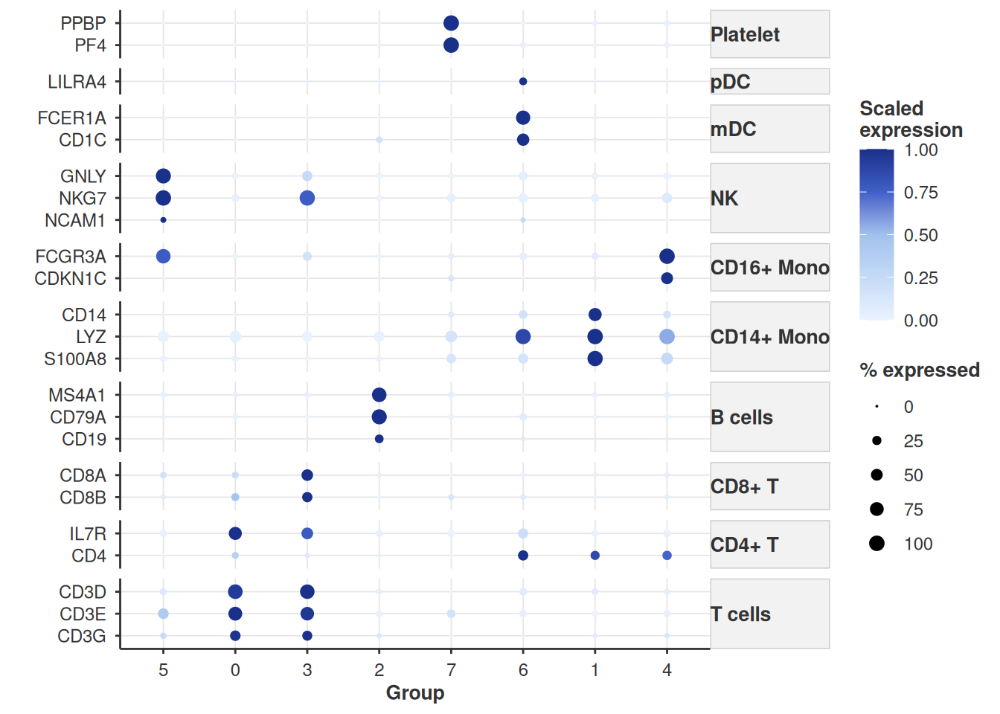

Dot plot of canonical cell-type marker genes across Leiden clusters.
Gene groups are annotated on the x-axis; expression is scaled per gene.

**Key arguments:**

| Argument | Description |
|----|----|
| `features` | Ensembl IDs to plot |
| `feature_labels` | Display names shown on the axis |
| `grouping_variable` | Cell metadata column defining rows |
| `scale_exp` | Scale expression per gene (z-score) |
| `feature_grouping` | Named vector mapping gene → group label for x-axis brackets |
| `cluster_groups` | Hierarchically cluster rows by expression profile |

**Extracting the plotting data**

Alternatively, you can also extract the plotting data directly to make
customised plots.

``` r

dt <- extract_dot_plot_data(
  sc_object,
  features = features,
  grouping_variable = "leiden_clusters",
  modality = "rna"
)

head(dt)
#>               gene  group   mean_exp   pct_exp scaled_exp
#>             <fctr> <fctr>      <num>     <num>      <num>
#> 1: ENSG00000167286      0 2.12428379 87.207359 0.94420867
#> 2: ENSG00000167286      1 0.16426496  9.756097 0.07301303
#> 3: ENSG00000167286      2 0.09634478  5.187320 0.04282365
#> 4: ENSG00000167286      3 2.24980330 85.389608 1.00000000
#> 5: ENSG00000167286      4 0.10693659  7.361963 0.04753153
#> 6: ENSG00000167286      5 0.22914907 10.810811 0.10185294
```

## Stacked Violin Plots

Stacked violins show the per-group expression distribution of several
genes in a compact vertical layout.

``` r

# Take the first five markers
idx <- 1:5

stacked_violin_plot_sc(
  sc_object,
  features = names(feature_labels)[idx],
  feature_labels = feature_labels[idx],
  grouping_variable = "sc_type",
)
```

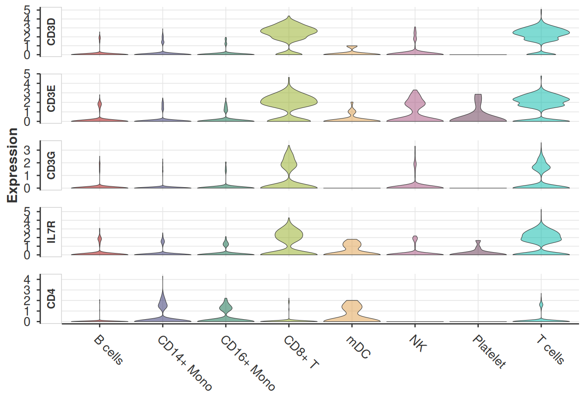

Stacked violin plot of markers across final cell types.

**Extracting the plotting data**

``` r

dt <- extract_gene_violin_data(
  sc_object,
  features = features,
  grouping_variable = "sc_type",
  modality = "rna"
)

head(dt)
#>             cell_id      group            gene expression
#>              <char>     <fctr>          <fctr>      <num>
#> 1: AAACATACAACCAC-1    T cells ENSG00000167286   2.865234
#> 2: AAACATTGAGCTAC-1    B cells ENSG00000167286   0.000000
#> 3: AAACATTGATCAGC-1    T cells ENSG00000167286   3.490234
#> 4: AAACCGTGCTTCCG-1 CD16+ Mono ENSG00000167286   0.000000
#> 5: AAACCGTGTATGCG-1         NK ENSG00000167286   0.000000
#> 6: AAACGCACTGGTAC-1    T cells ENSG00000167286   1.730469
```
